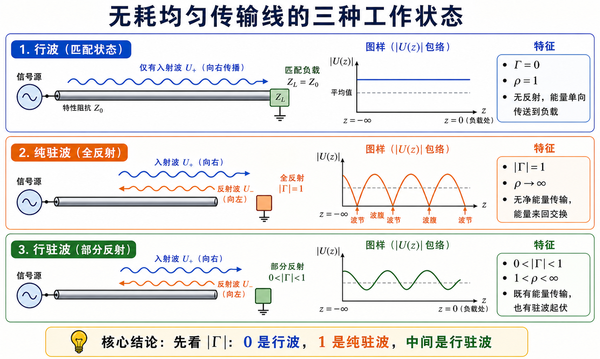
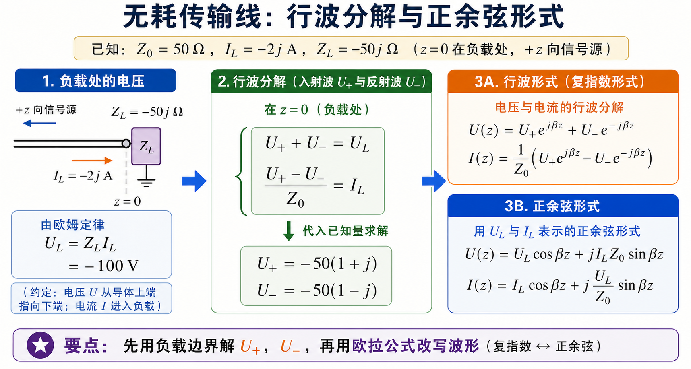
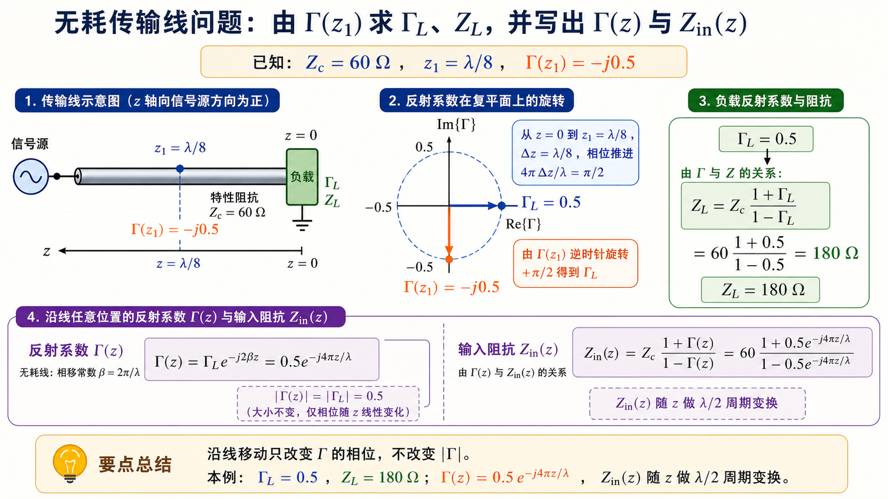
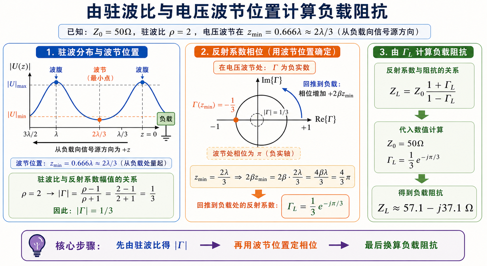

# 第一次作业 · Lec04

---

**导航：** [总目录](README.md) · [符号与导读](00-符号与导读.md) · [Lec01](01-Lec01.md) · [Lec02](02-Lec02.md) · [Lec03](03-Lec03.md) · **Lec04** · [Lec05](05-Lec05.md) · [附录](99-公式与图像.md)

---

## Lec04 作业

---

### 第 1 题

*（对应大纲 **Lec04 作业** 第 1 题；教材 **§1.3–1.4**（北理工）或 **§1.4**（华科）附近。本题**无唯一标准答案**，宜作长期复习笔记。）*

#### 题目复述

整理并阐述均匀无耗传输线三种典型工作状态的特点、变化规律及重要结论（含常用公式）。

> 三种状态最稳的判断入口是 $|\Gamma|$：$|\Gamma|=0$ 时没有反射，是行波；$|\Gamma|=1$ 时全反射，是纯驻波；中间值就是既传能量又有起伏的行驻波。

#### 详细思路

按 **行波**、**纯驻波**（含短路、开路、纯电抗三类终端）、**行驻波** 分块；每一块建议写清：**名称与条件**、**沿线幅值/相位特征**、**反射与驻波参量**、**输入阻抗沿线规律**、**常用公式 3～5 条**、**自举小例**（数字不必复杂）。

#### 一步步解答

以下为可直接誊入作业本的**结构示范**（内容请结合你班教材插图与符号再润色）。

**1. 行波状态**

- **条件**：终端匹配 $Z_L=Z_c$，故 $\Gamma_L=0$，无反射波。
- **沿线**：$|U(z)|$、$|I(z)|$ 为常数（不衰变时）；电压电流**同相**（就传播方向而言为单向行波）。
- **能量**：入射功率全部被负载吸收；$\rho=1$，行波系数 $K=1$（若定义 $K=|U|_{\min}/|U|_{\max}$）。
- **$Z_{\mathrm{in}}$**：沿线 $Z_{\mathrm{in}}(z)=Z_c$（无耗无限长或匹配终端的常用理想化结论）。
- **公式**：匹配时 $U^-=0$，电压为**单向行波**；若采用与本套 [Lec03](03-Lec03.md) 相同的写法 $U(z)=U^+\mathrm{e}^{\mathrm{j}\beta z}+U^-\mathrm{e}^{-\mathrm{j}\beta z}$（$z$ 自负载向源），则 $U(z)=U^+\mathrm{e}^{\mathrm{j}\beta z}$，$I(z)=U^+\mathrm{e}^{\mathrm{j}\beta z}/Z_c$。亦常见教材用 $\mathrm{e}^{-\mathrm{j}\beta z}$ 表示另一方向的行波，**全题与教材统一即可**。

**2. 纯驻波状态**

- **条件**：$|\Gamma_L|=1$，如 **短路** $Z_L=0$、**开路** $Z_L\to\infty$、或 **纯电抗** $Z_L=\mathrm{j}X$。
- **沿线**：$|U(z)|$、$|I(z)|$ 呈 **$\lambda/2$ 周期** 起伏；**电压波腹**处电流为节，**电流波腹**处电压为节；瞬时场上表现为「空间固定、时间振荡」的驻立图案。
- **能量**：线上**无净有功**向负载输送（纯电抗或短开路时）；能量在电场与磁场间交换。
- **$Z_{\mathrm{in}}$**：沿线为 **纯电抗** $Z_{\mathrm{in}}(z)=\mathrm{j}X_{\mathrm{in}}(z)$，随 $z$ 周期性变化。
- **公式（自负载向源，常用写法）**：
  - 短路：$Z_{\mathrm{in}}(z)=\mathrm{j}Z_c\tan\beta z$；
  - 开路：$Z_{\mathrm{in}}(z)=-\mathrm{j}Z_c\cot\beta z$；
  - $\rho\to\infty$，$K=0$（若 $K=|U|_{\min}/|U|_{\max}$）。

**3. 行驻波状态**

- **条件**：$0<|\Gamma_L|<1$，一般为 **复阻抗** 负载。
- **沿线**：$|U|$、$|I|$ 在最大值与最小值之间起伏；**波腹—波节**相距 $\lambda/4$，**腹—腹或节—节**相距 $\lambda/2$。
- **反射**：$\displaystyle |\Gamma|=\frac{\rho-1}{\rho+1}$，$\displaystyle \rho=\frac{1+|\Gamma|}{1-|\Gamma|}$。
- **$Z_{\mathrm{in}}$**：$\displaystyle Z_{\mathrm{in}}(z)=Z_c\frac{Z_L+\mathrm{j}Z_c\tan\beta z}{Z_c+\mathrm{j}Z_L\tan\beta z}$；在 **电压波腹** 处 $Z_{\mathrm{in}}$ 为 **最大实部**（约 $Z_c\rho$），在 **电压波节** 处为 **最小实部**（约 $Z_c/\rho$）（无耗线）。
- **幅值**：$|U(z)|\propto |1+\Gamma_L\mathrm{e}^{-\mathrm{j}2\beta z}|$（常数因子吸收到 $|U^+|$）。

#### 标准解答

- **行波**：$\Gamma_L=0$，$|U|$、$|I|$ 沿线不变（理想无耗匹配），$\rho=1$。
- **纯驻波**：$|\Gamma_L|=1$，腹节交替、间距 $\lambda/4$；短/开路线 $Z_{\mathrm{in}}$ 为 $\mathrm{j}Z_c\tan\beta z$ 或 $-\mathrm{j}Z_c\cot\beta z$。
- **行驻波**：$0<|\Gamma|<1$，$\rho>1$，$Z_{\mathrm{in}}(z)$ 为一般双曲正切型公式；腹/节处阻抗为纯阻且取极值。

#### 常见疑惑点

- **疑惑：** 「行驻波」里还有「行」吗？**解答：** 有；可看成 **行波分量**（$U^+$ 与 $U^-$）**干涉**后，既有能量传输（实功）也有来回交换（取决于负载）。

---

### 第 2 题

*（对应大纲 **Lec04 作业** 第 2 题。）*

#### 题目复述

均匀无耗线特性阻抗 $Z_0=50\,\Omega$，负载电流 $I_L=-2\mathrm{j}\,\mathrm{A}$，负载阻抗 $Z_L=-50\mathrm{j}\,\Omega$。（1）把 $U(z)$、$I(z)$ 写成**入射波与反射波之和**；（2）用欧拉公式写成**正余弦**形式。

> 本题不要一开始就展开指数。先在负载面写出 $U^+$、$U^-$ 的两个边界方程，解出入射波与反射波，再把复指数形式改写成正余弦形式。

#### 详细思路

1. 先由 $U_L=Z_L I_L$ 得负载电压相量。
2. 由 $U_L=U^++U^-$、$I_L=(U^+-U^-)/Z_0$ 解 $U^+$、$U^-$（符号与 [符号与导读](00-符号与导读.md) 一致）。
3. 写出 $U(z)=U^+\mathrm{e}^{\mathrm{j}\beta z}+U^-\mathrm{e}^{-\mathrm{j}\beta z}$（若 $+z$ 指向源，指数可能互换——**全题统一**即可）。
4. 正余弦形式用题给通解 $U(z)=U_L\cos\beta z+\mathrm{j}I_L Z_0\sin\beta z$ 等直接展开。

#### 一步步解答

**负载电压**

$$
U_L=Z_L I_L=(-50\mathrm{j})(-2\mathrm{j})=-100\ \mathrm{V}.
$$

**入射、反射（取 $U(z)=U^+\mathrm{e}^{\mathrm{j}\beta z}+U^-\mathrm{e}^{-\mathrm{j}\beta z}$，$I(z)=\dfrac{U^+\mathrm{e}^{\mathrm{j}\beta z}-U^-\mathrm{e}^{-\mathrm{j}\beta z}}{Z_0}$）**

$$
\begin{cases}
U^++U^-=-100,\\[4pt]
\dfrac{U^+-U^-}{Z_0}=-2\mathrm{j}
\end{cases}
\Rightarrow\ 
\begin{aligned}
U^+-U^-&=-100\mathrm{j},\\
2U^+&=-100-100\mathrm{j}\ \Rightarrow\ U^+=-50(1+\mathrm{j}),\\
2U^-&=-100+100\mathrm{j}\ \Rightarrow\ U^-=-50(1-\mathrm{j}).
\end{aligned}
$$

**（1）行波分解**

$$
\boxed{
\begin{aligned}
U(z)&=-50(1+\mathrm{j})\mathrm{e}^{\mathrm{j}\beta z}-50(1-\mathrm{j})\mathrm{e}^{-\mathrm{j}\beta z},\\
I(z)&=\frac{-50(1+\mathrm{j})\mathrm{e}^{\mathrm{j}\beta z}+50(1-\mathrm{j})\mathrm{e}^{-\mathrm{j}\beta z}}{Z_0}.
\end{aligned}}
$$

可验证 $\Gamma_L=U^-/U^+=-\mathrm{j}$，与 $\dfrac{Z_L-Z_0}{Z_L+Z_0}$ 一致。

**（2）正余弦形式**

$$
\begin{aligned}
U(z)&=U_L\cos\beta z+\mathrm{j}I_L Z_0\sin\beta z
=-100\cos\beta z+100\sin\beta z,\\
I(z)&=I_L\cos\beta z+\mathrm{j}\frac{U_L}{Z_0}\sin\beta z
=-2\mathrm{j}\cos\beta z-2\mathrm{j}\sin\beta z
=-2\mathrm{j}(\cos\beta z+\sin\beta z).
\end{aligned}
$$

利用 $\cos\beta z+\sin\beta z=\sqrt2\cos(\beta z-\pi/4)$ 等可再化为单一余弦。

#### 标准解答

- $U_L=-100\,\mathrm{V}$；$U^+=-50(1+\mathrm{j})\,\mathrm{V}$，$U^-=-50(1-\mathrm{j})\,\mathrm{V}$；$U(z)$、$I(z)$ 如上两形式任选其一作答即可。
- 余弦式：$U(z)=-100\cos\beta z+100\sin\beta z$，$I(z)=-2\mathrm{j}(\cos\beta z+\sin\beta z)$。

#### 常见疑惑点

- **疑惑：** $I_L=-2\mathrm{j}\,\mathrm{A}$ 是有效值相量还是峰值相量？**解答：** 作业未特别声明时，**全题同一约定**即可；写瞬时值 $i(z,t)=\mathrm{Re}\{I(z)\mathrm{e}^{\mathrm{j}\omega t}\}$ 时要与相量约定一致。

---

### 第 3 题

*（对应大纲 **Lec04 作业** 第 3 题。）*

#### 题目复述

无耗线特性阻抗 $Z_c=60\,\Omega$。在距负载 $z_1=\lambda/8$ 处，反射系数 $\Gamma(z_1)=-\mathrm{j}0.5$。（1）求 $\Gamma_L$、$Z_L$；（2）若导波波长 $\lambda_p=10\,\mathrm{cm}$，写出任意 $z$ 处的 $\Gamma(z)$、$Z_{\mathrm{in}}(z)$，并说明 $Z_{\mathrm{in}}(z)$ 与 $Z_L$ 的关系。

> 沿无耗线移动时，$\Gamma$ 的模不变，只是在复平面上转角。已知 $z_1=\lambda/8$ 处的 $\Gamma$，先把相位回推到负载面，再用 $\Gamma_L$ 换算 $Z_L$。

#### 详细思路

1. $\Gamma(z)=\Gamma_L\mathrm{e}^{-\mathrm{j}2\beta z}$（与教材约定一致），故 $\Gamma_L=\Gamma(z_1)\mathrm{e}^{\mathrm{j}2\beta z_1}$。
2. $z_1=\lambda/8\Rightarrow 2\beta z_1=\pi/2$。
3. $Z_L=Z_c\dfrac{1+\Gamma_L}{1-\Gamma_L}$；$Z_{\mathrm{in}}(z)=Z_c\dfrac{Z_L+\mathrm{j}Z_c\tan\beta z}{Z_c+\mathrm{j}Z_L\tan\beta z}$。
4. **关系**：双线性变换 + $\lambda/2$ 周期；沿线等 $|\Gamma|$ 圆上旋转。

#### 一步步解答

**（1）**

$$
\Gamma_L=\Gamma(z_1)\mathrm{e}^{\mathrm{j}2\beta z_1}=(-\mathrm{j}0.5)\cdot\mathrm{e}^{\mathrm{j}\pi/2}=(-\mathrm{j}0.5)\cdot\mathrm{j}=0.5.
$$

$$
Z_L=Z_c\frac{1+\Gamma_L}{1-\Gamma_L}=60\cdot\frac{1.5}{0.5}=180\ \Omega\quad(\text{纯阻}).
$$

**（2）** $\beta=2\pi/\lambda_p$，故

$$
\Gamma(z)=0.5\,\mathrm{e}^{-\mathrm{j}4\pi z/\lambda_p}.
$$

$$
Z_{\mathrm{in}}(z)=60\cdot\frac{180+\mathrm{j}60\tan\beta z}{60+\mathrm{j}180\tan\beta z}
=60\cdot\frac{3+\mathrm{j}\tan\beta z}{1+3\mathrm{j}\tan\beta z}.
$$

**与 $Z_L$ 的关系（文字）**：$Z_{\mathrm{in}}(z)$ 由 $Z_L$ 经无耗线 **变换** 得到；$z$ 增加 $\lambda/2$ 时 $Z_{\mathrm{in}}$ **重复**；$z=0$ 时 $Z_{\mathrm{in}}(0)=Z_L$；$|\Gamma(z)|=|\Gamma_L|$ 沿线不变。

#### 标准解答

- $\Gamma_L=0.5$，$Z_L=180\,\Omega$。
- $\Gamma(z)=0.5\mathrm{e}^{-\mathrm{j}4\pi z/\lambda_p}$；$Z_{\mathrm{in}}(z)=60\dfrac{3+\mathrm{j}\tan\beta z}{1+3\mathrm{j}\tan\beta z}$（$\beta=2\pi/\lambda_p$）。
- **关系**：同一点反射系数的模不变；阻抗沿线按 $\tan\beta z$ 规律变化且具有 $\lambda/2$ 周期。

#### 常见疑惑点

- **疑惑：** 为什么 $\Gamma(z_1)=-\mathrm{j}0.5$ 却得到 **实数** $Z_L$？**解答：** 只说明在该几何距离上反射波相对入射波有 $\pm90^\circ$ 附加相移；负载本身仍可纯阻，很常见。

---

### 第 4 题

*（对应大纲 **Lec04 作业** 第 4 题。）*

#### 题目复述

同轴线 $Z_0=50\,\Omega$，测得驻波比 $\rho=2$，**一个电压波节**距终端负载为 $0.666\lambda$（按大纲为**相波长** $\lambda$）。求终端负载 $Z_L$。

> 这类题分三步：由驻波比求 $|\Gamma|$，由波节位置确定 $\Gamma_L$ 的相位，最后用 $Z_L=Z_0(1+\Gamma_L)/(1-\Gamma_L)$ 换算成负载阻抗。

#### 详细思路

1. $|\Gamma|=(\rho-1)/(\rho+1)$。
2. 在**电压波节**处，无耗线上 $\Gamma(z)$ 为**负实数**：$\Gamma(z_{\mathrm{节}})=-|\Gamma|$（与教材相位零点一致时）。
3. 由 $\Gamma(z)=\Gamma_L\mathrm{e}^{-\mathrm{j}2\beta z}$ 反解 $\Gamma_L=\Gamma(z_{\mathrm{节}})\exp\bigl(\mathrm{j}2\beta z_{\mathrm{节}}\bigr)$。
4. 题中 $0.666\lambda$ 在作业与工程上常按 **$2\lambda/3$** 理解（$0.666\ldots=2/3$），则 $2\beta z=8\pi/3\equiv 2\pi/3\pmod{2\pi}$，计算简洁；若老师给定其它小数，按同一公式代入即可。

#### 一步步解答

$$
|\Gamma|=\frac{\rho-1}{\rho+1}=\frac{1}{3}.
$$

取 **波节** 在 $z=z_{\mathrm{节}}=\dfrac{2}{3}\lambda$（即题给 $0.666\lambda$ 的常用解读），则

$$
\Gamma(z_{\mathrm{节}})=-\frac{1}{3}\quad(\text{实数、负}).
$$

$$
\begin{aligned}
\Gamma_L&=\Gamma(z_{\mathrm{节}})\,\exp\bigl(\mathrm{j}2\beta z_{\mathrm{节}}\bigr)\\
&=-\frac{1}{3}\,\exp\Bigl(\mathrm{j}\,\frac{4\pi}{\lambda}\cdot\frac{2\lambda}{3}\Bigr)
=-\frac{1}{3}\,\exp\Bigl(\mathrm{j}\frac{8\pi}{3}\Bigr)
=-\frac{1}{3}\,\exp\Bigl(\mathrm{j}\frac{2\pi}{3}\Bigr).
\end{aligned}
$$

而 $\mathrm{e}^{\mathrm{j}2\pi/3}=-\dfrac{1}{2}+\mathrm{j}\dfrac{\sqrt3}{2}$，故

$$
\Gamma_L=-\frac{1}{3}\Bigl(-\frac{1}{2}+\mathrm{j}\frac{\sqrt3}{2}\Bigr)=\frac{1}{6}-\mathrm{j}\frac{\sqrt3}{6}=\frac{1}{3}\mathrm{e}^{-\mathrm{j}\pi/3}.
$$

$$
\frac{Z_L}{Z_0}=\frac{1+\Gamma_L}{1-\Gamma_L}
=\frac{1+\dfrac{1}{6}-\mathrm{j}\dfrac{\sqrt3}{6}}{1-\dfrac{1}{6}+\mathrm{j}\dfrac{\sqrt3}{6}}
=\frac{7-\mathrm{j}\sqrt3}{5+\mathrm{j}\sqrt3}.
$$

分子分母同乘 $5-\mathrm{j}\sqrt3$：

$$
\frac{Z_L}{Z_0}=\frac{(7-\mathrm{j}\sqrt3)(5-\mathrm{j}\sqrt3)}{25+3}
=\frac{32-12\mathrm{j}\sqrt3}{28}
=\frac{8-3\mathrm{j}\sqrt3}{7}.
$$

$$
\boxed{Z_L=Z_0\cdot\frac{8-3\mathrm{j}\sqrt3}{7}\approx(57.1-\mathrm{j}37.1)\ \Omega.}
$$

#### 标准解答

- $|\Gamma|=\dfrac{1}{3}$；在 $z=\dfrac{2}{3}\lambda$ 为电压波节时，$\Gamma_L=\dfrac{1}{3}\mathrm{e}^{-\mathrm{j}\pi/3}$。
- $\displaystyle Z_L=50\cdot\frac{8-3\mathrm{j}\sqrt3}{7}\,\Omega$（数值约 $57.1-\mathrm{j}37.1\,\Omega$）。

#### 常见疑惑点

- **疑惑：** 若 $0.666$ **不**取 $2/3$，答案变吗？**解答：** 会变；只要把 $2\beta z_{\mathrm{节}}=4\pi\times0.666\ldots$ 用**题目给定小数**算准，再重复上述 $\Gamma_L$ 与 $Z_L$ 步骤即可。
- **疑惑：** 波节位置会不会对应 $\Gamma=+|\Gamma|$？**解答：** 取决于教材对 $\Gamma(z)$ **相位零点**（在负载还是在某参考面）的定义；本解答采用与课堂常用写法一致的「波节处 $\Gamma(z)$ 取负实」约定，若与你书相反，整体加 $\pi$ 相移即可自洽。

---
