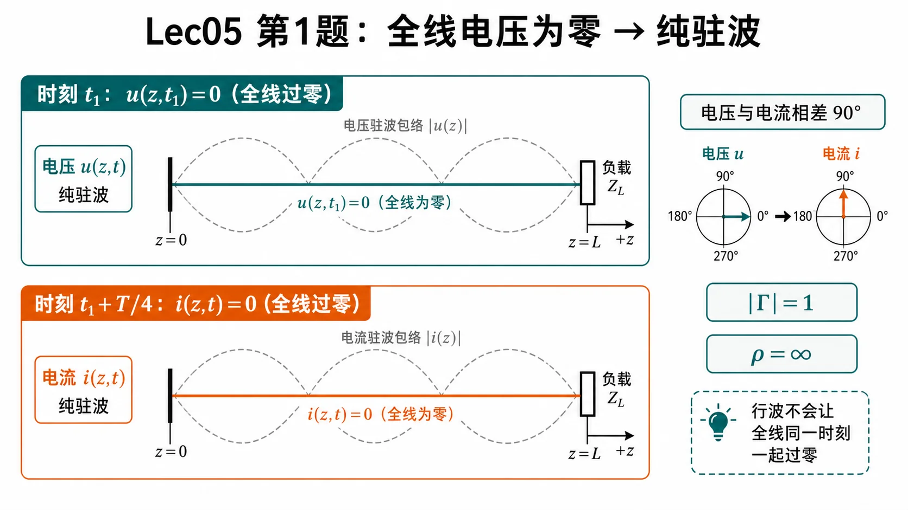
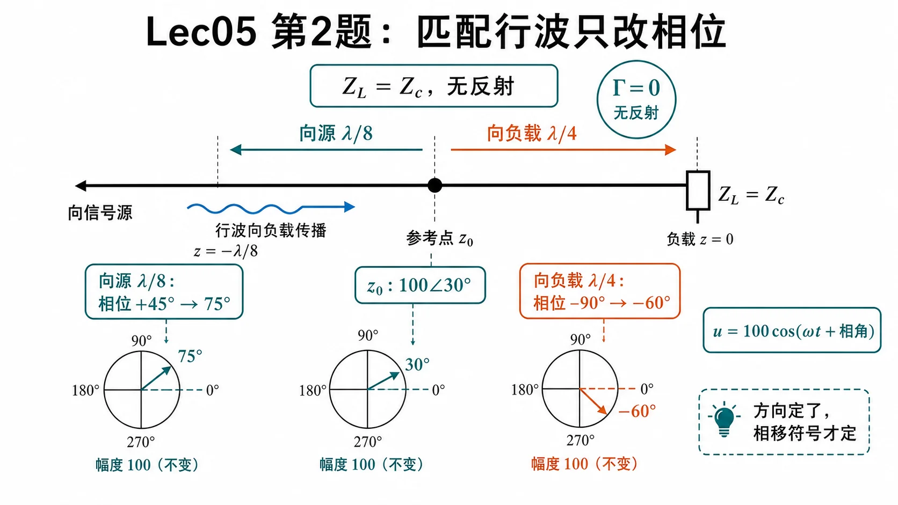
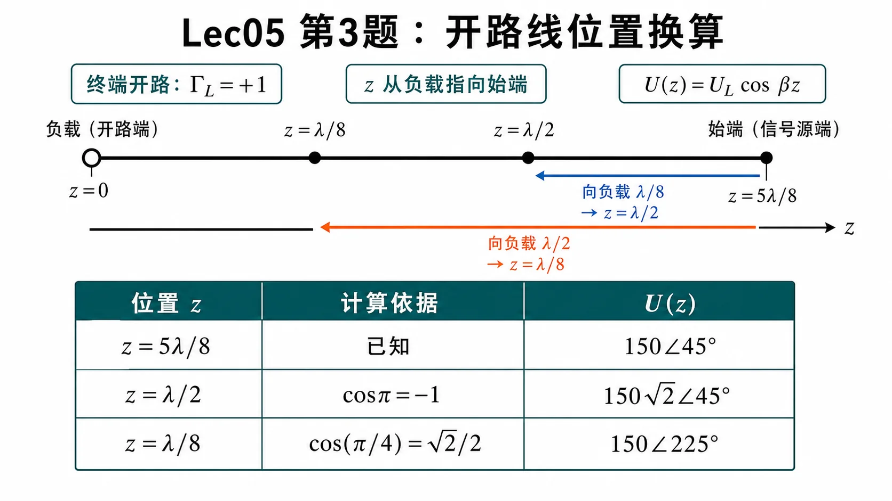
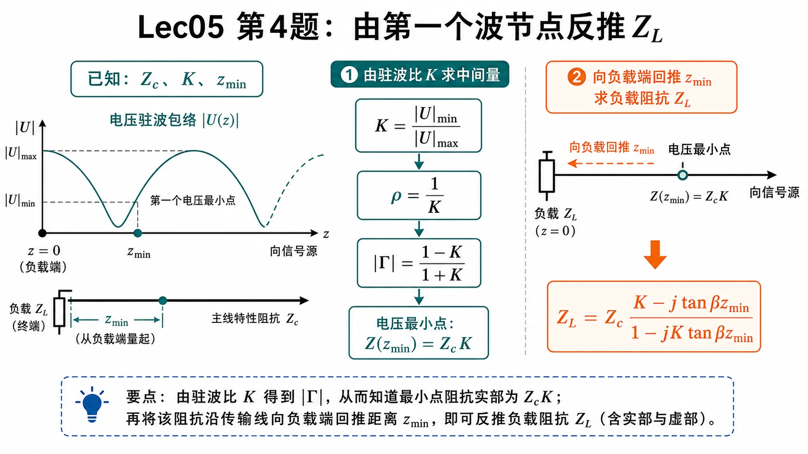
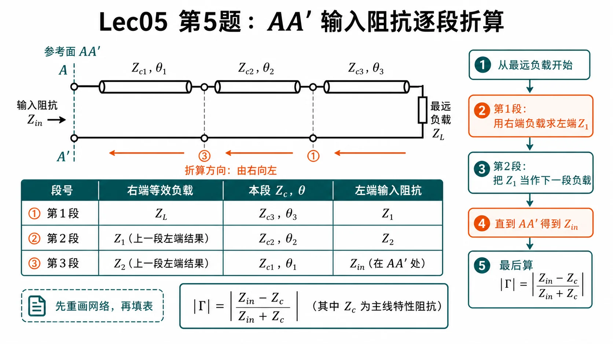
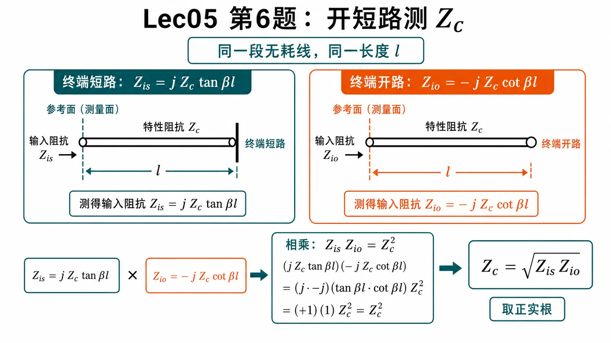

# 第一次作业 · Lec05

> 对应知识点：[05-开短路线周期性与测量](../../knowledge/01-传播与传输线/05-开短路线周期性与测量.md)

---

**导航：** [总目录](README.md) · [符号与导读](00-符号与导读.md) · [Lec01](01-Lec01.md) · [Lec02](02-Lec02.md) · [Lec03](03-Lec03.md) · [Lec04](04-Lec04.md) · **Lec05** · [附录](99-公式与图像.md)

---

## Lec05 作业

---

### 第 1 题

*（对应大纲 **Lec05 作业** 第 1 题；教材 **§1.4** 附近行驻波/纯驻波时间相位。）*

#### 题目复述

某时刻观测无耗线，**沿线各点电压瞬时值皆为零**；另一时刻，**沿线各点电流瞬时值皆为零**。问：反射系数模 $|\Gamma|$？驻波比 $\rho$？

#### 详细思路

纯驻波时，$u(z,t)$ 与 $i(z,t)$ 对时间 **相差 $90^\circ$**（空间上同为驻立分布）：某一时刻全场 $u\equiv 0$，四分之一周期后全场 $i\equiv 0$。行驻波时一般**不能**同时出现「全线 $u$ 恒零」与「全线 $i$ 恒零」这两种极端（除非退化为纯驻波）。

*图：题设的两个“全线过零”时刻对应纯驻波的电压、电流相位相差 $90^\circ$，因此 $|\Gamma|=1$、驻波比趋于无穷。*

#### 一步步解答

电压、电流瞬时值可写为

$$
u(z,t)=\mathrm{Re}\{U(z)\mathrm{e}^{\mathrm{j}\omega t}\},\qquad
i(z,t)=\mathrm{Re}\{I(z)\mathrm{e}^{\mathrm{j}\omega t}\}.
$$

**纯驻波**（$|\Gamma_L|=1$）时，可取实轴对齐使得某时刻 $\omega t_1$ 下 $\cos\omega t_1=0$ 而 $u\equiv 0$；再过 $\Delta t=T/4$，$i\equiv 0$。题设两时刻存在，故为 **纯驻波**，

$$
|\Gamma|=1,\qquad \rho=\frac{1+|\Gamma|}{1-|\Gamma|}\to\infty
$$

（工程上常记为 $\rho=\infty$。）

#### 标准解答

- $|\Gamma|=1$；$\rho=\infty$（纯驻波）。

#### 常见疑惑点

- **疑惑：** 匹配时不是也有「看起来简单」的场吗？**解答：** 匹配为**行波**，沿线各点 $u$ 一般不会在同一时刻**全部**为零（无全局同相零点）。

---

### 第 2 题

*（对应大纲 **Lec05 作业** 第 2 题。）*

#### 题目复述

终端负载 $Z_L=Z_c$（匹配）。线上某处电压相量 $U(z_0)=100\angle 30^\circ$（幅值单位与教材一致，下同）。写出该处、以及沿 **指向信号源** 方向移 $\lambda/8$ 处、沿 **指向负载** 方向移 $\lambda/4$ 处的**电压瞬时值** $u(z,t)$。

#### 详细思路

匹配线上只有**入射行波**，$U(z)$ 沿线仅积累相移：向负载（$+z$）相位按 $\mathrm{e}^{-\mathrm{j}\beta\Delta z}$，向源则相反为 $\mathrm{e}^{+\mathrm{j}\beta|\Delta z|}$。瞬时式 $u=\mathrm{Re}\{U\mathrm{e}^{\mathrm{j}\omega t}\}$；若 $U$ 为**峰值相量**，则 $u=|U|\cos(\omega t+\arg U)$。

*图：匹配时 $\Gamma=0$，幅值保持 $100$ 不变；向源走 $\lambda/8$ 相位加 $45^\circ$，向负载走 $\lambda/4$ 相位减 $90^\circ$。*

#### 一步步解答

设 $+z$ **由信号源指向负载**，行波 $U(z)=U(z_0)\mathrm{e}^{-\mathrm{j}\beta(z-z_0)}$。

- **$z_0$ 处**：$U=100\mathrm{e}^{\mathrm{j}\pi/6}$，

$$
u(z_0,t)=100\cos\Bigl(\omega t+\frac{\pi}{6}\Bigr).
$$

- **向源 $\lambda/8$**：坐标减小 $\lambda/8$，

$$
U=100\mathrm{e}^{\mathrm{j}\pi/6}\cdot\mathrm{e}^{\mathrm{j}\beta\lambda/8}
=100\mathrm{e}^{\mathrm{j}\pi/6}\mathrm{e}^{\mathrm{j}\pi/4}
=100\mathrm{e}^{\mathrm{j}5\pi/12},
$$

$$
u=100\cos\Bigl(\omega t+\frac{5\pi}{12}\Bigr).
$$

- **向负载 $\lambda/4$**：

$$
U=100\mathrm{e}^{\mathrm{j}\pi/6}\cdot\mathrm{e}^{-\mathrm{j}\beta\lambda/4}
=100\mathrm{e}^{\mathrm{j}\pi/6}\mathrm{e}^{-\mathrm{j}\pi/2}
=100\mathrm{e}^{-\mathrm{j}\pi/3},
$$

$$
u=100\cos\Bigl(\omega t-\frac{\pi}{3}\Bigr).
$$

#### 标准解答

- $z_0$：$u=100\cos(\omega t+30^\circ)$（若用角度书写）。
- 向源 $\lambda/8$：$u=100\cos(\omega t+75^\circ)$。
- 向负载 $\lambda/4$：$u=100\cos(\omega t-60^\circ)$。

（相角与 **$+z$ 定义**绑定；若教材反向，所有相移项整体改号即可。）

#### 常见疑惑点

- **疑惑：** $100$ 是有效值还是峰值？**解答：** 上式按 **峰值相量** 写瞬时值；若 $100$ 为有效值，则峰值因子 $\sqrt2$ 乘在余弦前。

---

### 第 3 题

*（对应大纲 **Lec05 作业** 第 3 题。）*

#### 题目复述

线长 $l=5\lambda/8$，**终端开路**，信号源内阻 $R_g=Z_c$，**始端**（接源端）电压相量 $U_{\mathrm{始}}=150\angle 45^\circ$。写出**始端**、以及从始端向负载方向相距 $\lambda/8$、相距 $\lambda/2$ 各处的 $u(z,t)$。

#### 详细思路

1. 取 $z$ **自负载向源**，终端开路 $\Rightarrow$ $\Gamma_L=+1$，负载处为电压腹。
2. 电压相量常用形式 $U(z)=U_L\cos\beta z$（$U_L$ 为负载端相量；与 [附录](99-公式与图像.md) 通解一致）。
3. 由 $U(5\lambda/8)=U_{\mathrm{始}}$ 反解 $U_L$，再求 $U(\lambda/2)$、$U(\lambda/8)$（注意：**从始端向负载**即 $z$ **减小**）。

*图：本题最容易错在位置换算。$z$ 从负载开路端指向始端；从始端向负载移动时，$z$ 变小。*

#### 一步步解答

**开路**：$I_L=0$，取

$$
U(z)=U_L\cos\beta z.
$$

始端 $z=l=5\lambda/8$：

$$
\beta l=\frac{2\pi}{\lambda}\cdot\frac{5\lambda}{8}=\frac{5\pi}{4},\qquad
\cos\frac{5\pi}{4}=-\frac{\sqrt2}{2}.
$$

$$
U_L=\frac{U_{\mathrm{始}}}{\cos(5\pi/4)}
=\frac{150\mathrm{e}^{\mathrm{j}\pi/4}}{-\sqrt2/2}
=-150\sqrt2\,\mathrm{e}^{\mathrm{j}\pi/4}
=150\sqrt2\,\mathrm{e}^{\mathrm{j}5\pi/4}.
$$

**始端**（$z=5\lambda/8$）：

$$
u_{\mathrm{始}}(t)=\mathrm{Re}\{150\mathrm{e}^{\mathrm{j}\pi/4}\mathrm{e}^{\mathrm{j}\omega t}\}
=150\cos\Bigl(\omega t+\frac{\pi}{4}\Bigr).
$$

**从始端向负载 $\lambda/8$** $\Rightarrow$ $z=l-\lambda/8=\lambda/2$：

$$
\beta z=\pi,\qquad U(\lambda/2)=U_L\cos\pi=-U_L,
$$

$$
U(\lambda/2)=150\sqrt2\,\mathrm{e}^{\mathrm{j}5\pi/4}\cdot(-1)=150\sqrt2\,\mathrm{e}^{\mathrm{j}\pi/4},
$$

$$
u=150\sqrt2\cos\Bigl(\omega t+\frac{\pi}{4}\Bigr).
$$

**从始端向负载 $\lambda/2$** $\Rightarrow$ $z=l-\lambda/2=\lambda/8$：

$$
\beta z=\frac{\pi}{4},\qquad U(\lambda/8)=U_L\cos\frac{\pi}{4}=U_L\frac{\sqrt2}{2}=150\mathrm{e}^{\mathrm{j}5\pi/4},
$$

$$
u=150\cos\Bigl(\omega t+\frac{5\pi}{4}\Bigr)=150\cos\Bigl(\omega t-\frac{3\pi}{4}\Bigr).
$$

#### 标准解答

- 始端：$u=150\cos(\omega t+45^\circ)$。
- 始端向负载 $\lambda/8$：$u=150\sqrt2\cos(\omega t+45^\circ)$。
- 始端向负载 $\lambda/2$：$u=150\cos(\omega t+225^\circ)$ 或 $150\cos(\omega t-135^\circ)$。

#### 常见疑惑点

- **疑惑：** 为什么第二处幅值变成 $150\sqrt2$？**解答：** 该点距负载 $\lambda/2$ 为**电压波腹**（开路在 $z=0$ 也是腹），$|U|$ 最大；始端恰在 $\cos(5\pi/4)$ 的较深谷值附近，故幅值较小。

---

### 第 4 题

*（对应大纲 **Lec05 作业** 第 4 题。）*

#### 题目复述

特性阻抗 $Z_c$，**行波系数** $K$（此处取 **$K=|U|_{\min}/|U|_{\max}$**，与大纲常用定义一致），终端负载 $Z_l$，**第一个电压最小点**距终端 $z_{\min}$。求 $Z_l$。

#### 详细思路

1. 由 $K$ 得 $\rho=1/K$，$|\Gamma|=(\rho-1)/(\rho+1)=(1-K)/(1+K)$。
2. 在电压最小点，无耗线输入阻抗为**纯阻** $R_{\min}=Z_c K$（与 $\rho$ 关系一致：$R_{\min}=Z_c/\rho$）。
3. 将该处阻抗当作「已知」，向负载回推距离 $z_{\min}$，即把 $Z(z_{\min})=Z_c K$ 代入反解 $Z_l$。

*图：先由 $K$ 确定波节处的纯阻值 $Z_cK$，再把该截面沿无耗线向负载端回推 $z_{\min}$。*

#### 一步步解答

在 $z=z_{\min}$ 处：

$$
Z(z_{\min})=Z_c\frac{Z_l+\mathrm{j}Z_c t}{Z_c+\mathrm{j}Z_l t}=Z_c K,\qquad t=\tan(\beta z_{\min}).
$$

于是

$$
\frac{Z_l+\mathrm{j}Z_c t}{Z_c+\mathrm{j}Z_l t}=K
\Rightarrow Z_l+\mathrm{j}Z_c t=K Z_c+\mathrm{j}K Z_l t.
$$

$$
Z_l(1-\mathrm{j}K t)=Z_c(K-\mathrm{j}t).
$$

$$
\boxed{Z_l=Z_c\,\frac{K-\mathrm{j}\tan(\beta z_{\min})}{1-\mathrm{j}K\tan(\beta z_{\min})}.}
$$

（若教材把 $K$ 定义为 $|U|_{\max}/|U|_{\min}$，则上式中 $K$ 与 $1/K$ 互换后再推导。）

#### 标准解答

- $\displaystyle Z_l=Z_c\frac{K-\mathrm{j}\tan(\beta z_{\min})}{1-\mathrm{j}K\tan(\beta z_{\min})}$（$\beta=2\pi/\lambda$）。

#### 常见疑惑点

- **疑惑：** 第一个波节是否唯一确定 $Z_l$？**解答：** 在 **$Z_c$、$K$、$z_{\min}$ 已知** 且线**无耗**的前提下，上式给出与测量一致的一个 $Z_l$；多解情况来自周期 $\lambda/2$，题目已用「第一个」波节固定分支。

---

### 第 5 题

*（对应大纲 **Lec05 作业** 第 5 题；教材 **图 1-1** 网络。请**直接对照原书插图**完成数值。）*

#### 题目复述

求图 1-1 中传输线 **输入端 $AA'$** 的等效输入阻抗 $Z_{\mathrm{in}}(AA')$ 与 **反射系数模** $|\Gamma|$（相对 $AA'$ 所在那段线的 $Z_c$）。

#### 详细思路

1. **从右向左**（从最远负载向 $AA'$）逐级算：每段无耗线用

$$
Z_{\mathrm{in}}=Z_c\frac{Z_L+\mathrm{j}Z_c\tan\beta l}{Z_c+\mathrm{j}Z_L\tan\beta l},
$$

其中 $Z_L$ 为该段**右端**看入的等效负载，$l$、$Z_c$ 取图中标注。
2. 若两段线**级联**，交界处的 $Z_{\mathrm{in}}$ 作为左段的负载。
3. 得到 $AA'$ 处总输入阻抗 $Z_{\mathrm{in}}$ 后，相对本段 $Z_c$：

$$
\Gamma=\frac{Z_{\mathrm{in}}-Z_c}{Z_{\mathrm{in}}+Z_c},\qquad |\Gamma|=\Bigl|\frac{Z_{\mathrm{in}}-Z_c}{Z_{\mathrm{in}}+Z_c}\Bigr|.
$$

*图：这类网络题先重画连接关系，再从最远负载开始逐段向 $AA'$ 折算；最后用 $AA'$ 所在线段的 $Z_c$ 求 $|\Gamma|$。*

#### 一步步解答（对照教材图 1-1 的「填空表」）

请先在书上标出各段 **电长度**（如 $\lambda/8$、$\lambda/4$）、各段 **$Z_c$**、**终端负载**（短路/开路/电阻/纯电抗）。然后**从终端负载一侧起，沿指向 $AA'$ 的方向逐段向左（或按你书上图示的链路顺序）**填下表（把 $Z_{L0}$ 换成图上最末端的负载）。

| 步骤 | 该段右端等效 $Z$ | 该段 $Z_c$ | 电长度 $\beta l$ | 公式 | 输出：该段左端 $Z_{\mathrm{in}}$ |
|------|------------------|------------|------------------|------|----------------------------------|
| 1 | 终端负载 $Z_{L0}$（书上图示） | $Z_{c1}$ | $\theta_1$ | $Z_{c1}\dfrac{Z_{L0}+\mathrm{j}Z_{c1}\tan\theta_1}{Z_{c1}+\mathrm{j}Z_{L0}\tan\theta_1}$ | $Z_1$ |
| 2 | $Z_1$（作为下一段负载） | $Z_{c2}$ | $\theta_2$ | 同上 | $Z_2$ |
| … | … | … | … | … | … |
| 末 | … | $Z_{c,AA}$ | $\theta_{AA}$ | 同上 | $Z_{\mathrm{in}}(AA')$ |

**纯短路/开路** 时可直接用 $Z_{\mathrm{in}}=\mathrm{j}Z_c\tan\beta l$ 或 $-\mathrm{j}Z_c\cot\beta l$ 代替上式。**$\lambda/4$ 段接纯阻** 可用 $Z_{\mathrm{in}}=Z_c^2/R$ 快速验算。

算得 $Z_{\mathrm{in}}(AA')$ 后，用所在线段特性阻抗 $Z_c$ 代入 $\Gamma=(Z_{\mathrm{in}}-Z_c)/(Z_{\mathrm{in}}+Z_c)$ 即得 $|\Gamma|$。

#### 标准解答

- **无统一数值答案**；结果由 **教材图 1-1** 上各段 $Z_c$、长度与终端负载决定。
- **方法结论**：$Z_{\mathrm{in}}(AA')$ 为从最右端向左多次阻抗变换的结果；$\displaystyle |\Gamma|=\left|\frac{Z_{\mathrm{in}}-Z_c}{Z_{\mathrm{in}}+Z_c}\right|$（$Z_c$ 取 $AA'$ 处主线特性阻抗）。

#### 常见疑惑点

- **疑惑：** 题图看不清怎么办？**解答：** 先重画网络连接关系，标出参考面、串并联关系与每段线长；本题关键是看清连接方式，再按串并联等效和输入阻抗公式计算。

---

### 第 6 题

*（对应大纲 **Lec05 作业** 第 6 题。）*

#### 题目复述

$Z_{\mathrm{is}}$ 为**终端短路**时某参考面的输入阻抗，$Z_{\mathrm{io}}$ 为**终端开路**时同一参考面的输入阻抗，$Z_c$ 为特性阻抗。试证 $Z_c=\sqrt{Z_{\mathrm{is}}Z_{\mathrm{io}}}$。

#### 详细思路

同一位置、同一线长 $l$，仅改终端边界：短路 $Z_L=0$、开路 $Z_L\to\infty$ 代入无耗 $Z_{\mathrm{in}}$ 公式，得 $\tan$ 与 $\cot$ 互为倒数，相乘消去。

*图：两次测量必须是同一段线、同一参考面、同一长度 $l$；只改变终端开路/短路条件。*

#### 一步步解答

$$
Z_{\mathrm{is}}=Z_c\,\frac{0+\mathrm{j}Z_c\tan\beta l}{Z_c+0}=\mathrm{j}Z_c\tan\beta l,
$$

$$
Z_{\mathrm{io}}=Z_c\,\frac{\infty\ \text{极限}}{ \cdots }=-\mathrm{j}Z_c\cot\beta l.
$$

（开路线用 $Z_{\mathrm{in}}=-\mathrm{j}Z_c\cot\beta l$ 亦可直接写出。）

$$
Z_{\mathrm{is}}Z_{\mathrm{io}}=(\mathrm{j}Z_c\tan\beta l)(-\mathrm{j}Z_c\cot\beta l)=Z_c^2.
$$

故

$$
\boxed{Z_c=\sqrt{Z_{\mathrm{is}}Z_{\mathrm{io}}}.}
$$

取 **正实根** 作为特性阻抗（无耗线 $Z_c>0$）。

#### 标准解答

- 由 $Z_{\mathrm{is}}=\mathrm{j}Z_c\tan\beta l$、$Z_{\mathrm{io}}=-\mathrm{j}Z_c\cot\beta l$ 得 $Z_{\mathrm{is}}Z_{\mathrm{io}}=Z_c^2$，故 $Z_c=\sqrt{Z_{\mathrm{is}}Z_{\mathrm{io}}}$。

#### 常见疑惑点

- **疑惑：** 复数开方有两支？**解答：** $Z_c$ 定义为**正实数**；测量上 $Z_{\mathrm{is}}$、$Z_{\mathrm{io}}$ 在同一频率下应使根号内乘积落在正实轴（理想无耗情形）。

---
