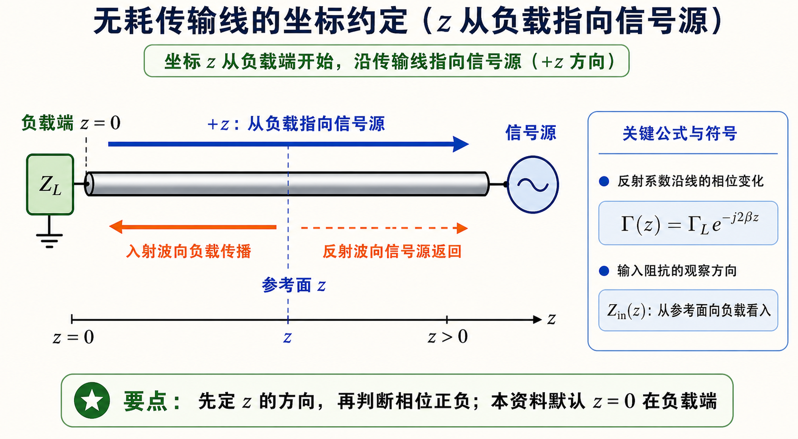

# 第二次作业 · 符号约定与导读

**导航：** [总目录](README.md) · [符号与导读](00-符号与导读.md) · [Lec06](01-Lec06.md) · [Lec07](02-Lec07.md) · [Lec08–09](03-Lec08-09/README.md) · [附录](99-公式与图像.md)

---

## 符号约定与读前说明

- **$z$**：自**终端负载**指向**信号源**的距离（与多数教材长线公式一致）。
- **相量**：$U$、$I$、$Z$ 等为复数（正弦稳态下的复振幅）；$\mathrm{j}$ 为虚单位。
- **特性阻抗** $Z_c$（或 $Z_0$）：传输线本身的参数；**驻波比** $\rho$（或 $s$）；**行波系数** $K=1/\rho$（对电压驻波）。
- **相位常数** $\beta=2\pi/\lambda$（rad/m），**电长度**常用 $l/\lambda$（无量纲）表示「线长是波长的几分之几」。

*图：与 $\Gamma(z)=\Gamma_L\mathrm{e}^{-\mathrm{j}2\beta z}$ 配套的距离参考；负载在左、源在右仅为示意，与电路图画法无关。*

### 如何阅读本文

每道作业推荐顺序：**① 题目复述** → **② 详细思路**（预备知识 + 为何这样算）→ **③ 一步步解答**（推导与代入）→ **④ 标准解答**（最终结论精粹，便于对答案）。**Lec07** 建议**先读该讲「Smith 圆图零基础」**，再按各题 **解法二** 配图学习；公式路径见各题 **解法一**。**Lec08–09** 建议先读 [Lec08–09 分册](03-Lec08-09/README.md) 中 **「本讲导读」**，再读 **「导纳匹配与 $g=1$ 圆（零基础）」**，然后分题用 **解法二**。**Lec07** 与 **Lec08–09** 中凡标 **「解法二：圆图（Smith）」** 或 **「圆图解法」**、**「圆图与解析对应」** 的小节，请按步骤在 Smith 圆图上操作并与 **解法一** 公式结果对照；其余题亦可用 **向源 = 顺时针** 原则抽查。每题末可选读 **「常见疑惑点」**。做题前可扫一眼 [附录](99-公式与图像.md) 中 **「本阶段常用公式速查」**，再按需跳回各题。

**题面说明**：具体数值与表述以各分册各题 **「题目复述」** 为准。各题下 **「对应大纲」** 一行中的 **§1.5 / §1.6** 用于定位 Smith 圆图、无耗线变换和阻抗匹配等相关知识点。

**未展开**：大纲中「课后练习：本节全部例题」及未标「作业」的纯思考题。

### 本阶段易错速览（一行一条）

- $z$、$l$ 均按文首约定：**自负载向源**；圆图上**向源 = 顺时针**转波长数。
- Smith 图上**淡灰线**主要是两族：**等 $r$ 圆**与**等 $x$ 弧**；做题只找题目里的那一个 $r$、一个 $x$ 的交点，不必认清每一条灰线。
- **无源负载**下 $|\Gamma|\le 1$，故 **$\rho=(1+|\Gamma|)/(1-|\Gamma|)\ge 1$**；$\rho$ 只依赖 $|\Gamma|$，与辐角无关。
- **并联**结点用 **导纳相加**；**串联**元件用 **阻抗相加**，不可把串联支节写成 $Y_{\mathrm{line}}+Y_{\mathrm{stub}}$。
- **短路支节** $Z=\mathrm{j}Z_c\tan\beta l$，**开路支节** $Z=-\mathrm{j}Z_c\cot\beta l$；与并联单支节题设一致再代公式。
- $\tan\beta l$ 周期为 $\pi$，对应线长加 **$\lambda/2$**；「最短解」常在 $(0,\lambda/2)$ 内挑选。
- 单支节匹配常有多组 $(d,l)$，另加 **$\lambda/2$** 周期；工程上常取**距负载最近**的 $d$（见 [Lec08–09 第 5 题](03-Lec08-09/第05题.md) 数值解）。

### 图像阅读提示

Lec06 先看沿线电压、电流幅值如何随 $z$ 起伏；Lec07 再把同一件事搬到 Smith 圆图上，看 $\Gamma$ 的模长不变、相位随沿线移动旋转；Lec08–09 做匹配时，重点看 **先沿线移动到 $g=1$ 圆，再用支节补掉虚部** 这一条路径。

---
