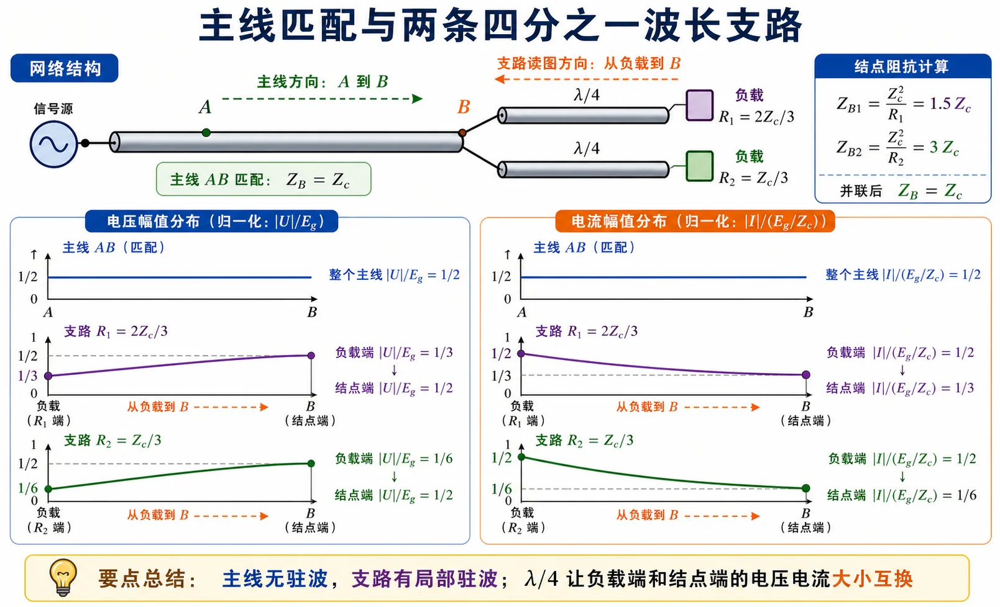
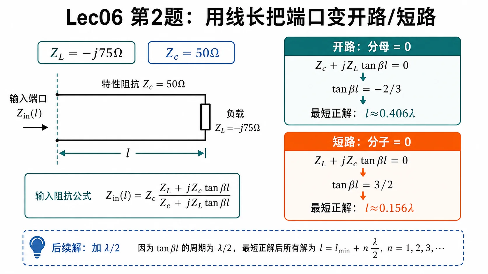
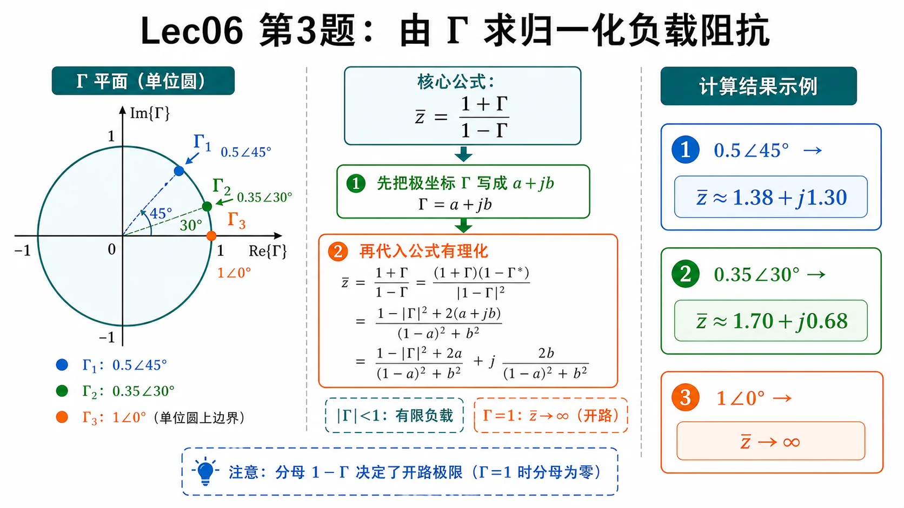
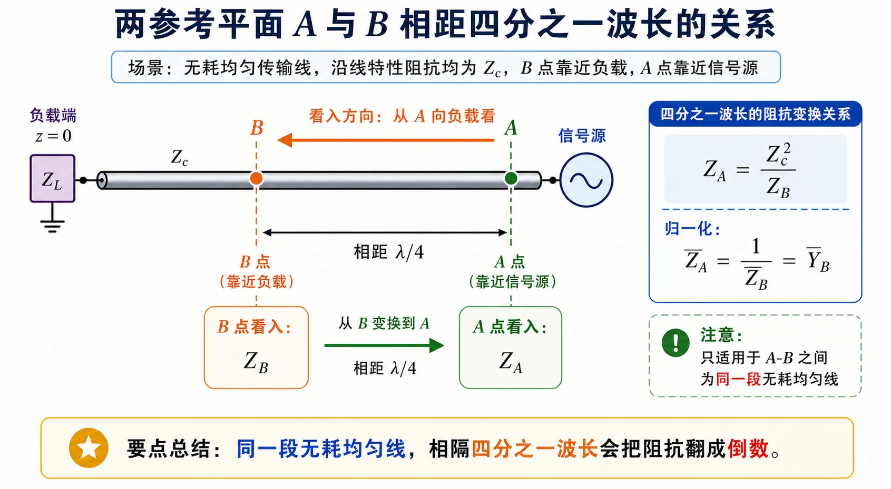
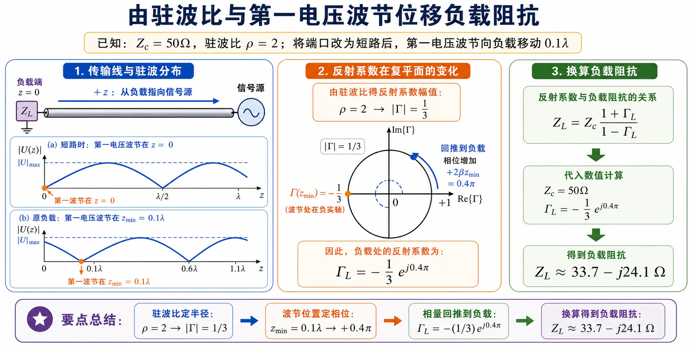

# 第二次作业 · Lec06

> 对应知识点：[01-多段线并联与四分之一波长](../../knowledge/02-反射与匹配/01-多段线并联与四分之一波长.md)

---

**导航：** [总目录](README.md) · [符号与导读](00-符号与导读.md) · [Lec06](01-Lec06.md) · [Lec07](02-Lec07.md) · [Lec08–09](03-Lec08-09/README.md) · [附录](99-公式与图像.md)

---

## Lec06 作业

### 第 1 题

*（对应大纲《第二次教学大纲及作业》**Lec06 作业** 第 1 题；该讲「教材章节」建议对照 **§1.5**，版本以你班指定教材为准。）*

#### 题目复述

主线与两支线特性阻抗均为 $Z_c$；信号源电压幅值 $E_g$，内阻 $R_g=Z_c$；两支线各长 $\lambda/4$，分别接 $R_1=2Z_c/3$、$R_2=Z_c/3$。要求画出**主线与支线上电压、电流幅值**的分布。

#### 详细思路

1. **$\lambda/4$ 线的阻抗变换**：终端接**纯阻** $R$、线长为 $\lambda/4$ 时，在另一端（向源端看）的输入阻抗为 $Z_{\mathrm{in}}=Z_c^2/R$（无耗线）。物理上相当于四分之一波长线把电阻「翻转」成另一个电阻。
2. **并联阻抗**：两分支在结点 $B$ 并联时，$\dfrac{1}{Z_B}=\dfrac{1}{Z_{B1}}+\dfrac{1}{Z_{B2}}$。
3. **匹配**：若从某点向负载看入的总阻抗等于 $Z_c$，且电源内阻也是 $Z_c$，则主线上为**行波区**，$|V|$、$|I|$ 沿线**不变**（无反射回源端）。
4. **驻波与反射系数**：支线上终端 $R\neq Z_c$ 时存在反射；电压幅值可写为 $|U(d)|=|U^+|\,|1+\Gamma\mathrm{e}^{-\mathrm{j}2\beta d}|$（$d$ 为自负载向结点计量），电流有类似 $|1-\Gamma\mathrm{e}^{-\mathrm{j}2\beta d}|$ 形式；$\Gamma_L=\dfrac{R-Z_c}{R+Z_c}$。

**思路叙述：**

先算两分支在 $B$ 点各自呈现的阻抗（用 $\lambda/4$ 公式），再并联看是否等于 $Z_c$，从而判断主线是否匹配。主线匹配则 $|V|$、$|I|$ 为常数。再在每条支线上，由负载反射系数写出幅值随 $d$ 的变化，并利用结点 $B$ 处电压连续定 $|U^+|$。

#### 一步步解答

**步骤 1 — 分支在 $B$ 点的输入阻抗**

对 $R_1$ 支路（$\lambda/4$）：

$$
Z_{B1}=\frac{Z_c^2}{R_1}=\frac{Z_c^2}{2Z_c/3}=\frac{3}{2}Z_c.
$$

对 $R_2$ 支路：

$$
Z_{B2}=\frac{Z_c^2}{R_2}=\frac{Z_c^2}{Z_c/3}=3Z_c.
$$

**步骤 2 — $B$ 点并联**

$$
\frac{1}{Z_B}=\frac{1}{Z_{B1}}+\frac{1}{Z_{B2}}=\frac{2}{3Z_c}+\frac{1}{3Z_c}=\frac{1}{Z_c}
\quad\Rightarrow\quad Z_B=Z_c.
$$

即从主线看入 $B$，右侧等效为 $Z_c$，与 $R_g=Z_c$、主线 $Z_c$ 构成匹配，**主线 $AB$ 上 $|V|$、$|I|$ 为常数**。

**步骤 3 — 支线上反射系数**

$$
\Gamma_{L1}=\frac{R_1-Z_c}{R_1+Z_c}=\frac{2Z_c/3-Z_c}{2Z_c/3+Z_c}=-\frac{1}{5},\qquad
\Gamma_{L2}=\frac{Z_c/3-Z_c}{Z_c/3+Z_c}=-\frac{1}{2}.
$$

**步骤 4 — 幅值分布（概念式）**

在支线上取 $d$ 为**自负载指向结点**的电距离，则

$$
|V(d)|=|U^+_i|\,|1+\Gamma_{Li}\mathrm{e}^{-\mathrm{j}2\beta d}|,\quad
|I(d)|=\frac{|U^+_i|}{Z_c}\,|1-\Gamma_{Li}\mathrm{e}^{-\mathrm{j}2\beta d}|.
$$

在 $d=\lambda/4$（结点 $B$）处 $|V|$ 应等于主线上的常数值，由此可定 $|U^+_1|$、$|U^+_2|$。归一化取 $E_g=1$、$Z_c=1$ 时，主线上 $|V|=\dfrac{1}{2}E_g$（匹配半压），$|I|=\dfrac{1}{2}(E_g/Z_c)$。

端点值可用功率守恒快速校验：

| 位置 | $|V|/E_g$ | $|I|/(E_g/Z_c)$ |
|------|-----------|------------------|
| 主线 $AB$ | $1/2$ | $1/2$ |
| $R_1$ 负载端 | $1/3$ | $1/2$ |
| $R_1$ 结点 $B$ 端 | $1/2$ | $1/3$ |
| $R_2$ 负载端 | $1/6$ | $1/2$ |
| $R_2$ 结点 $B$ 端 | $1/2$ | $1/6$ |

#### 标准解答

- $Z_{B1}=\dfrac{3}{2}Z_c$，$Z_{B2}=3Z_c$，并联得 $Z_B=Z_c$，主线匹配，$|V|$、$|I|$ 沿线为常数。
- $\Gamma_{L1}=-\dfrac{1}{5}$，$\Gamma_{L2}=-\dfrac{1}{2}$；支线上 $|V|$、$|I|$ 按驻波公式随 $d$ 起伏。
- 归一化 $E_g=1$、$Z_c=1$ 时主线上 $|V|=\dfrac{1}{2}E_g$、$|I|=\dfrac{1}{2}(E_g/Z_c)$；两支路端点幅值见图中标注。

- **检验/注意：** 结点匹配使主线无驻波；两支线 $R\neq Z_c$ 故有驻波，腹节位置可用 $|1\pm\Gamma\mathrm{e}^{-\mathrm{j}2\beta d}|$ 自检。

#### 常见疑惑点

- **疑惑：** 支线上的 $d$ 和文首说的 $z$ 是不是一回事？**解答：** 本题支线上特意用 $d$ 表示**自负载指向结点 $B$** 的距离；它与符号约定里的 $z$（自负载向源）方向一致，只是强调「在支路局部」计量。
- **疑惑：** 为什么主线 $|V|$、$|I|$ 可以画成常数？**解答：** 从结点 $B$ 向两支路看入并联为 $Z_c$，与 $R_g=Z_c$、主线 $Z_c$ 匹配，源端无反射回主线，主线处于行波区，幅值沿线不变。
- **疑惑：** $\lambda/4$ 公式 $Z_{\mathrm{in}}=Z_c^2/R$ 对电容、电感负载成立吗？**解答：** 本题两支终端为**纯电阻**，故可用该式；若为复数 $Z_L$，仍可用一般式 $Z_{\mathrm{in}}=Z_c\dfrac{Z_L+\mathrm{j}Z_c\tan\beta l}{Z_c+\mathrm{j}Z_L\tan\beta l}$，令 $l=\lambda/4$ 化简，而不是盲目套 $Z_c^2/R$。

---

### 第 2 题

*（对应大纲 **Lec06 作业** 第 2 题；该讲教材章节 **§1.5**。）*

#### 题目复述

$Z_c=50\,\Omega$，$Z_L=-\mathrm{j}75\,\Omega$。求使**始端**输入阻抗 $Z_{\mathrm{in}}=\infty$（开路）与 $Z_{\mathrm{in}}=0$（短路）的**最短**线长 $l$。

#### 详细思路

1. **无耗线输入阻抗**（长 $l$，$z$ 自负载）：

$$
Z_{\mathrm{in}}(l)=Z_c\,\frac{Z_L+\mathrm{j}Z_c\tan\beta l}{Z_c+\mathrm{j}Z_L\tan\beta l},\quad \beta=\frac{2\pi}{\lambda}.
$$

2. **$\tan\beta l$ 的周期性**：$\tan$ 周期为 $\pi$（对应 $l$ 增加 $\lambda/2$），故同一阻抗往往有无穷多线长解；**最短正解**需在 $(0,\lambda/2)$ 或等价主值区间内挑选。

**思路叙述：**

$Z_{\mathrm{in}}=\infty$ 等价于**分母为零**（有限 $Z_L$ 时）；$Z_{\mathrm{in}}=0$ 等价于**分子为零**。分别解 $\tan\beta l$，再化成 $l/\lambda$。

*图：同一个输入阻抗公式里，开路看分母，短路看分子；最短正解之外再加 $\lambda/2$ 得等效线长。*

#### 一步步解答

通式已给。注意 $\mathrm{j}Z_L\tan\beta l=\mathrm{j}(-\mathrm{j}75)\tan\beta l=75\tan\beta l$（实数）。

**（1）$Z_{\mathrm{in}}=\infty$：分母为零**

$$
Z_c+\mathrm{j}Z_L\tan\beta l=50+75\tan\beta l=0
\quad\Rightarrow\quad
\tan\beta l=-\frac{2}{3}.
$$

$\arctan(-2/3)$ 为负角，取**最短正** $\beta l$：

$$
\beta l=\pi-\arctan\frac{2}{3}
\quad\Rightarrow\quad
l_{\min}=\frac{\lambda}{2\pi}\Bigl(\pi-\arctan\frac{2}{3}\Bigr)\approx 0.406\,\lambda.
$$

**（2）$Z_{\mathrm{in}}=0$：分子为零**

$$
Z_L+\mathrm{j}Z_c\tan\beta l=-\mathrm{j}75+\mathrm{j}50\tan\beta l=0
\quad\Rightarrow\quad
\tan\beta l=\frac{3}{2},
$$

$$
l_{\min}=\frac{\lambda}{2\pi}\arctan\frac{3}{2}\approx 0.156\,\lambda.
$$

#### 标准解答

- 使 $Z_{\mathrm{in}}=\infty$（分母为零）：**$l_{\min}\approx 0.406\,\lambda$**。
- 使 $Z_{\mathrm{in}}=0$（分子为零）：**$l_{\min}\approx 0.156\,\lambda$**。

- **检验/注意：** 纯电抗负载下，适当线长可把端口变成等效开路或短路，这是谐振腔、阻抗变换等应用的基础。

#### 常见疑惑点

- **疑惑：** 为什么说 $Z_{\mathrm{in}}=\infty$ 要令**分母**为零？**解答：** 公式为分式，在 $Z_L$ 有限时，只有分母趋于零而分子非零，$Z_{\mathrm{in}}$ 才趋于无穷（开路）；分子为零则 $Z_{\mathrm{in}}=0$（短路）。
- **疑惑：** $\tan\beta l=-2/3$ 为什么不直接取 $\arctan$ 的负角？**解答：** $\arctan$ 主值在 $(-\pi/2,\pi/2)$，得到的是负的 $\beta l$，对应「向负载缩短」的等效；题目要**最短正**线长，需在 $\tan$ 的周期内取 $\beta l=\pi-\arctan(2/3)\in(0,\pi)$。
- **疑惑：** 加上整数倍 $\lambda/2$ 线长会怎样？**解答：** $\tan\beta l$ 周期为 $\pi$（$\beta l$ 增加 $\pi$ 即线长增加 $\lambda/2$），故 $Z_{\mathrm{in}}$ 每 $\lambda/2$ 重复；「最短」即在 $(0,\lambda/2)$ 内挑第一个满足条件的解。

---

### 第 3 题

*（对应大纲 **Lec06 作业** 第 3 题；该讲教材章节 **§1.5**。）*

#### 题目复述

传输线终端反射系数分别为（题面印刷按常见写法理解为）$\Gamma=0.5\angle45^\circ$、$0.35\angle30^\circ$、$1\angle0^\circ$。求**归一化负载阻抗** $\bar Z$。

#### 详细思路

1. **$\Gamma$ 的极坐标与代数形式**：$|\Gamma|\angle\theta=|\Gamma|(\cos\theta+\mathrm{j}\sin\theta)$。
2. **归一化阻抗与反射系数**（对同一 $Z_c$）：

$$
\bar Z=\frac{Z_L}{Z_c}=\frac{1+\Gamma}{1-\Gamma}.
$$

3. **$|\Gamma|=1$**：全反射，$\Gamma=1$ 时 $\bar Z\to\infty$，对应负载开路（在纯电抗负载的一种极限）。

**思路叙述：**

把每个 $\Gamma$ 写成 $a+\mathrm{j}b$，代入 $\bar Z=(1+\Gamma)/(1-\Gamma)$，有理化分母。

*图：先把 $\Gamma$ 的极坐标写成复数，再代入 $\bar Z=(1+\Gamma)/(1-\Gamma)$；当 $\Gamma=1$ 时分母为零，对应开路极限。*

#### 一步步解答

**（1）$\Gamma=0.5\mathrm{e}^{\mathrm{j}45^\circ}=0.5\bigl(\dfrac{\sqrt2}{2}+\mathrm{j}\dfrac{\sqrt2}{2}\bigr)\approx 0.3536+\mathrm{j}0.3536$**

$$
\bar Z=\frac{1+0.3536+\mathrm{j}0.3536}{1-0.3536-\mathrm{j}0.3536}
=\frac{1.3536+\mathrm{j}0.3536}{0.6464-\mathrm{j}0.3536}.
$$

分母有理化（或直接用计算器）得 $\bar Z\approx 1.38+\mathrm{j}1.30$。

**（2）$\Gamma=0.35\mathrm{e}^{\mathrm{j}30^\circ}\approx 0.3031+\mathrm{j}0.175$**

同理得 $\bar Z\approx 1.70+\mathrm{j}0.68$。

**（3）$\Gamma=1$**

$$
\bar Z=\frac{1+1}{1-1}\to\infty,
$$

对应**开路**（或理想开路极限）。

#### 标准解答

- $\Gamma=0.5\angle45^\circ$：$\bar Z\approx 1.38+\mathrm{j}1.30$。
- $\Gamma=0.35\angle30^\circ$：$\bar Z\approx 1.70+\mathrm{j}0.68$。
- $\Gamma=1$：$\bar Z\to\infty$（开路）。

- **检验/注意：** $|\Gamma|<1$ 时 $\bar Z$ 为有限复数；$|\Gamma|=1$ 且 $\Gamma=1$ 对应开路点。

#### 常见疑惑点

- **疑惑：** $\bar Z=(1+\Gamma)/(1-\Gamma)$ 里的 $\Gamma$ 是电压反射系数吗？**解答：** 与本文一致的约定下，负载处电压反射系数 $\Gamma=(Z_L-Z_c)/(Z_L+Z_c)$，归一化阻抗 $\bar Z=Z_L/Z_c$ 满足 $\bar Z=(1+\Gamma)/(1-\Gamma)$；勿与电流反射系数混用（差一个符号）。
- **疑惑：** 算出的 $\bar Z$ 要不要乘 $Z_c$ 才是 $Z_L$？**解答：** 题要的是**归一化** $\bar Z$；若题目给具体 $Z_c$，则 $Z_L=Z_c\bar Z$。
- **疑惑：** $\Gamma=1\angle0^\circ$ 为什么是开路？**解答：** 代入得 $\bar Z\to\infty$，即 $R\to\infty$，理想开路；注意 $|\Gamma|=1$ 且 $\Gamma\neq 1$ 时一般是纯电抗负载，而不是开路。

---

### 第 4 题

*（对应大纲 **Lec06 作业** 第 4 题；该讲教材章节 **§1.5**。）*

#### 题目复述

传输线上 $A$、$B$ 两点相距 $\lambda/4$。证明：$A$ 点的归一化输入阻抗等于 $B$ 点的归一化导纳（形式或数值上 $\bar Z_A=\bar Y_B$）。

#### 详细思路

1. **$\lambda/4$ 阻抗变换**：无耗线长 $\lambda/4$，若 $B$ 向负载看入为 $Z_B$，则 $A$ 向负载看入（多一段 $\lambda/4$）满足 $Z_A=Z_c^2/Z_B$。
2. **归一化**：$\bar Z=Z/Z_c$，$\bar Y=Y\cdot Z_c=1/\bar Z$。

**思路叙述：**

先用 $Z_A=Z_c^2/Z_B$，再两边除以 $Z_c$ 化为归一化关系。

*图：$B$ 更靠近负载，$A$ 更靠近源，二者相距 $\lambda/4$（与证明中「从 $B$ 向负载看为 $Z_B$，从 $A$ 向负载看多一段 $\lambda/4$」一致）。*

#### 一步步解答

由 $\lambda/4$ 变换：

$$
Z_A=\frac{Z_c^2}{Z_B}.
$$

归一化：

$$
\bar Z_A=\frac{Z_A}{Z_c}=\frac{Z_c^2}{Z_B Z_c}=\frac{Z_c}{Z_B}=\frac{1}{Z_B/Z_c}=\frac{1}{\bar Z_B}=\bar Y_B.
$$

证毕。

#### 标准解答

- 已证 **$\bar Z_A=\bar Y_B$**（$\lambda/4$ 变换 + 归一化）。

- **检验/注意：** 这是 Smith 圆图上「转 $\lambda/4$ 相当于阻抗↔导纳互换」的解析基础。

#### 常见疑惑点

- **疑惑：** $\bar Y_B$ 是 $Y_B$ 还是 $Y_B\cdot Z_c$？**解答：** 本文约定 $\bar Y=Y\cdot Z_c=1/\bar Z$（与 $\bar Z=Z/Z_c$ 配套）；证式里用的是 $\bar Y_B=Z_c/Z_B=1/\bar Z_B$。
- **疑惑：** $A$ 比 $B$ 更靠近源，为什么说 $Z_A=Z_c^2/Z_B$？**解答：** 两者相对**同一负载参考方向**：从 $B$ 向负载看是 $Z_B$，从 $A$ 向负载看多一段 $\lambda/4$，故用 $\lambda/4$ 变换把 $Z_B$ 翻到 $Z_A$。
- **疑惑：** 数值上 $\bar Z_A$ 会等于 $\bar Z_B$ 吗？**解答：** 一般不等；相等的是 **$\bar Z_A$ 与 $\bar Y_B$**（归一化导纳），不要与「阻抗相等」混淆。

---

### 第 5 题

*（对应大纲 **Lec06 作业** 第 5 题；该讲教材章节 **§1.5**。）*

#### 题目复述

$Z_c=50\,\Omega$，驻波比 $\rho=2$。当终端**改短路**时，电压最小点位置向**负载**方向移动了 $0.1\lambda$。求原负载 $Z_L$。

#### 详细思路

1. **$\rho$ 与 $|\Gamma|$**：$|\Gamma|=\dfrac{\rho-1}{\rho+1}$。
2. **反射系数沿线**：$\Gamma(z)=\Gamma_L\mathrm{e}^{-\mathrm{j}2\beta z}$（$z$ 自负载向源）。
3. **电压波节**：$|U|$ 最小处对应反射波与入射波相消；用 $\Gamma(z)$ 相位可定波节位置。短路时第一波节在负载处 $z=0$。

**思路叙述：**

（可与 **Lec07 第 5 题** 对照：同一类由 $\rho$ 与第一波节反推 $Z_L$ 的题。）「向负载移动 $0.1\lambda$」表示：有载时**第一电压波节**到负载的距离比短路情形「远」 $0.1\lambda$，短路时第一波节在负载，故有载时**第一波节在 $z_{\min}=0.1\lambda$**。由波节条件定 $\Gamma_L$ 相位，再结合 $|\Gamma|$ 得 $Z_L$。

*图：仅为直观示意 $|V(z)|$ 沿线变化与「距负载最近」的电压波节；Lec07-5 中 $z_{\min}=0.2\lambda$ 时波形周期相同、位置按比例平移即可理解。*

#### 一步步解答

**步骤 1**

$$
|\Gamma|=\frac{\rho-1}{\rho+1}=\frac{1}{3}.
$$

**步骤 2 — 波节与 $\Gamma(z)$**

第一波节处可设 $\Gamma(z_{\min})=-|\Gamma|$（实数负，与教材约定一致）。又

$$
\Gamma(z_{\min})=\Gamma_L\mathrm{e}^{-\mathrm{j}2\beta z_{\min}},
$$

故

$$
\Gamma_L=-|\Gamma|\mathrm{e}^{\mathrm{j}2\beta z_{\min}}
=-\frac{1}{3}\mathrm{e}^{\mathrm{j}2\cdot(2\pi/\lambda)\cdot 0.1\lambda}
=-\frac{1}{3}\mathrm{e}^{\mathrm{j}0.4\pi}.
$$

**步骤 3 — $Z_L$**

$$
Z_L=Z_c\frac{1+\Gamma_L}{1-\Gamma_L}\approx(33.74-\mathrm{j}24.07)\,\Omega.
$$

（代数展开可用计算器完成。）

#### 标准解答

- **$Z_L\approx(33.74-\mathrm{j}24.07)\,\Omega$**。

- **检验/注意：** $\rho$ 定 $|\Gamma|$，波节位置定 $\Gamma$ 辐角，最后由 $\Gamma$ 换回 $Z_L$，是典型「测量反推负载」思路。

#### 常见疑惑点

- **疑惑：** 「最小点向负载移动 $0.1\lambda$」怎么变成 $z_{\min}=0.1\lambda$？**解答：** 终端改短路后，第一波节在负载 $z=0$；相对该参考，有载时第一波节出现在离负载更远 $0.1\lambda$ 处，即 $z_{\min}=0.1\lambda$（有载时第一电压波节到负载的距离）。
- **疑惑：** 第一波节处为什么写 $\Gamma(z_{\min})=-|\Gamma|$？**解答：** 与教材常用相位约定一致：波节处入射与反射电压相消，对应反射系数在该截面为**负实数**（模为 $|\Gamma|$）；若你书用另一套符号，应先统一再代公式。
- **疑惑：** $\Gamma_L=-|\Gamma|\mathrm{e}^{\mathrm{j}2\beta z_{\min}}$ 里指数是正号还是负号？**解答：** 本文 $\Gamma(z)=\Gamma_L\mathrm{e}^{-\mathrm{j}2\beta z}$（$z$ 自负载向源），在 $z=z_{\min}$ 代入反解即得该式。

---
