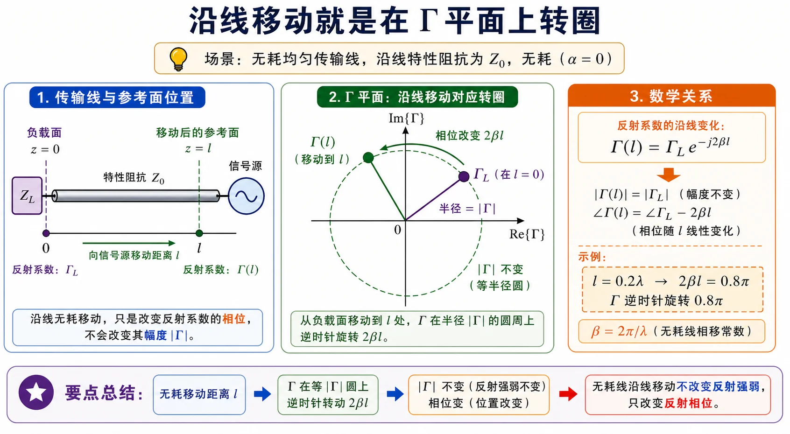
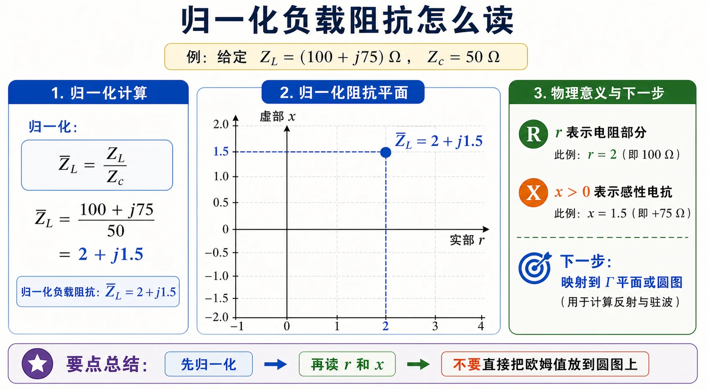
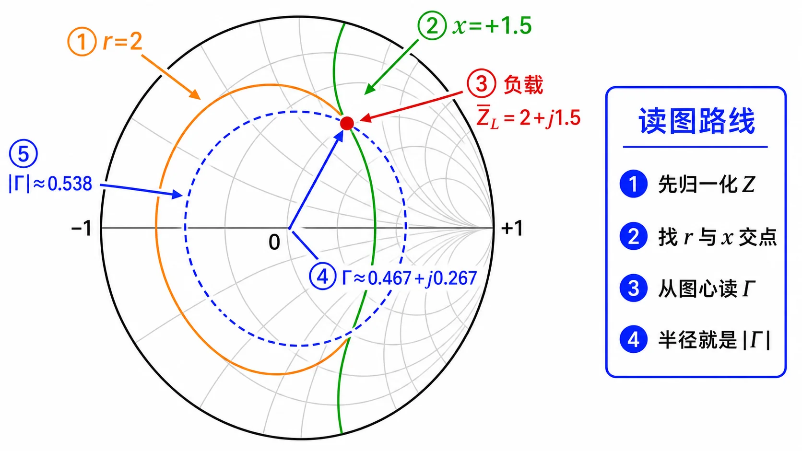
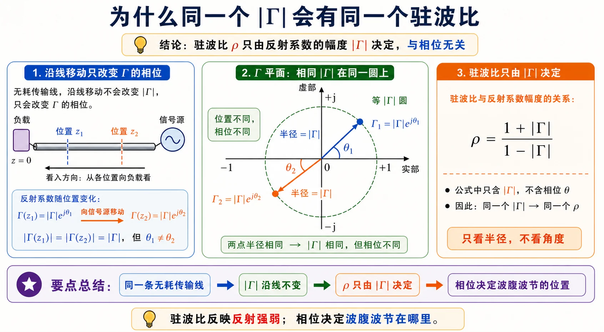
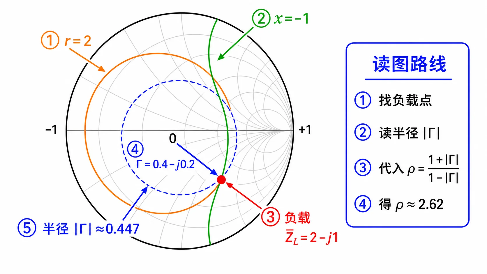
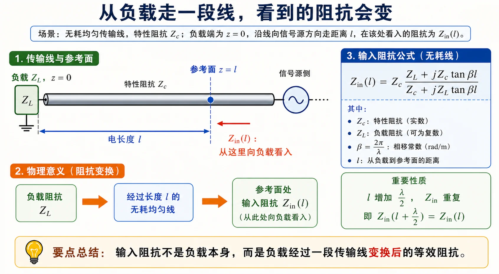
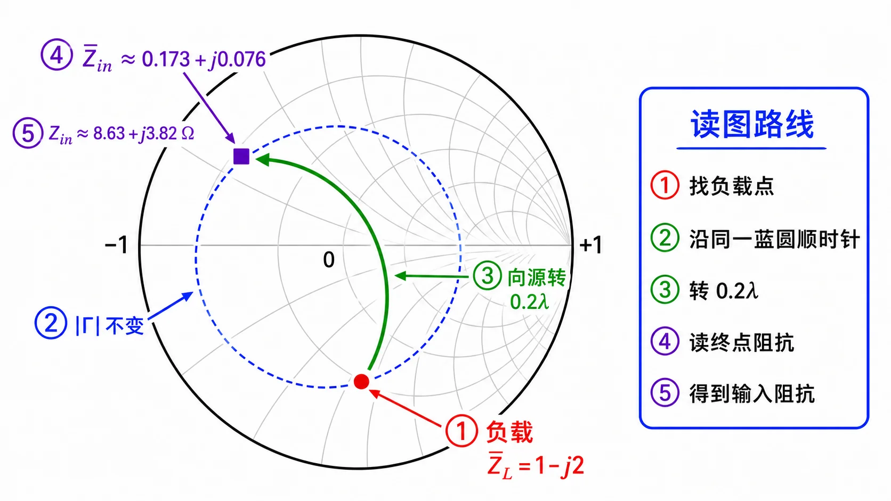
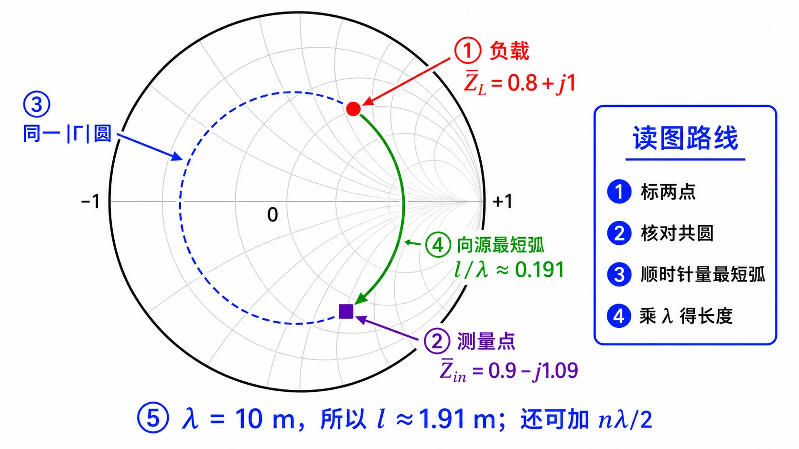
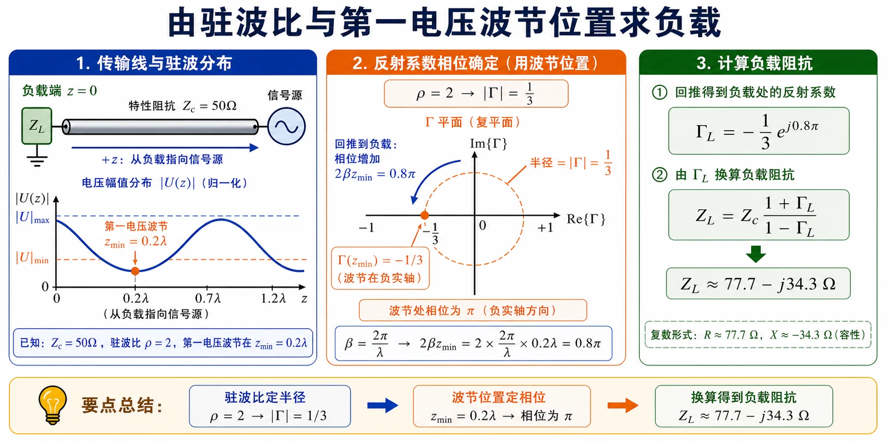
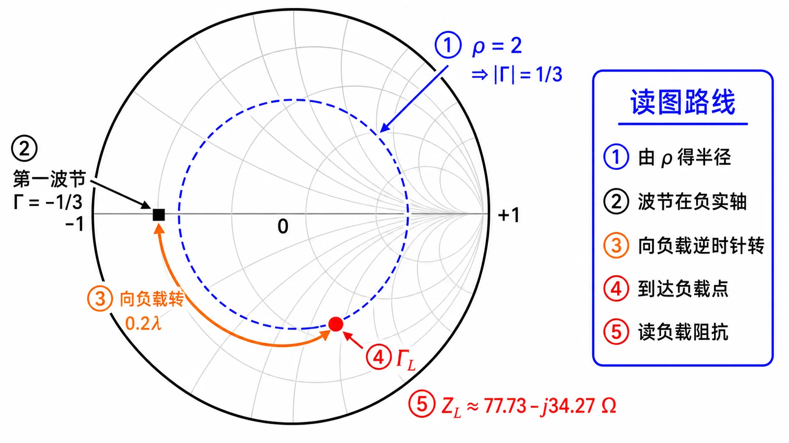

# 第二次作业 · Lec07

> 对应知识点：[02-Smith圆图怎么读](../../knowledge/02-反射与匹配/02-Smith圆图怎么读.md)

---

**导航：** [总目录](README.md) · [符号与导读](00-符号与导读.md) · [Lec06](01-Lec06.md) · [Lec07](02-Lec07.md) · [Lec08–09](03-Lec08-09/README.md) · [附录](99-公式与图像.md)

---

## Lec07 作业（圆图 + 解析；初学者导读）

**阅读建议：** 若你**从未用过 Smith 圆图**，请先通读下面 **「Smith 圆图零基础」**，再按各题 **解法二** 的配图与 **读图说明** 逐步操作；**解法一（公式）** 可单独用来写答案与验算，两条路径的数值应一致（读图允许小视差）。

### 本讲公共预备知识

#### Smith 圆图零基础

**（1）你在看哪个平面？** 阻抗 Smith 圆图通常画在 **反射系数** $\Gamma$ 的复平面上：横轴为 $\mathrm{Re}\,\Gamma$，纵轴为 $\mathrm{Im}\,\Gamma$；**最外圈黑线圆**表示 **$|\Gamma|=1$**（全反射边界）。图里那些 **淡灰色** 的曲线**不是**「随便画的背景」，而是下面两类曲线**叠在一起**画了很多条：

**（1′）专门读懂：满图的淡灰色圆、弧是什么？（最重要）**

- **第一类：等电阻圆（等 $r$ 圆）**  
  归一化阻抗写成 $\bar Z=r+\mathrm{j}x$。若只要求 **电阻部分 $r=\mathrm{Re}\,\bar Z$ 固定**、电抗随便，在 $\Gamma$ 平面上轨迹是 **一整圈圆**（画在 Smith 图里时往往只显示落在 $|\Gamma|\le 1$ 内的那一段，看起来像「一段弧或一个圆」）。**不同的 $r$ 值**对应 **不同半径、不同圆心位置** 的圆，所以你会看到 **好多条** 淡灰圆。**你不需要记住每一条是几**，做题时 **只找题目给你的那一个 $r$**（例如 $\bar Z_L=2+\mathrm{j}1.5$ 就只关心 **$r=2$** 的那一条）。

- **第二类：等电抗弧（等 $x$ 弧）**  
  若 **电抗 $x=\mathrm{Im}\,\bar Z$ 固定**、电阻随便，轨迹是 **另一类圆弧**（圆心在最右边 $\mathrm{Re}\,\Gamma=1$ 附近那一族）。**感性** $x>0$ 在上半平面一侧，**容性** $x<0$ 在下半平面一侧。同样有很多条淡灰弧，**你只找题目里的那个 $x$**（上例只找 **$x=1.5$**）。

- **怎么定点？**  
  **「一个 $r$ 圆」和「一个 $x$ 弧」的交点** 就是 **$\bar Z=r+\mathrm{j}x$**，就像地图上 **纬度线** 和 **经度线** 交出一个城市。交点处的 $\Gamma$ 就由公式 $\Gamma=(\bar Z-1)/(\bar Z+1)$ 与之一一对应。

- **为什么看起来乱？**  
  完整 Smith 图为了「整张图都能读」，会把许多 $r$、许多 $x$ 都画出来，**淡灰线才特别密**。初学可以 **先无视绝大部分灰线**，只当它们是「坐标网」；**只盯两条有色加粗线（或你手算出的那一个 $r$、一个 $x$）** 即可。下面 **零基础图** 左栏只画了 **一条 $r$ 圆 + 一条 $x$ 弧** 示意；右栏在 **减密后的灰网** 上把 Lec07 第 1 题的 **$r=2$、$x=1.5$** 加粗标出。

**（1″）$r=2$、$x=1.5$ 具体怎么找？（操作步骤）**

以 Lec07 第 1 题为例：$Z_L=(100+\mathrm{j}75)\,\Omega$，$Z_c=50\,\Omega$，先算

$$
\bar Z_L=\frac{Z_L}{Z_c}=\frac{100+\mathrm{j}75}{50}=2+\mathrm{j}1.5.
$$

于是 **$r=\mathrm{Re}\,\bar Z_L=2$**，**$x=\mathrm{Im}\,\bar Z_L=1.5$**。注意：**$r$、$x$ 不是题目里原来的欧姆电阻/电抗**，而是 **归一化以后** 的实部、虚部。

**A. 在纸质「阻抗 Smith 圆图」上怎么找**

1. 确认你拿的是 **阻抗圆图**（Z-chart），不是导纳圆图（Y-chart 会旋转/标注不同）。
2. **找 $r=2$ 的等电阻圆**：图上每一圈等 $r$ 圆旁或说明里会标 **$r$ 的数值**（常见有 $0$、$0.2$、$0.5$、$1$、$2$、$5$、$\infty$ 等）。找到 **标着 $2$** 的那一整条圆（只画在单位圆 $|\Gamma|=1$ 里面的那一段）。  
   - 记一个形状：**$r$ 越大，等 $r$ 圆越小**（$r\to\infty$ 缩到最右端一点）。
3. **找 $x=+1.5$ 的等电抗弧**：在 **上半圆**（$\mathrm{Im}\,\Gamma>0$，对应 **感性**、$\bar Z$ 虚部为正）找标 **$+1.5$**（或最接近的刻度，有的图是 $1.0$、$2.0$ 之间插读）的那条弧。  
   - **容性** $x<0$ 则在 **下半圆** 找 **负的** 标值（如 $-1$、$-2$）。
4. **交点**：**$r=2$ 圆** 与 **$x=+1.5$ 弧** 在单位圆 **内部** 的交点，就是 **$\bar Z=2+\mathrm{j}1.5$**。在该点用圆图的 **$\Gamma$ 标尺**（或直角坐标尺）读出 $\Gamma$。

**B. 在本页配图里怎么找**

1. 先看下方「零基础图」：橙色加粗线表示本题的 **$r=2$**，绿色加粗线表示 **$x=+1.5$**，两线交点就是 $\bar Z_L$。  
2. 再看第 1 题的题图：它把同一个 $\bar Z_L=2+\mathrm{j}1.5$ 先放到归一化阻抗平面上，帮助你把“欧姆值”转换成圆图能读的相对坐标。

**C. 若手边图的刻度没有正好 $1.5$**

在 **$1.0$ 与 $2.0$** 两条 $x$ 弧之间 **目测插值**；或用 **解法一** 公式算出 $\Gamma$ 的实部、虚部，再在 $\Gamma$ 平面上核对交点是否落在该处。

**（2）为什么要先归一化？** 令 $\bar Z=Z/Z_c$ 后，**匹配**恒为 $\bar Z=1$，在图上就是 **$\Gamma=0$（圆心）**。这样无论题目 $Z_c$ 是 $50\,\Omega$ 还是 $100\,\Omega$，都用**同一张**阻抗圆图看「相对关系」；最后再乘 $Z_c$ 换回物理阻抗。

**（3）$\Gamma$ 与 $\bar Z$ 怎么互算？**

$$
\Gamma=\frac{\bar Z-1}{\bar Z+1},\qquad \bar Z=\frac{1+\Gamma}{1-\Gamma}.
$$

与 $\Gamma=\dfrac{Z_L-Z_c}{Z_L+Z_c}$ 完全等价（后者分子分母同除以 $Z_c$ 即得前者）。

**（4）沿无耗线移动，圆图上怎么动？** 本文 $z$ **自负载向源**，且 $\Gamma(z)=\Gamma_L\mathrm{e}^{-\mathrm{j}2\beta z}$。故 **$|\Gamma|$ 沿线不变**，只有辐角随 $z$ 变——在 $\Gamma$ 平面上轨迹是 **以原点为圆心、半径 $|\Gamma_L|$ 的圆**，即 **等 $|\Gamma|$ 圆**。

**（5）顺时针还是逆时针？** 在阻抗圆图上：**向信号源**（$z$ 增大）沿等 $|\Gamma|$ 圆 **顺时针** 转；**向负载**（$z$ 减小）**逆时针** 转。转过的电长度对应外圈波长刻度上的 **$z/\lambda$**（与 $2\beta z$ 的相位变化一致）。若你教材印刷图刻度方向与本文口诀不一致，以你书为准，但须与 $\Gamma(z)$ 公式自洽。

**（6）纸质 Smith 图与本页配图。** 纸质图常带**双圈波长刻度**；本页配图更偏讲解，会把 $\Gamma$ 平面、$r/x$ 网格和移动轨迹拆开画清楚。手工作图时，在等 $|\Gamma|$ 圆上按外圈刻度量取 $l/\lambda$；网页图主要用来帮你确认方向、半径和起点。

**（7）公式与圆图如何分工？** 可**以公式写最终答案**，用圆图核对走向与数量级；读图与手算相差一点属正常，以计算器为准。

*图：先看图内编号：**①** 图心是匹配点，**②** 蓝色虚线圆表示沿无耗线移动时 $|\Gamma|$ 不变，**③** 橙色圆是一条等 $r$ 圆，**④** 绿色弧是一条等 $x$ 弧，**⑤** 红点是 $r$ 与 $x$ 的交点，也就是负载点。右侧读图顺序只要求你会找「$r$ 圆 + $x$ 弧 → 交点 → 沿蓝圆移动」，不要一开始就试图看懂所有灰线。*

---

下列 **第 1～5 条**为公式侧预备，可与各题 **解法一** 对照。

1. **归一化阻抗** $\bar Z_L=Z_L/Z_c$：把不同 $Z_c$ 的题放到同一尺度，Smith 圆图外圈读数多为**相对值**。
2. **反射系数** $\Gamma=\dfrac{\bar Z_L-1}{\bar Z_L+1}$（由归一化阻抗直接写，与 $\Gamma=\dfrac{Z_L-Z_c}{Z_L+Z_c}$ 等价）。
3. **驻波比** $\rho=\dfrac{1+|\Gamma|}{1-|\Gamma|}$。
4. **线长变换（解析）**：自负载向源走过线长 $l$，

$$
Z_{\mathrm{in}}=Z_c\frac{Z_L+\mathrm{j}Z_c\tan\beta l}{Z_c+\mathrm{j}Z_L\tan\beta l},\quad \beta l=2\pi\frac{l}{\lambda}.
$$

5. **圆图操作口诀**：**向信号源**沿等 $|\Gamma|$ 圆**顺时针**转电长度 $l/\lambda$；向负载则逆时针。解析结果应与「转圆图」一致。

#### Smith 圆图操作清单（本讲）

1. 先算 **$\bar Z_L=Z_L/Z_c$**，在阻抗圆图上标出负载点：在 **等 $r=\mathrm{Re}\,\bar Z_L$ 圆** 与 **等 $x=\mathrm{Im}\,\bar Z_L$ 弧** 的交点；**忽略**其余淡灰线，当作坐标背景即可（或化为 $\bar Y_L$ 在导纳图操作，视题型而定）。
2. **向信号源**移动：沿**等 $|\Gamma|$ 圆**按外圈波长刻度 **顺时针** 转 $l/\lambda$。
3. 读图得到的新点即 **$\bar Z_{\mathrm{in}}$**（或 $\bar Y$）；再乘 $Z_c$（或除以 $Z_c$）换回物理量。
4. 单支节匹配常在 **导纳图** 上找与 **$g=1$** 圆交点定 $d$，再在短路/开路点沿外圆读支节长度。
5. 读图误差正常；**以解析公式结果为基准**，圆图用于检验与建立直觉。

**圆图与解析并列：** 若大纲或教师要求「圆图解」，请按每题的圆图步骤操作；最终数值应与公式解、标准答案互相吻合。圆图读数允许小误差，但方向、所在圆、起点和终点不能错。

**读图说明（零基础，与上图配合）**

- **坐标面**：上图横轴为 $\mathrm{Re}\,\Gamma$，纵轴为 $\mathrm{Im}\,\Gamma$；虚线圆是 **$|\Gamma|=\mathrm{const}$**（未画 $r,x$ 网格，只强调「沿线走 = 在该圆上转」）。
- **两点含义**：圆上 **圆点** 可视为负载参考处的 $\Gamma_L$，**方点** 可视为再向源走过某段线长后的 $\Gamma$。
- **绿弧与线长**：绿弧沿虚线圆 **顺时针** 从 $\Gamma_L$ 转到新点，对应的相位变化为 **$\Delta\phi=2\beta l=4\pi l/\lambda$**（向源 $z$ 增大，$\Gamma$ 乘 $\mathrm{e}^{-\mathrm{j}2\beta z}$）。图中示例取 **$2\beta l=0.8\pi$**，即 **$l/\lambda=0.2$**。
- **与印刷 Smith 图**：手边完整圆图上，这一段就是沿等 $|\Gamma|$ 圆读外圈 **「朝向发生器」** 刻度走过 **$0.2\lambda$**。
- **自检**：顺时针/向源、逆时针/向负载，须与 [符号与导读](00-符号与导读.md) 中 $z$ 约定及公式 $\Gamma(z)=\Gamma_L\mathrm{e}^{-\mathrm{j}2\beta z}$ 一致；若转向画反，所有线长读数都会错。

*图注小结：向信号源走线长 $l$ 时，$\Gamma(z)=\Gamma_L\mathrm{e}^{-\mathrm{j}2\beta z}$ 对应在 $|\Gamma|$ 圆上沿**顺时针**转过相位 **$2\beta l$**。图中取 $l=0.2\lambda$ 只是示例，用来说明“线长变成圆上的转角”。*

---

### 第 1 题

*（对应大纲《第二次教学大纲及作业》**Lec07 作业** 第 1 题；该讲教材章节建议对照 **§1.5**。）*

#### 题目复述

$Z_c=50\,\Omega$，$Z_L=(100+\mathrm{j}75)\,\Omega$，求终端反射系数 $\Gamma$。

#### 详细思路

复习上节 **①②**；本题直接用 $\Gamma=\dfrac{Z_L-Z_c}{Z_L+Z_c}$ 或先 $\bar Z_L$ 再 $\Gamma=\dfrac{\bar Z_L-1}{\bar Z_L+1}$。

**思路叙述：**

先算 $\bar Z_L$，避免大数；再代入 $\Gamma=(\bar Z_L-1)/(\bar Z_L+1)$。

*图：本题 $\bar Z_L=2+\mathrm{j}1.5$。先把欧姆值变成归一化坐标，再把这个点映射到 $\Gamma$ 平面或 Smith 圆图上读反射系数。*

#### 解法一：公式（解析）

$$
\bar Z_L=\frac{100+\mathrm{j}75}{50}=2+\mathrm{j}1.5.
$$

$$
\Gamma=\frac{1+\mathrm{j}1.5}{3+\mathrm{j}1.5}
=\frac{(1+\mathrm{j}1.5)(3-\mathrm{j}1.5)}{9+2.25}
=\frac{3-\mathrm{j}1.5+\mathrm{j}4.5+2.25}{11.25}
=\frac{5.25+\mathrm{j}3}{11.25}
\approx 0.467+\mathrm{j}0.267.
$$

$|\Gamma|\approx 0.538$。

**标准结论：** **$\Gamma\approx 0.467+\mathrm{j}0.267$**，**$|\Gamma|\approx 0.538$**。

- **检验/注意：** 与 **解法二** 圆图上读出的 $\Gamma$ 应接近；差 $0.01\sim0.02$ 级多为描点视差。

#### 解法二：圆图（Smith 阻抗圆图）

**读图说明（零基础）**

- **淡灰色线**：本图已用 **减密网格**（比「满图 Smith」灰线少），仍不必逐条辨认。**只找** $\bar Z_L=2+\mathrm{j}1.5$ 对应的 **$r=2$ 圆** 与 **$x=+1.5$ 弧** 的交点即可，其余灰线当背景坐标网。
- **坐标面**：本图是 **$\Gamma$ 平面**（$\mathrm{Re}\,\Gamma$ 横轴，$\mathrm{Im}\,\Gamma$ 纵轴）；**最外黑线圆**为 **$|\Gamma|=1$**。淡灰曲线为 **等 $r$ 圆、等 $x$ 弧** 两族。
- **归一化**：本题 $Z_c=50\,\Omega$，故 $\bar Z_L=(100+\mathrm{j}75)/50=2+\mathrm{j}1.5$。在图上即 **$r=2$ 圆** 与 **$x=+1.5$ 弧** 的交点（感性为正电抗）。
- **图上对象**：**红色负载点**为归一化阻抗 $\bar Z_L$；图内编号按「找 $r$ 圆、找 $x$ 弧、交点为负载、从图心读 $\Gamma$、半径读 $|\Gamma|$」排列，与公式 $\Gamma=(\bar Z-1)/(\bar Z+1)$ 是同一件事。
- **方向**：本题只求负载处 $\Gamma$，**不需要**沿线旋转；若误把别的题的「顺时针」套到本题，属于概念混淆。
- **与解法一对表**：公式算出 $\Gamma\approx 0.467+\mathrm{j}0.267$；图上读数应落在此附近。
- **自检**：$|\Gamma|<1$；若点落到单位圆外，说明归一化或描点错误。

**圆图操作步骤**

1. 取 **$Z_c=50\,\Omega$**：$\bar Z_L=2+\mathrm{j}1.5$，故 **$r=2$**、**$x=+1.5$**（实部、虚部）。**具体如何在图上找这两条线**，见上文 **「（1″）$r=2$、$x=1.5$ 具体怎么找？」**：纸质图看刻度标字，本页零基础图则用橙/绿加粗线标出。
2. 在阻抗圆图上找 **标有 $r=2$ 的等电阻圆** 与 **标有 $x=+1.5$ 的等电抗弧（上半面）** 的交点。
3. 用圆图标尺读 **$\Gamma$**（实部、虚部或模角）。
4. 与 **解法一** 数值对照，允许小幅读图误差。

#### 常见疑惑点

- **疑惑：** $\Gamma=\dfrac{Z_L-Z_c}{Z_L+Z_c}$ 与 $\Gamma=\dfrac{\bar Z_L-1}{\bar Z_L+1}$ 会算出不一致吗？**解答：** 数学上完全等价（后者即前者除以 $Z_c$ 后的形式）；数值差异只可能来自计算或舍入。
- **疑惑：** 圆图上读的 $\Gamma$ 与解析差一点点算不算错？**解答：** 读图有视差，一般允许小幅偏差；应以解析或计算器为准，圆图作校验。

#### 自测 1 分钟

- **问：** 无源负载下，$|\Gamma|$ 能否大于 1？**答：** 不能；$|\Gamma|\le 1$，故 $\rho\ge 1$。

---

### 第 2 题

*（对应大纲 **Lec07 作业** 第 2 题；该讲教材章节 **§1.5**。）*

#### 题目复述

$Z_c=50\,\Omega$，$Z_L=(100-\mathrm{j}50)\,\Omega$，求驻波比 $\rho$。

#### 详细思路

复习 **①②③**；本题先求 $\Gamma$ 再求 $\rho$。

**思路叙述：**

$\bar Z_L\to\Gamma\to|\Gamma|\to\rho$。

*图：两个反射系数幅角不同但模相同，代入 $\rho=(1+|\Gamma|)/(1-|\Gamma|)$ 得同一驻波比。*

#### 解法一：公式（解析）

$$
\bar Z_L=\frac{100-\mathrm{j}50}{50}=2-\mathrm{j}.
$$

$$
\Gamma=\frac{1-\mathrm{j}}{3-\mathrm{j}}
=\frac{(1-\mathrm{j})(3+\mathrm{j})}{10}
=\frac{3+\mathrm{j}-3\mathrm{j}+1}{10}=0.4-\mathrm{j}0.2.
$$

$$
|\Gamma|=\sqrt{0.16+0.04}=\sqrt{0.2}\approx 0.4472,\quad
\rho=\frac{1+|\Gamma|}{1-|\Gamma|}\approx 2.618.
$$

**标准结论：** **$\rho\approx 2.618$**。

- **检验/注意：** $\rho$ 仅依赖 $|\Gamma|$，与 $\Gamma$ 辐角无关。

#### 解法二：圆图（Smith 阻抗圆图）

**读图说明（零基础）**

- **淡灰色线**：减密后的 **等 $r$ 圆 / 等 $x$ 弧**；本题只需用 **$r=2$** 与 **$x=-1$** 定负载点，其余灰线可忽略。
- **坐标面**：$\Gamma$ 平面 + 等 $r,x$ 网格；**蓝色虚线圆**为过负载点的 **等 $|\Gamma|$ 圆**（圆心在原点，半径 $=|\Gamma_L|$）。
- **归一化**：$\bar Z_L=2-\mathrm{j}$，即 **$r=2$** 与 **$x=-1$**（容性为负电抗）的交点。
- **图上对象**：**圆点**为负载点；**虚线圆**强调「若只改变 $\Gamma$ 辐角、不改变模，则点只能在此圆上滑动」——对应 **$\rho$ 不变** 的物理事实。
- **方向**：本题只读 **$|\Gamma|$** 算 $\rho$，**不必**沿线旋转；旋转同一圆上另一点可验证 $\rho$ 相同（与 **解法一** 结论一致）。
- **与解法一对表**：读出 $|\Gamma|\approx 0.447$，代入 $\rho=(1+|\Gamma|)/(1-|\Gamma|)$ 得 $\approx 2.62$；角标亦给出 $\rho$ 近似值。
- **自检**：$|\Gamma|=\sqrt{0.2}\approx 0.447$；若半径画错，$\rho$ 会整体错。

**圆图操作步骤**

1. 标出 $\bar Z_L=2-\mathrm{j}$。
2. 作过该点的等 $|\Gamma|$ 圆（圆心 $\Gamma=0$，半径到该点距离）。
3. 读 **$|\Gamma|$**，算 **$\rho=(1+|\Gamma|)/(1-|\Gamma|)$**；或用纸质圆图的 $\rho$ 刻度。
4. 可在同一虚线圆上另取一点，验证 $\rho$ 不变。

#### 常见疑惑点

- **疑惑：** 能不能不先求 $\Gamma$，直接由 $Z_L$ 写 $\rho$？**解答：** 可以，但通常仍先算 $|\Gamma|=|(Z_L-Z_c)/(Z_L+Z_c)|$，再用 $\rho=(1+|\Gamma|)/(1-|\Gamma|)$；驻波比**不**依赖 $\Gamma$ 的辐角。
- **疑惑：** $\rho$ 会小于 1 吗？**解答：** 无源负载下 $|\Gamma|\le 1$，故 $\rho\ge 1$；$\rho=1$ 对应完全匹配。

---

### 第 3 题

*（对应大纲 **Lec07 作业** 第 3 题；该讲教材章节 **§1.5**。）*

#### 题目复述

$Z_c=50\,\Omega$，$Z_L=(50-\mathrm{j}100)\,\Omega$，线长 $l=0.2\lambda$（指始端距负载），求始端 $Z_{\mathrm{in}}$。

#### 详细思路

复习 **④**；注意题中「没有指定 $z$ 时指始端」即线长 $l=0.2\lambda$。

**思路叙述：**

代入 $Z_{\mathrm{in}}$ 公式，$\beta l=2\pi\times 0.2=0.4\pi$，$\tan\beta l=\tan(72^\circ)$。

*图：$z=0$ 接 $Z_L$，沿无耗线向源走过 $l$（本题 $l/\lambda=0.2$）的截面为 $Z_{\mathrm{in}}$。*

#### 解法一：公式（解析）

$$
\beta l=0.4\pi,\quad \tan\beta l\approx 3.0777.
$$

$$
Z_{\mathrm{in}}=50\cdot\frac{50-\mathrm{j}100+\mathrm{j}50\times 3.0777}{50+\mathrm{j}(50-\mathrm{j}100)\times 3.0777}.
$$

分母展开：$\mathrm{j}(50-\mathrm{j}100)t=100t+\mathrm{j}50t$，故分母 $=50+100t+\mathrm{j}50t\approx 357.8+\mathrm{j}153.9$；分子 $\approx 50+\mathrm{j}53.9$。相除后

$$
Z_{\mathrm{in}}\approx(8.63+\mathrm{j}3.82)\,\Omega.
$$

（中间步可用计算器。）

**标准结论：** **$Z_{\mathrm{in}}\approx(8.63+\mathrm{j}3.82)\,\Omega$**。

- **检验/注意：** 与 **解法二** 读出的 $\bar Z_{\mathrm{in}}$ 乘 $50$ 后应一致。

#### 解法二：圆图（Smith 阻抗圆图）

**读图说明（零基础）**

- **淡灰色线**：等 $r$/等 $x$ 网（已减密）；先定 **$\bar Z_L=1-\mathrm{j}2$**（$r=1$、$x=-2$ 的交点），再沿 **绿弧** 转，不必研究每条灰线。
- **坐标面**：$\Gamma$ 平面 + Smith 阻抗网格；移动轨迹在 **等 $|\Gamma|$ 圆** 上。
- **归一化**：$\bar Z_L=(50-\mathrm{j}100)/50=1-\mathrm{j}2$。**绿弧**表示从负载点 **向信号源** 走过 **$l/\lambda=0.2$** 时 $\Gamma$ 的相位变化：$\Gamma_{\mathrm{in}}=\Gamma_L\mathrm{e}^{-\mathrm{j}4\pi l/\lambda}$（因 $2\beta l=4\pi l/\lambda$）。
- **图上对象**：**圆点** = 负载 $\bar Z_L$；**方点** = 向源转 $0.2\lambda$ 后的 $\bar Z_{\mathrm{in}}$（在等 $|\Gamma|$ 圆上、沿弧顺时针到达）。
- **方向**：**向源 = 顺时针**（与公共预备中的口诀一致）。若逆时针转，会得到错误的输入阻抗。
- **与解法一对表**：绿弧对应的电长度是 **$0.2\lambda$**；终点读 $\bar r,\bar x$ 后 $Z_{\mathrm{in}}=50(\bar r+\mathrm{j}\bar x)\approx(8.63+\mathrm{j}3.82)\,\Omega$。
- **自检**：模 $|\Gamma|$ 沿线不变；若弧心不在原点或半径变化，则图画错。

**圆图操作步骤**

1. 标 $\bar Z_L=1-\mathrm{j}2$。
2. **向源**：沿等 $|\Gamma|$ 圆 **顺时针** 转 **$0.2\lambda$**（纸质图用外圈「朝向发生器」刻度）。
3. 读终点 **$\bar Z_{\mathrm{in}}$**。
4. **$Z_{\mathrm{in}}=50\,\bar Z_{\mathrm{in}}$**，与 **解法一** 对照。

#### 常见疑惑点

- **疑惑：** 公式里的 $l$ 是物理长度还是 $l/\lambda$？**解答：** 式中用 $\beta l=2\pi l/\lambda$，故 $l$ 可与 $\lambda$ 同单位相除得**电长度** $l/\lambda$；本题直接给 $l=0.2\lambda$，即 $\beta l=0.4\pi$。
- **疑惑：** 「始端距负载」会不会搞反成从源算？**解答：** 无耗线 $Z_{\mathrm{in}}$ 公式默认：**线段一端接 $Z_L$（负载端），向源方向量线长 $l$** 得到另一端输入阻抗；与 [符号与导读](00-符号与导读.md) 中 $z$ 约定一致。

#### 自测 1 分钟

- **问：** $\beta l=0.4\pi$ 时，若误把 $\beta l$ 当成 $0.4\,\mathrm{rad}$，$\tan\beta l$ 会怎样？**答：** 完全错误；本题 $\beta l$ 为弧度，且 $0.4\pi\approx 1.26\,\mathrm{rad}$，必须用 $\beta l=2\pi l/\lambda$ 统一单位。

---

### 第 4 题

*（对应大纲 **Lec07 作业** 第 4 题；该讲教材章节 **§1.5**。）*

#### 题目复述

$Z_c=100\,\Omega$，$Z_L=(80+\mathrm{j}100)\,\Omega$，测得某处输入阻抗 $Z_{\mathrm{in}}=(90-\mathrm{j}109)\,\Omega$，工作波长 $\lambda=10\,\mathrm{m}$，求该处到负载的线长 $l$。

#### 详细思路

复习 **④**；本题是**反解** $l$，且 $Z_{\mathrm{in}}(l)$ 具有 **$\lambda/2$ 周期**：$l$ 与 $l+n\lambda/2$ 同解（$n$ 为整数）。

**思路叙述：**

（无耗线变换式即 **本讲公共预备知识** 第 4 条，此处为反解 $l$。）令 $\bar Z_L$、$\bar Z_{\mathrm{in}}$ 已知，由

$$
\bar Z_{\mathrm{in}}=\frac{\bar Z_L+\mathrm{j}\tan\beta l}{1+\mathrm{j}\bar Z_L\tan\beta l}
$$

解出 $t=\tan\beta l$（一元方程），再得 $l/\lambda$，取**最短正解**。

几何关系同 **第 3 题** 的“负载到输入截面”示意图：已知 $Z_L$ 与某截面 $Z_{\mathrm{in}}$，反求该截面到负载的电长度 $l$。

#### 解法一：公式（解析）

$\bar Z_L=0.8+\mathrm{j}1$，$\bar Z_{\mathrm{in}}=0.9-\mathrm{j}1.09$。由上式交叉相乘整理得关于 $t$ 的线性方程，解出 $t=\tan\beta l\approx 3.39$，对应

$$
\beta l\approx 1.199\,\mathrm{rad},\quad \frac{l}{\lambda}\approx 0.191,\quad l\approx 1.91\,\mathrm{m}.
$$

**多解说明**：加任意 $n\lambda/2$ 的线长，输入阻抗重复，故通解 $l\approx 0.191\lambda+n\lambda/2$。

**标准结论：** 最短 **$l\approx 0.191\lambda\approx 1.91\,\mathrm{m}$**；通解 **$l=0.191\lambda+n\lambda/2$**（$n$ 为整数）。

- **检验/注意：** 工程上常取**最短**距离；圆图上即沿等 $|\Gamma|$ 圆转到目标点的**最短弧长**。

#### 解法二：圆图（Smith 阻抗圆图）

**读图说明（零基础）**

- **淡灰色线**：背景 $r,x$ 网；本题先在灰网上找到 **$\bar Z_L$** 与 **$\bar Z_{\mathrm{in}}$** 两点，再沿 **等 $|\Gamma|$ 圆**（蓝色虚线圆）量弧长。
- **坐标面**：$\Gamma$ 平面 + 网格；**灰色点线圆**为同时过 $\bar Z_L$ 与 $\bar Z_{\mathrm{in}}$ 的 **等 $|\Gamma|$ 圆**（两点必在同一圆上，否则数据与无耗线模型矛盾）。
- **归一化**：$\bar Z_L=0.8+\mathrm{j}1$、$\bar Z_{\mathrm{in}}=0.9-\mathrm{j}1.09$（已由 $Z_c=100\,\Omega$ 除过）。
- **图上对象**：**圆点** = 负载；**方点** = 测量截面；**绿弧** = 从负载 **向源（顺时针）** 走到测量点的弧，其电长度即 **$\Delta(l/\lambda)$**。
- **方向**：本题求「测量点到负载的距离」，参考面更靠源，故从 **负载点顺时针** 转到 **$\bar Z_{\mathrm{in}}$**（与第 3 题同向）。若反向转，得到的是「绕远」的另一支解。
- **与解法一对表**：弧长对应 **$\Delta(l/\lambda)\approx 0.191$**；$l=\Delta(l/\lambda)\cdot\lambda\approx 1.91\,\mathrm{m}$。另可加 **$n\lambda/2$** 得到通解（圆图上再转半圈整数倍）。
- **自检**：先核对两点确实在同一等 $|\Gamma|$ 圆上；若不在，先检查 $\bar Z_L$、$\bar Z_{\mathrm{in}}$ 是否算错。

**圆图操作步骤**

1. 标出 $\bar Z_L$、$\bar Z_{\mathrm{in}}$，核对共圆。
2. 从 $\bar Z_L$ **顺时针**沿等 $|\Gamma|$ 圆走到 $\bar Z_{\mathrm{in}}$，读 **最短**弧对应的 **$\Delta(l/\lambda)\approx 0.191$**。
3. $l=\Delta(l/\lambda)\cdot\lambda$，$\lambda=10\,\mathrm{m}$ 得 **$l\approx 1.91\,\mathrm{m}$**。
4. 需要时加上 **$n\lambda/2$** 写出通解。

#### 常见疑惑点

- **疑惑：** 为什么通解要加 $n\lambda/2$？**解答：** $Z_{\mathrm{in}}$ 沿线周期为 $\lambda/2$（因 $\tan\beta l$ 周期为 $\pi$），故同一测量 $Z_{\mathrm{in}}$ 对应无穷多线长，彼此相差 $\lambda/2$ 整数倍。
- **疑惑：** 题给 $Z_{\mathrm{in}}$ 与 $Z_L$ 代入反解 $t=\tan\beta l$，为什么会出现「微小虚部」？**解答：** 实测或印刷数据往往舍入；严格应在无耗线上存在**实** $t$，工程上取 $\mathrm{Re}(l/\lambda)$ 即可，与 $l\approx 0.191\lambda$ 一致。
- **疑惑：** $\arctan t$ 多值怎么办？**解答：** 与 $\tan\beta l$ 多支一样，在 $(0,\pi)$ 内取符合物理线长且最短的那一支，并与圆图旋转方向核对。

---

### 第 5 题

*（对应大纲 **Lec07 作业** 第 5 题；该讲教材章节 **§1.5**。）*

#### 题目复述

$Z_c=50\,\Omega$，$\rho=2$，距终端**第一个**电压最小点（波节）位置为 $0.2\lambda$，求 $Z_L$。

#### 详细思路

复习 **③** 与 Lec06-5 中**波节与 $\Gamma$ 相位**关系；第一个波节位置定 $\Gamma_L$ 辐角。

**思路叙述：**

（套路与 **Lec06 第 5 题** 相同，仅 $z_{\min}$ 数值不同。）$|\Gamma|=\dfrac{\rho-1}{\rho+1}$；第一波节在 $z_{\min}=0.2\lambda$，写 $\Gamma_L=-|\Gamma|\mathrm{e}^{\mathrm{j}2\beta z_{\min}}$，再 $Z_L=Z_c\dfrac{1+\Gamma_L}{1-\Gamma_L}$。

*图：这道题与 Lec06 第 5 题同套路，只是第一波节位置改为 $z_{\min}=0.2\lambda$，因此回推到负载面的相位也随之改变。*

#### 解法一：公式（解析）

$|\Gamma|=\dfrac{1}{3}$，$2\beta z_{\min}=0.8\pi$，

$$
\Gamma_L=-\frac{1}{3}\mathrm{e}^{\mathrm{j}0.8\pi}
\quad\Rightarrow\quad
Z_L\approx(77.73-\mathrm{j}34.27)\,\Omega.
$$

**标准结论：** **$Z_L\approx(77.73-\mathrm{j}34.27)\,\Omega$**。

- **检验/注意：** 与 Lec06-5 同一类题，只是波节位置数据不同。

#### 解法二：圆图（Smith 阻抗圆图）

**读图说明（零基础）**

- **淡灰色线**：等 $r,x$ 网（减密）；定出 **$\Gamma_L$**（红色负载点）后，再在灰网上读 **$\bar Z_L$**，不必对每条灰弧编号。
- **坐标面**：$\Gamma$ 平面；**虚线圆**为 **$|\Gamma|=1/3$**（由 $\rho=2$ 得 $|\Gamma|=(\rho-1)/(\rho+1)$）。
- **归一化**：最后读负载 $\bar Z_L$ 后乘 $Z_c=50\,\Omega$ 得 $Z_L$。
- **图上对象**：**方点**落在 **负实轴**上，表示 **第一波节** 处 $\Gamma(z_{\min})=-|\Gamma|=-1/3$（电压最小、反射波与入射波反相叠加的常用约定）。**圆点**为 **负载** $\Gamma_L$。**橙弧**从方点 **逆时针** 转 **$0.2\lambda$** 到圆点——因为负载在波节的 **向负载一侧**（$z$ 比波节小 $0.2\lambda$），相当于从波节 **走向负载**，与「向源顺时针」相反。
- **方向**：本题关键弧是 **逆时针 $0.2\lambda$**（向负载）。勿与第 3、4 题「向源顺时针」混用。
- **与解法一对表**：得到 $\Gamma_L$ 后，在阻抗圆图上读 $\bar Z_L$，$Z_L=50\bar Z_L\approx(77.73-\mathrm{j}34.27)\,\Omega$。
- **自检**：$|\Gamma_L|=1/3$ 应仍在虚线圆上；若点跑出该圆，说明转角或起点取错。

**圆图操作步骤**

1. 由 $\rho=2$ 得 $|\Gamma|=1/3$，画等 $|\Gamma|$ 圆。
2. 在 **负实轴** 上取 **$\Gamma=-1/3$** 作为 **第一波节**。
3. 从该点 **逆时针**（向负载）转 **$0.2\lambda$** 得 **$\Gamma_L$**。
4. 读 **$\bar Z_L$**，**$Z_L=50\,\bar Z_L$**，与 **解法一** 对照。

#### 常见疑惑点

- **疑惑：** 「第一个电压最小点」会不会不是第一波节？**解答：** 本题即指**距负载最近**的电压波节；若题目另定义「第二个」「第三个」，需相应改 $2\beta z_{\min}$ 与 $\Gamma_L$ 相位关系，不能照搬 $0.2\lambda$ 这一套。
- **疑惑：** Lec06-5 与本题公式一样吗？**解答：** 一样：$|\Gamma|=(\rho-1)/(\rho+1)$，第一波节有 $\Gamma_L=-|\Gamma|\mathrm{e}^{\mathrm{j}2\beta z_{\min}}$，再 $Z_L=Z_c(1+\Gamma_L)/(1-\Gamma_L)$；仅 $z_{\min}$ 数值不同。

---
