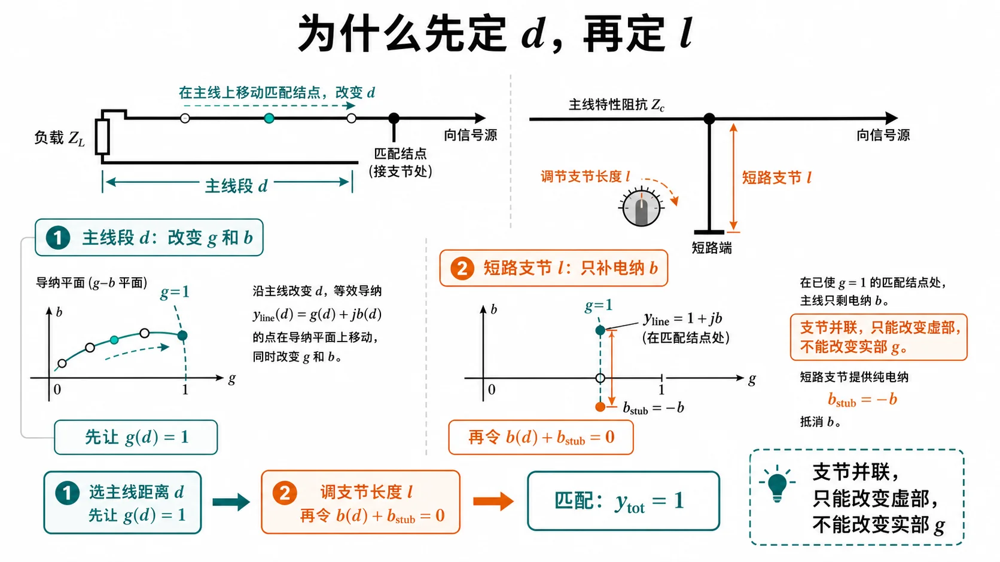
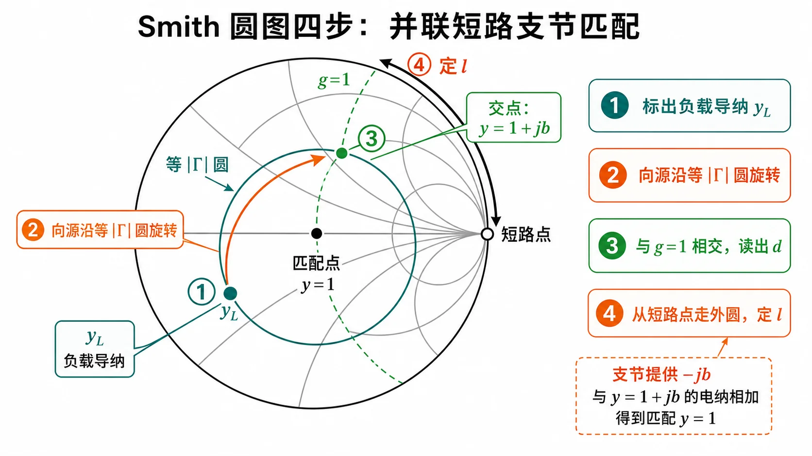
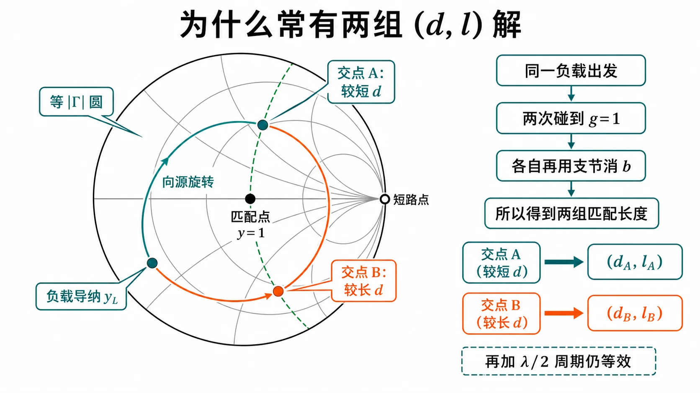
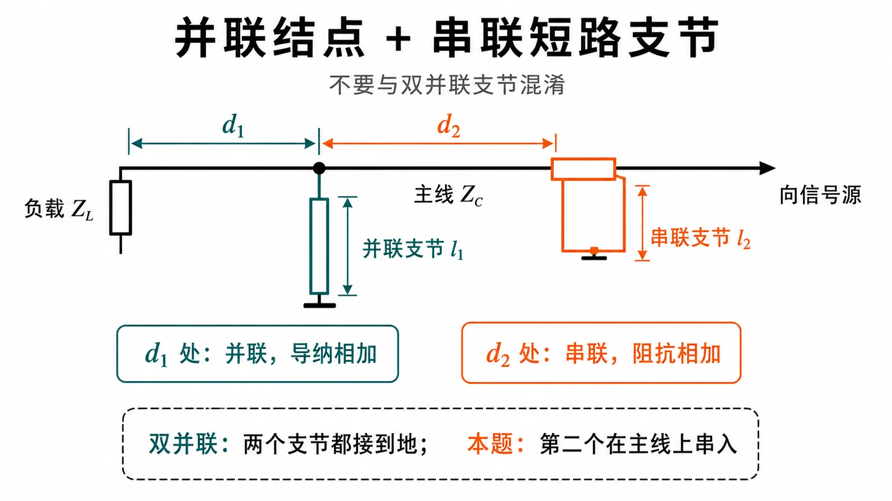

# 第二次作业 · Lec08–09

---

**导航：** [总目录](../README.md) · [符号与导读](../00-符号与导读.md) · [Lec06](../01-Lec06.md) · [Lec07](../02-Lec07.md) · **Lec08–09** · [**1**](第01题.md) · [**2**](第02题.md) · [**3**](第03题.md) · [**4**](第04题.md) · [**5**](第05题.md) · [**6**](第06题.md) · [**7**](第07题.md) · [附录](../99-公式与图像.md)

---

## Lec08–09 作业

**BLQ 串讲对照**：p23 习 1-8 → [Lec04 · 第 4 题](../../01-传输线基础/04-Lec04.md)；p26–28 圆图综合；p29 $\lambda/4$ 变换；p30–32 单/双支节与死区；**p34 单支节算例**（$Z_L=50+j25\,\Omega$，$\lambda=10\,\mathrm{cm}$）→ [03 · 并联支节 · 算例](../../knowledge/02-反射与匹配/03-并联支节匹配.md#blq-p34-stub-example)、[第 4 题](第04题.md)。

**阅读建议：** 请按顺序 **① 本讲导读（下面）** → **②「导纳匹配与 $g=1$ 圆（零基础）」** → **③ [各题单题分册](#各题索引单题分册)**。**解法一** 用公式算数为主；**解法二** 用 Smith 圆图对照。圆图、$|\Gamma|$、$\rho$ 若生疏，先看 [Lec07 分册](../02-Lec07.md)；$z$ 方向与 **向源 = 顺时针** 见 [符号与导读](../00-符号与导读.md)。

### 本讲导读（Lec08–09 在学什么）

**本讲一句话**

馈线有设计好的 **特性阻抗** $Z_c$。负载若和这根线 **不「合拍」**，线上会有 **反射**（一部分能量被弹回）。本讲要学的是：常常 **不换负载**，而在 **某一个位置** 加元件——例如 **并联一根短路线**，或 **插入一段 $\lambda/4$ 线**——把反射 **压下去**，让主线更接近「合拍」（工程上叫 **匹配**）。这和低频电路里用 **L、C 调谐** 是同类想法，只是这里用的是 **分布参数** 传输线模型。

**和 Lec06、Lec07 有什么不一样**

- **Lec06、Lec07**：重点是 **顺着线走**，看 **阻抗沿线怎么变**；若学了 Lec07，还会用 Smith 圆图读 **反射强弱**、线长——核心是 **「状态怎么变」**。
- **Lec08–09**：重点是 **在某个接头/截面上动手**，用支节、变换段 **改电路**，让从该点向电源方向看进去 **更接近理想**——核心是 **「怎么调到合拍」**。
- 上两行里的「反射」在量上常对应 $|\Gamma|$、**驻波比** $\rho$（Lec06–07 已练过）；本讲不再从头讲它们，忘了可回看 [Lec06](../01-Lec06.md)、[Lec07](../02-Lec07.md)。

**本讲里会出现的结构（先记白话）**

| 名称 | 白话在干什么 |
|------|----------------|
| **主传输线** | 信号从源到负载的那根 **$Z_c$** 线，匹配对象通常是它。 |
| **并联短路线（单支节）** | 在主线上某点 **并接** 一根到地的短路线，用支节长度提供 **可调电抗**，配合主线某段长度一起 **消反射**。 |
| **$\lambda/4$ 变换段** | 一段 **四分之一波长** 线；在 **纯电阻** 截面上接时，能把电阻 **变成另一个电阻**，便于接到 $Z_c$。 |
| **双支节（两处并联支节）** | 两个并联支节 + 中间固定线长，调节更灵活，但有些负载 **根本配不平**（**盲区**）。 |

**题型地图：每道题大概干什么**

- **第 1 题**：把「单支节并联匹配」要满足的方程 **推导出来**——这是 **第 4、5 题算数时用的同一套套路的源头**。（**并联单支节解析母题**）→ [第 1 题](第01题.md)
- **第 2 题**：给一条具体长线，算 **驻波比**、负载反射强弱、**始端输入阻抗**；再问 **$\lambda/4$ 变换器** 应接在距负载多远、变换段 **特性阻抗** $Z_{0T}$ 多大。（**先找沿线纯电阻位置，再接 $\lambda/4$**）→ [第 2 题](第02题.md)
- **第 3 题**：终端本来 **已匹配**，中间某处又 **并联** 了一个阻抗，求另一位置的 **输入阻抗**——练 **分段计算**；并联处用 **导纳** 列式往往最省事。（**分段 + 并联导纳**）→ [第 3 题](第03题.md)
- **第 4、5 题**：给定负载，用 **单支节** 求距离 $d$ 与支节长 $l$ 的 **数值**；圆图上对应 **$g=1$ 轨迹** 与 **外圆支节**。（**单支节匹配计算**）→ [第 4 题](第04题.md)、[第 5 题](第05题.md)
- **第 6 题**：两处都是 **并联** 短路线，$d_1$、$d_2$ 题目给定，求 $l_1$、$l_2$；比单支节多一个自由度，但有 **盲区**。（**双并联支节**）→ [第 6 题](第06题.md)
- **第 7 题**：一处 **并联** 支节、另一处与主线 **串联**——**并联只按导纳加，串联只按阻抗加**，和「两并联」的 **第 6 题列式不同，不能混抄**。（**并 + 串混合拓扑**）→ [第 7 题](第07题.md)

**题目之间的关系（为啥要一起看）**

- **第 1 题 → 第 4、5 题**：第 1 题写 **条件**，第 4、5 题用 **同一套并联匹配思路** 代数字。
- **第 2 题**：也是「**先让某一截面满足某种简单性质**（这里是 **阻抗变纯实**），再接下一段器件」，但具体公式是 **$\lambda/4$ 变换器** 那一套，**不要硬套单支节那组式子**。
- **第 3 题**：单独练 **线上分段** 与 **并联** 怎么接公式。
- **第 6 题 与 第 7 题**：都是 **多个可调件**，但 **接法不同 → 方程不同**；第 7 题尤其不要把 **并联支节的导纳式** 写到 **串联支节** 上去。

**你该怎么读（接下来看什么）**

1. 若 **导纳 $Y$、电导、电纳** 还不熟：请接着读下面 **「导纳匹配与 $g=1$ 圆（零基础）」**——导读只建立 **动机和路线图**，具体 **并联为什么要先算 $d$ 再算 $l$**、圆图上 **橙线是什么**，都在那一节展开。  
2. 再按各题 **解法一** 把数算稳，用 **解法二** 在圆图上 **走一遍波长**，印象会更牢。

### 图解辅读（自学用示意图组）

以下插图为 **概念示意**，与上节「为什么要先 $d$ 后 $l$」、第 4 题圆图步骤、**两组 $(d,l)$** 以及第 7 题 **并 / 串** 拓扑对照阅读；**具体数值** 仍以各题 **解法一** 为准。

*图 1：**电路长什么样**——在距负载 $d$ 处 **并接** 短路支节 $l$；调节 $d,l$ 使向源看入接近 $Z_c$。*

*图 2：**物理顺序**——并联短路线只提供 **纯电纳**，结点处 **只能加减电纳**；须先用主线长度 $d$ 使 **$\mathrm{Re}\,Y=Y_c$**（归一化即 **$g=1$**），再用 $l$ 把 **总电纳** 调到零。*

*图 3：**圆图上手指怎么走**——与 [第 4 题](第04题.md)、[第 5 题](第05题.md)「解法二」同一套路。*

*图 4：**为何多解**——同一负载圆与 **$g=1$** 轨迹可相交 **两次**，工程上常取 **距负载较近** 的 $d$；加 **$\lambda/2$** 周期仍有等价写法。*

*图 5：**并 vs 串**——并联结点用 **导纳相加**；串联截面用 **阻抗相加**，列式与 [第 6 题](第06题.md) 不同。*

#### 导纳匹配与 $g=1$ 圆（零基础）

**（接在导读后）** 上面只建立了「要匹配、支节在干什么」；从本节起引入 **导纳** $\bar Y=g+\mathrm{j}b$ 与 **$g=1$**，专门用来描述 **并联结点** 上的加减，并和 Smith 图上的 **橙色轨迹** 一一对应。

定义 **归一化导纳** $\bar Y=Y/Y_c=g+\mathrm{j}b$（$g$、$b$ 无量纲）。**匹配到馈线 $Z_c$** 时，希望结点 **$\bar Y_{\mathrm{tot}}=1+\mathrm{j}0$**，即 **$g=1$ 且 $b=0$**。

**为什么单支节要先选 $d$ 再选 $l$？** 长度 $d$ 的主线段使 **$Y(d)$ 的实部、虚部都随 $d$ 变**。**并联短路支节** 只提供 **纯电纳** $Y_{\mathrm{stub}}$（实部为 0），在结点上 **只能改总电纳、不能改总电导**。因此必须先用 **某个 $d$** 使 **$\mathrm{Re}\,Y(d)=Y_c$**（写成归一化即 **$\mathrm{Re}\,\bar Y=1$**，即落在 **$g=1$** 上），再用 **支节长度 $l$** 把 **总虚部** 调到零。这就是 [第 1 题](第01题.md) 里 **先 $G=Y_c$ 再消 $B$** 的物理版叙述。

**圆图上怎么看**：在 **$\Gamma$ 平面** 上，**$\mathrm{Re}\,\bar Y=1$** 是一条固定轨迹（本讲义配图用 **橙色曲线** 画出，即 **$g=1$ 圆/线**）。从 **$\bar Y_L$**（或由 $\bar Z_L$ 取倒数）对应点出发，沿 **等 $|\Gamma|$ 圆** **向源顺时针** 转，与 **$g=1$** 的交点定 **$d/\lambda$**；在该交点读 **$b$**，从 **最外圆上的短路点** 沿外圆走支节，提供 **$-b$**，得 **$l/\lambda$**。**阻抗 Smith 图** 与 **导纳 Smith 图** 在 $\Gamma$ 平面上可通过对 $\bar Z\leftrightarrow\bar Y$ 互换理解；**并联结点**列式时 **导纳相加** 最直接。

*图：**橙色**为 **$g=1$** 轨迹；**匹配** $\bar Y=1$ 须同时 **$g=1$** 且 **$b=0$**。单支节读图按编号走：先定负载导纳，沿同一 $|\Gamma|$ 圆向源转到 $g=1$，在交点读 $b$，再用短路支节补 $-b$。若你只看本图仍不知从何转起，请接着看 [**第 1 题**](第01题.md) 的编号说明。*

---

### 各题索引（单题分册）

| 题号 | 文档 | 结论速览 |
|:----:|------|----------|
| **1** | [第 1 题](第01题.md) | 并联单支节：**$Y(d)+Y_{\mathrm{stub}}=Y_c$**；先 **$\mathrm{Re}\,Y=Y_c$** 定 $d$，再 **$\tan\beta l=Y_c/B$** 定 $l$；Smith：**$g=1$** + 外圆。 |
| **2** | [第 2 题](第02题.md) | **$\rho\approx27.6$**，**$Z_{\mathrm{in}}$** 量级 $(133.5-\mathrm{j}1354.9)\,\Omega$；$\lambda/4$ 变换器 **$d\approx0.0262\,\mathrm{m}$**，**$Z_{0T}\approx114.2\,\Omega$**。 |
| **3** | [第 3 题](第03题.md) | 匹配线上并联后：**$Z_{\mathrm{in}}=(100+\mathrm{j}100)\,\Omega$**。 |
| **4** | [第 4 题](第04题.md) | **$d=\lambda/8$、$l=\lambda/8$**（一组）；或 **$d\approx0.301\lambda$、$l=3\lambda/8$**。 |
| **5** | [第 5 题](第05题.md) | **$d\approx0.0806\lambda$、$l\approx0.419\lambda$**（一组）；另一组 **$d\approx0.4468\lambda$、$l\approx0.0811\lambda$**。 |
| **6** | [第 6 题](第06题.md) | **$l_1\approx0.194\lambda$、$l_2\approx0.114\lambda$**（一组）；或 **$0.452\lambda$、$0.474\lambda$**。 |
| **7** | [第 7 题](第07题.md) | 并+串：**约** $(0.391\lambda,0.211\lambda)$ 或 $(0.257\lambda,0.323\lambda)$。 |

---

### 本讲收尾：还可怎么自查？

1. **并联支节**：是否能一句话说清 **先 $d$ 后 $l$**（支节只改电纳，先要把电导旋到 **$Y_c$**）？
2. **$\lambda/4$ 变换器**：是否记得 **必须先在纯阻截面** 接入，且 **$Z_{0T}=\sqrt{Z_c R}$** 与 **波腹/波节** 两种电阻对应两种实现难度？
3. **并联负载分段**：是否 **先 $Y$ 相加** 再向源走线长？
4. **第 4、5 题**：**$\mathrm{Re}\,\bar Y(d)=1$** 是否既能 **画圆图** 又能 **化二次方程**？
5. **第 6 与第 7 题**：能否在草稿纸上各画 **一张草图**，标出 **两处结点** 是 **并** 还是 **串**，避免公式混用？

---
