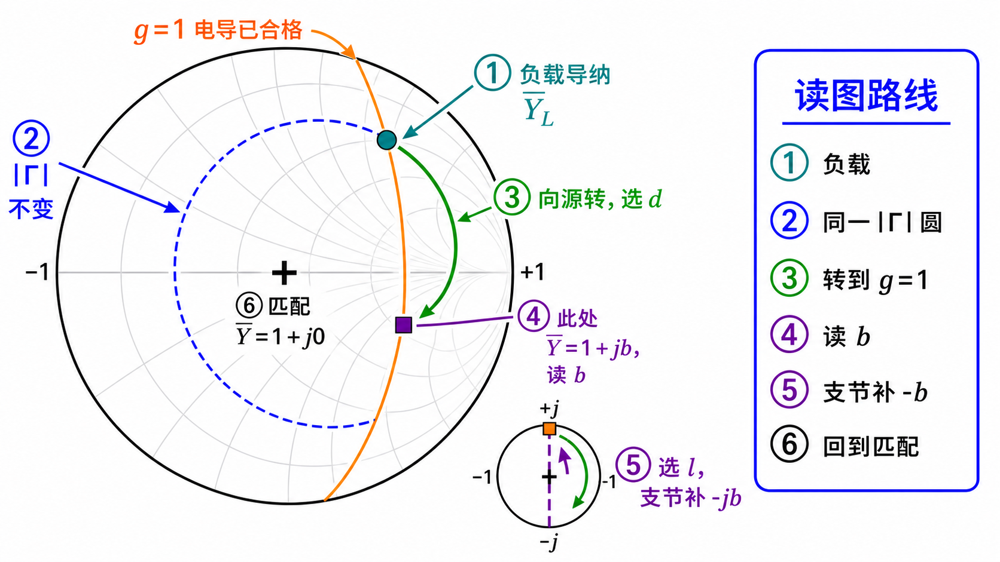

# 第二次作业 · Lec08–09 · 第 1 题

**导航：** [总目录](../README.md) · [符号与导读](../00-符号与导读.md) · [Lec08–09 总册](README.md) · [Lec06](../01-Lec06.md) · [Lec07](../02-Lec07.md) · [附录](../99-公式与图像.md)

> **说明**：本题为 **并联单支节解析母题**；数值题见 [第 4 题](第04题.md)、[第 5 题](第05题.md)。**导读与 $g=1$ 零基础** 见 [Lec08–09 总册](README.md)。

---

### 第 1 题（并联单支节匹配的解析思路）

*（对应大纲《第二次教学大纲及作业》**Lec08–09 作业** 第 1 题；该讲「教材章节」建议对照 **§1.6**（或你班指定的阻抗匹配章节），版本以教材为准。）*

#### 题目复述

特性阻抗 $Z_c$，负载 $Z_L$。推导**并联单支节**匹配时：支节接在距负载 $d$ 处、支节长度为 $l$ 的解析条件（给出过程即可）。

#### 详细思路

**工程/物理目标**：在距负载 $d$ 的并联结点，使 **向源侧** 等效为接在 $Z_c$ 馈线上的 **行波状态**，即结点 **$Y_{\mathrm{tot}}=Y_c$**（归一化 **$\bar Y_{\mathrm{tot}}=1$**）。这与 Lec06 中「反射系数为零、无附加反射」一致，本讲用 **并联枝节** 在结点上实现该条件。

1. **并联结构**：结点处总导纳 = 主线向负载看的导纳 + 支路导纳：$Y_{\mathrm{tot}}=Y_{\mathrm{line}}+Y_{\mathrm{stub}}$。
2. **主线段输入阻抗**：长 $d$、终端 $Z_L$，

$$
Z(d)=Z_c\frac{Z_L+\mathrm{j}Z_c\tan\beta d}{Z_c+\mathrm{j}Z_L\tan\beta d},\quad
Y(d)=\frac{1}{Z(d)}.
$$

3. **短路支节**（特性阻抗亦为 $Z_c$）：$Z_{\mathrm{stub}}=\mathrm{j}Z_c\tan\beta l$，$Y_{\mathrm{stub}}=\dfrac{1}{Z_{\mathrm{stub}}}=-\mathrm{j}\dfrac{1}{Z_c\tan\beta l}=-\mathrm{j}Y_c\cot\beta l$，其中 $Y_c=1/Z_c$。
4. **匹配条件**：从结点向「源方向」看，若左侧为半无穷长 $Z_c$ 线，希望结点处**总的**导纳等于 $Y_c$（纯实），即

$$
Y(d)+Y_{\mathrm{stub}}=Y_c+\mathrm{j}0.
$$

**思路叙述：**

把 $Y(d)=G(\beta d)+\mathrm{j}B(\beta d)$ 写成由 $Z_L$、$\tan\beta d$ 决定的复数；令 **实部** $G+\mathrm{Re}(Y_{\mathrm{stub}})=Y_c$、**虚部** $B+\mathrm{Im}(Y_{\mathrm{stub}})=0$。因 $Y_{\mathrm{stub}}$ 为纯电纳，$\mathrm{Re}(Y_{\mathrm{stub}})=0$，实部方程化为 $G=Y_c$，由此解 $\tan\beta d$（可能多解）；再代入虚部方程得 $\tan\beta l$。

*图：结点处 $Y_{\mathrm{tot}}=Y_{\mathrm{line}}+Y_{\mathrm{stub}}$；主线一侧向负载、一侧向源。*

#### 拓扑图怎么读（零基础）

这张图只回答「**线怎么接**」，没有画 Smith 圆，也**不按真实比例**画 $d$、$l$，只标方向与名称。

1. **一根水平黑线 = 主传输线**：分成左右两段，在**中间**与竖线相接。
2. **左端负载 $Z_L$ 到匹配结点** 的主线距离，就是题里的 **$d$**；它负责把主线导纳的实部调到 $g=1$。
3. **右侧箭头** 表示向信号源方向。匹配成功后，源侧看到的是 **无反射的 $Z_c$ 行波状态**。
4. **匹配结点** 是三通点：主线与短路支节在这里**并联**，所以列式用 **导纳相加**：$Y_{\mathrm{tot}}=Y_{\mathrm{line}}+Y_{\mathrm{stub}}$。
5. **向下的短路支节** 从结点一直量到短路端，这段长度是题里的 **$l$**；它负责提供 $-jb$，把结点虚部抵消掉。

**和公式对齐**：思路叙述里的 **$Y(d)$** = 站在结点、**朝负载看** 进左边那段 $d$ 长线所见的导纳；**$Y_{\mathrm{stub}}$** = 站在结点、**朝下看** 进短路枝节的导纳。

#### 解法一：公式（解析）

**物理意义（与 Lec06 衔接）**：结点 **$Y_{\mathrm{tot}}=Y_c$** 表示该处 **不再向源反射**（在左侧为半无穷 $Z_c$ 线的理想化下，主线上为行波）。代数上 **先令 $\mathrm{Re}\,Y(d)=Y_c$ 再令虚部为零**，对应「枝节只提供纯电纳、只能事后抵消电纳，须先用线长 $d$ 把电导旋到 $Y_c$」。

#### 一步步解答

**步骤 0（负荷导纳）** 负载导纳 $Y_L=1/Z_L$；特性导纳 $Y_c=1/Z_c$（与本文记号一致）。

**步骤 1（接入点向负载看的导纳）** 由 $Z(d)=Z_c\dfrac{Z_L+\mathrm{j}Z_c t}{Z_c+\mathrm{j}Z_L t}$（$t=\tan\beta d$）取倒数得

$$
Y(d)=\frac{1}{Z_c}\cdot\frac{Z_c+\mathrm{j}Z_L t}{Z_L+\mathrm{j}Z_c t}.
$$

**等价写法（全用导纳）** 把 $Z_L=1/Y_L$、$Z_c=1/Y_c$ 代入并整理，可得与上式同一结果的

$$
Y(d)=Y_c\,\frac{Y_L+\mathrm{j}Y_c\tan\beta d}{Y_c+\mathrm{j}Y_L\tan\beta d}.
$$

记 $Y(d)=G(d)+\mathrm{j}B(d)$（或 $G(t)+\mathrm{j}B(t)$，$t=\tan\beta d$）。

**步骤 2** 将 $Y(d)$ 分实部、虚部（分母有理化后分离）。若已写成归一化 **$\bar Y=Y/Y_c=g+\mathrm{j}b$** 且 **$\bar Y_L=g_0+\mathrm{j}b_0$**，则与 [第 4 题](第04题.md) 完全同形：

$$
\bar Y(d)=\frac{g_0+\mathrm{j}(b_0+t)}{(1-b_0 t)+\mathrm{j}g_0 t},\qquad
\mathrm{Re}\,\bar Y(d)=\frac{g_0(1+t^2)}{(1-b_0 t)^2+(g_0 t)^2},
$$

$$
\mathrm{Im}\,\bar Y(d)=\frac{(b_0+t)(1-b_0 t)-g_0^2 t}{(1-b_0 t)^2+(g_0 t)^2}
$$

（由 $\bigl[g_0+\mathrm{j}(b_0+t)\bigr]\bigl[(1-b_0 t)-\mathrm{j}g_0 t\bigr]$ 取虚部即得分子。）

由 **$\bar Y=Y/Y_c$** 得 **$G=Y_c\,\mathrm{Re}\,\bar Y$**、**$B=Y_c\,\mathrm{Im}\,\bar Y$**。若坚持用 **$Z_L$** 原始式，则把 **$g_0+\mathrm{j}b_0=Z_c/Z_L$**（因 **$\bar Y_L=Y_L Z_c=Z_c/Z_L$**）代入上式即可，不必另记一套展开。

**步骤 3（匹配：先实后虚）** 结点总导纳 $Y(d)+Y_{\mathrm{stub}}=Y_c$。

- **实部**：短路枝节 $Y_{\mathrm{stub}}=-\mathrm{j}Y_c\cot\beta l$ 无虚部，故 **$G(d)=Y_c=1/Z_c$** —— 由此 **关于 $t=\tan\beta d$ 的实方程** 解 $d$（常有两支 $t$，对应两组 $d$，再加 $\lambda/2$ 周期）。
- **虚部**：需 **$B_{\mathrm{stub}}=-B(d)$**；对 **短路枝节** $Y_{\mathrm{stub}}=-\mathrm{j}Y_c\cot\beta l$，即 $\cot\beta l=B(d)/Y_c$，亦即

$$
\tan\beta l=\frac{Y_c}{B(d)}\quad(B(d)\neq 0).
$$

（与下文 **$B(t)-Y_c/\tan\beta l=0$** 同义。）

**步骤 4** 由选定的 $d$ 得 $B(d)$，再算 $l$；$d$、$l$ 均可加 $\lambda/2$ 周期，故 **解不唯一**。

#### 标准解答

- 并联匹配：**$Y(d)+Y_{\mathrm{stub}}=Y_c$**；由 **$\mathrm{Re}\,Y(d)=1/Z_c$** 定 $d$（$t=\tan\beta d$），再由 **$\tan\beta l=Y_c/B(t)$** 定支节长度 $l$；$d$、$l$ 均有 **$\lambda/2$ 周期**，解不唯一。

- **检验/注意：** 并联匹配本质是「用主线段把 $Y$ 的实部调到 $Y_c$，用支节抵消电纳」。

#### 解法二：圆图（Smith）

在 **导纳 Smith 图**（$\Gamma$ 平面）上：**$\mathrm{Re}\,\bar Y(d)=1$** 即落在 **$g=1$**（橙色轨迹），与 **解法一** 中 **$G(t)=Y_c$** 同一步；定 $d$ 后读 **电纳 $b$**，**短路并联枝节** 沿 **外圆** 提供 **$-b$**，与 **$\tan\beta l=Y_c/B$** 同一件事。交卷可画草图标出「向源转至 $g=1$ → 读 $b$ → 枝节抵消」三步与公式对应。

**与解法一的对照**

| 圆图操作 | 解析式 |
|--------|--------|
| 从 $\bar Y_L$ 沿 **等 $\|\Gamma\|$** 圆 **向源（顺时针）** 转至与 **$g=1$** 相交 | 选 $d$ 使 $\mathrm{Re}\,Y(d)=Y_c$，即 $G(t)=Y_c$ |
| 交点处读归一化电纳 $b$ | 由 $Y(d)$ 的虚部 $B(t)$（与 $\bar b$ 对应） |
| 从 **短路点** 沿 **外圆** 走枝节 | $\tan\beta l=Y_c/B(t)$（$B\neq 0$） |

**读图说明（零基础）**

**整张圆图在画什么**：仍是在 **$\Gamma$ 平面**（单位圆盘）上读 **归一化导纳** $\bar Y=g+\mathrm{j}b$；与 [Lec07 分册](../02-Lec07.md) 同一张坐标纸，只是本题关注 **导纳** 与 **$g=1$**。

**按图内编号读一遍**

1. **① 负载导纳**：先把负载换成 $\bar Y_L$，它一般不在图心，说明负载本身不匹配。
2. **② 同一 $|\Gamma|$ 圆**：沿无耗线移动时只改相位，点沿蓝色虚线圆走。
3. **③ 转到 $g=1$**：从负载沿同一圆向源顺时针转，碰到橙色 $g=1$ 轨迹时，电导实部已经合格，这一步确定接入距离 $d$。
4. **④ 读 $b$**：交点通常不是图心，而是 $\bar Y=1+\mathrm{j}b$，还差一个电纳虚部。
5. **⑤ 支节补 $-b$**：短路并联支节只提供纯电纳，用支节长度 $l$ 把 $b$ 抵消。
6. **⑥ 回到匹配**：总导纳变成 $\bar Y_{\mathrm{tot}}=1+\mathrm{j}0$，源侧才看到匹配。

**再记四条**

- **黑色外圆周**：$|\Gamma|=1$；**并联短路枝节** 只提供纯电纳，在图上常沿 **最外圆** 移动。
- **图心十字**（若有）：理想 **匹配点** $\bar Y=1$（$g=1$ 且 $b=0$）；本题交点一般在 **橙线上但不在圆心**，所以要靠 **外圆枝节** 再走到圆心。
- **向源为什么顺时针**：与 [符号与导读](../00-符号与导读.md) 一致，**向源 = 顺时针**，对应主线从负载往源方向加长 $d$。
- **自检**：用 **解法一** 的 $G(t)=Y_c$ 核对 $d$；用 $\tan\beta l=Y_c/B$ 核对 $l$；注意 **$\lambda/2$** 周期带来的多解。

#### 常见疑惑点

- **疑惑：** 为什么先令 $\mathrm{Re}\,Y(d)=Y_c$，而不是先消虚部？**解答：** 短路支节只提供**纯电纳**，不改变结点导纳的**实部**；故必须先在距离 $d$ 上把主线导纳实部调到 $Y_c$，再用支节把虚部配平。
- **疑惑：** 开路支节公式和短路支节差在哪里？**解答：** 开路支节 $Z_{\mathrm{stub}}=-\mathrm{j}Z_c\cot\beta l$，导纳为 $\mathrm{j}Y_c\tan\beta l$；与短路支节的 $-\mathrm{j}Y_c\cot\beta l$ 对调「$\tan$ / $\cot$」及符号，推导时勿混用。
- **疑惑：** 式子写成 $B(t)-Y_c/\tan\beta l=0$ 怎么理解？**解答：** 因 $Y_{\mathrm{stub}}=-\mathrm{j}Y_c\cot\beta l=-\mathrm{j}Y_c/\tan\beta l$，虚部相加为 $B+\mathrm{Im}(Y_{\mathrm{stub}})=B-Y_c/\tan\beta l$，令其为零即得 $\tan\beta l=Y_c/B$（$B\neq 0$）。

---

*同讲各题：[1](第01题.md) · [2](第02题.md) · [3](第03题.md) · [4](第04题.md) · [5](第05题.md) · [6](第06题.md) · [7](第07题.md)*

*返回总册：[Lec08–09 总册](README.md)*
