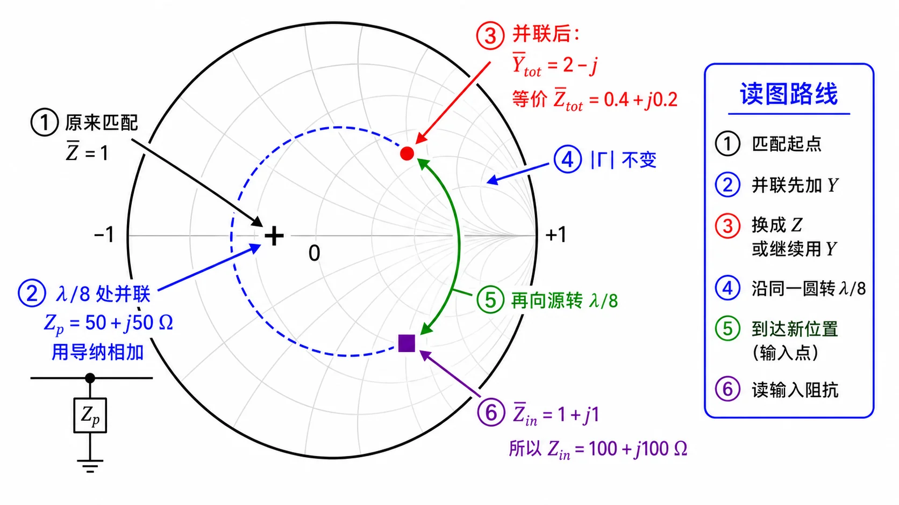

# 第二次作业 · Lec08–09 · 第 3 题

> 对应知识点：[03-并联支节匹配](../../../knowledge/02-反射与匹配/03-并联支节匹配.md)

**导航：** [总目录](../README.md) · [符号与导读](../00-符号与导读.md) · [Lec08–09 总册](README.md) · [Lec06](../01-Lec06.md) · [Lec07](../02-Lec07.md) · [附录](../99-公式与图像.md)

---

### 第 3 题

*（对应大纲 **Lec08–09 作业** 第 3 题；该讲教材章节 **§1.6**。）*

#### 题目复述

$Z_c=100\,\Omega$，终端**匹配**。在距终端 $\lambda/8$ 处**并联** $(50+\mathrm{j}50)\,\Omega$，求距终端 $\lambda/4$ 处的输入阻抗。

#### 详细思路

**工程/物理目标**：在 **已匹配** 的长线上某截面 **并联** 集总阻抗，求 **另一截面** 的输入阻抗——工程上对应「匹配链路上并接元件后，下游/上游端口阻抗如何变」；**并联结点必须用导纳或并联公式**，再 **分段** 用传输线公式。

1. 匹配终端：在并联点前，向负载看仍为 $Z_c$。
2. **并联**：先用导纳相加，或 $Z_{\mathrm{par}}=\dfrac{Z_a Z_b}{Z_a+Z_b}$。
3. 再经一段线用 $Z_{\mathrm{in}}$ 公式向源变换。

**思路叙述：**

以负载为 $z=0$：$0\to\lambda/8$ 点匹配故 $Z=Z_c$；在该点并上 $Z_p$；再从该点到 $\lambda/4$ 又走 $\lambda/8$。

#### 解法一：公式（解析）

#### 一步步解答

**步骤 1** 在 $\lambda/8$ 处并联前，$Z^-=Z_c=100\,\Omega$。

**步骤 2** 并联 $Z_p=50+\mathrm{j}50\,\Omega$：

$$
\frac{1}{50+\mathrm{j}50}=\frac{50-\mathrm{j}50}{50^2+50^2}=\frac{50-\mathrm{j}50}{5000}=0.01-\mathrm{j}0.01\,\mathrm{S},
$$

$$
Y_{\mathrm{tot}}=\frac{1}{100}+\frac{1}{50+\mathrm{j}50}=0.01+(0.01-\mathrm{j}0.01)=0.02-\mathrm{j}0.01\,\mathrm{S},\quad
Z_{\mathrm{tot}}=\frac{1}{Y_{\mathrm{tot}}}=\frac{0.02+\mathrm{j}0.01}{0.02^2+0.01^2}=40+\mathrm{j}20\,\Omega.
$$

**步骤 3** 从并联点到「距终端 $\lambda/4$」还须向源走 **$\Delta z=\lambda/8$**，$\beta\Delta z=\pi/4$，$\tan\beta\Delta z=1$：

$$
Z_{\mathrm{in}}=Z_c\,\frac{Z_{\mathrm{tot}}+\mathrm{j}Z_c\tan(\beta\Delta z)}{Z_c+\mathrm{j}Z_{\mathrm{tot}}\tan(\beta\Delta z)}
=100\cdot\frac{40+\mathrm{j}20+\mathrm{j}100}{100+\mathrm{j}(40+\mathrm{j}20)}
=100\cdot\frac{40+\mathrm{j}120}{80+\mathrm{j}40}.
$$

化简：分子分母同除 $40$，再 **分子分母同乘 $(2-\mathrm{j})$**：

$$
Z_{\mathrm{in}}=100\cdot\frac{1+\mathrm{j}3}{2+\mathrm{j}}
=100\cdot\frac{(1+\mathrm{j}3)(2-\mathrm{j})}{5}
=100\cdot\frac{5+\mathrm{j}5}{5}=(100+\mathrm{j}100)\,\Omega.
$$

#### 标准解答

- **$Z_{\mathrm{in}}=(100+\mathrm{j}100)\,\Omega$**。

- **检验/注意：** 分段：匹配段 → 并联破坏匹配 → 再变换；导纳法在并联处往往更省事。

#### 解法二：圆图（Smith）

*图：在阻抗 $\Gamma$ 平面上画 $\bar Z_{\mathrm{tot}}$ 与旋转；亦可用 $\bar Y_{\mathrm{tot}}=2-\mathrm{j}$ 在导纳图上核对为同一点。*

**读图说明（零基础）**

- **并联这一步**：在 **导纳面** 上最直观——**$\bar Y$ 相加**；与 **$\bar Z$** 是 **同一点** 的两种坐标，不要当成两个物理位置。
- **圆心**：匹配点 **$\bar Z=\bar Y=1$**（本题在并联前）。
- **并联后点**：**$\bar Y_{\mathrm{tot}}=2-\mathrm{j}$** 或 **$\bar Z_{\mathrm{tot}}=0.4+\mathrm{j}0.2$**；图上应在 **等 $\|\Gamma\|$ 圆** 上离开圆心。
- **再转 $\lambda/8$**：沿 **等 $\|\Gamma\|$** 圆 **向源顺时针** 走 **$0.125\lambda$**，读 **$\bar Z_{\mathrm{in}}$** 或先读 **$\bar Y_{\mathrm{in}}$** 再取倒数。
- **自检**：结果应为 **$\bar Z_{\mathrm{in}}=1+\mathrm{j}1$**，即 **$(100+\mathrm{j}100)\,\Omega$**。

**圆图操作步骤**

1. **距终端 $\lambda/8$** 截面：匹配终端故 **$\bar Z=1$**，在阻抗圆图为 **圆心**；换到 **导纳圆图** 亦为 **$\bar Y=1$**（同一点）。
2. **并联** $Z_p=50+\mathrm{j}50\,\Omega$：算 **$\bar Y_p=Y_p Z_c$**，与 **$\bar Y=1$** **代数相加**得结点 **$\bar Y_{\mathrm{tot}}=2-\mathrm{j}$**（与 **$\bar Z_{\mathrm{tot}}=0.4+\mathrm{j}0.2$** 互为倒数）；在导纳圆图上最省事是 **算 $\bar Y_{\mathrm{tot}}$ 后直接在图上标出该点**。
3. 从 **$\bar Y_{\mathrm{tot}}$** 出发，沿 **等 $|\Gamma|$ 圆** **向源（顺时针）** 再转 **$\lambda/8$**，读 **$\bar Y_{\mathrm{in}}$**，再 **$Z_{\mathrm{in}}=\bar Y_{\mathrm{in}}^{-1}\,Z_c$**，应与 **$(100+\mathrm{j}100)\,\Omega$** 一致（亦可在阻抗图上从 **$\bar Z_{\mathrm{tot}}=0.4+\mathrm{j}0.2$** 转 $\lambda/8$ 读 $\bar Z_{\mathrm{in}}$）。

#### 常见疑惑点

- **疑惑：** 「终端匹配」到底指什么？**解答：** 指传输线**负载端**接匹配负载，使在并联支路接入之前、沿线的入射端看负载为 $Z_L=Z_c$；本题在 $\lambda/8$ 截面向负载看仍为 $Z_c$。
- **疑惑：** 从 $\lambda/8$ 到 $\lambda/4$ 为什么又是 $\lambda/8$ 线长？**解答：** 距终端 $\lambda/4$ 与距终端 $\lambda/8$ 相差 **$\lambda/4-\lambda/8=\lambda/8$**，故第二段用 $Z_{\mathrm{in}}$ 公式时取 $l=\lambda/8$。
- **疑惑：** 并联为什么用 $Y$ 相加而不是 $Z$ 直接相加？**解答：** 并联支路电压相同，用**导纳**相加最直接；亦可用 $Z_{\mathrm{par}}=Z_a Z_b/(Z_a+Z_b)$，与导纳法等价。

---

*同讲各题：[1](第01题.md) · [2](第02题.md) · [3](第03题.md) · [4](第04题.md) · [5](第05题.md) · [6](第06题.md) · [7](第07题.md)*

*返回总册：[Lec08–09 总册](README.md)*
