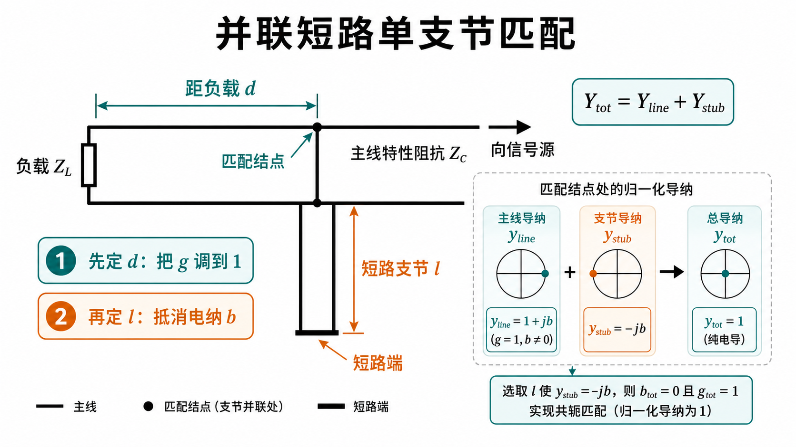
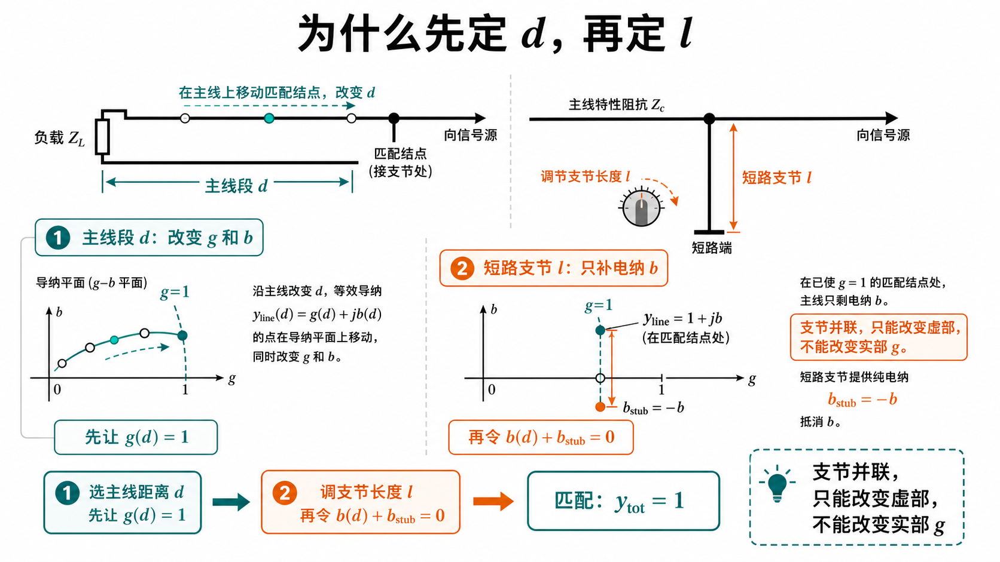
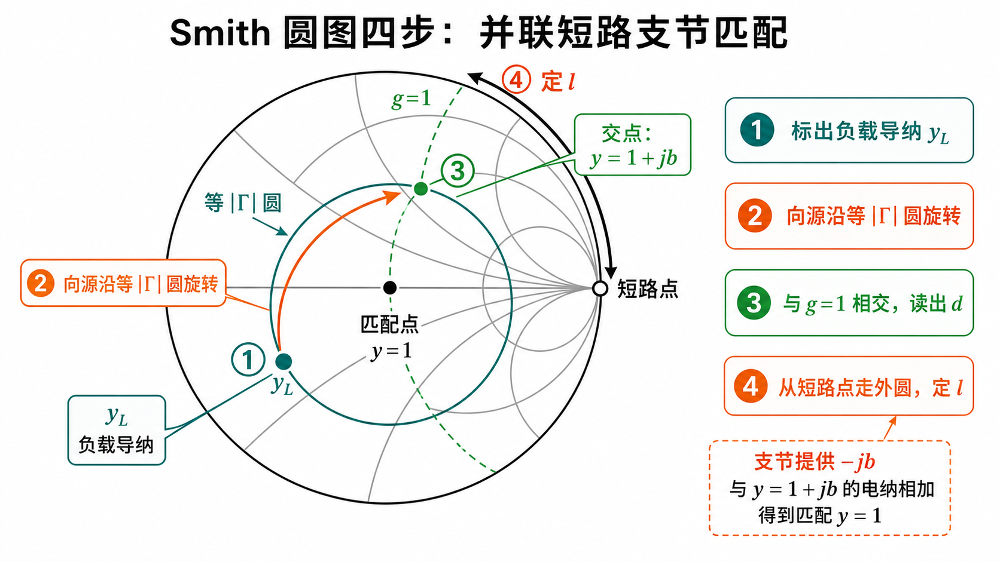
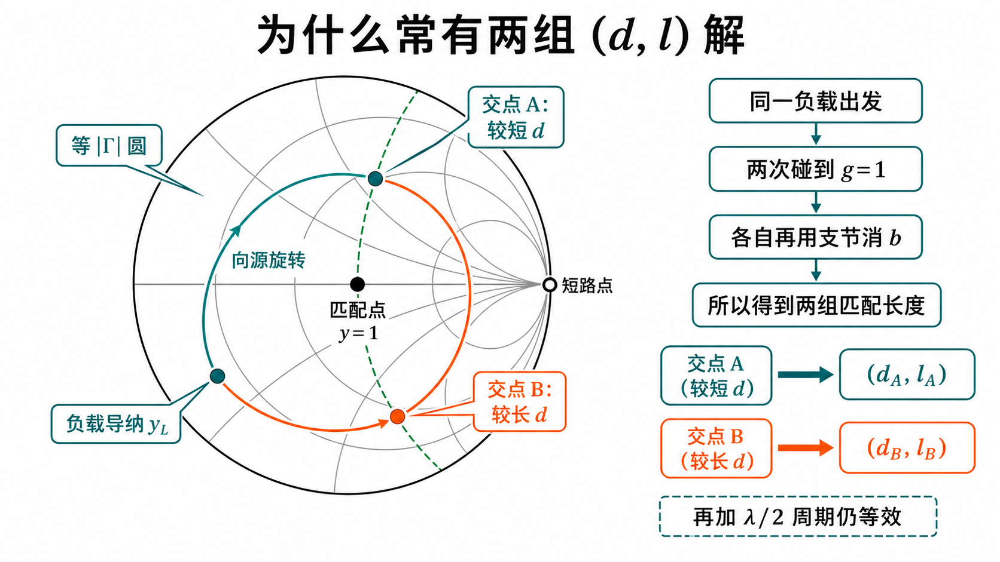
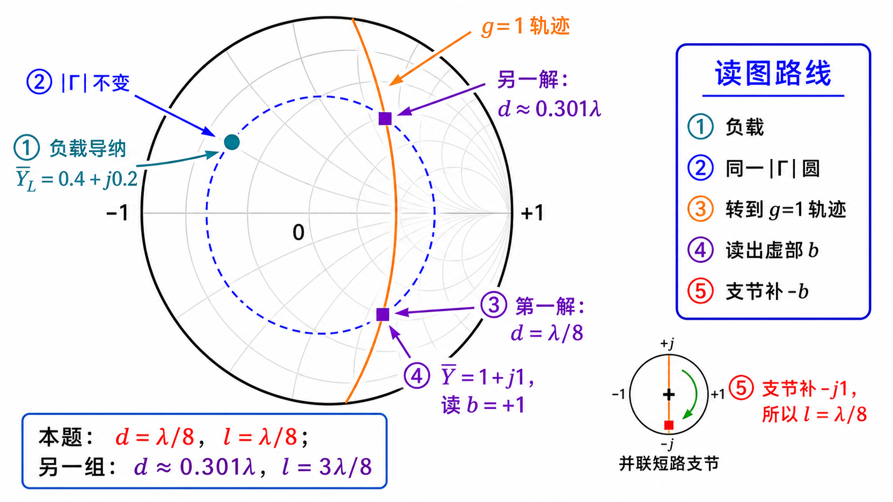

# 第二次作业 · Lec08–09 · 第 4 题

> 对应知识点：[03-并联支节匹配](../../../knowledge/02-反射与匹配/03-并联支节匹配.md)

**导航：** [总目录](../README.md) · [符号与导读](../00-符号与导读.md) · [Lec08–09 总册](README.md) · [Lec06](../01-Lec06.md) · [Lec07](../02-Lec07.md) · [附录](../99-公式与图像.md)

> **说明**：**并联单支节通用推导、拓扑图与 $g=1$ 圆** 可先读 [第 1 题](第01题.md) 和 [Lec08–09 总册](README.md) 的导读，再回到本题代入数值。

---

### 第 4 题

*（对应大纲 **Lec08–09 作业** 第 4 题；该讲教材章节 **§1.6**。）*

#### 题目复述

$Z_L=(100-\mathrm{j}50)\,\Omega$，$Z_c=50\,\Omega$，用**并联短路支节**匹配（主线、支线 $Z_c$ 均为 $50\,\Omega$）。求支节位置 $d$ 与长度 $l$（解析 + 圆图思路）。

#### 详细思路

**工程/物理目标**：把 **任意 $Z_L$** 经 **距负载 $d$ 的截面 + 并联短路枝节** 调到 **$Z_c$**，使馈线上反射最小；圆图上即 **$g=1$ 定 $d$、外圆定 $l$**（与 [Lec08–09 总册](README.md) 导读、[第 1 题](第01题.md) **解法二** 同一套路）。

[第 1 题](第01题.md) 推导的**并联单支节**；圆图上：从 $\bar Y_L$ 出发向源转，与 $g=1$ 圆求交得 $d$，再在导纳圆上读短路支节长度。

**思路叙述：**

（并联单支节**通用推导**见 [第 1 题](第01题.md)。）解析：求 $Y(d)$ 使 $\mathrm{Re}\,Y(d)=1/Z_c$；再用短路支节消去电纳。

拓扑与第 1 题相同：都是在距离负载 $d$ 的截面并联一段短路支节，先用主线长度定接入点，再用支节长度抵消多余电纳。

#### 图解辅读（与总册「图解辅读」同套示意图）

下列四图与 [Lec08–09 总册](README.md) **「图解辅读」** 讲的是同一条思路，便于单题阅读时 **不用跳转**。

*提示：本题数值解 **$d=\lambda/8,\,l=\lambda/8$** 等与 **图 3、图 4** 的作图逻辑一致；精确位置以你手算 / 圆图读数为准。*

#### 解法一：公式（解析）

#### 一步步解答

**归一化** $\bar Z_L=Z_L/Z_c=(100-\mathrm{j}50)/50=2-\mathrm{j}$，

$$
\bar Y_L=\frac{1}{\bar Z_L}=\frac{1}{2-\mathrm{j}}=\frac{2+\mathrm{j}}{5}=0.4+\mathrm{j}0.2
$$

**沿线的归一化导纳**（距负载 $d$，$t=\tan\beta d$）可写成

$$
\bar Y(d)=\frac{\bar Y_L+\mathrm{j}t}{1+\mathrm{j}\bar Y_L t}
$$

（与第 1 题 **$Y(d)$** 公式除以 $Y_c$ 后一致）。

令 **$\mathrm{Re}\,\bar Y(d)=1$**（即 $\mathrm{Re}\,Y(d)=Y_c$）。记 $\bar Y_L=g_0+\mathrm{j}b_0=0.4+\mathrm{j}0.2$，将

$$
\bar Y(d)=\frac{g_0+\mathrm{j}(b_0+t)}{(1-b_0 t)+\mathrm{j}g_0 t}.
$$

**分母有理化（写出实部，不漏项）** 记 $D=(1-b_0 t)+\mathrm{j}g_0 t$，则 $|D|^2=(1-b_0 t)^2+(g_0 t)^2$。分子乘以 $D^\ast$：

$$
\bigl[g_0+\mathrm{j}(b_0+t)\bigr]\bigl[(1-b_0 t)-\mathrm{j}g_0 t\bigr]
$$

其实部为

$$
\mathrm{Re}(N D^\ast)=g_0(1-b_0 t)+(b_0+t)(g_0 t)=g_0(1+t^2),
$$

其中中间项 $-g_0 b_0 t$ 与 $+g_0 b_0 t$ 相消，余下 $g_0+g_0 t^2$。故

$$
\mathrm{Re}\,\bar Y(d)=\frac{g_0(1+t^2)}{(1-b_0 t)^2+(g_0 t)^2}.
$$

令 **$\mathrm{Re}\,\bar Y=1$**，分母恒正，等价于

$$
g_0(1+t^2)=(1-b_0 t)^2+(g_0 t)^2.
$$

代入 $g_0=0.4$、$b_0=0.2$：

$$
0.4(1+t^2)=(1-0.2t)^2+0.16t^2=1-0.4t+0.2t^2,
$$

整理得关于 **$t=\tan\beta d$** 的二次方程

$$
t^2+2t-3=0\quad\Rightarrow\quad t=1\ \ \text{或}\ \ t=-3.
$$

- **解 1：** $t=1\Rightarrow \beta d=\pi/4\Rightarrow d=\lambda/8=0.125\lambda$。代回 $\bar Y(d)=\dfrac{0.4+\mathrm{j}(0.2+1)}{(1-0.2)+\mathrm{j}0.4}=\dfrac{0.4+\mathrm{j}1.2}{0.8+\mathrm{j}0.4}$，分子分母同乘 $(0.8-\mathrm{j}0.4)$ 得 **$\bar Y=1+\mathrm{j}1$**，故 **$\mathrm{Im}\,\bar Y=1$**。并联短路枝节归一化导纳为 **$-\mathrm{j}\cot\beta l$**，令总电纳为零：**$1-\cot\beta l=0\Rightarrow \cot\beta l=1\Rightarrow \beta l=\pi/4\Rightarrow l=\lambda/8$**。
- **解 2：** $t=-3$ 时，$\beta d=\arctan(-3)+\pi$（取 $(0,\pi)$ 内正解），**$d/\lambda=\dfrac{\arctan(-3)+\pi}{2\pi}\approx 0.3013$**。代回得 **$\bar Y\approx 1-\mathrm{j}1$**，**$\mathrm{Im}\,\bar Y=-1$**，需 **$\cot\beta l=-1\Rightarrow \beta l=3\pi/4\Rightarrow l=3\lambda/8$**（与圆图上另一 $g=1$ 交点一致；另加 $\lambda/2$ 周期可得等价解）。

**圆图要点**：标 $\bar Y_L$（或 $\bar Z_L$），沿 **等 $|\Gamma|$** 圆 **向源顺时针** 转至 **$g=1$** 得 $d$；读交点电纳，从 **短路点** 沿 **外圆** 走 $l$ 抵消。

#### 标准解答

- **一组常用解：** **$d=\lambda/8\approx 0.125\lambda$**，**$l=\lambda/8\approx 0.125\lambda$**；**另一组解：** **$d\approx 0.301\lambda$**，**$l=3\lambda/8=0.375\lambda$**（另加 $\lambda/2$ 周期可得等价解）。圆图：归一化导纳向源转至 **$g=1$** 定 $d$，短路点沿外圆定 $l$。

- **检验/注意：** 多解对应不同交点与 $\lambda/2$ 周期。

#### 解法二：圆图（Smith）

*图：$\bar Y_L=1/\bar Z_L$；蓝色虚线圆表示沿线移动时 $|\Gamma|$ 不变，橙色轨迹是 $g=1$，两个紫色交点对应两组 $(d,l)$。*

**读图说明（零基础）**

- **$\bar Y_L$**：$\bar Z_L=2-\mathrm{j}$ 的倒数，在 **导纳坐标** 下标出（或阻抗面取倒数同一点）。
- **橙色 $g=1$**：与 [第 1 题](第01题.md) 的 $g=1$ 导读图同义；交点 = **$\mathrm{Re}\,\bar Y=1$**。
- **蓝色等 $|\Gamma|$ 圆**：沿同一圆 **向源顺时针** 找到与 $g=1$ 的交点；弧长 = **$d/\lambda$**（第一次交点常取最短 $d$）。
- **外圆**：**短路点**出发走 **$l/\lambda$**，抵消交点处的 **$b$**。
- **自检**：$d\approx 0.125\lambda$、$l\approx 0.125\lambda$ 与 **解法一** 一组解互校；多解勿忘 **$\lambda/2$**。

**圆图操作步骤**

1. **$Z_c=50\,\Omega$**，$\bar Z_L=(100-\mathrm{j}50)/50=2-\mathrm{j}$。在 **阻抗圆图** 上标负载；若用 **导纳圆图**，可将该点理解为 $\bar Y_L=1/\bar Z_L$（或按教材「转 $\lambda/4$」到导纳面）。
2. 从 **$\bar Y_L$** 出发，沿 **等 $|\Gamma|$ 圆** **向源（顺时针）** 移动，直至与 **$g=1$**（即 **$\mathrm{Re}\,\bar Y=1$**）圆相交；**第一次**（距负载最近）交点对应的波长行程即 **$d/\lambda\approx 0.125$**。
3. 在该交点读 **归一化电纳 $b$**；**并联短路支节**从圆图 **短路点**（$\bar Z=0$、$\bar Y\to\infty$）出发，沿 **外圆** 向适当方向转到使结点总电纳被抵消，得 **$l/\lambda\approx 0.125$**（与解析一组解一致；另有多解）。
4. 与 **解法一**「一步步解答」中数值互校。

#### 常见疑惑点

- **疑惑：** 圆图上 $g=1$ 与解析的 $\mathrm{Re}\,\bar Y=1$ 是一回事吗？**解答：** 对。归一化导纳 $\bar Y=Y/Y_c=Y Z_c$，故 $\mathrm{Re}\,\bar Y=1$ 即 $\mathrm{Re}\,Y=Y_c=1/Z_c$，对应等电导圆 $g=1$。
- **疑惑：** 为什么常有多组 $(d,l)$？**解答：** $\mathrm{Re}\,Y(d)=Y_c$ 在 $d$ 上可有多个解；每一 $d$ 对应不同电纳，支节长度 $l$ 随之不同；再加 $\lambda/2$ 周期，书写时务必注明「一组解」。

#### 自测 1 分钟

- **问：** 归一化后 $\mathrm{Re}\,\bar Y(d)=1$ 在圆图上对应什么？**答：** 等电导圆 **$g=1$**（因 $\bar Y=Y/Y_c$，$\mathrm{Re}\,\bar Y=1$ 即 $\mathrm{Re}\,Y=Y_c$）。

---

*同讲各题：[1](第01题.md) · [2](第02题.md) · [3](第03题.md) · [4](第04题.md) · [5](第05题.md) · [6](第06题.md) · [7](第07题.md)*

*返回总册：[Lec08–09 总册](README.md)*
