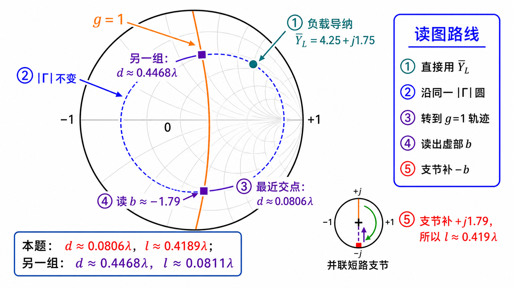

# 第二次作业 · Lec08–09 · 第 5 题

**导航：** [总目录](../README.md) · [符号与导读](../00-符号与导读.md) · [Lec08–09 总册](README.md) · [Lec06](../01-Lec06.md) · [Lec07](../02-Lec07.md) · [附录](../99-公式与图像.md)

> **说明**：单支节匹配的**通用条件**见 [第 1 题](第01题.md)；与阻抗题对照见 [第 4 题](第04题.md)。

---

### 第 5 题

*（对应大纲 **Lec08–09 作业** 第 5 题；该讲教材章节 **§1.6**。）*

#### 题目复述

$Y_L=(0.0425+\mathrm{j}0.0175)\,\mathrm{S}$，$Z_c=100\,\Omega$，并联短路支节匹配（主线、支线均为 $100\,\Omega$）。求 $d$、$l$。

#### 图解辅读（与第 4 题同一作图套路）

本题仍为 **并联短路单支节**，圆图步骤与 [第 4 题](第04题.md)、[Lec08–09 总册](README.md) **「图解辅读」** 相同；负载导纳直接给出时，起点为 **$\bar Y_L=Y_L Z_c$**（高电导区），常出现 **两组 $(d,l)$**，可对照下图 **两交点** 理解。

#### 详细思路

**工程/物理目标**：与第 4 题相同（单支节匹配到 $Z_c$），题面以 **导纳 $Y_L$** 给出负载，便于 **直接归一化 $\bar Y_L$** 上 Smith，减少 $Z\leftrightarrow Y$ 换算步骤。

$\bar Y_L=Y_L Z_c$；其余同第 4 题。

**思路叙述：**

（与 [第 4 题](第04题.md) 同型；匹配方程形式见 [第 1 题](第01题.md)。）先 $Z_L=1/Y_L$，或直接用 $\bar Y_L$ 写 $Y(d)$ 条件。

#### 解法一：公式（解析）

#### 一步步解答

$$
\bar Y_L=Y_L Z_c=(0.0425+\mathrm{j}0.0175)\times 100=4.25+\mathrm{j}1.75,\qquad Y_c=0.01\,\mathrm{S}.
$$

记 $\bar Y_L=g_0+\mathrm{j}b_0=4.25+\mathrm{j}1.75$。沿线归一化导纳（与第 4 题同形）

$$
\bar Y(d)=\frac{g_0+\mathrm{j}(b_0+t)}{1+\mathrm{j}\bar Y_L t}
=\frac{g_0+\mathrm{j}(b_0+t)}{(1-b_0 t)+\mathrm{j}g_0 t}.
$$

与第 4 题相同的 **$\mathrm{Re}(N D^\ast)=g_0(1+t^2)$**、$|D|^2=(1-b_0 t)^2+(g_0 t)^2$，令 **$\mathrm{Re}\,\bar Y=1$** 得

$$
g_0(1+t^2)=(1-b_0 t)^2+(g_0 t)^2.
$$

代入 $g_0=4.25$、$b_0=1.75$：左边 $4.25+4.25t^2$；右边

$$
(1-1.75t)^2+(4.25t)^2=1-3.5t+3.0625t^2+18.0625t^2=1-3.5t+21.125t^2.
$$

移项整理

$$
16.875\,t^2-3.5\,t-3.25=0
\quad\Rightarrow\quad
t_1\approx 0.55464,\ \ t_2\approx -0.34724.
$$

**由 $t$ 求 $d$** 取 $\beta d=\arctan t$ 的主值并映射到 $(0,\pi)$ 内正电长度（与第 4 题同）：$d/\lambda=\dfrac{\beta d}{2\pi}$。

- **取 $t_1\approx 0.55464$（常对应顺时针第一次碰到 $g=1$、$d$ 较短）：** $\beta d=\arctan t_1\approx 0.5064\,\mathrm{rad}$，**$d\approx 0.08060\lambda$**。代回算得 **$\mathrm{Im}\,\bar Y(d)\approx -1.7905$**。短路枝节满足 **$\mathrm{Im}\,\bar Y-\cot\beta l=0$**，即 **$\cot\beta l\approx -1.7905$**，**$\tan\beta l\approx -0.5585$**；取枝节长度在 $(0,\lambda/2)$ 内的常用支：**$\beta l\approx \pi+\arctan(-0.5585)\approx 2.630\,\mathrm{rad}$**，**$l\approx 0.4189\lambda$**。
- **取 $t_2\approx -0.34724$：** $\beta d=\arctan t_2+\pi\approx 2.8074\,\mathrm{rad}$，**$d\approx 0.44681\lambda$**。该点 **$\mathrm{Im}\,\bar Y\approx +1.7905$**，**$\tan\beta l\approx 0.5585$**，**$l\approx 0.08107\lambda$**（圆图上另一 $g=1$ 交点；另加 $\lambda/2$ 周期可得等价解）。

#### 标准解答

- **$\bar Y_L=4.25+\mathrm{j}1.75$**；**一组常用解：** **$d\approx 0.08060\lambda$**，**$l\approx 0.4189\lambda$**；**另一组解：** **$d\approx 0.4468\lambda$**，**$l\approx 0.0811\lambda$**（多解、$\lambda/2$ 周期仍适用）。

- **检验/注意：** 负载以导纳给出时，先归一化导纳更贴近圆图习惯。

#### 解法二：圆图（Smith）

*图：高电导区负载；取**距负载最近**的交点与解析一组解一致。*

**读图说明（零基础）**

- **起点**：**$\bar Y_L=4.25+\mathrm{j}1.75$** 在 **高电导区**（靠近外圆附近），与第 4 题低阻负载在图上的位置感不同，但 **套路相同**。
- **橙线 $g=1$**：仍表示 **$\mathrm{Re}\,\bar Y=1$**；**顺时针** 第一次交点 → **最短 $d$**，与数值 **$d\approx 0.0806\lambda$** 对齐。
- **外圆枝节**：交点处读出 **$b$**，从 **短路点** 沿外圆走到 **$-b$**，得 **$l/\lambda\approx 0.419$**（与解析 **$\approx 0.4189$** 一致）。
- **自检**：与 **解法一** 数值一致；若选 **更远** 的 $g=1$ 交点，会得到另一组 $(d,l)$，属正常多解。

**圆图操作步骤**

1. **$\bar Y_L=Y_L Z_c=4.25+\mathrm{j}1.75$** 已在题中给出，直接在 **导纳圆图** 上标出（高电导区一点）。
2. 沿 **等 $|\Gamma|$ 圆** **向源（顺时针）** 转，与 **$g=1$** 圆求交；取 **距负载最近** 的交点，读 **$d/\lambda\approx 0.0806$**。
3. 在该交点读 **电纳 $b$**，用 **并联短路支节** 从 **短路点** 沿外圆转到 **抵消** 该电纳，得 **$l/\lambda\approx 0.419$**（约 **$0.4189$**）。
4. 多交点、$\lambda/2$ 周期与另选支路解，与 **「常见疑惑点」** 一致，须在图上逐段说明。

#### 常见疑惑点

- **疑惑：** 文档里一组解写 $d\approx 0.0806\lambda$，圆图上会不会对应更远的位置？**解答：** 会；满足实部条件的 $d$ 常有多处，工程上多取**距负载最近**的解（与数值搜索「最短 $d$」一致），其余解加上 $\lambda/2$ 周期仍可能成立。
- **疑惑：** $\bar Y_L=Y_L Z_c$ 量纲对吗？**解答：** $Y_L$ 为西门子，$Z_c$ 为欧姆，乘积为无量纲，即**归一化导纳**，与 Smith 圆图一致。

---

*同讲各题：[1](第01题.md) · [2](第02题.md) · [3](第03题.md) · [4](第04题.md) · [5](第05题.md) · [6](第06题.md) · [7](第07题.md)*

*返回总册：[Lec08–09 总册](README.md)*
