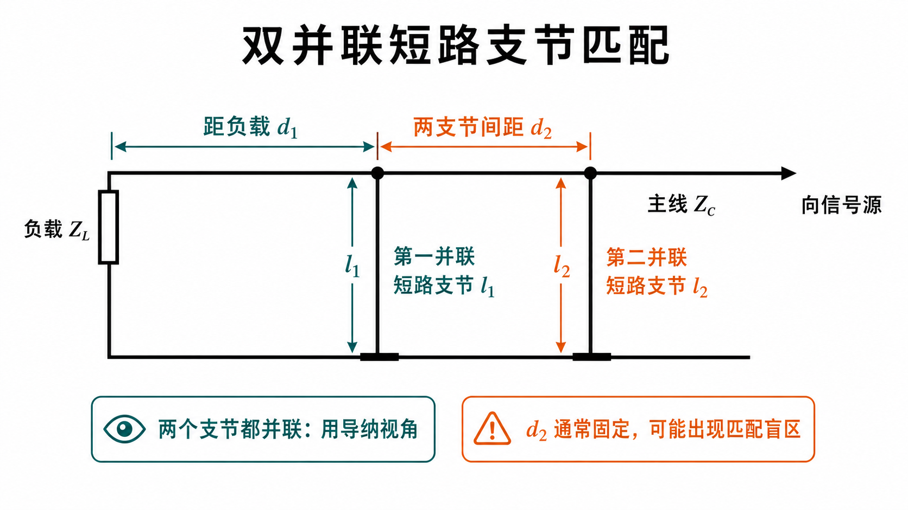
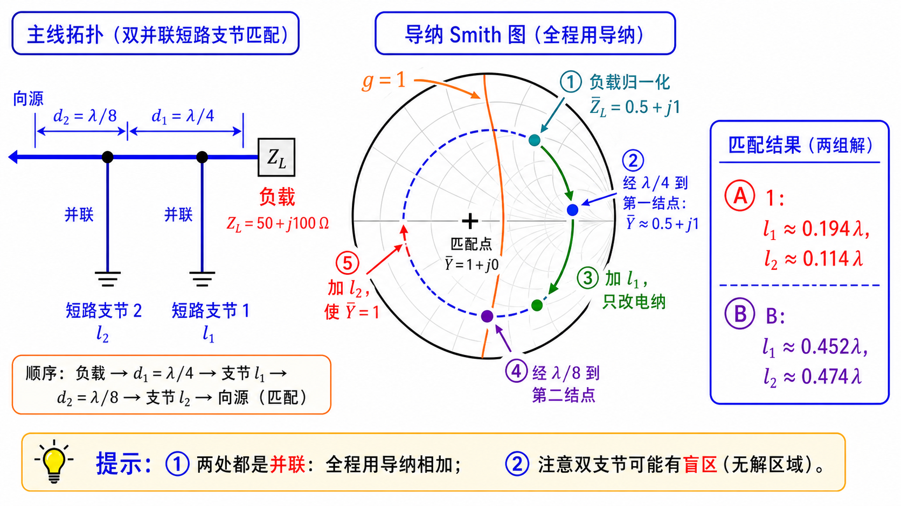

# 第二次作业 · Lec08–09 · 第 6 题

> 对应知识点：[03-并联支节匹配](../../../knowledge/02-反射与匹配/03-并联支节匹配.md)

**导航：** [总目录](../README.md) · [符号与导读](../00-符号与导读.md) · [Lec08–09 总册](README.md) · [Lec06](../01-Lec06.md) · [Lec07](../02-Lec07.md) · [附录](../99-公式与图像.md)

> **说明**：**沿线 $\bar Y$ 变换公式**与单支节题同形，见 [第 4 题](第04题.md)；$\lambda/4$ 与 $\bar Z\leftrightarrow\bar Y$ 见 [Lec06 分册](../01-Lec06.md) 第 4 题。[第 7 题](第07题.md) 为并+串混合拓扑，勿与本题「两并联」混用。

---

### 第 6 题

*（对应大纲 **Lec08–09 作业** 第 6 题；该讲教材章节 **§1.6**。）*

#### 题目复述

$Z_L=(50+\mathrm{j}100)\,\Omega$，主线与支线 $Z_0=100\,\Omega$；双短路支节：第一支节距负载 $d_1=\lambda/4$，两支节间距 $d_2=\lambda/8$，均与主线并联。求 $l_1$、$l_2$。

#### 详细思路

**工程/物理目标**：用 **两个并联枝节** 与 **固定间距 $d_2$** 增加调节自由度，避免单支节在某些负载下 **达不到 $g=1$** 的尴尬；代价是存在 **盲区**（部分负载无解或需改 $d_1,d_2$）。

1. **双支节**：在第一个结点用 $l_1$ 调导纳，经 $d_2$ 线段后在第二个结点用 $l_2$ 使总导纳匹配 $Y_0$。
2. $\lambda/4$ 段使阻抗↔导纳互换（见 Lec06-4）。

**思路叙述：**

（$\lambda/4$ 与 **$\bar Z\leftrightarrow\bar Y$** 关系见 **Lec06 第 4 题**。）负载经 $\lambda/4$ 到第一支节处，算 $\bar Y$；加 $l_1$ 的短路线电纳；经 $\lambda/8$ 变换；在第二结点加 $l_2$ 使 $\bar Y_{\mathrm{in}}=1$。

*图：两支节均**并联**在主线同一导体上；本题中 $d_1=\lambda/4$、$d_2=\lambda/8$ 为已知，求 $l_1,l_2$。*

#### 解法一：公式（解析）

#### 一步步解答

**归一化负载** $\bar Z_L=(50+\mathrm{j}100)/100=0.5+\mathrm{j}1$。

**经 $d_1=\lambda/4$ 到第一支节截面（未并枝节前）** 对无耗线有 **$Z(\lambda/4)=Z_0^2/Z_L$**（纯电阻负载时的「四分之一波长线阻抗倒置」公式的推广形式），故

$$
\bar Z(\lambda/4)=\frac{Z_0}{Z_L}=\frac{1}{\bar Z_L}=0.4-\mathrm{j}0.8,
$$

$$
\bar Y(\lambda/4)=\frac{1}{\bar Z(\lambda/4)}=0.5+\mathrm{j}1.0.
$$

（**不要**把「$\lambda/4$ 旋转」误记成「$\bar Y=\bar Z_L$」；上式由 **$Z(\lambda/4)=Z_0^2/Z_L$** 推出。）

**并上第一短路枝节** 只改电纳：记归一化枝节电纳为 **$\mathrm{j}b_s=-\mathrm{j}\cot\beta l_1$**，则

$$
\bar Y_1'=0.5+\mathrm{j}(1+b_s).
$$

**再经 $d_2=\lambda/8$** 到第二结点前方：记 **$t=\tan(\beta d_2)=\tan(\pi/8)=\sqrt{2}-1\approx 0.41421356$**，归一化导纳满足与第 4 题同形的 **沿线公式**

$$
\bar Y_2=\frac{\bar Y_1'+\mathrm{j}t}{1+\mathrm{j}\bar Y_1' t}.
$$

令 **$p=1+b_s=1-\cot\beta l_1$**（即 $\bar Y_1'=0.5+\mathrm{j}p$）。把 $\bar Y_1'$ 代入上式，分母写成

$$
D=1+\mathrm{j}\bar Y_1' t=(1-pt)+\mathrm{j}\,0.5t,
$$

分子

$$
N=0.5+\mathrm{j}(p+t).
$$

与第 4 题同一技巧：**$\mathrm{Re}\,\bar Y_2=\mathrm{Re}(N/D)=\dfrac{\mathrm{Re}(N D^\ast)}{|D|^2}$**，其中

$$
\mathrm{Re}(N D^\ast)=0.5(1-pt)+(p+t)(0.5t)=0.5(1+t^2),
$$

（交叉项 $-0.5pt+0.5pt$ 相消，余 $0.5+0.5t^2$）。第二枝节并联短路前须 **$\mathrm{Re}\,\bar Y_2=1$**（落到 **$g=1$**），故

$$
\frac{0.5\,(1+t^2)}{(1-pt)^2+(0.5t)^2}=1
\quad\Longleftrightarrow\quad
(1-pt)^2+(0.5t)^2=0.5(1+t^2).
$$

代入 $t^2=\tan^2(\pi/8)=3-2\sqrt{2}$，上式化为关于 **$p$** 的二次方程 **$t^2 p^2-2tp+\bigl(0.5-\tfrac14 t^2\bigr)=0$**。数值解得

$$
p_1\approx 0.635390,\qquad p_2\approx 4.193037.
$$

**求 $l_1$：** **$\cot\beta l_1=1-p$**。短路枝节物理长度常取 $\beta l_1\in(0,\pi)$：若 $1-p>0$ 取 $\beta l_1=\arctan\!\bigl(\frac{1}{1-p}\bigr)$ 型的一支；若 $1-p<0$ 则 $\beta l_1\in(\pi/2,\pi)$，用 **$\beta l_1=\pi+\arctan\!\bigl(\frac{1}{1-p}\bigr)$**（因 $\arctan$ 主值落在 $(-\pi/2,0)$）。

**求 $l_2$：** 在 **$\bar Y_2$** 处并联第二短路枝节，总导纳 **$\bar Y=\bar Y_2-\mathrm{j}\cot\beta l_2$**。匹配要求 **$\bar Y=1$**，已使 **$\mathrm{Re}\,\bar Y_2=1$**，故只需

$$
\mathrm{Im}\,\bar Y_2-\cot\beta l_2=0
\quad\Rightarrow\quad
\cot\beta l_2=\mathrm{Im}\,\bar Y_2,
$$

再按 **$\beta l_2\in(0,\pi)$** 取与 **$\mathrm{Im}\,\bar Y_2$** 符号一致的一支。

**两组数值解（代入 $t$、$p$ 回算核验）**

- **情况 A（$p_1$）：** **$l_1\approx 0.19435\lambda$**，**$l_2\approx 0.11437\lambda$**（此组 **$\mathrm{Im}\,\bar Y_2\approx +1.143$**）。
- **情况 B（$p_2$）：** **$l_1\approx 0.45170\lambda$**，**$l_2\approx 0.47359\lambda$**（此组 **$\mathrm{Im}\,\bar Y_2\approx -5.972$**）。

另加 **$\lambda/2$** 于任一枝节长度可得等价实现。作图时仍以教材 **辅助圆/禁区** 核对；勿与「并+串」拓扑混用。

#### 标准解答

- 经 $\lambda/4$ 后 **$\bar Y=0.5+\mathrm{j}1.0$**；**一组解：** **$l_1\approx 0.194\lambda$**，**$l_2\approx 0.114\lambda$**；**另一组解：** **$l_1\approx 0.452\lambda$**，**$l_2\approx 0.474\lambda$**（可加 $\lambda/2$ 周期；存在盲区时可能无解）。

- **检验/注意：** 双支节避免在单支节不可实现的纯电导点，但存在**盲区**（某些负载无解），需用教材圆图法系统讲解。

#### 解法二：圆图（Smith）

*图：左侧先分清两根支节都与主线并联；中间按导纳图展示“经 $\lambda/4$ 到第一结点、加 $l_1$、再经 $\lambda/8$、加 $l_2$”的顺序；右侧列出两组长度。*

**读图说明（零基础）**

- **本图定位**：它不是只给一个起点，而是把双支节完整流程拆开：负载经 $d_1=\lambda/4$ 到第一结点，先由 $l_1$ 改电纳，再经 $d_2=\lambda/8$ 到第二结点，最后由 $l_2$ 配平到 $\bar Y=1$。
- **橙线**：仍为 **$g=1$** 参考；第一枝节 + $d_2$ 的目标是让第二结点能被第二枝节补到匹配点。
- **与 Q4/Q5 差异**：两结点均 **并联**，但中间有 **$d_2$ 线段变换**，故不能只用「一次转 $g=1$ + 外圆」结束。
- **自检**：图上起点应与 **解法一**「经 $\lambda/4$ 后 $\bar Y\approx 0.5+\mathrm{j}1.0$」一致；两组 $l_1,l_2$ 要与解析值互校。

**圆图操作步骤**

1. **$Z_0=100\,\Omega$**，$\bar Z_L=(50+\mathrm{j}100)/100=0.5+\mathrm{j}1$；自负载经 **$d_1=\lambda/4$** 在圆图上等价于 **阻抗↔导纳互换**（或直接在 **导纳图** 上得到 **$\bar Y\approx 0.5+\mathrm{j}1.0$** 附近一点，与解析核对）。
2. 在 **第一并联支节** 处：从该 $\bar Y$ 出发，用 **短路并联枝节** 沿外圆调节，使经 **$d_2=\lambda/8$** 线段变换后，能在 **第二并联支节** 处落到 **匹配点**（$\bar Y=1$ 或 $\bar Z=1$，视你书作图约定）。
3. 按教材 **双支节** 标准作图顺序（有的书用辅助圆/禁区说明）读出 **$l_1/\lambda$、$l_2/\lambda$**，应与解析 **$\approx 0.194$、$0.114$** 或 **$\approx 0.452$、$0.474$** 两组互校；**盲区**负载在图上表现为无法落到匹配点。
4. 交作业时建议 **附圆图草图** 或逐步拍照，标明每次旋转的波长数与枝节起点。

#### 常见疑惑点

- **疑惑：** 为什么先要经 $d_1=\lambda/4$ 再谈 $\bar Y$？**解答：** 无耗 $\lambda/4$ 线使 $\bar Z\leftrightarrow \bar Y$ 互换（见 Lec06-4），便于把负载变换到适于双支节操作的导纳平面；具体数值 $\bar Y\approx 0.5+\mathrm{j}1.0$ 由本题 $Z_L$ 推出。
- **疑惑：** $l_1,l_2$ 的数值为什么只是「一组解」？**解答：** 双支节方程周期性强，且存在无解区间（盲区）；数值或圆图求得的 $l_1,l_2$ 常可加 $\lambda/2$ 得到等价解。
- **疑惑：** 双支节和两个单支节串联起来想行不行？**解答：** 不行混拓扑；本题规定**两结点均并联**于主线，且第二段间距 $d_2=\lambda/8$ 参与变换，须按「并联电纳 + 线段变换」顺序列式。

---

*同讲各题：[1](第01题.md) · [2](第02题.md) · [3](第03题.md) · [4](第04题.md) · [5](第05题.md) · [6](第06题.md) · [7](第07题.md)*

*返回总册：[Lec08–09 总册](README.md)*
