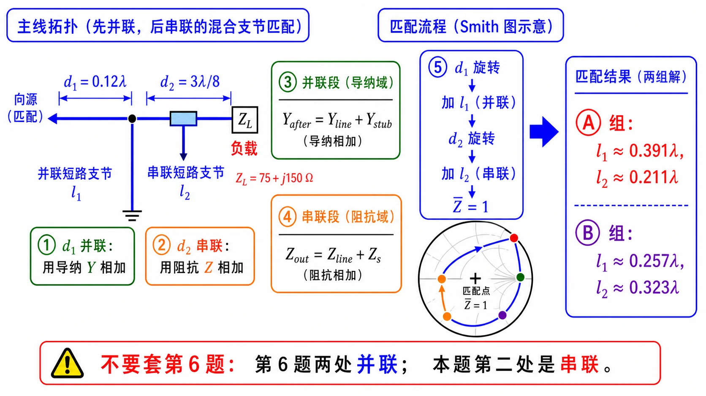

# 第二次作业 · Lec08–09 · 第 7 题

> 对应知识点：[03-并联支节匹配](../../../knowledge/02-反射与匹配/03-并联支节匹配.md)

**导航：** [总目录](../README.md) · [符号与导读](../00-符号与导读.md) · [Lec08–09 总册](README.md) · [Lec06](../01-Lec06.md) · [Lec07](../02-Lec07.md) · [附录](../99-公式与图像.md)

> **说明**：**并联支节**列式与 [第 1 题](第01题.md) 同族；**不可**套用 [第 6 题](第06题.md)「两并联双支节」公式——本题 $d_2$ 处为 **串联** 支节。

---

### 第 7 题

*（对应大纲 **Lec08–09 作业** 第 7 题；该讲教材章节 **§1.6**。）*

#### 题目复述

$Z_L=(75+\mathrm{j}150)\,\Omega$，$Z_c=75\,\Omega$；在 $d_1=0.12\lambda$ 处**并联**短路支节 $l_1$；再沿主线到 $d_2=3\lambda/8$ 处，把短路支节 $l_2$ 与主线**串联**。求 $l_1$、$l_2$。

*图：$d_1$ 处为并联短路线；$d_2$ 处支节与主线**串联**（与第 6 题「两并联支节」不同）。*

*图（辅读）：列式时 **$d_1$ 并联用 $Y$ 相加，$d_2$ 串联用 $Z$ 相加**。*

#### 详细思路

**工程/物理目标**：按上图 **混合拓扑**（$d_1$ **并联**、$d_2$ **串联**）列方程求 $l_1,l_2$，使端口满足匹配；核心纪律是 **并联只动 $Y$、串联只动 $Z$**，不可套用第 6 题「两并联」公式。

1. **并联支节**：结点导纳相加。
2. **串联支节**：在主线串联一阻抗 $Z_s=\mathrm{j}Z_c\tan\beta l_2$（短路线模型），总阻抗为线段输入阻抗与 $Z_s$ 的**串联**（与并联完全不同，须按图中电路顺序写）。

**思路叙述：**

（$d_1$ 处**并联**短路线与 [第 1 题](第01题.md) 同一套；$d_2$ 处**串联**必须用阻抗相加，勿抄并联导纳式。）明确顺序：**自负载起**先到 $d_1$，并联 $l_1$；再沿主线到 $d_2$，**串入** $\mathrm{j}75\tan\beta l_2$；剩余线使端口匹配（或题设要求端口为纯阻等）。列两个方程（实部、虚部）解 $(l_1,l_2)$，或 Smith 圆图分步。

#### 解法一：公式（列式与数值）

#### 一步步解答

**通用列式（与上图拓扑绑定）**

1. 算 **$d_1$ 并联前** 向负载看的 **$Z(d_1^-)$**（或 $\bar Z$），再 **并联短路支节** 得 **$Y_{\mathrm{after1}}$**（导纳相加）。
2. 沿主线变换到 **$d_2$ 串联前** 截面得 **$Z(d_2^-)$**。
3. **串联** 短路支节 **$Z_s=\mathrm{j}Z_c\tan\beta l_2$**，得 **$Z'=Z(d_2^-)+Z_s$**。
4. 端口要求匹配到 **$Z_c$**，在 **归一化** 下写 **$\mathrm{Re}\,\bar Z'=1$**、**$\mathrm{Im}\,\bar Z'=0$**（与 **$\mathrm{Re}\,Z'=Z_c$**、**$\mathrm{Im}\,Z'=0$** 等价）。

**数值推演（拓扑约定：负载 $\to$ 经 $d_1$ 到第一**并联**支节 $\to$ 沿主线经 $d_2=3\lambda/8$ 到第二**串联**支节 $\to$ 向源；端口要求匹配到 $Z_c$，即第二支节后 **$\bar Z=1$**。）**

**（1）$d_1$ 并联前（归一化）** $\bar Z_L=1+\mathrm{j}2$，$\tan\beta d_1=\tan(0.24\pi)\approx 0.93906$：

$$
\bar Z(d_1^-)=\frac{\bar Z_L+\mathrm{j}\tan\beta d_1}{1+\mathrm{j}\bar Z_L\tan\beta d_1}\approx 1.1385-\mathrm{j}2.1295,
$$

$$
\bar Y(d_1^-)=\frac{1}{\bar Z(d_1^-)}\approx 0.19525+\mathrm{j}0.36521.
$$

**（2）第一并联短路支节** 归一化导纳 **$-\mathrm{j}\cot\beta l_1$**，结点相加：

$$
\bar Y_B=0.19525+\mathrm{j}\bigl(0.36521-\cot\beta l_1\bigr),\qquad
\bar Z_B=\frac{1}{\bar Y_B}=a+\mathrm{j}b.
$$

**（3）经 $d_2=3\lambda/8$** 时 **$\beta d_2=3\pi/4$**，**$t_2=\tan\beta d_2=-1$**：

$$
\bar Z_C=\frac{\bar Z_B+\mathrm{j}t_2}{1+\mathrm{j}\bar Z_B t_2}
=\frac{\bar Z_B-\mathrm{j}}{1-\mathrm{j}\bar Z_B}.
$$

**（4）串联第二短路支节** 归一化阻抗 **$\mathrm{j}\tan\beta l_2$**，匹配要求

$$
\bar Z_{\mathrm{out}}=\bar Z_C+\mathrm{j}\tan\beta l_2=1.
$$

先令 **$\mathrm{Re}\,\bar Z_C=1$**（否则仅靠串联纯电抗无法把实部调到 $1$）。把 $\bar Z_B=a+\mathrm{j}b$ 代入 $\bar Z_C=(\bar Z_B-\mathrm{j})/(1-\mathrm{j}\bar Z_B)$，可化得（直接展开即得）

$$
\mathrm{Re}\,\bar Z_C=\frac{2a}{a^2+(b+1)^2}.
$$

令其为 $1$：

$$
2a=a^2+(b+1)^2.
$$

其中 $a,b$ 由 **$\bar Y_B$**（因而由 **$\cot\beta l_1$**）决定；上式是关于 **$\cot\beta l_1$** 的一个实方程，一般可用数值求根（或化为二次式后代入本题具体数）。

**（5）定 $l_2$** 在 **$\mathrm{Re}\,\bar Z_C=1$** 成立后，令 **$\mathrm{Im}\,\bar Z_{\mathrm{out}}=0$**：

$$
\tan\beta l_2=-\,\mathrm{Im}\,\bar Z_C.
$$

**（6）本题数值（与上拓扑一致时）** 常见两组解为：

- **分支 A：** **$l_1\approx 0.391\lambda$**，**$l_2\approx 0.211\lambda$**。
- **分支 B：** **$l_1\approx 0.257\lambda$**，**$l_2\approx 0.323\lambda$**。

（末位因求根步长/舍入略有出入属正常。）

#### 标准解答

- **列式：** $d_1$ **并联** 用 **$Y$ 相加**；到 $d_2$ **串联** 用 **$Z$ 相加**；**不可**把第 6 题「两并联」公式搬来用。
- **数值：** **$(l_1,l_2)$** 可取 **约 $(0.391\lambda,\,0.211\lambda)$** 或 **约 $(0.257\lambda,\,0.323\lambda)$** 两组。

- **检验/注意：** 并联与串联支节不能混用同一公式；先画拓扑再列方程。

#### 解法二：圆图（Smith）

*图：左侧先画清拓扑：$d_1$ 处并联短路支节用导纳相加，$d_2$ 处串联短路支节用阻抗相加；右侧列出按这一路径求得的两组长度。*

**读图说明（零基础）**

- **分段纪律**：**$d_1$ 并联** → 在 **导纳面** 用 **$Y_{\mathrm{tot}}=Y_{\mathrm{line}}+Y_{\mathrm{stub}}$**（外圆调 $l_1$）；**$d_2$ 串联** → 在 **阻抗面** **$\bar Z'=\bar Z_{\mathrm{line}}+\bar Z_s$**，**不可**写成导纳相加。
- **本图作用**：先防止拓扑混淆：**并联段** 与 **Q4/Q5** 同族，必须用导纳；**串联段** 在 Smith 上 **不是** 简单沿等 $|\Gamma|$ 圆走一段外圆，必须回到阻抗域做相加。
- **为何 Smith 不「一眼读完」**：串联电抗在 $\Gamma$ 平面上 **非** 沿外圆的纯电纳轨迹；本题以 **解法一** 列式为主，圆图作 **校验并联 + 线长旋转**。
- **自检**：$d_1$ 并联后导纳实部仍须满足物理可实现；$l_2$ 只进入 **$\mathrm{j}\tan\beta l_2$** 的 **阻抗** 支路。

**圆图操作步骤**

1. **$\bar Z_L=1+\mathrm{j}2$**（$Z_L/Z_c$）；在 **阻抗圆图** 上标负载，**向源** 走 **$d_1=0.12\lambda$** 到 $d_1^-$ 截面读 **$\bar Z$**（或用公式算再图上核对）。
2. **$d_1$ 并联短路支节**：在 **导纳圆图** 上，从 **$\bar Y(d_1^-)$** 出发，支节提供 **纯电纳**，沿 **$g=\text{常数}$** 的竖直方向在导纳面上移动（等价于并联短路点沿外圆取长度 $l_1$），使结点 **$\bar Y$** 变化；读图或列式与 **$Y_{\mathrm{tot}}=Y_{\mathrm{line}}+Y_{\mathrm{stub}}$** 一致。
3. 再沿主线 **向源** 变换到 **$d_2^-$**（阻抗或导纳圆上转相应电长度）。
4. **$d_2$ 串联短路线**：在 **阻抗域** **$\bar Z'=\bar Z(d_2^-)+\bar Z_s$**，**$\bar Z_s=\mathrm{j}\tan\beta l_2$**（归一化）；Smith 上为沿 **实轴平移** 的直观较弱，通常 **在阻抗平面作矢量相加** 或直接用公式解 $(l_1,l_2)$，圆图用于校验 **并联段** 与 **线长旋转** 是否正确。

#### 常见疑惑点

- **疑惑：** 串联支节还能写成 $Y_{\mathrm{tot}}=Y_{\mathrm{line}}+Y_{\mathrm{stub}}$ 吗？**解答：** **不能**。串联是在**阻抗**域相加：$Z'=Z_{\mathrm{line}}+Z_s$；并联才在结点用导纳相加。混用会导致完全错误的方程。
- **疑惑：** $Z_s=\mathrm{j}Z_c\tan\beta l_2$ 何时改成开路支节？**解答：** 若题目明确为开路终端，短路线模型改为 $Z_s=-\mathrm{j}Z_c\cot\beta l_2$，须与题设终端条件一致。
- **疑惑：** 为什么本题比第 6 题更容易混？**解答：** 第 6 题两个支节都并联，统一用导纳相加；本题第一处并联、第二处串联，需要在两个参考面之间切换 **导纳视角** 与 **阻抗视角**。

---

*同讲各题：[1](第01题.md) · [2](第02题.md) · [3](第03题.md) · [4](第04题.md) · [5](第05题.md) · [6](第06题.md) · [7](第07题.md)*

*返回总册：[Lec08–09 总册](README.md)*
