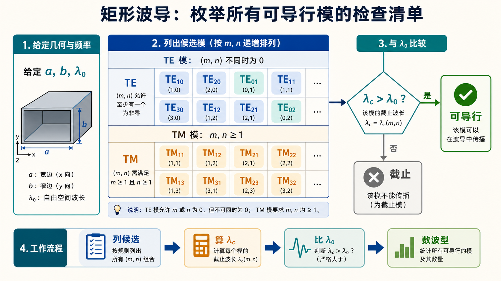

# 第三次作业 · 符号约定与导读

**导航：** [总目录](README.md) · [符号与导读](00-符号与导读.md) · [Lec10–11](01-Lec10-11.md) · [Lec11～12](02-Lec11-12.md) · [Lec13–Lec16](03-Lec13-16/README.md) · [附录](99-公式与图像.md)

---

## 符号约定与读前说明

- **真空光速**记为 $c$（数值计算可取 $c\approx 3.00\times 10^8\,\mathrm{m/s}$）。
- **空气填充**时，若无特别说明，介质近似为 $\varepsilon_{\mathrm r}=1$、$\mu_{\mathrm r}=1$，本征阻抗 $\eta_0=\sqrt{\mu_0/\varepsilon_0}\approx 120\pi\,\Omega$。
- **矩形波导**宽边尺寸 **$a$**、窄边 **$b$**，通常 **$a>b$**；坐标与教材一致（常见为 $x\in[0,a]$、$y\in[0,b]$、$z$ 为传播方向）。
- **工作波长** $\lambda$（或 $\lambda_0$）：无界介质或 TEM 近似下由 $f$ 决定的波长；**空气**中常写 $\lambda_0=c/f$。
- **截止波数** $k_{\mathrm c}$、**截止角频率** $\omega_{\mathrm c}$、**截止频率** $f_{\mathrm c}$、**截止波长** $\lambda_{\mathrm c}$：使某模能在波导内导行（传播常数 $\beta$ 为实数）的最低频率条件；对给定模，$\lambda<\lambda_{\mathrm c}$（或 $f>f_{\mathrm c}$）时该模可传播（具体等式形式以教材为准）。
- **相位常数**（导行波沿 $z$）$\beta$，**波导波长** $\lambda_{\mathrm g}=2\pi/\beta$；无耗时空气填充 $\mathrm{TE}$/$\mathrm{TM}$ 模常用

  $$
  k^2=k_{\mathrm c}^2+\beta^2,\qquad k=\frac{2\pi}{\lambda_0}\sqrt{\varepsilon_{\mathrm r}}
  $$

  （$k$ 为介质中的波数；**$k_{\mathrm c}$** 仅由横截面几何与模指数决定。）
- **相速** $v_{\mathrm p}=\omega/\beta$，**群速** $v_{\mathrm g}=\mathrm d\omega/\mathrm d\beta$；无耗色散媒质中常用关系 $v_{\mathrm p}v_{\mathrm g}=c^2/\varepsilon_{\mathrm r}$（对空气 $\varepsilon_{\mathrm r}=1$ 即 $v_{\mathrm p}v_{\mathrm g}\approx c^2$，以教材推导为准）。
- **波阻抗**：$Z_{\mathrm{TE}}$、$Z_{\mathrm{TM}}$ 记号与教材一致；**$\mathrm{TE}_{10}$** 主模场分量下标 $(E_y,H_x)$ 等以所用教材为准。

### 与「长线理论」章的关系

- 均匀无耗传输线上：$\beta_{\mathrm{line}}=2\pi/\lambda$，反射系数 $|\Gamma|$、驻波比 $\rho$ 的定义与波导中**某一固定模**下沿轴向的驻波现象可类比；但波导中**色散**使 $\beta(\omega)$ 非线性，$\lambda_{\mathrm g}\neq\lambda_0$。
- [第二次作业](../02-圆图与匹配/README.md) 中的 **$z$ 自负载向源**、**并联支节匹配**公式，在 [Lec13–16 第 8 题](03-Lec13-16/README.md) 对 **$\mathrm{TE}_{10}$ 等效传输线** 仍可使用：此时特性阻抗取该模的 **$Z_{\mathrm{TE}}$**，相位常数取 **$\beta$（波导）**，波长取 **$\lambda_{\mathrm g}$**。

### 如何阅读本文

每道计算题推荐顺序：**① 题目复述** → **② 判据与公式** → **③ 代入与数值** → **④ 标准解答（结论）**。Lec13–Lec16 的按题页面与上述对应为：**一、前置知识**；**二、分析思路**；**三、标准解答**；主册为提要和链向分题。**概念题**给出可直接背诵的要点提纲，**推导题**（如 $\mathrm{TM}_{11}$）按教材顺序写「从假设到边界条件」的完整骨架；细节请用教材核对符号。

**题面说明**：具体数值与表述以各题 **「题目复述」** 为准；若与印发材料有出入，以你班最新版为准。

### 本阶段易错速览

- **传播条件**与 **$\lambda_{\mathrm c}$** 的不等式方向：先写对该模的 $\lambda_{\mathrm c}$，再判断 $\lambda<\lambda_{\mathrm c}$ 还是 $f>f_{\mathrm c}$，不要与传输线「低频似稳」直觉混淆。
- **$\mathrm{TE}_{m0}$** 与 **$\mathrm{TM}_{mn}$**：TM 模要求 $m\ge 1,\ n\ge 1$；$\mathrm{TE}_{m0}$ 可存在（$n=0$）。
- **$\mathrm{TE}_{11}$ 与 $\mathrm{TM}_{11}$** 在矩形波导中 **$k_{\mathrm c}$ 相同**，计数「可能存在几种波型」时通常 **各算一种**。
- **$\lambda_{\mathrm g}$、$v_{\mathrm p}$、$v_{\mathrm g}$** 必须按 **该工作频率下** 的 $\beta(\omega)$ 计算；不可把自由空间 $\lambda_0$ 直接当作导行波波长。
- **介质全填充**：$k$ 与 $f_{\mathrm c}$ 同时按 $\sqrt{\varepsilon_{\mathrm r}}$ 缩放，**$\lambda_{\mathrm c}$** 对同一几何同一模往往变为 $\lambda_{\mathrm c,\,air}/\sqrt{\varepsilon_{\mathrm r}}$（以教材为准）。
- **螺钉匹配**（第 8 题）：先确认 **单模** 与等效 **$Z_0$**，再在 $\bar y$ 平面上用 **$g=1$** 条件找接入位置；螺钉提供 **并联电纳**。

### 图像阅读提示

波导图不要只看曲线，要先看三个层次：横截面决定 $k_{\mathrm c}$，频率决定 $\beta$，$\beta$ 再决定 $\lambda_{\mathrm g}$、$v_{\mathrm p}$ 和 $v_{\mathrm g}$。只要抓住这条链，截止、色散、单模范围和匹配题就能统一起来。

---
