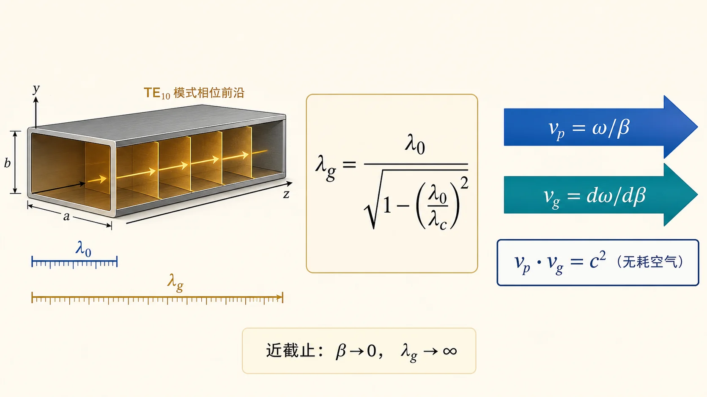
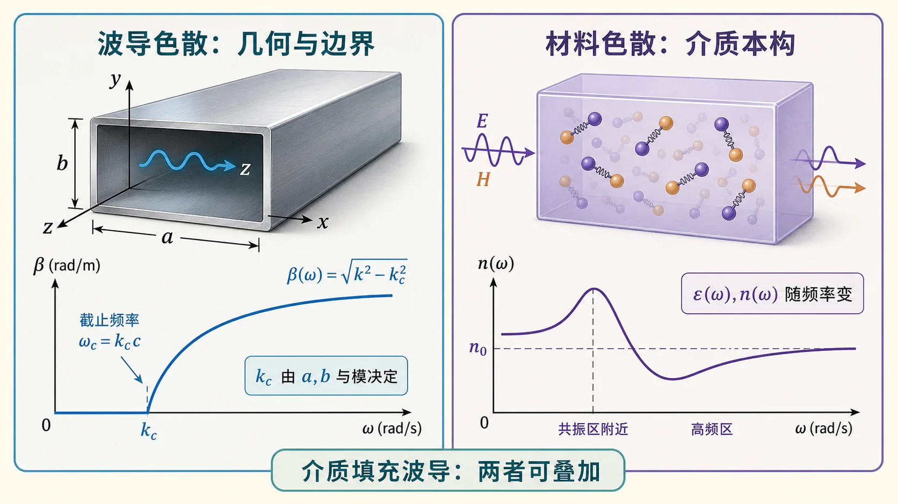
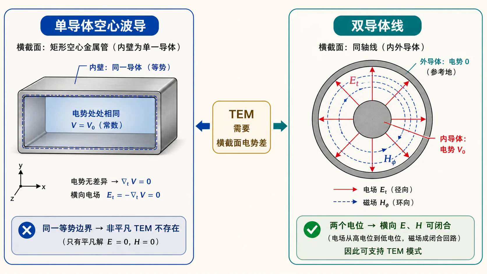

# 第三次作业 · Lec11～12（波导波长与色散、无 TEM）

> 对应知识点：[README](../../knowledge/04-截止色散与速度/README.md)

**导航：** [总目录](README.md) · [符号与导读](00-符号与导读.md) · [Lec10–11](01-Lec10-11.md) · **Lec11～12** · [Lec13–Lec16](03-Lec13-16/README.md) · [附录](99-公式与图像.md)

---

**对应大纲**：Lec11～12；教材：北理工 §2.2，华科 §2.2。

---

## 作业 1）工作波长、截止波长、波导波长：含义、关系与区别

下面三个「波长」**量纲相同**（都是长度），但**物理对象不同**：$\lambda_0$ 描述**你在多高的频率上工作**；$\lambda_{\mathrm c}$ 描述**这一几何、这一模能不能传**；$\lambda_{\mathrm g}$ 描述**一旦能传，沿管子轴向相位重复有多「稀」**。答题时先**分别定义**，再写**色散关系**把它们连起来。

先把三种长度放在不同“位置”理解：$\lambda_0$ 属于工作频率，$\lambda_{\mathrm c}$ 属于几何门槛，$\lambda_{\mathrm g}$ 属于已经导行后的轴向相位。这样后面算波节距或螺钉位置时，就不会误用 $\lambda_0$。

---

### （1）工作波长 $\lambda_0$（常记 $\lambda$，作业与教材也常混用记号）

**含义**：由**工作频率** $f$ 与**填充介质**中平面波的相速共同决定的空间周期。在**空气**（$\varepsilon_{\mathrm r}\approx 1$）中常写

$$
\lambda_0=\frac{c}{f},\qquad c\approx 3\times 10^8\,\mathrm{m/s}.
$$

**前置知识（与本题「工作波长」一句有关）**：下面两个记号在**空气**里常不出现，但一旦题目改成**介质填充**或比较「真空 / 空气 / 介质」尺度，就要用到。

**① 相对介电常数 $\varepsilon_{\mathrm r}$ 与假定 $\mu_{\mathrm r}=1$**  
- **$\varepsilon_{\mathrm r}$**：介质相对**真空**的介电常数之比，$\varepsilon=\varepsilon_{\mathrm r}\varepsilon_0$，**无量纲**；真空 $\varepsilon_{\mathrm r}=1$，一般电介质 $\varepsilon_{\mathrm r}>1$（微波工程里常见几到十几）。它决定介质中的**波数** $k=\omega\sqrt{\mu\varepsilon}$ 比真空大多少。  
- **$\mu_{\mathrm r}=1$**：假定介质**非磁性**（$\mu=\mu_0$），许多**电介质**在微波频段可这样近似；若 $\mu_{\mathrm r}\neq 1$，则 $k=\omega\sqrt{\mu_0\varepsilon_0}\sqrt{\mu_{\mathrm r}\varepsilon_{\mathrm r}}=k_0\sqrt{\mu_{\mathrm r}\varepsilon_{\mathrm r}}$，下文要同时保留 $\mu_{\mathrm r}$。

**② 无界介质中的波长 $\lambda$ 与 $\lambda_0$ 的关系（在 $\mu_{\mathrm r}=1$ 时）**  
时谐平面波在均匀介质中的波数 $k=\omega\sqrt{\mu_0\varepsilon_0\varepsilon_{\mathrm r}}=k_0\sqrt{\varepsilon_{\mathrm r}}$，而 $k=2\pi/\lambda$，$k_0=2\pi/\lambda_0$（同一频率 $f$ 下真空中的波长记为 $\lambda_0=c/f$）。两式相除得

$$
\frac{2\pi}{\lambda}=\frac{2\pi}{\lambda_0}\sqrt{\varepsilon_{\mathrm r}}
\quad\Rightarrow\quad
\lambda=\frac{\lambda_0}{\sqrt{\varepsilon_{\mathrm r}}}.
$$

即：**同一频率下，介质中的波长比真空（或空气，$\varepsilon_{\mathrm r}\approx 1$）更短**，因为相速 $v_{\mathrm p}=\omega/k=c/\sqrt{\varepsilon_{\mathrm r}}$ 变小。

**与本题的关系**：本题主干用**空气**时，取 $\varepsilon_{\mathrm r}\approx 1$，工作波长就写成 $\lambda_0=c/f$ 即可。若作业或考试问「**介质填充波导**中的工作波长 / 波数」，应先把 $k$ 换成 $k_0\sqrt{\varepsilon_{\mathrm r}}$（及相应的 $\lambda$），再代入 $k^2=k_{\mathrm c}^2+\beta^2$ 讨论 $\lambda_{\mathrm g}$、截止等——**概念结构不变，只是把「无界介质里的 $k,\lambda$」从真空换到介质**。

**要点**：$\lambda_0$ 是「**无界均匀介质**里、与 $f$ 配套」的尺度；它**不是**波导轴线上相邻等相位面间距。波导里沿 $z$ 的相位周期由 **$\lambda_{\mathrm g}$** 描述。

---

### （2）截止波长 $\lambda_{\mathrm c}$（对某一固定模 $\mathrm{TE}_{mn}$ 或 $\mathrm{TM}_{mn}$）

**含义**：该模**刚好能导行**（传播常数 $\beta=0$）时，与**截止频率** $f_{\mathrm c}$ **对应**的空间尺度。与截止波数 $k_{\mathrm c}$ 的关系为

$$
\lambda_{\mathrm c}=\frac{2\pi}{k_{\mathrm c}},\qquad
f_{\mathrm c}=\frac{c\,k_{\mathrm c}}{2\pi}\ \text{（空气近似）}.
$$

**矩形波导**：$k_{\mathrm c}=\sqrt{(m\pi/a)^2+(n\pi/b)^2}$，故 **$\lambda_{\mathrm c}$ 只与截面尺寸 $a,b$ 与模指数 $(m,n)$ 有关**，与当前工作频率**无直接关系**（同一波导、不同模有不同 $\lambda_{\mathrm c}$）。

**导行条件**（与作业、第三次作业附录一致）：该模能远距离导行当且仅当 **$\beta$ 为实数**，等价于（无耗均匀填充）

$$
k>k_{\mathrm c}
\quad\Longleftrightarrow\quad
\lambda_0<\lambda_{\mathrm c}
\quad\Longleftrightarrow\quad
f>f_{\mathrm c}.
$$

若 **$\lambda_0>\lambda_{\mathrm c}$**（或 $f<f_{\mathrm c}$），则 $\beta$ 为虚数，场沿 $z$ **指数衰减**，该模**截止**，不能作为导行模远距离传输。

---

### （3）波导波长 $\lambda_{\mathrm g}$

**含义**：**导行波**沿波导**轴线**（常取 $z$）传播时，相位变化 $2\pi$ 所经过的距离，即轴向相位常数 $\beta$ 所对应的波长：

$$
\lambda_{\mathrm g}=\frac{2\pi}{\beta}.
$$

**与 $\lambda_0,\lambda_{\mathrm c}$ 的关系（空气、无耗）**：由色散 $k^2=k_{\mathrm c}^2+\beta^2$ 及 $k=2\pi/\lambda_0$ 得

$$
\beta=\frac{2\pi}{\lambda_0}\sqrt{1-\left(\frac{\lambda_0}{\lambda_{\mathrm c}}\right)^2},
\qquad
\lambda_{\mathrm g}=\frac{\lambda_0}{\sqrt{1-(\lambda_0/\lambda_{\mathrm c})^2}}.
$$

在**可导行**区间 $0<\lambda_0<\lambda_{\mathrm c}$ 内，根号为正实数，且 **$\lambda_{\mathrm g}>\lambda_0$**（波导内轴向相位重复比自由空间「更稀」）。

**近截止**：$\lambda_0\to\lambda_{\mathrm c}^-$ 时 $\beta\to 0^+$，故 **$\lambda_{\mathrm g}\to\infty$**；此时相速 $v_{\mathrm p}=\omega/\beta\to\infty$（理想无耗模型下的极限，物理上见教材对能量速度与损耗的讨论）。

---

### （4）三者对照（答题可直接复述）

| 名称 | 由谁决定 | 一句话 |
|------|----------|--------|
| **工作波长** $\lambda_0$ | 工作频率 $f$、介质 | 「这一工作点」在无界介质中的波长尺度。 |
| **截止波长** $\lambda_{\mathrm c}$ | 截面几何 $a,b$、模 $(m,n)$ | 「这一模能不能传」的临界波长；$\lambda_0<\lambda_{\mathrm c}$ 才能导行。 |
| **波导波长** $\lambda_{\mathrm g}$ | $\lambda_0$ 与 $\lambda_{\mathrm c}$ 通过 $\beta$ 耦合 | 「能传之后」沿轴向的相位重复距离；一般 $\lambda_{\mathrm g}>\lambda_0$。 |

**易错点**：不要把 $\lambda_0$ 当成沿波导轴线画驻波/行波时的间距；计算**轴向电长度**、**螺钉位置**等应用 **$\lambda_{\mathrm g}$**（见第三次作业 Lec13–16 与附录）。

---

## 作业 1 的延伸）色散：含义、成因、影响

**色散**：传播常数 $\beta$ 对频率 $\omega$ **非线性**（$\beta(\omega)$ 不是 $\omega/c$ 的简单比例），导致不同频率分量相速不同。

**波导中的成因**：导行条件使 $\beta=\sqrt{k^2-k_{\mathrm c}^2}$，其中 $k=\omega/c$（空气）而 $k_{\mathrm c}$ 与 $\omega$ 无关；因而 $v_{\mathrm p}=\omega/\beta$ 随 $\omega$ 变化。

**影响**：窄脉冲（宽频谱）在波导中传播会**展宽**；能量传播速度用群速 $v_{\mathrm g}=\mathrm d\omega/\mathrm d\beta$ 描述，且与 $v_{\mathrm p}$ 满足教材给出的关系（无耗空气填充时常用 $v_{\mathrm p}v_{\mathrm g}\approx c^2$）。

---

## 作业 1 的延伸）微波波导色散 vs 光学材料色散

- **波导（结构）色散**：源于**边界约束**与几何色散关系 $\beta=\sqrt{k^2-k_{\mathrm c}^2}$；即使介质 $\varepsilon$ 为常数仍存在。
- **光学材料色散**：常指 **$\varepsilon(\omega)$** 或折射率 $n(\omega)$ 随频率变化（电子共振等微观机制），在**无界介质或 TEM 线**中也会出现。

**本质**：前者是**模式与几何**导致的色散；后者是**材料本构**的频率色散。二者可**同时存在**（例如介质填充波导）。

---

## 作业 2）为什么单导体型波导不能传输 TEM 波？

**要点 1（静电）**：TEM 要求横截面内存在满足 Laplace 方程且周界为等势的**二维静电势**解，使电场、磁场均在横截面内闭合。

**要点 2（拓扑）**：对**单连通**空心导体管内壁为同一等势面时，腔内拉普拉斯解退化为**常数势**，横截面内**无电场**，从而也不存在与之正交的横向磁场结构来维持沿 $z$ 的功率流。

**要点 3（对比）**：同轴线与平行双导线等**双导体**结构允许非平凡二维势分布，因而可支持 TEM。

（表述可与教材「单连通区域内调和函数极值原理」版本等价替换。）

---

*若课堂强调「$k_{\mathrm c}=0$ 的 TEM 与空心波导边界条件矛盾」角度，见本站 [04 · 空心波导无 TEM](../knowledge/04-截止色散与速度/04-为什么空心波导没有TEM.md)。*
