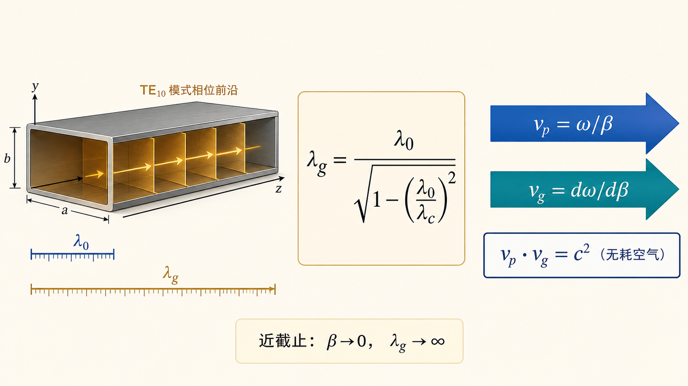

# 第三次作业 · Lec13–Lec16（矩形波导计算与综合）

**导航：** [总目录](../README.md) · [符号与导读](../00-符号与导读.md) · [Lec10–11](../01-Lec10-11.md) · [Lec11～12](../02-Lec11-12.md) · **Lec13–Lec16** · [**1**](第01题.md) · [**2**](第02题.md) · [**3**](第03题.md) · [**4**](第04题.md) · [**5**](第05题.md) · [**6**](第06题.md) · [**7**](第07题.md) · [**8**](第08题.md) · [**9**](第09题.md) · [**10**](第10题.md) · [**11**](第11题.md) · [**12**](第12题.md) · [附录](../99-公式与图像.md)

---

**对应大纲**：Lec13–Lec16；教材：北理工 §2.3，华科 §2.3。  
**说明**：第 10～12 题为**选做**；数值保留与教材例题风格一致的有效数字。

记 **$a$** 为宽边、**$b$** 为窄边（$a>b$）。空气填充时 $k=2\pi/\lambda_0=\omega/c$。矩形波导 $\mathrm{TE}_{mn}$/$\mathrm{TM}_{mn}$（TM 要求 $m,n\ge 1$）：

$$
k_{\mathrm c}=\sqrt{\left(\frac{m\pi}{a}\right)^2+\left(\frac{n\pi}{b}\right)^2},\quad
\lambda_{\mathrm c}=\frac{2\pi}{k_{\mathrm c}},\quad
f_{\mathrm c}=\frac{c\,k_{\mathrm c}}{2\pi}.
$$

某模可导行（$\beta$ 为实数）当且仅当 $\lambda_0<\lambda_{\mathrm c}$（等价 $f>f_{\mathrm c}$）。全填充 $\varepsilon_{\mathrm r}>1,\ \mu_{\mathrm r}=1$ 时，$k=k_0\sqrt{\varepsilon_{\mathrm r}}$，且 $f_{\mathrm c}$ 按同一因子变为 $f_{\mathrm c,\,air}/\sqrt{\varepsilon_{\mathrm r}}$（与教材推导一致）。

---

## 分题体例

各题**完整**书写（**一、前置知识**；**二、分析思路**；**三、标准解答**；必要时**四、衔接**；并含 **《图示》** 一节。以下为主册**提要**与**链向**（主册不重复贴全图）。

---

## 第 1 题：只传输 $\mathrm{TE}_{10}$ 的尺寸条件（空气 / 介质）

- **要点**：**只传** $\mathrm{TE}_{10}$ 需**同时**主模**导行**（$\lambda_0<2a$）与**各竞争模不导行**；空气下**下界**为 $\max\{a,2b,\,\lambda_{\mathrm c,11},\ldots\}\le\lambda_0$（**不能**不核对就仅写 $a<\lambda_0<2a$）。**BJ-100** 常 **$2b<a$**，$\max$ **须代入** $a,b$ 验证。全填充时 **$k_\mathrm c$ 不变**，**$f_\mathrm c,\,\lambda_\mathrm c$** 均**除以** $\sqrt{\varepsilon_\mathrm r}$，**所有模同步缩放**。

- **完整版**：[第三次作业解答-Lec13-16-第1题.md](第01题.md)

---

## 第 2 题：$f=10\,\mathrm{GHz}$ 只传 $\mathrm{TE}_{10}$ 与 $\lambda_{\mathrm g},v_{\mathrm p},v_{\mathrm g}$

- **要点**：**WR-90** 上 **10 GHz** 对竞争模**逐** $\lambda_\mathrm c$ 核对**单模**后，$\lambda_\mathrm{g},\,v_\mathrm p,\,v_\mathrm g$ 仅按 $\mathrm{TE}_{10}$ 计算；$v_\mathrm p v_\mathrm g\approx c^2$ 验算。

- **完整版**：[第2题](第02题.md)

---

## 第 3 题：$10\times 6\,\mathrm{mm^2}$ 的 $\mathrm{TE}_{10}$、$\mathrm{TE}_{20}$、$\mathrm{TE}_{21}$ 的 $f_\mathrm c$

- **要点**：$f_\mathrm c=\dfrac{c}{2\pi}\sqrt{(m\pi/a)^2+(n\pi/b)^2}$，代 $(1,0),(2,0),(2,1)$。

- **完整版**：[第3题](第03题.md)

---

## 第 4 题：BJ-100、$\lambda_0=18\,\mathrm{mm}$，几种波型？

- **要点**：$\lambda_0<\lambda_\mathrm c$ 即**可**导行；$\mathrm{TE}_{11}$ 与 $\mathrm{TM}_{11}$ **分计** → **5** 种。

- **完整版**：[第4题](第04题.md)

---

## 第 5 题：两尺寸、四波长

- **要点**：（1）小波导**逐$\lambda_0$** 判**能否传**、列**可能模**；（2）大波导**14/38** 为**全枚举**结果，**答卷**应附**模式清单**或说明截断。

- **完整版**：[第5题](第05题.md)

---

## 第 6 题：BJ-100 的 $\lambda_\mathrm c$ 表与**只**传 $\mathrm{TE}_{10}$ 的窗

- **要点**：$\max\{a,2b,\lambda_{\mathrm c,11}\}$ 在 BJ-100 上**合成**的**严格**单模常写 **$\,22.86\,\mathrm{mm}<\lambda_0<45.72\,\mathrm{mm}$**；下界在标准比例下**来自** $\lambda_{\mathrm c,20}=a$；**且** 因 **$2b<a$**，在此开区间内**已**自动有 $\lambda_0>2b$ 等，$\mathrm{TE}_{01}$ 等**不导行**（见**分题**表）。

- **完整版**：[第6题](第06题.md)

---

## 第 7 题：相邻波节距 $22.40\,\mathrm{mm}\Rightarrow\lambda_\mathrm g$

- **要点**：$\lambda_\mathrm g=2\times$**(相邻波节距)**，**非** $\lambda_0/2$。

- **完整版**：[第7题](第07题.md)

---

## 第 8 题：BJ-100、驻波、第一波节、单螺钉

- **要点**：$\rho\to|\Gamma|$；$\lambda_\mathrm{g},\beta$；$\bar Y_L$；$\,d,b_{\mathrm{stub}}$（有**多解**取近负载）。

- **完整版**：[第8题](第08题.md)

---

## 第 9 题：$1\,\mathrm{m}$、$\bar Z_L=0.5$、$\rho$ 与**行波**

- **要点**：$\rho=2$；**无耗**下 $|\Gamma|,\rho$ **横截面不变**；行波=**匹配**措施。

- **完整版**：[第9题](第09题.md)

---

## 第 10 题（选做）：$72.14\times 34.04$、$6\,\mathrm{GHz}$ 可导行模

- **要点**：$\lambda_0\approx 50\,\mathrm{mm}$ 下 **5** 模，同第4、5(2) **枚举**规则。

- **完整版**：[第10题](第10题.md)

---

## 第 11 题（选做）：**能传**主模 与 **严格**单模 的**口语**辨析

- **要点**：$\lambda_0<46\,\mathrm{mm}$ 等**过宽**说法**不**能替代第6题窗；**严格**同 **$22.86<\lambda_0<45.72$ mm**（BJ-100）。

- **完整版**：[第11题](第11题.md)

---

## 第 12 题（选做）：击穿**量级**

- **要点**：$P_\mathrm{max}\sim\mathrm{MW}$ **依教材系数/场定义**；**定稿**以教材**公式**为准。

- **完整版**：[第12题](第12题.md)

---

*图：$\mathrm{TE}_{10}$ 色散曲线用于检查截止附近 $\lambda_{\mathrm g}$、$v_{\mathrm p}$、$v_{\mathrm g}$ 的极限趋势。*
