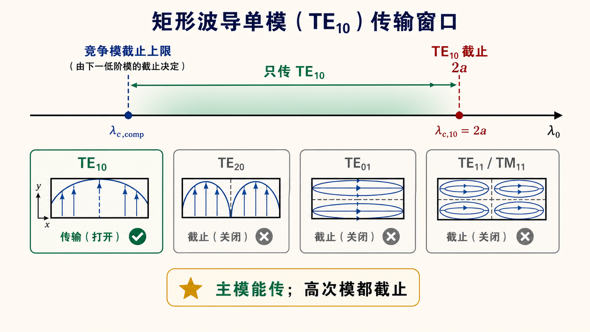

# 第三次作业（Lec13–16）第 1 题：只传输 $\mathrm{TE}_{10}$ 的尺寸条件

**题意**（与主册一致）：在矩形波导中（宽边 $a$、窄边 $b$，$a>b$），导出**只传输** $\mathrm{TE}_{10}$ 时，工作波长 $\lambda_0$（或工作频率 $f$）与 $a$、$b$ 应满足的关系；分**空气**与**全填充电介质**（$\mu_{\mathrm{r}}=1$、$\varepsilon_{\mathrm{r}}>1$）说明。

**导航：** [总目录](../README.md) · [符号与导读](../00-符号与导读.md) · [Lec10–11](../01-Lec10-11.md) · [Lec11～12](../02-Lec11-12.md) · [Lec13–Lec16 主册](README.md) · **分题** [**1**](第01题.md) · [**2**](第02题.md) · [**3**](第03题.md) · [**4**](第04题.md) · [**5**](第05题.md) · [**6**](第06题.md) · [**7**](第07题.md) · [**8**](第08题.md) · [**9**](第09题.md) · [**10**](第10题.md) · [**11**](第11题.md) · [**12**](第12题.md) · **下一题** [第2题](第02题.md) · [附录](../99-公式与图像.md)

---

## 一、前置知识

### 1. 专有名词

- **矩形波导**：横截面为矩形的**理想金属**波导，导行方向取为 $z$。记**宽边**为 $a$、**窄边**为 $b$，常设 **$a>b$**。  
- **$\mathrm{TE}_{mn}$ / $\mathrm{TM}_{mn}$**：横截面上场随 $x,y$ 取驻波，整数 **$m,n$** 为沿 $a,b$ 的“半正弦”**半周数**。$\mathrm{TM}_{mn}$ 要求 **$m,n\ge 1$**；$\mathrm{TE}_{mn}$ 允许 **$m$ 或 $n$** 为 0，但**不同时为 0**。  
- **截止与导行**：**截止波数** $k_\mathrm{c}$、**截止波长** $\lambda_\mathrm{c}$、**截止频率** $f_\mathrm{c}$ 只由**截面几何**与 $(m,n)$ 决定。无耗时某模**能导行**当且仅当 **$\beta$** 为**实数**；空气填充时常写 **$\lambda_0<\lambda_{\mathrm c}$** 或 **$f>f_\mathrm{c}$**。  
- **主模 / 高次模 / 竞争模**：$\mathrm{TE}_{10}$ 的 $\lambda_{\mathrm{c},10}=2a$ 在常见排序中**最大**，为**主模**；$\mathrm{TE}_{20}$ 等称**高次模**；列**只传** $\mathrm{TE}_{10}$ 时须与主模**竞争导行**的低次、高次模称**竞争模**（本题记 $\mathrm{TE}_{20}$、$\mathrm{TE}_{01}$、$\mathrm{TE}_{11}/\mathrm{TM}_{11}$ 等）。  
- **简并**：$\mathrm{TE}_{11}$ 与 $\mathrm{TM}_{11}$ **有相同** $k_\mathrm{c}$（$\lambda_\mathrm{c}$ 同值），是两种**场分布不同**的波型。  
- **全填充电介质**：$\mu_{\mathrm{r}}=1$、$\varepsilon_{\mathrm{r}}>1$ 时，体区内**波数** **$k=k_0\sqrt{\varepsilon_{\mathrm{r}}}$**；**横截面本征问题**与空气相同，故 **$k_{\mathrm{c},mn}$ 与几何有关而与 $\varepsilon_\mathrm{r}$ 无直接关系**（仍由 $a,b,m,n$ 决定）。

### 2. 核心公式（含义与在题中角色）

- **本征值与截止**  
  $k_{\mathrm{c},mn} = \sqrt{\left(m\pi/a\right)^2 + \left(n\pi/b\right)^2}$；$\lambda_{\mathrm{c},mn} = 2\pi/k_{\mathrm{c},mn}$。**角色**：用 $\lambda_0$ 与 $\lambda_{\mathrm{c},mn}$ 比较，判断**该 $(m,n)$ 模是否导行**。

- **导行/不导行（空气）**  
  **导行** $\Leftrightarrow \lambda_0 < \lambda_{\mathrm{c},mn} \Leftrightarrow f>f_{\mathrm{c},mn}$（等价的 $f$ 判据在第三节）。**不导行**时作业常写 **$\lambda_0 \ge \lambda_{\mathrm{c},mn}$**（**恰为截止**是否取等以教材为准；开区间**内部**结论不受影响）。

- **典型竞争模的 $\lambda_\mathrm{c}$**（见第三节推导）**  
  $\lambda_{\mathrm{c},20}=a$；$\lambda_{\mathrm{c},01}=2b$；$\lambda_{\mathrm{c},11}^{(\mathrm{TE})}=\lambda_{\mathrm{c},11}^{(\mathrm{TM})}=2\big/\sqrt{1/a^2+1/b^2}$。**角色**：与 $\lambda_{\mathrm{c},10}=2a$ 联立，得到**只传** $\mathrm{TE}_{10}$ 的**下界/上界**或 $\max\{\cdot\}$ 合并不等式。

- **全填充时截止量的缩放**  
  **$f_{\mathrm{c},mn,\varepsilon} = f_{\mathrm{c},mn,\mathrm{air}}/\sqrt{\varepsilon_{\mathrm{r}}}$**，**$ \lambda_{\mathrm{c},mn,\varepsilon} = \lambda_{\mathrm{c},mn,\mathrm{air}}/\sqrt{\varepsilon_{\mathrm{r}}}$**。**角色**：同一几何下介质使**各模**截止频率**同步**变低/截止波长**同步**变短；**不能只缩放** $\mathrm{TE}_{10}$ 的截止量。

**列不等式与合并不等式的逻辑**见**第二节**；**完整书写**见**第三节**。

---

## 二、分析思路

**1. 把「只传 $\mathrm{TE}_{10}$」拆成两条逻辑**

- **要传的**：主模 $\mathrm{TE}_{10}$ 必须处于**导行**状态。  
- **不要传的**：除 $\mathrm{TE}_{10}$ 外，凡横截面上**可能出现的**低次、高次模，都必须**不导行**（在截止区一侧）。

不能只凭「$\mathrm{TE}_{10}$ 能传」就结束，**必须**与**紧邻主模的若干高次模**比截止波长，写成不等式组。

**2. 用哪条充要条件**

均匀填充、无耗时，某 $(m,n)$ 模**能导行**的充要条件为

$$
\beta_{mn} = \sqrt{k^2 - k_{\mathrm{c},mn}^2}\ \text{为实数}
\;\Leftrightarrow\;
\lambda_0 < \lambda_{\mathrm{c},mn}
\;\Leftrightarrow\;
f > f_{\mathrm{c},mn}.
$$

**不导行**则取反向（作业里常写 $\lambda_0 \ge \lambda_{\mathrm{c},mn}$ 表示该模不传播；端点“恰为截止”是否允许以教材为准，**区间内部**的写法不受影响）。

**3. 先写 $k_{\mathrm{c}}$ 再点名列竞争模**

矩形波导

$$
k_{\mathrm{c},mn} = \sqrt{\left(\frac{m\pi}{a}\right)^2 + \left(\frac{n\pi}{b}\right)^2},
\qquad
\lambda_{\mathrm{c},mn} = \frac{2\pi}{k_{\mathrm{c},mn}}.
$$

在 $a>b$ 下，**最先需要核对**的往往是（除 $\mathrm{TE}_{10}$ 外）：

- $\mathrm{TE}_{20}$：$\lambda_{\mathrm{c},20}=a$；
- $\mathrm{TE}_{01}$：$\lambda_{\mathrm{c},01}=2b$；
- $\mathrm{TE}_{11}$ 与 $\mathrm{TM}_{11}$：同一 $k_{\mathrm{c}}$（简并），

$$
\lambda_{\mathrm{c},11} = \frac{2}{\sqrt{\dfrac{1}{a^2}+\dfrac{1}{b^2}}}.
$$

**$a$ 与 $2b$、与 $\lambda_{\mathrm{c},11}$ 谁大谁小**决定哪一条不等式**最紧**（最先把单模区「掐窄」），因此一般不能只背一个 $a<\lambda_0<2a$，而要**会列完整不等式**再**合并**；若 $2b\ll a$ 且已验证 $\lambda_{\mathrm{c},11}$ 不紧，才常用 $a<\lambda_0<2a$ 的简化写法。

**4. 全填充 $\varepsilon_{\mathrm{r}}$ 时多一步**

- **几何不变** $\Rightarrow$ $k_{\mathrm{c},mn}$ **不变**（与 $\varepsilon_{\mathrm{r}}$ 无关）。  
- 体区内**波数** $k = k_0\sqrt{\varepsilon_{\mathrm{r}}}$，故各模

$$
f_{\mathrm{c},mn,\varepsilon} = \frac{f_{\mathrm{c},mn,\mathrm{air}}}{\sqrt{\varepsilon_{\mathrm{r}}}},
\qquad
\lambda_{\mathrm{c},mn,\varepsilon} = \frac{\lambda_{\mathrm{c},mn,\mathrm{air}}}{\sqrt{\varepsilon_{\mathrm{r}}}}.
$$

**同几何、同 $f$ 或同 $\lambda_0$ 下**更容易满足「$\lambda_0 < \lambda_{\mathrm{c}}$」，高次模更易被**激发**，**单模工作区相对空气变窄**；列式时应对**所有**相关模的 $f_{\mathrm{c}}$ 或 $\lambda_{\mathrm{c}}$ **同步**缩放，不能只缩放主模。

---

## 三、标准解答

**解：**

**（1）记号线与主模、高次模的截止关系**

设宽边为 $a$、窄边为 $b$，$a>b$，**空气**填充时 $k=2\pi/\lambda_0=\omega/c$。矩形波导 $\mathrm{TE}_{mn}$、$\mathrm{TM}_{mn}$ 的截止波数

$$
k_{\mathrm{c},mn} = \sqrt{\left(\frac{m\pi}{a}\right)^2 + \left(\frac{n\pi}{b}\right)^2},
\qquad
\lambda_{\mathrm{c},mn} = \frac{2\pi}{k_{\mathrm{c},mn}}.
$$

「只传输 $\mathrm{TE}_{10}$」等价于：

- $\mathrm{TE}_{10}$ 导行：

$$
\lambda_0 < \lambda_{\mathrm{c},10} = 2a;
$$

- 对其余至少需考虑的模（如 $\mathrm{TE}_{20}$、$\mathrm{TE}_{01}$、$\mathrm{TE}_{11}$、$\mathrm{TM}_{11}$ 等）均不导行：

$$
\lambda_0 \ge \lambda_{\mathrm{c},mn}
\quad
\text{（对每一个这样的 }(m,n)\text{）}.
$$

其中

$$
\lambda_{\mathrm{c},20}=a,\quad
\lambda_{\mathrm{c},01}=2b,\quad
\lambda_{\mathrm{c},11}^{(\mathrm{TE})}=\lambda_{\mathrm{c},11}^{(\mathrm{TM})}=
\frac{2}{\sqrt{\dfrac{1}{a^2}+\dfrac{1}{b^2}}}.
$$

**（2）空气填充：合并不等式**

由 $\mathrm{TE}_{10}$ 与「$\mathrm{TE}_{20}$ 不导行」得

$$
a \le \lambda_0 < 2a
\quad
\text{（若要求严格在通带内，常写 } a<\lambda_0<2a\text{）}.
$$

要同时**不让** $\mathrm{TE}_{01}$、$\mathrm{TE}_{11}/\mathrm{TM}_{11}$ 导行，需

$$
\lambda_0 \ge 2b,\qquad
\lambda_0 \ge \frac{2}{\sqrt{\dfrac{1}{a^2}+\dfrac{1}{b^2}}}.
$$

**因此** 单看波长时，下界为上述各截止波长中的**最大者**：

$$
\boxed{
\max\left\{
a, 2b, \frac{2}{\sqrt{\dfrac{1}{a^2}+\dfrac{1}{b^2}}}, \ldots
\right\}
\;\le\; \lambda_0\; <\; 2a
}
$$

（若还需排除更高次模，在 $\max\{\cdot\}$ 中继续补项；直到所有可能低于 $\lambda_{\mathrm{c},10}$ 的模都列入。）

在**标准矩形波导**常见比例 **$2b < a$**（如 **BJ-100 / WR-90**：$a=22.86\,\mathrm{mm},\,b=10.16\,\mathrm{mm}$，$2b=20.32\,\mathrm{mm}<a$）时，有

- $2b < a$，故当 $\lambda_0 \ge a$ 时已自动满足 $\lambda_0 \ge 2b$；  
- 对该类尺寸再比较 $a$ 与 $\lambda_{\mathrm{c},11}$，常有 $\lambda_{\mathrm{c},11} < a$，故 $\max\{a,2b,\lambda_{\mathrm{c},11}\}=a$（**须代入验证**；不同 $a/b$ 时 $\max$ 可改为 $2b$ 或其它项，**不能**默认下界是 $a$）。

若 **$2b \ge a$**（窄边相对较宽），则「$\lambda_0 \ge 2b$」可能比「$\lambda_0 \ge a$」**更严**，工作波长带**不能**用 $a<\lambda_0<2a$ 代替，**必须以**前面 $\max\{\cdot\} \le \lambda_0 < 2a$ 为准。

于是**仅由主模与紧邻高次模常写**为

$$
\boxed{a < \lambda_0 < 2a}
$$

（**答卷建议**：写出上式**之前**点明已核对 $2b$、$\lambda_{\mathrm{c},11}$ 等，避免被扣分。）

**（3）全填充：$\varepsilon_{\mathrm{r}}>1$，$\mu_{\mathrm{r}}=1$**

$k_{\mathrm{c},mn}$ 仍由 $a$、$b$、$m$、$n$ 决定，**与空气相同**。填充后

$$
f_{\mathrm{c},mn,\varepsilon} = \frac{f_{\mathrm{c},mn,\mathrm{air}}}{\sqrt{\varepsilon_{\mathrm{r}}}},
\qquad
\lambda_{\mathrm{c},mn,\varepsilon} = \frac{\lambda_{\mathrm{c},mn,\mathrm{air}}}{\sqrt{\varepsilon_{\mathrm{r}}}}.
$$

「只传 $\mathrm{TE}_{10}$」在**以频率表述**时：$\mathrm{TE}_{10}$ 导行而其余模不导行，即

$$
f_{\mathrm{c},10,\varepsilon} < f,\qquad
f \le f_{\mathrm{c},mn,\varepsilon}
\quad
\text{对其它相关 }(m,n)
$$

（具体边界的开闭依课程约定）；或统一换成 $\lambda_0$ 与**缩放后的**各 $\lambda_{\mathrm{c},mn,\varepsilon}$ 书写同一组不等式。

**物理解释**：在**同一波导尺寸**下，**$\varepsilon_{\mathrm{r}}$ 增大**使各模**截止频率降低**，在固定 $f$ 下更易出现**多模**，**单模工作区变窄**。

> **列式注意**：在空气中先算得各模的 $f_{\mathrm{c},mn}$ 或 $\lambda_{\mathrm{c},mn}$，全填充时一律按 $\displaystyle\frac{1}{\sqrt{\varepsilon_{\mathrm{r}}}}$ 比例缩放，再与（2）中同一套单模不等式联立，勿只缩放主模。

**（4）本题的结论性表述（可写在卷末）**

- **空气**：主模能传 + 所列举高次模均不能传，得到 $\lambda_0$（或 $a,b$ 与 $f$）的不等式组；典型 $2b<a$ 时主波长带常简写为 $a<\lambda_0<2a$，**须补一句**已核对 $\mathrm{TE}_{11}$ 等。  
- **全介质**：$k_{\mathrm{c}}$ 不变，$f_{\mathrm{c}}$、$\lambda_{\mathrm{c}}$ 同除以 $\sqrt{\varepsilon_{\mathrm{r}}}$ 后，重复上述**同一套**单模判据。

## 图示

*图：阴影区为「主模能传且所列竞争模不导行」的 $\lambda_0$ 开区间在数轴上的位置；下界为 $\max\{a,2b,\lambda_{\mathrm{c},11}^{(\mathrm{TE})}\}$ 等中的最大者、上界为 $\lambda_{\mathrm{c},10}=2a$ 联立后所得（对一般 $a,b$ 须代入，勿只背 $a<\lambda_0<2a$）。*

---

## 四、与主册的衔接

- 全册**第 2、4、6 题**含 **BJ-100** 等具体数值，可与本节「$\max\{a,2b,\lambda_{\mathrm{c},11}\}$」的**验算**对照。  
- 符号与 Lec13–Lec16 主文件开头总述一致。

---

*本文件为第 1 题独立成篇：含「一 前置知识」「二 分析思路」「三 标准解答」「四 与主册的衔接」，可与 [Lec13–Lec16 主册](README.md) 文首与导航并读。*
