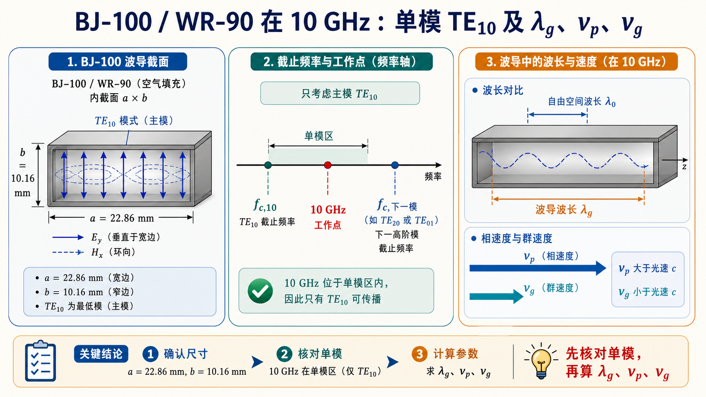

# 第三次作业（Lec13–Lec16）第 2 题：$f=10\,\mathrm{GHz}$ 只传 $\mathrm{TE}_{10}$ 的尺寸与 $\lambda_{\mathrm g},v_{\mathrm p},v_{\mathrm g}$

**导航：** [总目录](../README.md) · [符号与导读](../00-符号与导读.md) · [Lec10–11](../01-Lec10-11.md) · [Lec11～12](../02-Lec11-12.md) · [Lec13–Lec16 主册](README.md) · **分题** [**1**](第01题.md) · [**2**](第02题.md) · [**3**](第03题.md) · [**4**](第04题.md) · [**5**](第05题.md) · [**6**](第06题.md) · [**7**](第07题.md) · [**8**](第08题.md) · [**9**](第09题.md) · [**10**](第10题.md) · [**11**](第11题.md) · [**12**](第12题.md) · **上一题** [第1题](第01题.md) · **下一题** [第3题](第03题.md) · [附录](../99-公式与图像.md)

> 矩形波导 $k_{\mathrm c}$、$\lambda_{\mathrm c}$ 与主册总述见 [Lec13–Lec16 主册](README.md) 文首；**单模判据**的完整合并不等式见 [第1题分题](第01题.md)。

---

## 一、前置知识

### 1. 专有名词

- **BJ-100 / WR-90**：国内/国外命名的**同一**标准**矩形波导**规格，常用于 X 波段。题中取 **$a=22.86\,\mathrm{mm}$、$b=10.16\,\mathrm{mm}$**（**内**尺寸）。  
- **$\lambda_0$**：无限均匀介质中该频率的**工作波长**；空气时 **$\lambda_0=c/f$**。  
- **$\beta$**：沿 **$z$** 的**相位常数**；**导行**时 $\beta=\sqrt{k^2-k_{\mathrm c}^2}$（**实数**）。  
- **$\lambda_\mathrm{g}$（波导波长）** ：导行时 **$\lambda_\mathrm{g}=2\pi/\beta$**。对空气 $\mathrm{TE}_{10}$ 常写为 **$\lambda_\mathrm{g}=\lambda_0\big/\sqrt{1-(\lambda_0/(2a))^2}$** 或等价的 $(f/f_{\mathrm c,10})$ 形式。  
- **$v_\mathrm p$（相速）**、**$v_\mathrm{g}$（群速）** ：**$v_\mathrm p=\omega/\beta$**，**$v_\mathrm{g}=\mathrm d\omega/\mathrm d\beta$**。**均匀、无耗、空气**填充矩形波导中常用 **$v_\mathrm p v_\mathrm{g}=c^2$** 验算。  
- **$\lambda_{\mathrm c}$ / 单模** ：可导行当 **$\lambda_0 < \lambda_{\mathrm c,mn}$** ；在若干竞争模**都不导行**、仅 **$\mathrm{TE}_{10}$** 导行时，称该频率下在题设尺寸上为 **$\mathrm{TE}_{10}$ 单模**。

### 2. 核心公式（含义）

- **$\lambda_0=c/f$**：由 **$f$** 得自由空间工作波长。  
- **$\beta=\sqrt{k^2-k_{\mathrm c,10}^2}$、$\lambda_\mathrm{g}=2\pi/\beta$**：**$k=2\pi/\lambda_0$**（空气）。若已确认**仅** $\mathrm{TE}_{10}$ 可传，则只取 **$k_{\mathrm c,10}=\pi/a$**。  
- **$\lambda_\mathrm{g}$ 显式**（$\mathrm{TE}_{10}$）：$\lambda_\mathrm{g}=\lambda_0\big/\sqrt{1-(\lambda_0/(2a))^2}$ — **角色**：由 $\lambda_0$、$a$ 直算**波导波长**。  
- **$\ v_\mathrm p=c\big/\sqrt{1-(f_{\mathrm c,10}/f)^2}$**，**$v_\mathrm{g}=c\sqrt{1-(f_{\mathrm c,10}/f)^2}$**（$\mathrm{TE}_{10}$ 空气段常用形式）— **角色**：由 **$f$** 与主模 **$f_{\mathrm c,10}=c/(2a)$** 求相/群速；验算 **$v_\mathrm p v_\mathrm{g}\approx c^2$**。

---

## 二、分析思路

1. 按课程常用例题取 **BJ-100（WR-90）** 的 **$a,b$**。  
2. 由 **$f$** 算 **$\lambda_0=c/f$**。  
3. 用 **$\lambda_0 < \lambda_{\mathrm c,mn}$** 对主模与 **$\mathrm{TE}_{20}$、$\mathrm{TE}_{01}$、$\mathrm{TE}_{11}/\mathrm{TM}_{11}$** 等**逐模**核对，确认在 **10 GHz** 上**仅** $\mathrm{TE}_{10}$ 能导行。  
4. 在单模成立前提下，用 **$\mathrm{TE}_{10}$** 的色散式求 **$\lambda_\mathrm{g}$**。  
5. 用 **$f_{\mathrm c,10}$** 与 **$f$** 写出 **$v_\mathrm p$、$v_\mathrm{g}$**，并验 **$v_\mathrm p v_\mathrm{g}$**。

---

## 三、标准解答

取工程上常用的**标准矩形波导 BJ-100（WR-90）**：

$$
a=22.86\,\mathrm{mm},\qquad b=10.16\,\mathrm{mm}.
$$

**工作波长**（取 $c\approx 2.998\times 10^8\,\mathrm{m/s}$）：

$$
\lambda_0=\frac{c}{f}\approx 2.998\times 10^{-2}\,\mathrm{m}\approx 29.98\,\mathrm{mm}.
$$

**单模核对**（$\lambda_{\mathrm c,10}=2a=45.72\,\mathrm{mm}$）：

| 模 | $\lambda_\mathrm c$ | 与 $\lambda_0$ 比 |
|----|------------------------|----------------------|
| $\mathrm{TE}_{10}$ | 45.72 mm | $>\lambda_0$：可导行 |
| $\mathrm{TE}_{20}$ | $a=22.86\,\mathrm{mm}$ | $<\lambda_0$，不导行 |
| $\mathrm{TE}_{01}$ | $2b=20.32\,\mathrm{mm}$ | 不导行 |
| $\mathrm{TE}_{11}/\mathrm{TM}_{11}$ | $\approx 18.57\,\mathrm{mm}$ | 不导行 |

故在 **10 GHz** 上**仅 $\mathrm{TE}_{10}$ 单模工作**（与教材常用 WR-90 例题一致），以下按 $\mathrm{TE}_{10}$ 取 $\beta$。

$$
\boxed{\lambda_{\mathrm g}=\frac{\lambda_0}{\sqrt{1-(\lambda_0/(2a))^2}}\approx 3.97\times 10^{-2}\,\mathrm{m}\approx 39.7\,\mathrm{mm}}
$$

$$
\boxed{v_{\mathrm p}=\frac{c}{\sqrt{1-(f_{\mathrm c,10}/f)^2}}\approx 3.97\times 10^8\,\mathrm{m/s}},\qquad
\boxed{v_{\mathrm g}=c\sqrt{1-(f_{\mathrm c,10}/f)^2}\approx 2.26\times 10^8\,\mathrm{m/s}}.
$$

**验算**：$v_{\mathrm p}v_{\mathrm g}\approx c^2$。

## 图示

*图：$f$ 相对主模截止 $f_{\mathrm c,10}$ 的比 $r$ 上：$\lambda_\mathrm{g}/\lambda_0$ 与 $v_\mathrm p/c,\,v_\mathrm g/c$；竖线处为本题 10\,GHz 工作点。由图可见导行时 $\lambda_\mathrm{g}>\lambda_0$、$v_\mathrm p>c$ 而 $v_\mathrm g<c$ 等定性关系。详细公式见第三节。*

---

## 四、与主册/他题衔接

- 单模判据与 **$\max\{a,2b,\lambda_{\mathrm c,11}\}$** 的合并不等式，见 [第1题](第01题.md) **第三节**；本题因给定 **标准尺寸** 与 **10 GHz**，直接逐模**数值比较**即够。

---
