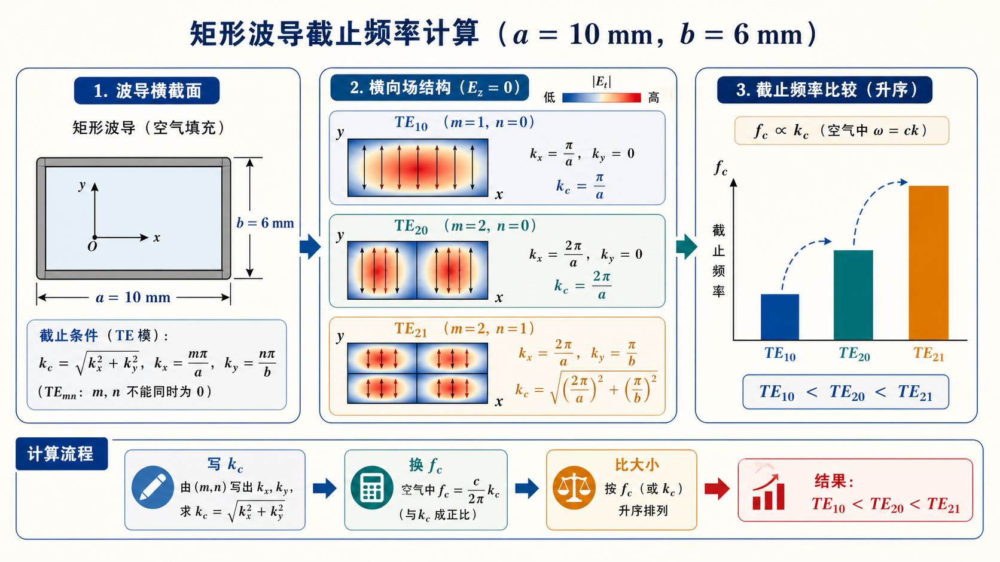

# 第三次作业（Lec13–Lec16）第 3 题：$a\times b=10\times 6\,\mathrm{mm^2}$，求 $\mathrm{TE}_{10}$、$\mathrm{TE}_{20}$、$\mathrm{TE}_{21}$ 的截止频率

**导航：** [总目录](../README.md) · [符号与导读](../00-符号与导读.md) · [Lec10–11](../01-Lec10-11.md) · [Lec11～12](../02-Lec11-12.md) · [Lec13–Lec16 主册](README.md) · **分题** [**1**](第01题.md) · [**2**](第02题.md) · [**3**](第03题.md) · [**4**](第04题.md) · [**5**](第05题.md) · [**6**](第06题.md) · [**7**](第07题.md) · [**8**](第08题.md) · [**9**](第09题.md) · [**10**](第10题.md) · [**11**](第11题.md) · [**12**](第12题.md) · **上一题** [第2题](第02题.md) · **下一题** [第4题](第04题.md) · [附录](../99-公式与图像.md)

> 文首 $k_\mathrm c,\lambda_\mathrm c,f_\mathrm c$ 通式见 [Lec13–Lec16 主册](README.md)。

---

## 一、前置知识

### 1. 专有名词

- **$k_\mathrm c$（截止波数）** ：矩形波导模 $(m,n)$ 的**横向**本征值，由截面尺寸决定，**与是否激励该模、工作频率无关**（在均匀填充、理想导体壁模型下）。  
- **$f_\mathrm c$（截止频率）** ：该模**开始出现导行**的最低工作频率，空气时 **$f_\mathrm c=c\,k_\mathrm c/(2\pi)$**。  
- **$\mathrm{TE}_{mn}$ / $\mathrm{TM}_{mn}$ 的指数** ：$\mathrm{TE}_{mn}$ 中 **$m$** 或 **$n$** 允许为 0（**不同时**为 0）。$\mathrm{TM}_{mn}$ 要求 **$m,n\ge 1$**。本题**只出现 TE**。  
- **$\pi/a$、$\pi/b$** 出现在 $k_\mathrm c$ 中：物理上是横截面驻波在 **宽边/窄边** 方向的**空间**变化率，代入公式时 **$a,b$** 须与 **$\mathrm{m\,,n}$** 一一对应。

### 2. 核心公式（含义）

- **$\displaystyle k_\mathrm c=\sqrt{\left(\frac{m\pi}{a}\right)^2+\left(\frac{n\pi}{b}\right)^2}$** — 几何决定，量纲 m$^{-1}$。  
- **$\displaystyle f_\mathrm c=\frac{c}{2\pi}\,k_\mathrm c=\frac{c}{2\pi}\sqrt{\left(\frac{m\pi}{a}\right)^2+\left(\frac{n\pi}{b}\right)^2}$** — 空气，量纲 **Hz**；本题取 **$c=2.99792458\times 10^8\,\mathrm{m/s}$** 与主册/教材常值一致。  
- 同一 **$a,b$** 下，**$(m,n)$** 不同则 **$f_\mathrm c$** 不同；$\mathrm{TE}_{20}$ 的 **$f_\mathrm c$** 是 $\mathrm{TE}_{10}$ 的**两倍**仅当同一边（此处沿 $a$ 的 $(1,0)$ 与 $(2,0)$）**且同一 $a$** 成立。

---

## 二、分析思路

1. 把 **10 mm、6 mm** 换成 **$\mathrm{m}$** 或全程 **$\mathrm{mm}$** 与 **$c$** 自洽。  
2. 对 **$(1,0)$、$(2,0)$、$(2,1)$** 分别算 **$k_\mathrm c$**，再得 **$f_\mathrm c$**。  
3. 可检查 **$\mathrm{TE}_{20}$** 的 **$f_\mathrm c$** 是否约为 **$\mathrm{TE}_{10}$** 的 **2 倍**（同一边主导）。  
4. 用 **2～4 位**有效数字与教材风格对齐。

---

## 三、标准解答

已知 **$a=10\,\mathrm{mm}=0.01\,\mathrm{m}$**、**$b=6\,\mathrm{mm}=0.006\,\mathrm{m}$**，空气

$$
f_\mathrm c=\frac{c}{2\pi}\sqrt{\left(\frac{m\pi}{a}\right)^2+\left(\frac{n\pi}{b}\right)^2}.
$$

- **$\mathrm{TE}_{10}$（$m=1,n=0$）**：$k_\mathrm c=\pi/a$，$\displaystyle f_\mathrm c=\frac{c}{2a}$  

  $$
  f_{\mathrm c,10}=\frac{2.99792458\times 10^8}{2\times 0.01}\ \mathrm{Hz}\approx \boxed{14.99\,\mathrm{GHz}}.
  $$

- **$\mathrm{TE}_{20}$（$m=2,n=0$）**：$k_\mathrm c=2\pi/a=2k_{\mathrm c,10}$，故  

  $$
  f_{\mathrm c,20}\approx 2f_{\mathrm c,10}\approx \boxed{29.98\,\mathrm{GHz}}.
  $$

- **$\mathrm{TE}_{21}$（$m=2,n=1$）**：代一般式，  

  $$
  f_{\mathrm c,21}\approx\boxed{39.02\,\mathrm{GHz}}.
  $$

汇总：

| 模 | $f_\mathrm c$（数值） |
|----|------------------------|
| $\mathrm{TE}_{10}$ | $\approx 14.99\,\mathrm{GHz}$ |
| $\mathrm{TE}_{20}$ | $\approx 29.98\,\mathrm{GHz}$ |
| $\mathrm{TE}_{21}$ | $\approx 39.02\,\mathrm{GHz}$ |

## 图示

*图：先由 $a,b,m,n$ 求 $k_\mathrm c$，再换成 $f_\mathrm c$。图只强调三者的相对顺序；精确数值以上表为准。*

---
