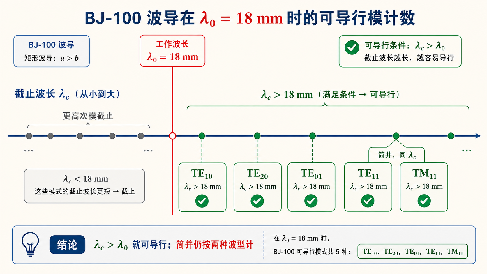

# 第三次作业（Lec13–Lec16）第 4 题：BJ-100，$\lambda_0=18\,\mathrm{mm}$，可能存在几种波型？

**导航：** [总目录](../README.md) · [符号与导读](../00-符号与导读.md) · [Lec10–11](../01-Lec10-11.md) · [Lec11～12](../02-Lec11-12.md) · [Lec13–Lec16 主册](README.md) · **分题** [**1**](第01题.md) · [**2**](第02题.md) · [**3**](第03题.md) · [**4**](第04题.md) · [**5**](第05题.md) · [**6**](第06题.md) · [**7**](第07题.md) · [**8**](第08题.md) · [**9**](第09题.md) · [**10**](第10题.md) · [**11**](第11题.md) · [**12**](第12题.md) · **上一题** [第3题](第03题.md) · **下一题** [第5题](第05题.md) · [附录](../99-公式与图像.md)

> 通式与 BJ-100 尺寸见 [主册](README.md)；**波型数统计规则**与 [第5题](第05题.md)、[第10题](第10题.md) 一致：$\mathrm{TE}$ 与 $\mathrm{TM}$ 若**简并**（同 $k_\mathrm c$）算**两种**波型。

---

## 一、前置知识

### 1. 专有名词

- **波型（模式）** ：$\mathrm{TE}_{mn}$ 与 $\mathrm{TM}_{mn}$ 在横截面的场分布**不同**；**同一 $(m,n)$** 的 $\mathrm{TE}$ 与 $\mathrm{TM}$ 若**不同类**，一般各算一种。  
- **$\beta$ 为实数**（无耗均匀填充） $\Leftrightarrow$ **$\lambda_0 < \lambda_{\mathrm c,mn}$**（或 **$f>f_{\mathrm c,mn}$**）— 该**波型在题设频率/波长**下**能存在导行**（在理想无限长、理想激励模型下**可能被激励**；题目常问**可能**数）。  
- **简并**：$\mathrm{TE}_{11}$ 与 $\mathrm{TM}_{11}$ **有相同** **$k_\mathrm c$**、**相同** **$\lambda_\mathrm c$**，但仍是**两个****不同**的波型，计数时常记 **2**。  
- **BJ-100（WR-90）** ：\ **$a=22.86\,\mathrm{mm}$、$b=10.16\,\mathrm{mm}$**。  

### 2. 核心公式

- **$\lambda_{\mathrm c,mn}=2\pi/k_\mathrm c$** 或逐模在表中列出；**角色**：与题给 **$\lambda_0$** 比较。  
- **$\lambda_0 < \lambda_{\mathrm c,mn}$** 则该**波型**在本题中**可导行**；否则该模在截止区（不计入**可能**的导行型）。

---

## 二、分析思路

1. 取 **BJ-100** 的 **$a,b$**。  
2. 对**低次**及相邻模计算（或表列）$\lambda_\mathrm c$：至少含 **$\mathrm{TE}_{10},\mathrm{TE}_{20},\mathrm{TE}_{01},\mathrm{TE}_{11}/\mathrm{TM}_{11}$**。  
3. 将 **$\lambda_0=18\,\mathrm{mm}$** 与每个 **$\lambda_\mathrm c$** 比较。  
4. 凡 **$\lambda_\mathrm c > 18\,\mathrm{mm}$** 的**波型**均**可能**存在；$\mathrm{TE}_{11}$ 与 **$\mathrm{TM}_{11}$** 各计 **1**；更高次模若 **$\lambda_\mathrm c \le 18\,\mathrm{mm}$** 则不再计入。

---

## 三、标准解答

BJ-100：**$a=22.86\,\mathrm{mm}$**、**$b=10.16\,\mathrm{mm}$**。满足**导行**需 **$\lambda_0 < \lambda_\mathrm c$**。各模**截止波长**（$\mathrm{mm}$）：

- $\mathrm{TE}_{10}$：45.72  
- $\mathrm{TE}_{20}$：22.86  
- $\mathrm{TE}_{01}$：20.32  
- $\mathrm{TE}_{11}/\mathrm{TM}_{11}$：**同** 18.57（**简并**不同类）

**均大于** **$18\,\mathrm{mm}$**，故以上 **5** 个**波型**在 $\lambda_0=18\,\mathrm{mm}$ 时**均可**导行；$\lambda_\mathrm c < 18\,\mathrm{mm}$ 的**更高**次模不导行，不计。

$$
\boxed{\text{共 5 种：}\mathrm{TE}_{10},\ \mathrm{TE}_{20},\ \mathrm{TE}_{01},\ \mathrm{TE}_{11},\ \mathrm{TM}_{11}}.
$$

## 图示

*图：凡 $\lambda_\mathrm c>\lambda_0$ 的模可导行；$\mathrm{TE}_{11}$ 与 $\mathrm{TM}_{11}$ 共用同一截止波长，但计数时仍按两种波型处理。*

---
