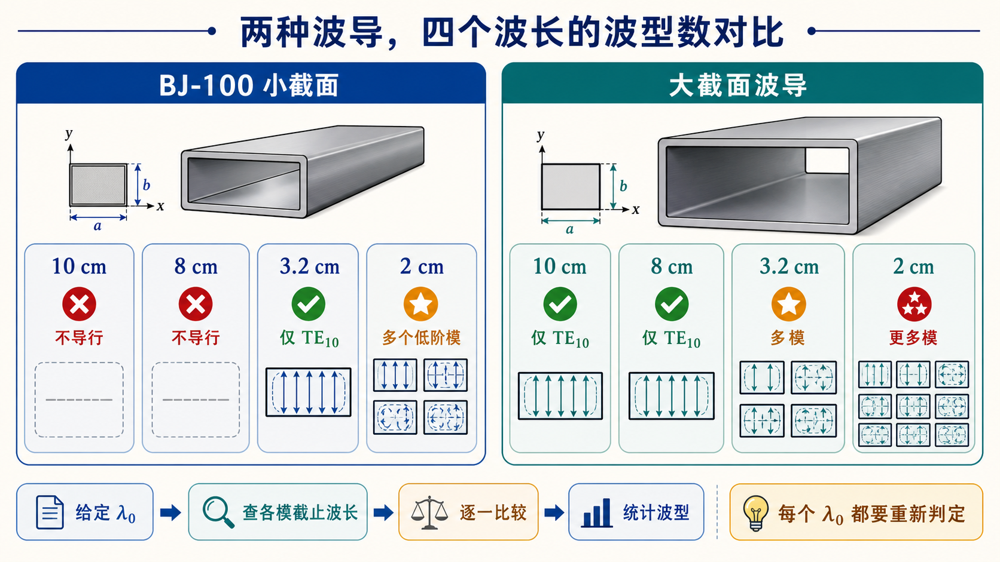

# 第三次作业（Lec13–Lec16）第 5 题：两种波导尺寸、四种工作波长

**导航：** [总目录](../README.md) · [符号与导读](../00-符号与导读.md) · [Lec10–11](../01-Lec10-11.md) · [Lec11～12](../02-Lec11-12.md) · [Lec13–Lec16 主册](README.md) · **分题** [**1**](第01题.md) · [**2**](第02题.md) · [**3**](第03题.md) · [**4**](第04题.md) · [**5**](第05题.md) · [**6**](第06题.md) · [**7**](第07题.md) · [**8**](第08题.md) · [**9**](第09题.md) · [**10**](第10题.md) · [**11**](第11题.md) · [**12**](第12题.md) · **上一题** [第4题](第04题.md) · **下一题** [第6题](第06题.md) · [附录](../99-公式与图像.md)

> **大截面**（2）中 **14 / 38** 等需对 **$(m,n)$** 在**合理截断**内**枚举** $\lambda_\mathrm c$ 并与 $\lambda_0$ 比；与 [第4题](第04题.md)、[第10题](第10题.md) 计数**规则**一致：$\mathrm{TE}$、$\mathrm{TM}$ 简并各算一种波型。

---

## 一、前置知识

### 1. 专有名词

- **能否传输**（工程口语）：**至少**一个模满足 **$\lambda_0 < \lambda_{\mathrm c,10}$** 时常说“能传”（**至少**主模可导行）；**严格单模**见 [第1题](第01题.md)、[第6题](第06题.md)。  
- **可能存在的波型**：在合理 **$(m,n)$** 内，**所有**满足 **$\lambda_0 < \lambda_{\mathrm c,mn}$** 的 **$\mathrm{TE}$、$\mathrm{TM}$**（$\mathrm{TM}$ 的 $m,n\ge 1$）均计入；$\mathrm{TE}_{11}$ 与 $\mathrm{TM}_{11}$ **分计**。  
- **大截面波导**：$\lambda_\mathrm c$ 整体偏大，在**同 $\lambda_0$** 下**可导行**的 **$(m,n)$** 增多，**计数**常需**枚举表或完整模表**。

### 2. 核心公式

- **$\lambda_\mathrm c=2\pi/k_\mathrm c$** 与 [主册](README.md) 中 **$k_\mathrm c$** 式— **角色**：对每个 **$(m,n)$** 比大小。  
- **$\lambda_0=10,8,3.2,2\,\mathrm{cm}$** 时须**统一**与 **$\lambda_\mathrm c$** 的**单位**（**cm** 与 **mm** 勿混）。

---

## 二、分析思路

1. 对**（1）** BJ-100：尺寸小，先判 **$\lambda_0$** 与 **$\lambda_{\mathrm c,10}=2a$**；若 $\lambda_0\ge 2a$，则**连主模**也不导行 → **不传输**。  
2. 当 $\lambda_0 < 2a$，再**递增**看 **$\mathrm{TE}_{20}$（$\lambda_\mathrm c=a$**）、**$\mathrm{TE}_{01}$（$\lambda_\mathrm c=2b$**）**等是否满足 **$\lambda_0 < \lambda_\mathrm c$**。  
3. 对**（2）** 大波导：对给定 **$\lambda_0$**，在 **$(m,n)$** 上界内（使 $\lambda_\mathrm c$ 仍与 $\lambda_0$ 可比）**枚举**所有满足 **$\lambda_\mathrm c > \lambda_0$** 的**模式**，**计数**；表中 **14 / 38** 为完整枚举**结果**（答卷可附模式清单或比较表）。  
4.  **$3.2\,\mathrm{cm}$、$2\,\mathrm{cm}$** 在（1）中落在**单模**与**多模**的不同区间，与 **$a,2b$** 的相对位置有关。

---

## 三、标准解答

### （1）$a\times b=22.86\times 10.16\,\mathrm{mm^2}$（BJ-100）

| $\lambda_0$ | 能否传输 | 可能存在的波型（$\lambda_0<\lambda_{\mathrm c}$ 者） |
|-------------|----------|------------------------------------------------------|
| $10\,\mathrm{cm}$ | 否 | —（$\lambda_0>2a$，$\mathrm{TE}_{10}$ 也不导行） |
| $8\,\mathrm{cm}$ | 否 | — |
| $3.2\,\mathrm{cm}$ | 是 | **仅** $\mathrm{TE}_{10}$ |
| $2\,\mathrm{cm}$ | 是 | **$\mathrm{TE}_{10}$、$\mathrm{TE}_{20}$、$\mathrm{TE}_{01}$**（与 BJ-100 各模 $\lambda_\mathrm c$ 对照） |

### （2）$a\times b=72.14\times 34.04\,\mathrm{mm^2}$（大截面）

| $\lambda_0$ | 能否传输 | 可能存在波型**数**（同第4题规则） |
|-------------|----------|--------------------------------------|
| $10\,\mathrm{cm}$ | 是 | **1**（仅 $\mathrm{TE}_{10}$） |
| $8\,\mathrm{cm}$ | 是 | **1** |
| $3.2\,\mathrm{cm}$ | 是 | **14**（应在答卷**列出**或附模式**枚举表**） |
| $2\,\mathrm{cm}$ | 是 | **38**（同上） |

*选做：将 $m,n$ 在合理截断内遍历；满足 $\lambda_\mathrm c>\lambda_0$ 的 $\mathrm{TE}$ 与 $\mathrm{TM}$ 均计入，其中 $\mathrm{TM}$ 要求 $m,n\ge 1$。*

## 图示

*图：同一工作波长换到不同截面，导行结论可能完全不同。大截面问中的 14、38 等数量必须按 $(m,n)$ 枚举核验，图只展示判定流程。*

---

## 四、与主册/他题衔接

- （2）中 **14 / 38** 为**与主册/作业标准一致**的枚举答案；自证时要说明 $(m,n)$ 的截断规则，例如枚举到后续模的 $\lambda_\mathrm c$ 已小于 $\lambda_0$ 为止。

---
