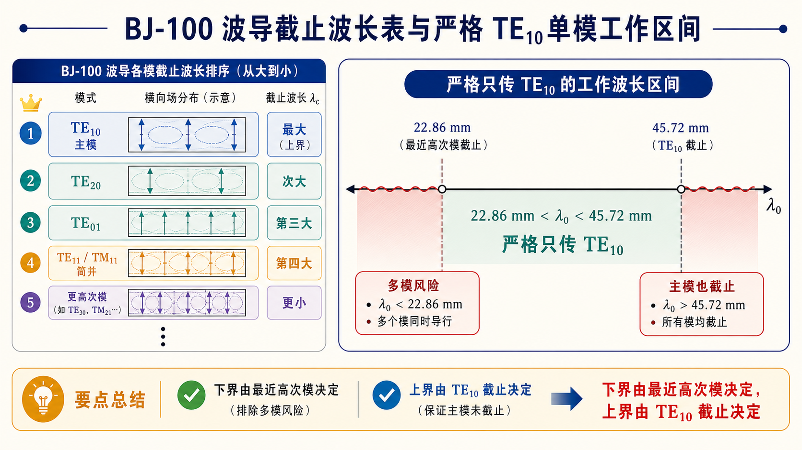

# 第三次作业（Lec13–Lec16）第 6 题：BJ-100，若干模的 $\lambda_{\mathrm c}$；只传 $\mathrm{TE}_{10}$ 的 $\lambda_0$ 范围

**导航：** [总目录](../README.md) · [符号与导读](../00-符号与导读.md) · [Lec10–11](../01-Lec10-11.md) · [Lec11～12](../02-Lec11-12.md) · [Lec13–Lec16 主册](README.md) · **分题** [**1**](第01题.md) · [**2**](第02题.md) · [**3**](第03题.md) · [**4**](第04题.md) · [**5**](第05题.md) · [**6**](第06题.md) · [**7**](第07题.md) · [**8**](第08题.md) · [**9**](第09题.md) · [**10**](第10题.md) · [**11**](第11题.md) · [**12**](第12题.md) · **上一题** [第5题](第05题.md) · **下一题** [第7题](第07题.md) · [附录](../99-公式与图像.md)

> **严格**只传 $\mathrm{TE}_{10}$ 的不等式组与 **$\max\{a,2b,\lambda_{\mathrm c,11},\ldots\}$** 见 [第1题](第01题.md)。

---

## 一、前置知识

### 1. 专有名词

- **$\lambda_{\mathrm c,mn}$**：由 **$k_\mathrm c$** 得 **$\lambda_\mathrm c=2\pi/k_\mathrm c$**，用于与 **$\lambda_0$** 比长短。  
- **只传 $\mathrm{TE}_{10}$**：需同时满足：① **$\lambda_0 < \lambda_{\mathrm c,10}=2a$**（主模导行）；② 所列竞争模**不导行**（作业常写 **$\lambda_0 \ge \lambda_{\mathrm c,mn}$**，**端点**依课程约定）。下界是 **$\max\{$ 各竞争模的 $\lambda_\mathrm c\}$** 与 **$\lambda_{\mathrm c,10}$** 的联立结果。  
- **单模工作波长窗**（空气）：$\max\{\cdots\} \le \lambda_0 < 2a$（**开闭**在 $a,2a$ 处依约定）。**BJ-100** 有 **$2b=20.32\,\mathrm{mm} < a=22.86\,\mathrm{mm}$**，故 **$\lambda_{\mathrm c,01}=2b < \lambda_{\mathrm c,20}=a$**；在比较**下界**时 **$\max\{a,2b,\lambda_{\mathrm c,11}\}$** 对典型比例常**取** **$a$**（**须代入**验证，见 [第1题](第01题.md)）。

### 2. 核心公式

- **$\lambda_\mathrm c=2\pi/k_\mathrm c$** 与 [主册](README.md) 中 **$k_\mathrm c$**。  
- **$\lambda_{\mathrm c,20}=a$**、$\lambda_{\mathrm c,01}=2b$、$\lambda_{\mathrm c,11}=2\big/\sqrt{1/a^2+1/b^2}$ — **与第1、4题**一致。

---

## 二、分析思路

1. 列 **BJ-100** 的 **$a,b$**，由公式算题表所列各模的 **$\lambda_\mathrm c$**。  
2. 只传 **$\mathrm{TE}_{10}$**：上界由 **$\lambda_{\mathrm c,10}=2a$**；下界为 **$\max$**{紧邻竞争模的 $\lambda_\mathrm c$} 中在 **$\lambda_0<2a$** 内需要满足的**最严**下界。  
3. 对 **BJ-100**，核对 **$\lambda_{\mathrm c,20}=a$** 与 **$2b$、$\lambda_{\mathrm c,11}$**，通常 **$\max=a$** 即给出 **$\lambda_0 > a$** 一侧（与 **$\lambda_0<2a$** 合并）。  
4. 在 **$a < \lambda_0 < 2a$** 内再确认 **$\mathrm{TE}_{01}$、$\mathrm{TE}_{11}/\mathrm{TM}_{11}$** 等已不导行。

---

## 三、标准解答

**BJ-100**：$a=22.86\,\mathrm{mm}$，$b=10.16\,\mathrm{mm}$。$\lambda_\mathrm c$（**mm**，四舍五入）：

| 模 | $\lambda_\mathrm c$ |
|----|------------------------|
| $\mathrm{TE}_{10}$ | 45.72 |
| $\mathrm{TE}_{20}$ | 22.86 |
| $\mathrm{TE}_{01}$ | 20.32 |
| $\mathrm{TM}_{11}/\mathrm{TE}_{11}$ | 18.57 |
| $\mathrm{TE}_{30}$ | 15.24 |
| $\mathrm{TE}_{21}$ | 15.19 |
| $\mathrm{TE}_{31}$ | 12.19 |
| $\mathrm{TE}_{41}$ | 9.96 |

**只传输 $\mathrm{TE}_{10}$**：$\lambda_0 < \lambda_{\mathrm c,10}$ 且对 $\mathrm{TE}_{20}$、$\mathrm{TE}_{01}$、$\mathrm{TE}_{11}/\mathrm{TM}_{11}$ 等**至少**有 $\lambda_0 \ge \lambda_\mathrm c$（不导行）。在 BJ-100 上，**下界**由 **$\lambda_{\mathrm c,20}=a$** 与 **$\max\{a,2b,\lambda_{\mathrm c,11}\}=a$** 给出，故

$$
\boxed{22.86\,\mathrm{mm} < \lambda_0 < 45.72\,\mathrm{mm}}
$$

**说明**：**开区间**端点以课程要求为准；在 **$(a,\,2a)$** 内已保证 **$\lambda_0>2b$、$\lambda_0>\lambda_{\mathrm c,11}$** 等，**$\mathrm{TE}_{30}$ 等**因 $\lambda_\mathrm c$ 更短也**不导行**（见表）。

## 图示

*图：阴影为 $\lambda_0$ 需同时满足「主模可导行」与「所列举竞争模不导行」的区间，端点开闭依课程。*

---

## 四、与主册/他题衔接

- [第11题](第11题.md) 对「口语宽区间」与**严格**单模窗的辨析，以本节区间为准。

---
