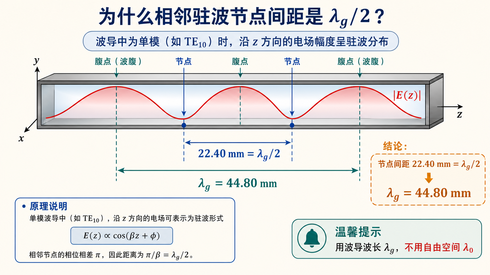

# 第三次作业（Lec13–Lec16）第 7 题：相邻两波节间距 $22.40\,\mathrm{mm}$，求 $\lambda_{\mathrm g}$

**导航：** [总目录](../README.md) · [符号与导读](../00-符号与导读.md) · [Lec10–11](../01-Lec10-11.md) · [Lec11～12](../02-Lec11-12.md) · [Lec13–Lec16 主册](README.md) · **分题** [**1**](第01题.md) · [**2**](第02题.md) · [**3**](第03题.md) · [**4**](第04题.md) · [**5**](第05题.md) · [**6**](第06题.md) · [**7**](第07题.md) · [**8**](第08题.md) · [**9**](第09题.md) · [**10**](第10题.md) · [**11**](第11题.md) · [**12**](第12题.md) · **上一题** [第6题](第06题.md) · **下一题** [第8题](第08题.md) · [附录](../99-公式与图像.md)

> $\lambda_\mathrm{g}$ 与 $\lambda_0$ 区别见 [第2题](第02题.md)；[符号与导读](../00-符号与导读.md) 的传输线/驻波约定须一致。

---

## 一、前置知识

### 1. 专有名词

- **驻波**：两列相反方向行波**相干叠加**，$|E|$ 或 $|U|$ 出现**波腹**、**波节**（**零点**）。  
- **波节**：相邻**波节**间距为**半个导行**波长。在**无耗**均匀波导/传输线、**行驻波**情形下，**沿线的相位周期**是 **$\lambda_\mathrm{g}/2$** 对应相邻波节。  
- **$\lambda_\mathrm{g}$（波导波长）** ：$\lambda_\mathrm{g}=2\pi/\beta$。**不是** **$\lambda_0/2$** 为相邻波节距——常见误区是**把自由空间**半波长当成波导半波长。  
- **$\lambda_0$**：同频率在**无界**介质中的波长；$\lambda_\mathrm{g}$ 是**导行**时的**等效**沿线波长。

### 2. 核心公式

- **相邻两波节距离** **$d_{\min} = \lambda_\mathrm{g}/2$** — **角色**：由测量**反求** **$\lambda_\mathrm{g}$**。  
- **$\lambda_\mathrm{g} = 2 d_{\min}$**。

---

## 二、分析思路

1. 题给的是**两相邻波节**间距，**不是** **$\lambda_\mathrm{g}$** 本身。  
2. 用 **$\lambda_\mathrm{g} = 2 \times$**（相邻波节距）。  
3. 不需求 $\beta$、$a$ 等，本题**仅**由几何测量关系得 **$\lambda_\mathrm{g}$**。

---

## 三、标准解答

电场（或等效**电压**）驻波**相邻波节**间距为 **$\lambda_\mathrm{g}/2$**。设相邻波节距 **$d_{\min}=22.40\,\mathrm{mm}$**，则

$$
\lambda_\mathrm{g} = 2 d_{\min} = 2 \times 22.40\,\mathrm{mm}.
$$

$$
\boxed{\lambda_\mathrm{g} = 44.80\,\mathrm{mm}}.
$$

## 图示

*图：$|E|$（或等效电压幅值）的相邻波节间距为 $\lambda_\mathrm g/2$，所以题给 $22.40\,\mathrm{mm}$ 要乘以 2 才是导波波长。*

---
