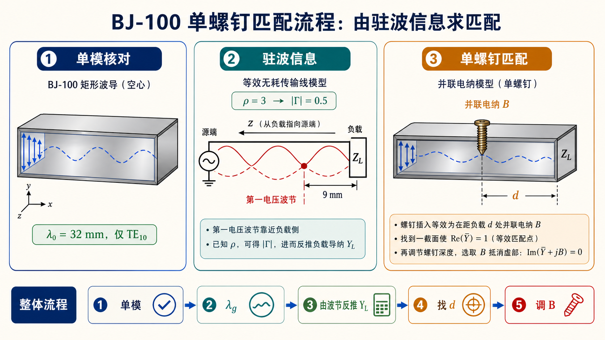

# 第三次作业（Lec13–Lec16）第 8 题：BJ-100，$\lambda_0=32\,\mathrm{mm}$，$\rho=3$，第一波节距负载 $9\,\mathrm{mm}$

> 对应知识点：[05-波导段反射驻波与匹配](../../../knowledge/05-矩形波导工程计算/05-波导段反射驻波与匹配.md)

**导航：** [总目录](../README.md) · [符号与导读](../00-符号与导读.md) · [Lec10–11](../01-Lec10-11.md) · [Lec11～12](../02-Lec11-12.md) · [Lec13–Lec16 主册](README.md) · **分题** [**1**](第01题.md) · [**2**](第02题.md) · [**3**](第03题.md) · [**4**](第04题.md) · [**5**](第05题.md) · [**6**](第06题.md) · [**7**](第07题.md) · [**8**](第08题.md) · [**9**](第09题.md) · [**10**](第10题.md) · [**11**](第11题.md) · [**12**](第12题.md) · **上一题** [第7题](第07题.md) · **下一题** [第9题](第09题.md) · [附录](../99-公式与图像.md)

> **$z$** 与 **$\Gamma(z)$** 的约定以 [符号与导读](../00-符号与导读.md) 及**第二次作业**一致为准。

---

## 一、前置知识

### 1. 专有名词

- **等效传输线**：$\mathrm{TE}_{10}$ 单模时，可沿传播方向**等效**为**无耗**均匀线：用 **$Z_{\mathrm{TE}}$** 与 **$\beta=2\pi/\lambda_\mathrm{g}$** 描述；**电长度、螺钉位置**一律用 **$\lambda_\mathrm{g}$** 而非 **$\lambda_0$**。  
- **$\rho$（驻波比）** ：$\rho=(1+|\Gamma|)/(1-|\Gamma|)$，故 **$|\Gamma|=(\rho-1)/(\rho+1)$**。  
- **$\Gamma(z)$**：**负载向源**时 $\Gamma(z)=\Gamma_L\,\mathrm e^{-\mathrm j 2\beta z}$（本题沿用 [符号与导读](../00-符号与导读.md) 的方向约定）。  
- **归一化导纳** $\bar Y = Y Z_{\mathrm{TE}}$（或课程定义的**特性**参考）。  
- **单螺钉匹配**：在**线上**找 **$\operatorname{Re}\bar Y=1$** 的截面，再**并联**归一化电纳 **$b$** 使**总** **$\bar Y\approx 1$**。

### 2. 核心公式

- **$\lambda_\mathrm{g}=\lambda_0\big/\sqrt{1-(f_{\mathrm c,10}/f)^2}$**，**$f=c/\lambda_0$**，**$f_{\mathrm c,10}=c/(2a)$** — 求 **$\beta$**。  
- **$\bar Y = (1-\Gamma)/(1+\Gamma)$**（若用**同一**归一化定义，与**导读**一致）。  
- 第一波节（电场）距负载的 **$z$** 与 **$\Gamma$** 的**辐角**关系用于定解。

---

## 二、分析思路

1. 用 **$\lambda_0=32\,\mathrm{mm}$** 与 BJ-100 各模 **$\lambda_\mathrm c$** 比，确认**单模** **$\mathrm{TE}_{10}$**。  
2. 由 **$\lambda_0,a$** 求 **$f$、$f_{\mathrm c,10}$、$\lambda_\mathrm{g}$、$\beta$**。  
3. 由 **$\rho$** 得 **$|\Gamma|$**；由「**距负载 9 mm 为第一波节**」定 **$\Gamma_L$** 或 **$\bar Y_L$**，并与 $z$ 方向约定自洽。  
4. **单螺钉**匹配：在 **$0<z< \lambda_\mathrm{g}/2$** 内搜第一个 **$\operatorname{Re}\bar Y=1$** 的 **$d$**，及所需 **$b_{\mathrm{stub}}$**。

---

## 三、标准解答

### （1）传输波型

$\lambda_{\mathrm c,10}=45.72\,\mathrm{mm} > \lambda_0$；$\mathrm{TE}_{20}$、$\mathrm{TE}_{01}$ 等 **$\lambda_\mathrm c < 32\,\mathrm{mm}$**。故

$$
\boxed{\text{仅 }\mathrm{TE}_{10}\text{ 单模传输}}.
$$

### （2）波导参数与归一化负载导纳

$$
f = \frac{c}{\lambda_0} \approx 9.369\,\mathrm{GHz}, \qquad
f_{\mathrm c,10} = \frac{c}{2a} \approx 6.557\,\mathrm{GHz},
$$

$$
\lambda_\mathrm{g} = \frac{\lambda_0}{\sqrt{1-(f_{\mathrm c,10}/f)^2}} \approx 44.80\,\mathrm{mm}, \qquad
\beta = \frac{2\pi}{\lambda_\mathrm{g}}.
$$

等效**无耗**线：$\rho=3\Rightarrow|\Gamma|=(\rho-1)/(\rho+1)=0.5$。由**第一波节**距负载 **$z=9\,\mathrm{mm}$** 与 **$\Gamma(z)=\Gamma_L\mathrm e^{-\mathrm j2\beta z}$** 自洽，得：

$$
\boxed{\bar Y_L \approx 0.363 + \mathrm j\,0.280}.
$$

（$\bar Y = Y Z_{\mathrm{TE}}$；波节位置和 $\Gamma$ 相位必须使用同一 $z$ 方向约定。）

### （3）单螺钉（并联电纳）匹配

在**负载向源**方向，第一个使 **$\operatorname{Re}\bar Y_{\mathrm{line}}=1$** 的截面距离负载约

$$
\boxed{d \approx 5.27\,\mathrm{mm}},\qquad
\boxed{b_{\mathrm{stub}} \approx -1.15}
$$

（在 $\bar Y_{\mathrm{line}}\approx 1+\mathrm j1.15$ 处并联 **$b_{\mathrm{stub}}=-1.15$** 使**总**导纳 **$\approx 1$**。另有**周期**解如 **$d\approx 12.7\,\mathrm{mm}$**，工程上常取**最靠近**负载的 **$d$**。螺钉深度与等效电纳大小需通过实际结构标定。）

## 图示

*图：先确认单模，再把 $\mathrm{TE}_{10}$ 波导段等效为无耗线。$\rho$ 与第一波节位置用于反推出 $\bar Y_L$，随后在 $\operatorname{Re}\bar Y=1$ 的截面用并联电纳补偿虚部。*

---

## 四、与主册/他题衔接

- **$\lambda_0=32\,\mathrm{mm}$** 的**单模**判据同 [第4、9题](第04题.md)。

---
