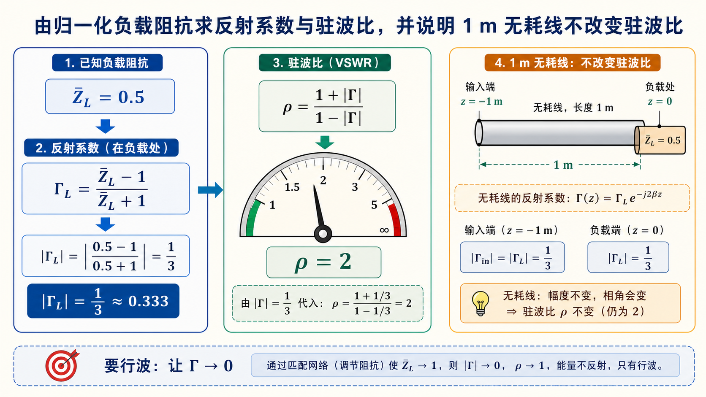

# 第三次作业（Lec13–Lec16）第 9 题：长 $1\,\mathrm{m}$，$\lambda_0=3.2\,\mathrm{cm}$，$\bar Z_L=0.5$（$\mathrm{TE}_{10}$ 归一化）

> 对应知识点：[05-波导段反射驻波与匹配](../../../knowledge/05-矩形波导工程计算/05-波导段反射驻波与匹配.md)

**导航：** [总目录](../README.md) · [符号与导读](../00-符号与导读.md) · [Lec10–11](../01-Lec10-11.md) · [Lec11～12](../02-Lec11-12.md) · [Lec13–Lec16 主册](README.md) · **分题** [**1**](第01题.md) · [**2**](第02题.md) · [**3**](第03题.md) · [**4**](第04题.md) · [**5**](第05题.md) · [**6**](第06题.md) · [**7**](第07题.md) · [**8**](第08题.md) · [**9**](第09题.md) · [**10**](第10题.md) · [**11**](第11题.md) · [**12**](第12题.md) · **上一题** [第8题](第08题.md) · **下一题** [第10题](第10题.md) · [附录](../99-公式与图像.md)

> **$\bar Z$** 相对 **$Z_0$** 或 **$Z_{\mathrm{TE}}$** 的定义以**课程/导读**为准，本题与原有数值约定一致。

---

## 一、前置知识

### 1. 专有名词

- **归一化阻抗** **$\bar Z = Z / Z_0$**；题给 **$\bar Z_L=0.5$** 为**负载**相对参考阻抗。  
- **反射系数**（负载面）**$\Gamma_L = (\bar Z_L - 1) / (\bar Z_L + 1)$**（在**同**一归一化下）。  
- **驻波比** **$\rho = (1+|\Gamma|)/(1-|\Gamma|)$**。  
- **无耗**均匀长线：**$|\Gamma|$** 沿线**为常数**；**输入**与**负载**端**同一** **$|\Gamma|$、$\rho$**（在**同频**、无耗、无**多次反射**的模型中）。  
- **行波**：**$\Gamma=0$**（**匹配**）；可经 **$\lambda/4$** 变换、**膜片/螺钉** 或**吸收**负载实现。  
- **工作自由空间波长** **$\lambda_0$**：无界真空（工程上**空气**常近似为自由空间）中，由**工作频率**决定的波长；题面「工作波长」在多数教材中即指 **$\lambda_0$**，**不是**在波导内另算一个「自由空间波长」。  
- **导内波长** **$\lambda_g$**：波导内沿轴向的**相波长**，由 **$\lambda_0$** 与模式截止波长 **$\lambda_c$** 共同决定，与 **$\lambda_0$** 不可混用。

### 2. 核心公式

**反射与驻波**

- **$\Gamma_L = (\bar Z_L-1)/(\bar Z_L+1)$**。  
- **$\rho = (1+|\Gamma|)/(1-|\Gamma|)$**。  

**工作自由空间波长**（由频率或波数得到；本题题面已直接给出 **$\lambda_0$** 时可直接采用）

- **$\displaystyle \lambda_0 = \frac{c}{f}$**，**$c \approx 3\times 10^8\,\mathrm{m/s}$**，**$f$** 为工作频率。  
- 若已知真空波数 **$k_0=2\pi f/c$**，则 **$\lambda_0 = 2\pi/k_0$**。  

**与导内波长的关系**（空气填充矩形波导 **$\mathrm{TE}_{10}$**，**$\lambda_{c,10}=2a$**）

- **$\displaystyle \lambda_g = \frac{\lambda_0}{\sqrt{1 - (\lambda_0/\lambda_c)^2}}$**（**$\lambda_0<\lambda_c$** 传播时）。  

**$\lambda_0=3.2\,\mathrm{cm}$** 与 BJ-100 **单模**关系见 [第4、8题](第04题.md)。**数值核对**：**$f=c/\lambda_0 \approx 9.375\,\mathrm{GHz}$** 时 **$\lambda_0=3.2\,\mathrm{cm}$**。

---

## 二、分析思路

1. **$\lambda_0$**：题面已给 **$3.2\,\mathrm{cm}$** 则直接用；若仅给 **$f$**，先用 **$\lambda_0=c/f$** 得到工作自由空间波长，再与 **$\lambda_c$** 比较判断模式。  
2. 确认在 **$\lambda_0=32\,\mathrm{mm}$** 下，依波导尺寸**仅** **$\mathrm{TE}_{10}$** 可传（**若**题未给尺寸，则**沿用**前题 BJ-100/教材默认）。  
3. 用 **$\bar Z_L$** 求 **$\Gamma_L$** 与 **$\rho$**。  
4. 由**无耗**得**输入**端 **$|\Gamma|,\rho$** 与**负载**端**相同**。**线长 1 m** 在本问**不**进入 **$\rho$**（仅影响相位，不改变 **$|\Gamma|$**）。  
5. 概括**行波**所需**匹配**措施。

---

## 三、标准解答

**工作自由空间波长**：本题题面已给 **$\lambda_0=3.2\,\mathrm{cm}$**，以下均取 **$\lambda_0=32\,\mathrm{mm}$**。若题目只给频率 **$f$**，应先算 **$\lambda_0=c/f$**（**$c\approx 3\times 10^8\,\mathrm{m/s}$**）；例如 **$f=9.375\,\mathrm{GHz}$** 时 **$\lambda_0\approx 3.2\,\mathrm{cm}$**，与题设一致。需要轴向相位、输入阻抗相角等时，波导内用 **$\lambda_g=\lambda_0/\sqrt{1-(\lambda_0/\lambda_c)^2}$**（**$\mathrm{TE}_{10}$** 时 **$\lambda_c=2a$**），**不要**把 **$\lambda_g$** 误当作题里的「工作自由空间波长」。

**波型**（$\lambda_0=32\,\mathrm{mm}$，与 BJ-100/课设一致时）：**仅** **$\mathrm{TE}_{10}$** 传播，见**第4、8题**同类判断。

$$
\Gamma_L = \frac{\bar Z_L-1}{\bar Z_L+1} = \frac{0.5-1}{0.5+1} = -\frac{1}{3},
\qquad
|\Gamma_L|=\frac{1}{3},
$$

$$
\boxed{\rho = \frac{1+|\Gamma_L|}{1-|\Gamma_L|} = 2 }.
$$

**无耗**长线上 **$|\Gamma|$** 为常数，**输入**端

$$
\boxed{|\Gamma_{\mathrm{in}}|=\tfrac{1}{3}, \qquad \rho_{\mathrm{in}}=2 }.
$$

**行波措施**（题常问）：在负载前实现**共轭/阻抗匹配**（如 **$\lambda/4$** 阻抗变换、**可调配**电抗元件、**吸收**负载等），使等效 **$\Gamma \to 0$**。

*注：线长 **$1\,\mathrm{m}$** 不改变 **$\rho$**，但会改变**输入**反射系数的**相角**；若题目追问 **$\bar Z_{\mathrm{in}}$**，再按传输线关系引入 **$\mathrm e^{-\mathrm j2\beta l}$** 等。*

## 图示

*图：先由 $\Gamma_L=(\bar Z_L-1)/(\bar Z_L+1)$ 得反射大小，再由 $\rho=(1+|\Gamma|)/(1-|\Gamma|)$ 得驻波比。无耗线上 $|\Gamma|$ 沿线不变，题中的 $1\,\mathrm m$ 线长只改变相角，不改变 $\rho$。*

---

## 四、与主册/他题衔接

- **$\bar Z=0.5$** 为**纯实数**，负载为**阻性**；与 [第8题](第08题.md) 的**导纳/反射**为同一**微波网络**的两种叙述。

---
