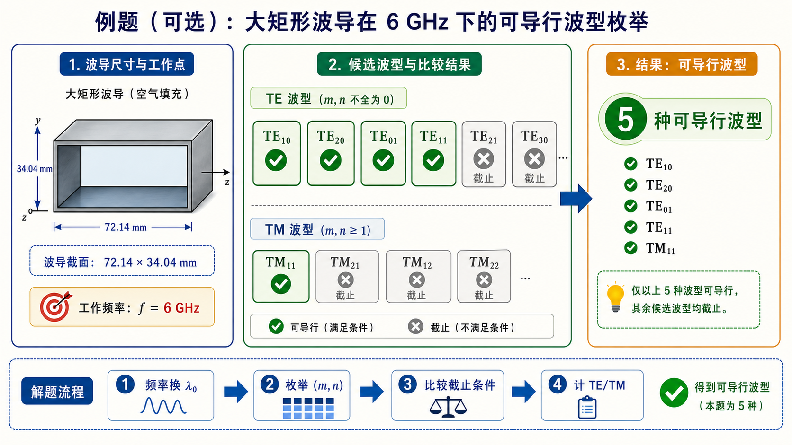

# 第三次作业（Lec13–Lec16）第 10 题（选做）：$72.14\times 34.04\,\mathrm{mm^2}$，$f=6\,\mathrm{GHz}$

> 对应知识点：[04-可传输模判定与枚举](../../../knowledge/05-矩形波导工程计算/04-可传输模判定与枚举.md)

**导航：** [总目录](../README.md) · [符号与导读](../00-符号与导读.md) · [Lec10–11](../01-Lec10-11.md) · [Lec11～12](../02-Lec11-12.md) · [Lec13–Lec16 主册](README.md) · **分题** [**1**](第01题.md) · [**2**](第02题.md) · [**3**](第03题.md) · [**4**](第04题.md) · [**5**](第05题.md) · [**6**](第06题.md) · [**7**](第07题.md) · [**8**](第08题.md) · [**9**](第09题.md) · [**10**](第10题.md) · [**11**](第11题.md) · [**12**](第12题.md) · **上一题** [第9题](第09题.md) · **下一题** [第11题](第11题.md) · [附录](../99-公式与图像.md)

> 枚举/计数法与 [第4题](第04题.md)、[第5(2)题](第05题.md) 同。

---

## 一、前置知识

### 1. 专有名词

- **工作频率/波长**：空气 **$\lambda_0=c/f$**；与**导行**判据**仍用** **$\lambda_0 < \lambda_{\mathrm c,mn}$**。  
- **大截面**（**$a,b$** 大）：在**同**一 **$\lambda_0$** 下，**更多** **$(m,n)$** 满足 **$\lambda_{\mathrm c,mn} > \lambda_0$**。  
- **可导行模清单**：在 **$(m,n)$** 上**截断**到足够高，**枚举**；$\mathrm{TE}_{11}$ 与 **$\mathrm{TM}_{11}$** 各计 **1**。

### 2. 核心公式

- **$\lambda_{\mathrm c,mn} = 2\pi/k_\mathrm c$**，**$k_\mathrm c$** 同 [主册](README.md) 文首。  
- **$\lambda_\mathrm c > \lambda_0$** $\Rightarrow$ 该**波型**可导行。

---

## 二、分析思路

1. 由 **$f$** 得 **$\lambda_0 \approx 49.97\,\mathrm{mm}$**。  
2. 据 **$a=72.14\,\mathrm{mm},\,b=34.04\,\mathrm{mm}$** 计算各模 **$\lambda_\mathrm c$**。  
3. 统计满足 **$\lambda_\mathrm c > 49.97\,\mathrm{mm}$** 的**模式**；与主册/作业**标准答案**对照为 **5** 个：$\mathrm{TE}_{10},\mathrm{TE}_{20},\mathrm{TE}_{01},\mathrm{TE}_{11},\mathrm{TM}_{11}$。  
4. 选做**重算**时，建议**写清** $(m,n)$ 截断规则，并附上可检查的**枚举清单**。

---

## 三、标准解答

$$
\lambda_0 = \frac{c}{f} \approx 49.97\,\mathrm{mm}\quad (f=6\,\mathrm{GHz}).
$$

$\lambda_\mathrm c > 49.97\,\mathrm{mm}$ 的模，枚举为 **5** 个（与 [第5(2)问](第05题.md) 同尺寸体系下常见结论一致于本题给定频率）：

$$
\boxed{\mathrm{TE}_{10},\ \mathrm{TE}_{20},\ \mathrm{TE}_{01},\ \mathrm{TE}_{11},\ \mathrm{TM}_{11}}.
$$

**答卷建议**：列出 5 个模各自的 **$\lambda_\mathrm c$** 与 **$\lambda_0$** 的**比较**，或给一张清楚的枚举表。

## 图示

*图：由 $f$ 得 $\lambda_0=c/f$，再对每组 $(m,n)$ 求 $\lambda_\mathrm c$；凡 $\lambda_\mathrm c>\lambda_0$ 的模在题设频率下可导行。$\mathrm{TE}_{11}$ 与 $\mathrm{TM}_{11}$ 简并、$\lambda_\mathrm c$ 相同，图中为一条、答卷中作两种波型。*

---

## 四、与主册/他题衔接

- [第4题](第04题.md) 为**固定** $\lambda_0$ **数模**可存在；**本题**为**大截面**+**固定 f** 的**同类**问法。

---
