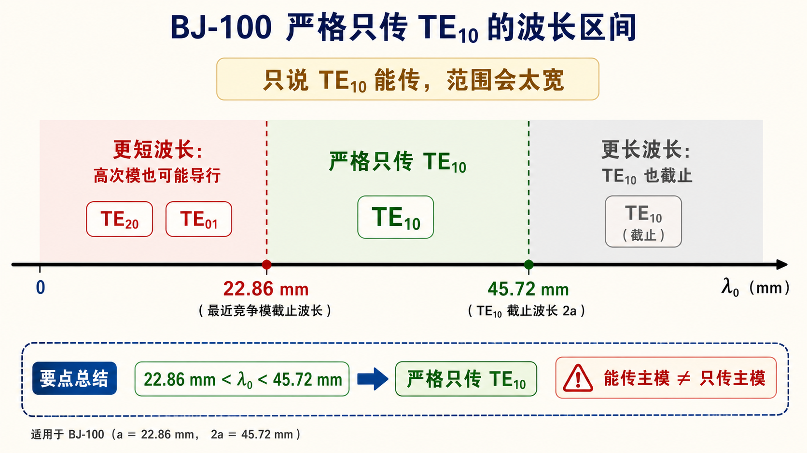

# 第三次作业（Lec13–Lec16）第 11 题（选做）：BJ-100 传 $\mathrm{TE}_{10}$，两种 $\lambda_0$ 区间

> 对应知识点：[02-单模工作区与介质填充](../../../knowledge/05-矩形波导工程计算/02-单模工作区与介质填充.md)

**导航：** [总目录](../README.md) · [符号与导读](../00-符号与导读.md) · [Lec10–11](../01-Lec10-11.md) · [Lec11～12](../02-Lec11-12.md) · [Lec13–Lec16 主册](README.md) · **分题** [**1**](第01题.md) · [**2**](第02题.md) · [**3**](第03题.md) · [**4**](第04题.md) · [**5**](第05题.md) · [**6**](第06题.md) · [**7**](第07题.md) · [**8**](第08题.md) · [**9**](第09题.md) · [**10**](第10题.md) · [**11**](第11题.md) · [**12**](第12题.md) · **上一题** [第10题](第10题.md) · **下一题** [第12题](第12题.md) · [附录](../99-公式与图像.md)

> **能传** $\mathrm{TE}_{10}$ 与**严格**只传 $\mathrm{TE}_{10}$ 的辨析见 [第1题](第01题.md)；**数值窗**以 [第6题](第06题.md) 为准。

---

## 一、前置知识

### 1. 专有名词

- **能传** $\mathrm{TE}_{10}$：**只**要 **$\lambda_0 < \lambda_{\mathrm c,10}=2a$**。  
- **只传/严格单模** **$\mathrm{TE}_{10}$**：除 [第1、6题](第01题.md) 的**全组**竞争条件外，**$\lambda_0$** 还须落在 **$\max\{\cdots\} < \lambda_0 < 2a$** 的窗内。  
- **波口径语**：课内有时把 **$a < \lambda_0 < 2a$** 当“主模区”说，**若**不声明**已**核对 **$\mathrm{TE}_{01}$ 等**，易与**单模**混。

### 2. 核心数据（BJ-100）

- **$2a=45.72\,\mathrm{mm}$**，**$a=22.86\,\mathrm{mm}$**，**$2b=20.32\,\mathrm{mm}$**，$\lambda_{\mathrm c,11}\approx 18.57\,\mathrm{mm}$（**见第4、6题**）。

---

## 二、分析思路

1. 对题目给出的**宽**区间，检查是否**含**可让 **$\lambda_0$** 同时满足 **$\lambda_0<\lambda_{\mathrm c,20}=a$** 或 **$\lambda_0<\lambda_{\mathrm c,01}=2b$** 等（即出现 **$\mathrm{TE}_{20}$、$\mathrm{TE}_{01}$** 等**导行**）的**子范围**。  
2. 对 **$\lambda_0<46\,\mathrm{mm}$** 与 **$23\,\mathrm{mm}<\lambda_0<46\,\mathrm{mm}$** 分别说明**是否**能断言「**一定**只有 $\mathrm{TE}_{10}$」。  
3. 对照 [第6题](第06题.md) 的**严格**单模开区间写出**结论**。

---

## 三、标准解答

- **$\lambda_0 < 46\,\mathrm{mm}$**：区间**过宽**。例如 BJ-100 中 **$20.32\,\mathrm{mm}<\lambda_0<22.86\,\mathrm{mm}$** 时，**$\lambda_0<a$** 使 **$\mathrm{TE}_{20}$** 可导行，与 **$\mathrm{TE}_{10}$** **多模**并存；**$\lambda_0<2b=20.32\,\mathrm{mm}$** 时 **$\mathrm{TE}_{01}$** 也可导行。**故**不能断言「**一定**只有 $\mathrm{TE}_{10}$」。  
- **$23\,\mathrm{mm} < \lambda_0 < 46\,\mathrm{mm}$**：其**下侧**含 **$\lambda_0<22.86\,\mathrm{mm}$** 部分时 **$\mathrm{TE}_{20}$** 可导行，**同样**不能**笼统**说仅 $\mathrm{TE}_{10}$。  

**严格**只传 $\mathrm{TE}_{10}$ 的**波长**窗为（与 [第6题](第06题.md) **同**式）：

$$
\boxed{22.86\,\mathrm{mm} < \lambda_0 < 45.72\,\mathrm{mm}}.
$$

（端点**开闭**依课程。）

## 图示

*图：浅绿带仅示意「过宽」口语区间中可能含多模子区；**严格**单模须用第1、6题整组不等式，勿把「$a<\lambda_0<2a$」等单句当充分条件。*

---

## 四、与主册/他题衔接

- 与 [第1题](第01题.md) 中 **$\max\{a,2b,\lambda_{\mathrm c,11},\ldots\}\le\lambda_0<2a$** 及 “**勿**只背 **$a<\lambda_0<2a$**” 的说明**一致**。

---
