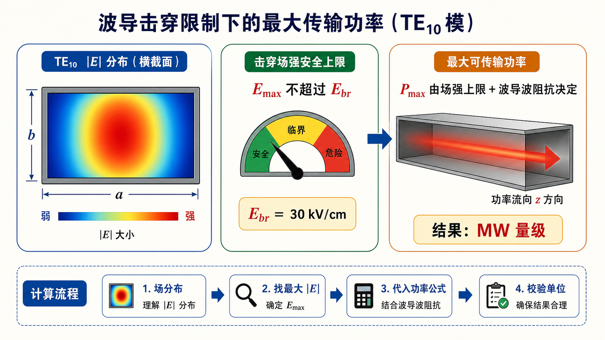

# 第三次作业（Lec13–Lec16）第 12 题（选做）：击穿场强限制下的最大功率（量级）

> 对应知识点：[05-波导段反射驻波与匹配](../../../knowledge/05-矩形波导工程计算/05-波导段反射驻波与匹配.md)

**导航：** [总目录](../README.md) · [符号与导读](../00-符号与导读.md) · [Lec10–11](../01-Lec10-11.md) · [Lec11～12](../02-Lec11-12.md) · [Lec13–Lec16 主册](README.md) · **分题** [**1**](第01题.md) · [**2**](第02题.md) · [**3**](第03题.md) · [**4**](第04题.md) · [**5**](第05题.md) · [**6**](第06题.md) · [**7**](第07题.md) · [**8**](第08题.md) · [**9**](第09题.md) · [**10**](第10题.md) · [**11**](第11题.md) · [**12**](第12题.md) · **上一题** [第11题](第11题.md) · [附录](../99-公式与图像.md)

> **$\eta_0$** 与 **$Z_\mathrm{TE}$** 见教材；**峰值/有效**场**定义**与**前面系数**须与**所用教材**一致，本解答**只给阶次**说明。

---

## 一、前置知识

### 1. 专有名词

- **$E_\mathrm{br}$**：介质（此处常取**空气**）**击穿**场强，超过则**不能**再按**线性/理想**器处理；**限制**了横截面**最大**可承受**电场**。  
- **$\mathrm{TE}_{10}$ 的 $Z_\mathrm{TE}$**：无耗、空气时常写 **$\eta_0/\sqrt{1-(f_\mathrm c/f)^2}$**，**$\eta_0\approx 377\,\Omega$**；**角色**：把**功率**与**场强**的**等效**关系**写**成与 **$a,b$** 有关的式子。  
- **峰值功率/平均功率**、**场取峰值/有效**值：教课书**公式的常数**随定义**不同**，**定稿**须以**你用的那一版**为准。

### 2. 核心比例（不抄具体常数时）

- **$\,P\,$** 与 **$\,E^2\,$**、**$\,Z\,$、截面积$\,ab\,$** 的**量纲**与常见比例：**$P \sim a b\,E^2\,\!/\!Z$** 量级（**精确**式含积分/系数）。**角色**：由 **$E\le E_\mathrm{br}$** 得 **$P_\mathrm{max}$** **量级**为 **$\sim 10^6\,\mathrm{W}$** 阶。

---

## 二、分析思路

1. 在教材**给定**的 **$\mathrm{TE}_{10}$ 场分布** 下，定出横截面**最大** **$|E|$** 与**总**功率**$P$** 的**关系**。  
2. 令 **$|E|_\mathrm{max}=E_\mathrm{br}$**（**或** 按教材的**等效**定义），解出 **$P_\mathrm{max}$**。  
3. 代入题给 **$E_\mathrm{br}$** 与**典型** BJ-100/作业尺寸，**只报量级**并说明**常数**依书而定。

---

## 三、标准解答

取 **$\mathrm{TE}_{10}$** 无耗时 **$\,Z_\mathrm{TE}=\eta_0\big/\sqrt{1-(f_\mathrm c/f)^2}\,$**。设 **$\,E_\mathrm{br}=30\,\mathrm{kV/cm}=3.0\times 10^6\,\mathrm{V/m}\,$**。按教材**把** **$P$** 与 **$E_\mathrm{br}, a, b, Z_\mathrm{TE}$** 联系起来的**完整**式（与**场取峰值/有效**、**场点位置**有关），**数值**在

$$
\boxed{P_\mathrm{max} \sim 10^6\ \mathrm{W}\ \ \text{（约 }0.8\text{–}1.0\ \mathrm{MW}\text{，依教材系数而定）} }.
$$

最终数值要与课堂采用的功率公式、峰值/有效值定义保持一致；本解答给出的是可靠量级与代入路径。

## 图示

*图：先找到 $\mathrm{TE}_{10}$ 场分布中的最大 $|E|$，再令其不超过击穿场强 $E_\mathrm{br}$。功率上界还要通过 $Z_\mathrm{TE}$ 与横截面积折算，因此本题重点是量级与单位核验。*

---

## 四、与主册/他题衔接

- 全册与 **BJ-100、$f=10\,\mathrm{GHz}$** 等**数值**题（如 [第2题](第02题.md)）可**共用** $(f/f_\mathrm c)$ 的 **$\,Z_\mathrm{TE}\,$**，但**功率极限**不属必算**主链**；本题**只作**选做**量级**。

---
