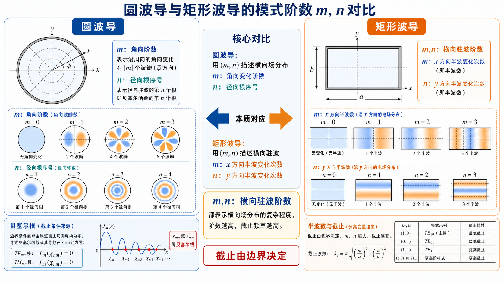

# 第 1 题：圆波导中的波型指数 \(m,n\) 的意义，与矩形波导有何异同

**题目**：圆波导中的波型指数 \(m\) 和 \(n\) 的意义是什么，与矩形波导中的波型指数有何异同。

**对应知识点**：圆波导柱坐标分离变量、角向阶数 \(m\)、径向贝塞尔根序号 \(n\)、矩形波导横向半波数对比。

*图：圆波导的 \(m\) 看角向变化、\(n\) 看径向根序号；矩形波导的 \(m,n\) 更接近两个直角方向上的横向驻波阶数。*

## 一、前置知识

圆波导用柱坐标 \((r,\varphi,z)\) 描述横截面场分布。对横向波动方程分离变量时，角向函数通常写成 \(\cos m\varphi\) 或 \(\sin m\varphi\)，径向函数写成贝塞尔函数 \(J_m(k_{\mathrm c}r)\)。

矩形波导用直角坐标描述横截面，波型指数通常直接对应宽边、窄边方向的驻波半周数；圆波导的横截面是圆形，边界条件会引出贝塞尔函数根。

## 二、分析思路

先分别解释 \(m\)、\(n\) 在圆波导中的物理含义，再与矩形波导的 \(m,n\) 对照。关键是说明：矩形波导的指数与两个直角方向有关；圆波导的 \(m\) 与角向变化有关，\(n\) 与径向根序号有关。

## 三、标准解答

圆波导中：

- \(m\) 表示场沿圆周方向的角向变化阶数。\(m=0\) 时场分布与 \(\varphi\) 无关，称为轴对称模；\(m\ge 1\) 时场沿圆周方向有 \(m\) 个周期性变化，并且通常存在 \(\cos m\varphi\)、\(\sin m\varphi\) 两种正交方位。
- \(n\) 表示径向方向满足边界条件的第 \(n\) 个正根，即从低到高的径向根序号。它不是简单的“半波个数”，而是由 \(J_m(x)=0\) 或 \(J'_m(x)=0\) 的根决定。

与矩形波导相比，相同点是：两类波导的波型指数都来自横向波动方程与导体边界条件，都决定截止波数 \(k_{\mathrm c}\)、截止频率 \(f_{\mathrm c}\)、截止波长 \(\lambda_{\mathrm c}\) 和场的横向分布。

不同点是：

- 矩形波导的 \(m,n\) 分别对应宽边、窄边方向的正弦或余弦半波变化，截止波数由 \((m\pi/a)^2+(n\pi/b)^2\) 给出；
- 圆波导的 \(m\) 是角向阶数，\(n\) 是贝塞尔函数根的序号，截止波数为 \(\chi_{mn}/R\) 或 \(\chi'_{mn}/R\)；
- 圆波导具有旋转对称性，所以 \(m\ge 1\) 的模式常有两个正交极化或方位简并状态；矩形波导因 \(a,b\) 两方向尺寸一般不同，这种旋转对称性不存在。

## 四、结论与易错点

\[
\boxed{m\ \text{表示角向变化阶数，}n\ \text{表示径向贝塞尔根序号。}}
\]

易错点：不要把圆波导的 \(n\) 直接理解为“径向半波数”；它本质上是贝塞尔函数根的编号。
