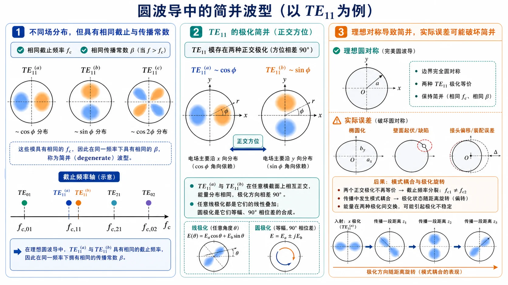

# 第 2 题：什么叫简并波型，这种波型有什么特点

> 对应知识点：[01-圆波导模式与贝塞尔根](../../../knowledge/06-圆波导同轴线微带线/01-圆波导模式与贝塞尔根.md)

**题目**：什么叫简并波型，这种波型有什么特点。

**对应知识点**：截止频率简并、传播常数简并、圆波导旋转对称性、\(\mathrm{TE}_{11}\) 两个正交极化、实际误差导致的模式耦合。

*图：理想圆波导中两个正交方位的 \(\mathrm{TE}_{11}\) 极化具有相同截止频率；实际椭圆度、接头偏移或馈电不对称会破坏这种理想简并。*

## 一、前置知识

波导模式的传播特性由截止波数 \(k_{\mathrm c}\) 决定。在同一波导中，如果两个不同场分布或不同波型名称的模式具有相同 \(k_{\mathrm c}\)，它们就具有相同的截止频率和相同的传播常数表达式。

## 二、分析思路

回答时应先给出简并的定义，再说明圆波导中常见的两种简并：极化简并和波型简并。最后说明简并模式在理想波导与实际波导中的工程特点。

## 三、标准解答

简并波型是指不同场分布、不同极化方向或不同波型名称的模式，在同一波导中具有相同的截止波数 \(k_{\mathrm c}\)、截止频率 \(f_{\mathrm c}\)，因而在同一工作频率下具有相同的传播常数 \(\beta\)。

圆波导中常见两类简并：

- **极化简并**：当 \(m\ge 1\) 时，\(\cos m\varphi\) 与 \(\sin m\varphi\) 对应两个互相正交的方位分布。理想圆波导具有旋转对称性，这两个模式截止频率相同，例如 \(\mathrm{TE}_{11}\) 的两个正交极化。
- **波型简并（EH 简并）**：不同 TE/TM 波型可能因为贝塞尔函数根之间的关系而有相同截止频率。例如 \(J'_0(x)=-J_1(x)\)，所以 \(\mathrm{TE}_{0n}\) 与 \(\mathrm{TM}_{1n}\) 具有相同的截止根。

简并波型的特点是：

- 在理想、均匀、完全圆对称的波导中，它们可以独立存在，也可以任意线性组合；
- 它们的截止频率、相速、群速等传播参数相同；
- 实际波导存在椭圆度、弯曲、接头不连续、馈电不对称等误差时，简并模式之间容易发生耦合或极化旋转；
- 工程上若只希望激励某一种极化或某一种场分布，需要通过馈电结构、模式滤波器、极化保持结构或较高加工精度来抑制不需要的简并模。

## 四、结论与易错点

\[
\boxed{\text{简并波型是不同场分布具有相同截止参量的模式。}}
\]

易错点：简并不是“同一个模式的不同名字”，而是场分布或极化状态不同，但截止频率相同。
