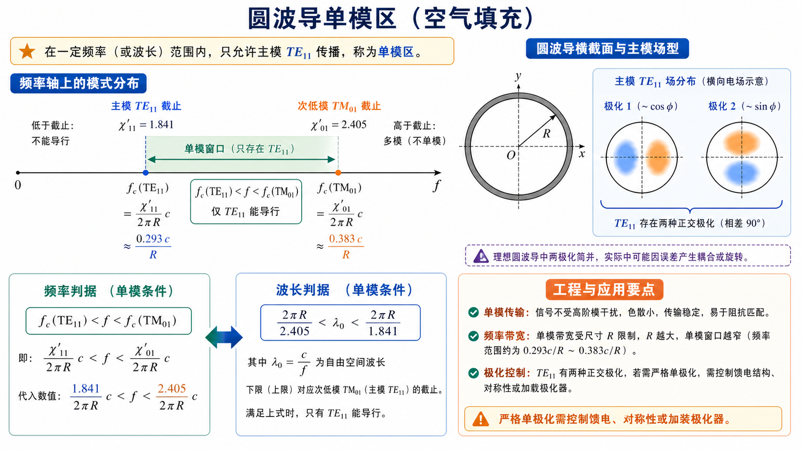

# 第 3 题：圆波导单模传输的条件与对应波型

**题目**：圆波导的单模传输的条件是什么，单模传输对应的波型是什么。

**对应知识点**：圆波导主模、次低模、单模频率窗口、波长窗口、\(\mathrm{TE}_{11}\) 极化简并。

*图：单模不是“只要主模能传”就够了，还要第二个模式 \(\mathrm{TM}_{01}\) 仍截止；严格单极化还要额外控制馈电和结构对称性。*

## 一、前置知识

空气圆波导中，\(\mathrm{TE}_{mn}\) 模的截止根为 \(J'_m(x)=0\) 的根，\(\mathrm{TM}_{mn}\) 模的截止根为 \(J_m(x)=0\) 的根。最低截止模式为 \(\mathrm{TE}_{11}\)，其截止根为

\[
\chi'_{11}=1.841.
\]

次低模式为 \(\mathrm{TM}_{01}\)，其截止根为

\[
\chi_{01}=2.405.
\]

## 二、分析思路

“单模传输”要求最低模式 \(\mathrm{TE}_{11}\) 能导行，同时第二个模式 \(\mathrm{TM}_{01}\) 仍处于截止状态。因此把工作波数 \(k\)、工作频率 \(f\) 或工作波长 \(\lambda_0\) 放在这两个截止边界之间即可。

## 三、标准解答

按波数表示，单模工作条件为

\[
\frac{\chi'_{11}}{R}<k<\frac{\chi_{01}}{R}.
\]

按频率表示为

\[
f_{\mathrm c,\mathrm{TE}_{11}}<f<f_{\mathrm c,\mathrm{TM}_{01}}.
\]

按空气中工作波长表示为

\[
\frac{2\pi R}{\chi_{01}}<\lambda_0<\frac{2\pi R}{\chi'_{11}}.
\]

对应的传输波型为 \(\mathrm{TE}_{11}\) 模。

需要注意：\(\mathrm{TE}_{11}\) 本身具有两个正交极化状态。很多教材说圆波导“单模传输”时，是指只传输 \(\mathrm{TE}_{11}\) 这一最低波型族；若要求严格的单一极化，还必须由馈电结构和波导加工精度控制其中一个极化。

## 四、结论与易错点

\[
\boxed{\mathrm{TE}_{11}\ \text{为圆波导主模，单模区为}\ f_{\mathrm c,\mathrm{TE}_{11}}<f<f_{\mathrm c,\mathrm{TM}_{01}}.}
\]

易错点：不要把 \(\mathrm{TM}_{01}\) 当成最低模式；圆波导主模是 \(\mathrm{TE}_{11}\)。
