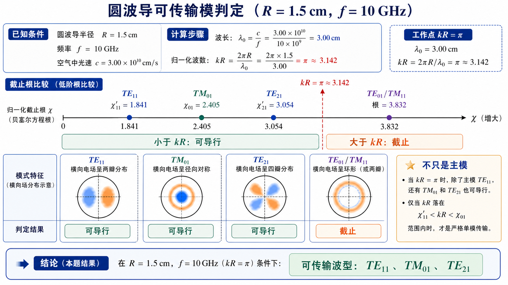

# 第 4 题：\(R=1.5\ \mathrm{cm}\)、\(f=10\ \mathrm{GHz}\) 时可能存在的波型

> 对应知识点：[01-圆波导模式与贝塞尔根](../../../knowledge/06-圆波导同轴线微带线/01-圆波导模式与贝塞尔根.md)

**题目**：设有一空气填充的圆波导，其内半径 \(R=1.5\ \mathrm{cm}\)，若电磁波的频率 \(f=10\ \mathrm{GHz}\)，问：若该电磁波在该波导中传输，可能存在哪些波型？

**对应知识点**：圆波导可导行判据、归一化工作点 \(kR\)、低阶截止根比较、可传输模式枚举。

*图：本题的工作点是 \(kR=\pi\)。把低阶截止根逐个放到同一条数轴上比较，根小于 \(kR\) 的模式可导行，根大于 \(kR\) 的模式截止。*

## 一、前置知识

圆波导模式可导行的条件是 \(f>f_{\mathrm c}\)，等价地

\[
kR>\text{该模式对应的截止根}.
\]

常用低阶根如下：

- \(\mathrm{TE}_{11}\)：\(\chi'_{11}=1.841\)；
- \(\mathrm{TM}_{01}\)：\(\chi_{01}=2.405\)；
- \(\mathrm{TE}_{21}\)：\(\chi'_{21}=3.054\)；
- \(\mathrm{TE}_{01}\)、\(\mathrm{TM}_{11}\)：对应根约为 \(3.832\)。

## 二、分析思路

先求工作波长和 \(kR\)，再把 \(kR\) 与各模式的截止根比较。截止根小于 \(kR\) 的模式可传输，截止根大于 \(kR\) 的模式不能传输。

## 三、标准解答

空气中工作波长为

\[
\lambda_0=\frac{c}{f}=\frac{3.00\times10^8}{10\times10^9}
=3.00\ \mathrm{cm}.
\]

所以

\[
kR=\frac{2\pi R}{\lambda_0}
=\frac{2\pi\times1.5}{3.00}
=\pi.
\]

逐个比较低阶根：

- \(\mathrm{TE}_{11}\)：\(\chi'_{11}=1.841<\pi\)，\(f_{\mathrm c}\approx 5.86\ \mathrm{GHz}\)，可传输；
- \(\mathrm{TM}_{01}\)：\(\chi_{01}=2.405<\pi\)，\(f_{\mathrm c}\approx 7.65\ \mathrm{GHz}\)，可传输；
- \(\mathrm{TE}_{21}\)：\(\chi'_{21}=3.054<\pi\)，\(f_{\mathrm c}\approx 9.72\ \mathrm{GHz}\)，可传输；
- \(\mathrm{TE}_{01}\) 与 \(\mathrm{TM}_{11}\)：对应根约为 \(3.832>\pi\)，截止频率约为 \(12.2\ \mathrm{GHz}\)，不能传输。

因此在 \(R=1.5\ \mathrm{cm}\)、\(f=10\ \mathrm{GHz}\) 的空气圆波导中，可能存在的低阶传输波型为

\[
\boxed{\mathrm{TE}_{11},\quad \mathrm{TM}_{01},\quad \mathrm{TE}_{21}}.
\]

## 四、结论与易错点

若按独立场分布计数，\(\mathrm{TE}_{11}\) 与 \(\mathrm{TE}_{21}\) 各有两个正交方位简并状态；若按常用波型名称列举，则列出 \(\mathrm{TE}_{11}\)、\(\mathrm{TM}_{01}\)、\(\mathrm{TE}_{21}\) 三类即可。

易错点：不能只判断主模；本题 \(10\ \mathrm{GHz}\) 已高于 \(\mathrm{TE}_{21}\) 的截止频率，所以不是单模。
