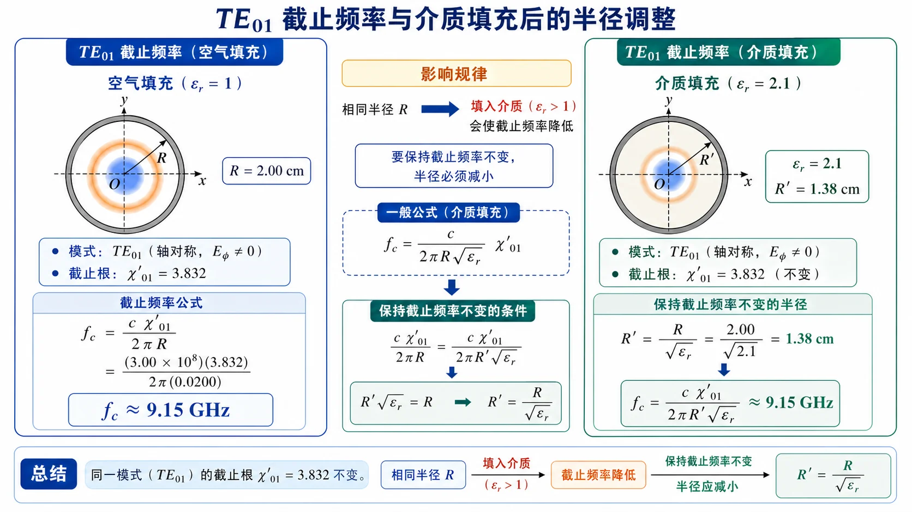

# 第 5 题：\(R=2\ \mathrm{cm}\) 的 \(\mathrm{TE}_{01}\) 截止频率及填充介质后的半径变化

> 对应知识点：[01-圆波导模式与贝塞尔根](../../../knowledge/06-圆波导同轴线微带线/01-圆波导模式与贝塞尔根.md)

**题目**：设有一空气填充的圆波导，其内半径 \(R=2\ \mathrm{cm}\)，传输波型为 \(\mathrm{TE}_{01}\)，对应的截止频率是多少？在该波导中填充相对介电常数为 2.1 的介质，若要保持截止频率不变，波导的半径应如何变化？

**对应知识点**：\(\mathrm{TE}_{01}\) 截止根、圆波导截止频率公式、均匀介质填充对截止频率的影响、保持 \(f_{\mathrm c}\) 不变时的尺寸缩放。

*图：同一半径下填入 \(\varepsilon_r>1\) 介质会降低截止频率；若题目要求截止频率不变，必须把半径按 \(R'=R/\sqrt{\varepsilon_r}\) 缩小。*

## 一、前置知识

\(\mathrm{TE}_{01}\) 模满足 \(J'_0(x)=0\)。由于 \(J'_0(x)=-J_1(x)\)，其第一根为

\[
\chi'_{01}=3.832.
\]

空气填充时

\[
f_{\mathrm c,\mathrm{TE}_{01}}=\frac{c\chi'_{01}}{2\pi R}.
\]

均匀填充相对介电常数 \(\varepsilon_r\)、且 \(\mu_r\approx1\) 的介质后，截止频率变为

\[
f'_{\mathrm c}=\frac{c\chi'_{01}}{2\pi R'\sqrt{\varepsilon_r}}.
\]

## 二、分析思路

第一问直接代入空气圆波导的截止频率公式。第二问要求介质填充后截止频率不变，所以令填充后的 \(f'_{\mathrm c}\) 等于原空气波导的 \(f_{\mathrm c}\)，解出新半径 \(R'\)。

## 三、标准解答

空气填充时

\[
f_{\mathrm c,\mathrm{TE}_{01}}
=\frac{c\chi'_{01}}{2\pi R}
=\frac{(3.00\times10^8)\times3.832}{2\pi\times0.020}
\approx 9.15\times10^9\ \mathrm{Hz}.
\]

所以

\[
\boxed{f_{\mathrm c,\mathrm{TE}_{01}}\approx 9.15\ \mathrm{GHz}}.
\]

填充 \(\varepsilon_r=2.1\) 后，若保持截止频率不变，则

\[
\frac{c\chi'_{01}}{2\pi R'\sqrt{\varepsilon_r}}
=\frac{c\chi'_{01}}{2\pi R}.
\]

两边约去相同因子，得

\[
R'\sqrt{\varepsilon_r}=R.
\]

因此

\[
R'=\frac{R}{\sqrt{\varepsilon_r}}
=\frac{2.00\ \mathrm{cm}}{\sqrt{2.1}}
\approx1.38\ \mathrm{cm}.
\]

## 四、结论与易错点

\[
\boxed{f_{\mathrm c,\mathrm{TE}_{01}}\approx 9.15\ \mathrm{GHz},\qquad R'\approx1.38\ \mathrm{cm}.}
\]

易错点：填充介质会降低同尺寸波导的截止频率；若要保持截止频率不变，半径应减小，而不是增大。
