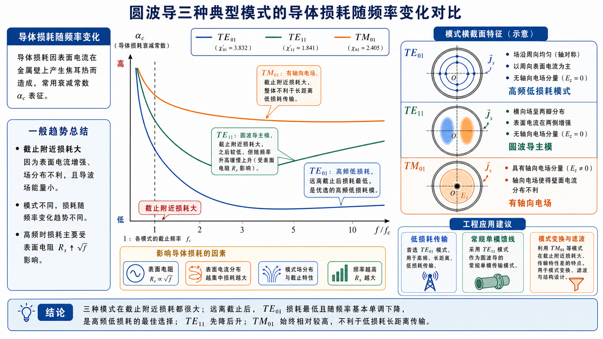

# 第 6 题：\(\mathrm{TE}_{01}\)、\(\mathrm{TE}_{11}\)、\(\mathrm{TM}_{01}\) 导体损耗随频率的变化与工程利用

**题目**：圆波导中 \(\mathrm{TE}_{01}\)、\(\mathrm{TE}_{11}\) 和 \(\mathrm{TM}_{01}\) 波型，它们的导体损耗系数随频率的变化特点各是什么，在实际中应如何利用这些特点？

**对应知识点**：圆波导导体损耗、表面电流分布、截止附近损耗、\(\mathrm{TE}_{01}\) 高频低损耗特性、主模与高次模工程取舍。

*图：三种模式靠近截止时损耗都偏大，但远离截止后趋势不同；\(\mathrm{TE}_{01}\) 适合高频低损耗传输，\(\mathrm{TE}_{11}\) 是常规主模，\(\mathrm{TM}_{01}\) 更常用于需要轴向电场的场景。*

## 一、前置知识

圆波导导体损耗来自有限电导率管壁上的表面电流。靠近截止频率时，波导群速度小，导体损耗通常较大；离开截止区后，不同模式因壁面电流分布不同，损耗随频率的变化趋势不同。

## 二、分析思路

本题是概念题，应分别说明 \(\mathrm{TE}_{01}\)、\(\mathrm{TE}_{11}\)、\(\mathrm{TM}_{01}\) 的损耗趋势，再说明工程利用。重点是突出 \(\mathrm{TE}_{01}\) 的高频低损耗特性，以及 \(\mathrm{TE}_{11}\) 作为主模的常规用途。

## 三、标准解答

**1. \(\mathrm{TE}_{01}\) 模**

\(\mathrm{TE}_{01}\) 是圆波导中的重要低损耗高次模。它的壁面电流主要为周向电流，适当高于截止频率后，导体衰减系数随频率升高反而下降；在高频近似下，其损耗下降趋势常可理解为比普通模式更快地减小。

工程利用：

- 适合用作高频、低损耗、较长距离或较高功率的圆波导传输模式；
- 因壁面电流不主要跨越横向接缝，对接头接触不良的敏感性较低；
- 但它不是圆波导主模，实际系统必须用模式变换器、模式滤波器和较高圆度的波导来抑制 \(\mathrm{TE}_{11}\)、\(\mathrm{TM}_{11}\) 等杂模。

**2. \(\mathrm{TE}_{11}\) 模**

\(\mathrm{TE}_{11}\) 是圆波导主模，截止频率最低。其导体衰减在截止附近较大，离开截止后先降低，通常存在一个较低损耗工作区；频率继续升高时，由于表面电阻 \(R_s\propto\sqrt f\) 增大，衰减又会逐渐上升。

工程利用：

- 适合普通圆波导馈线、天线馈源、圆极化或双极化结构；
- 设计单模圆波导时，常选择 \(\mathrm{TE}_{11}\) 工作在 \(\mathrm{TE}_{11}\) 截止频率以上、\(\mathrm{TM}_{01}\) 截止频率以下；
- 由于 \(\mathrm{TE}_{11}\) 有两个正交极化简并状态，实际结构要控制椭圆度、弯曲和馈电不对称，否则可能产生极化耦合。

**3. \(\mathrm{TM}_{01}\) 模**

\(\mathrm{TM}_{01}\) 模有纵向电场分量 \(E_z\)，壁面电流分布与 \(\mathrm{TE}_{01}\) 不同。其导体衰减同样在截止附近较大；离开截止后可下降到某一较小值，但频率进一步升高时通常随 \(R_s\) 的增加而上升，不能像 \(\mathrm{TE}_{01}\) 那样表现出持续降低的高频低损耗特性。

工程利用：

- 一般不把 \(\mathrm{TM}_{01}\) 作为远距离低损耗传输的优选模式；
- 当系统需要轴向电场或轴对称电场分布时，可利用 \(\mathrm{TM}_{01}\) 模，例如某些谐振腔、加速结构或特定模式变换结构；
- 若只需要低损耗传输，通常优先考虑 \(\mathrm{TE}_{01}\)；若需要主模单模传输，通常优先考虑 \(\mathrm{TE}_{11}\)。

## 四、结论与易错点

\[
\boxed{\mathrm{TE}_{01}\ \text{高频损耗可随频率升高而降低，适合低损耗传输；}}
\]

\[
\boxed{\mathrm{TE}_{11}\ \text{是圆波导主模，适合常规单模工作；}}
\]

\[
\boxed{\mathrm{TM}_{01}\ \text{有轴向电场，但不具备}\ \mathrm{TE}_{01}\ \text{的高频低损耗优势。}}
\]

易错点：不能因为 \(\mathrm{TE}_{01}\) 低损耗就把它当成主模；圆波导主模仍是 \(\mathrm{TE}_{11}\)。

---

## Lec19-20：同轴线与微带线

