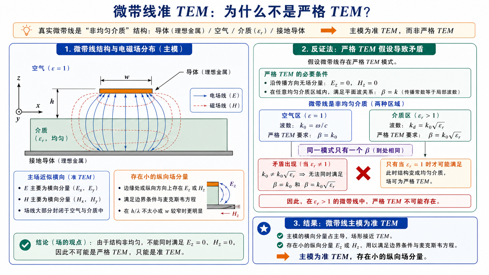

# 第 8 题：微带线的准 TEM 模及其纵向场分量

> 对应知识点：[03-微带线准TEM与有效介电常数](../../../knowledge/06-圆波导同轴线微带线/03-微带线准TEM与有效介电常数.md)

**题目**：什么是微带线的准 TEM 模？试证明：实际微带线中存在场具有纵向场分量，而不是纯 TEM 模。

**对应知识点**：微带线非均匀介质、严格 TEM 条件、同一模式传播常数唯一性、空气区与介质区本征波数不一致、纵向场分量来源。

*图：若微带线是严格 TEM，则空气区要求 \(\beta=k_0\)，介质区又要求 \(\beta=k_0\sqrt{\varepsilon_r}\)。同一模式不能同时满足两个不同的 \(\beta\)，所以实际主模只能是准 TEM。*

## 一、前置知识

微带线由金属带、介质基片和接地板组成。介质基片上方通常为空气，下方为介质，因此横截面介质并不均匀。纯 TEM 模要求

\[
E_z=0,\qquad H_z=0,
\]

且在每一个均匀介质区域中传播常数满足

\[
\beta=k=\omega\sqrt{\mu\varepsilon}.
\]

## 二、分析思路

先说明准 TEM 模的含义：主要场分量近似横向，但存在小的纵向分量。再用反证法证明：如果实际微带线是严格 TEM，则空气区和介质区必须具有同一个 \(\beta\)，但两区本征波数不同，因此矛盾。

## 三、标准解答

微带线主模的电磁场大部分仍近似横向分布，传播特性可用静电场或准静态场近似处理，因此称为**准 TEM 模**。

准 TEM 模的含义是：

- 主要场分量是横向场 \(E_t,H_t\)，纵向场 \(E_z,H_z\) 很小；
- 相速、特性阻抗、波导波长等可近似用等效相对介电常数 \(\varepsilon_{\mathrm{eff}}\) 描述；
- 由于结构是非均匀介质，主模不是严格 TEM，因而存在一定色散，且频率升高、电尺寸增大时纵向场分量更明显。

下面证明实际微带线不可能是严格纯 TEM。

若某一传输模式是严格 TEM，则

\[
E_z=0,\qquad H_z=0.
\]

在空气区域中，

\[
k_{\mathrm{air}}=\omega\sqrt{\mu_0\varepsilon_0}=k_0.
\]

在介质基片中，

\[
k_{\mathrm{sub}}=\omega\sqrt{\mu_0\varepsilon_0\varepsilon_r}
=k_0\sqrt{\varepsilon_r}.
\]

同一条微带线上的同一个导行模式只能有一个共同传播常数 \(\beta\)。若该模式是严格 TEM，则必须同时满足

\[
\beta=k_0
\]

和

\[
\beta=k_0\sqrt{\varepsilon_r}.
\]

当 \(\varepsilon_r\ne1\) 时，上述两个条件不能同时成立。因此，实际微带线在非均匀介质中不能支持严格纯 TEM 模。

为了满足空气-介质界面上的电磁场边界条件，实际微带线场必然含有小的纵向分量：

\[
\boxed{E_z\ne0\quad\text{或}\quad H_z\ne0}.
\]

## 四、结论与易错点

\[
\boxed{\text{微带线主模是准 TEM 模，不是严格 TEM 模。}}
\]

易错点：不能把“主场近似横向”理解成“完全没有纵向场”；非均匀介质结构决定了实际微带线只能近似 TEM。
