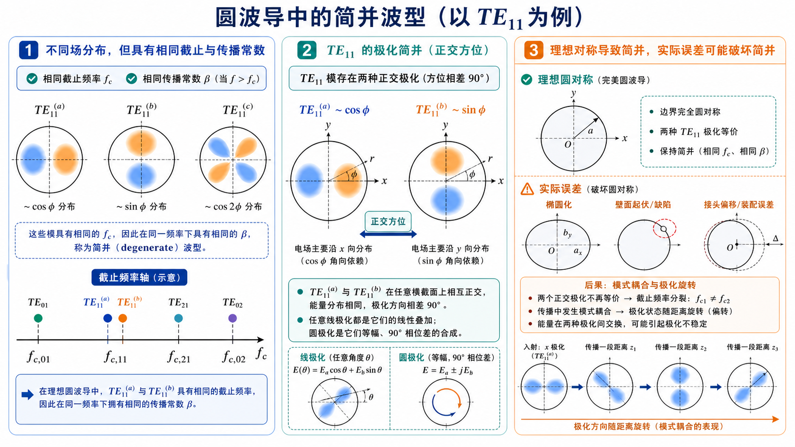
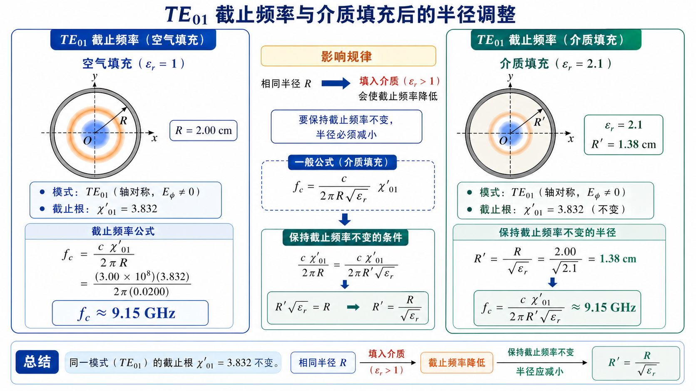
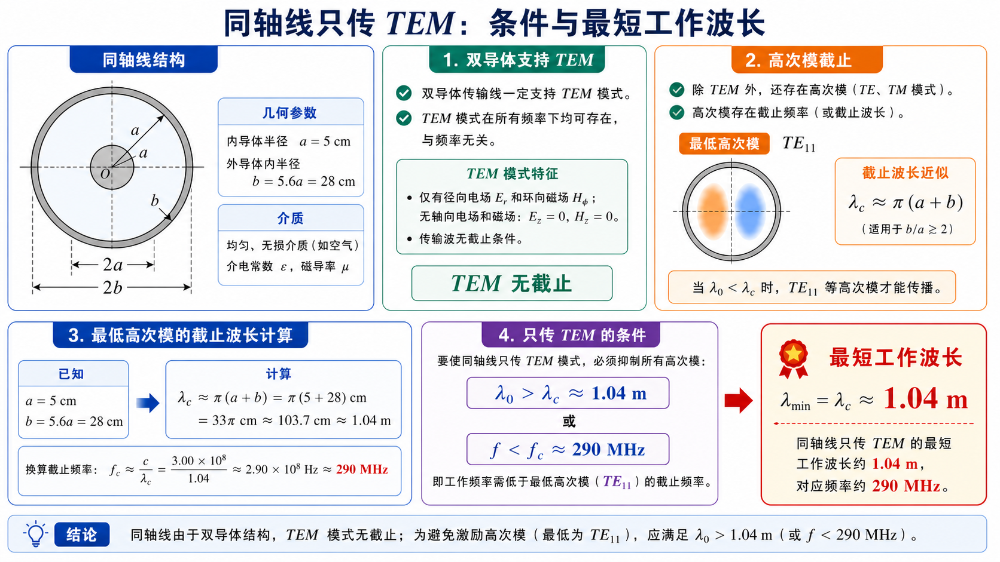
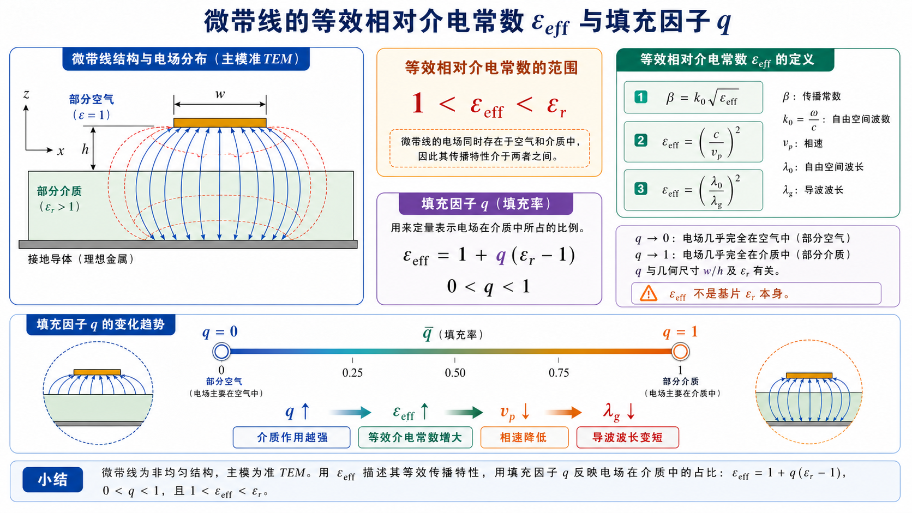

# 《微波技术基础》第四次作业标准解答

对应大纲：**《微波技术基础》第四次教学大纲及作业**（Lec17-18 圆波导；Lec19-20 同轴线与微带线）。

本解答按**每道题**统一写成：**题目**、**一、前置知识**、**二、分析思路**、**三、标准解答**、**四、结论与易错点**。统一取 \(c=3.00\times10^8\ \mathrm{m/s}\)，空气中 \(\lambda_0=c/f\)。圆波导半径记为 \(R\)；同轴线内导体外半径、外导体内半径分别记为 \(a,b\)。

圆波导中常用根值：

- \(\chi_{mn}\)：贝塞尔函数 \(J_m(x)\) 的第 \(n\) 个正零点，用于 \(\mathrm{TM}_{mn}\) 模；
- \(\chi'_{mn}\)：贝塞尔函数导数 \(J'_m(x)\) 的第 \(n\) 个正零点，用于 \(\mathrm{TE}_{mn}\) 模；
- 空气圆波导截止频率：

\[
f_{\mathrm c,\mathrm{TM}_{mn}}=\frac{c\chi_{mn}}{2\pi R},\qquad
f_{\mathrm c,\mathrm{TE}_{mn}}=\frac{c\chi'_{mn}}{2\pi R}.
\]

---

## Lec17-18：圆波导

### 第 1 题：圆波导中的波型指数 \(m,n\) 的意义，与矩形波导有何异同

**题目**：圆波导中的波型指数 \(m\) 和 \(n\) 的意义是什么，与矩形波导中的波型指数有何异同。

**对应知识点**：圆波导柱坐标分离变量、角向阶数 \(m\)、径向贝塞尔根序号 \(n\)、矩形波导横向半波数对比。

*图：圆波导的 \(m\) 看角向变化、\(n\) 看径向根序号；矩形波导的 \(m,n\) 更接近两个直角方向上的横向驻波阶数。*

#### 一、前置知识

圆波导用柱坐标 \((r,\varphi,z)\) 描述横截面场分布。对横向波动方程分离变量时，角向函数通常写成 \(\cos m\varphi\) 或 \(\sin m\varphi\)，径向函数写成贝塞尔函数 \(J_m(k_{\mathrm c}r)\)。

矩形波导用直角坐标描述横截面，波型指数通常直接对应宽边、窄边方向的驻波半周数；圆波导的横截面是圆形，边界条件会引出贝塞尔函数根。

#### 二、分析思路

先分别解释 \(m\)、\(n\) 在圆波导中的物理含义，再与矩形波导的 \(m,n\) 对照。关键是说明：矩形波导的指数与两个直角方向有关；圆波导的 \(m\) 与角向变化有关，\(n\) 与径向根序号有关。

#### 三、标准解答

圆波导中：

- \(m\) 表示场沿圆周方向的角向变化阶数。\(m=0\) 时场分布与 \(\varphi\) 无关，称为轴对称模；\(m\ge 1\) 时场沿圆周方向有 \(m\) 个周期性变化，并且通常存在 \(\cos m\varphi\)、\(\sin m\varphi\) 两种正交方位。
- \(n\) 表示径向方向满足边界条件的第 \(n\) 个正根，即从低到高的径向根序号。它不是简单的“半波个数”，而是由 \(J_m(x)=0\) 或 \(J'_m(x)=0\) 的根决定。

与矩形波导相比，相同点是：两类波导的波型指数都来自横向波动方程与导体边界条件，都决定截止波数 \(k_{\mathrm c}\)、截止频率 \(f_{\mathrm c}\)、截止波长 \(\lambda_{\mathrm c}\) 和场的横向分布。

不同点是：

- 矩形波导的 \(m,n\) 分别对应宽边、窄边方向的正弦或余弦半波变化，截止波数由 \((m\pi/a)^2+(n\pi/b)^2\) 给出；
- 圆波导的 \(m\) 是角向阶数，\(n\) 是贝塞尔函数根的序号，截止波数为 \(\chi_{mn}/R\) 或 \(\chi'_{mn}/R\)；
- 圆波导具有旋转对称性，所以 \(m\ge 1\) 的模式常有两个正交极化或方位简并状态；矩形波导因 \(a,b\) 两方向尺寸一般不同，这种旋转对称性不存在。

#### 四、结论与易错点

\[
\boxed{m\ \text{表示角向变化阶数，}n\ \text{表示径向贝塞尔根序号。}}
\]

易错点：不要把圆波导的 \(n\) 直接理解为“径向半波数”；它本质上是贝塞尔函数根的编号。

---

### 第 2 题：什么叫简并波型，这种波型有什么特点

**题目**：什么叫简并波型，这种波型有什么特点。

**对应知识点**：截止频率简并、传播常数简并、圆波导旋转对称性、\(\mathrm{TE}_{11}\) 两个正交极化、实际误差导致的模式耦合。

*图：理想圆波导中两个正交方位的 \(\mathrm{TE}_{11}\) 极化具有相同截止频率；实际椭圆度、接头偏移或馈电不对称会破坏这种理想简并。*

#### 一、前置知识

波导模式的传播特性由截止波数 \(k_{\mathrm c}\) 决定。在同一波导中，如果两个不同场分布或不同波型名称的模式具有相同 \(k_{\mathrm c}\)，它们就具有相同的截止频率和相同的传播常数表达式。

#### 二、分析思路

回答时应先给出简并的定义，再说明圆波导中常见的两种简并：极化简并和波型简并。最后说明简并模式在理想波导与实际波导中的工程特点。

#### 三、标准解答

简并波型是指不同场分布、不同极化方向或不同波型名称的模式，在同一波导中具有相同的截止波数 \(k_{\mathrm c}\)、截止频率 \(f_{\mathrm c}\)，因而在同一工作频率下具有相同的传播常数 \(\beta\)。

圆波导中常见两类简并：

- **极化简并**：当 \(m\ge 1\) 时，\(\cos m\varphi\) 与 \(\sin m\varphi\) 对应两个互相正交的方位分布。理想圆波导具有旋转对称性，这两个模式截止频率相同，例如 \(\mathrm{TE}_{11}\) 的两个正交极化。
- **波型简并（EH 简并）**：不同 TE/TM 波型可能因为贝塞尔函数根之间的关系而有相同截止频率。例如 \(J'_0(x)=-J_1(x)\)，所以 \(\mathrm{TE}_{0n}\) 与 \(\mathrm{TM}_{1n}\) 具有相同的截止根。

简并波型的特点是：

- 在理想、均匀、完全圆对称的波导中，它们可以独立存在，也可以任意线性组合；
- 它们的截止频率、相速、群速等传播参数相同；
- 实际波导存在椭圆度、弯曲、接头不连续、馈电不对称等误差时，简并模式之间容易发生耦合或极化旋转；
- 工程上若只希望激励某一种极化或某一种场分布，需要通过馈电结构、模式滤波器、极化保持结构或较高加工精度来抑制不需要的简并模。

#### 四、结论与易错点

\[
\boxed{\text{简并波型是不同场分布具有相同截止参量的模式。}}
\]

易错点：简并不是“同一个模式的不同名字”，而是场分布或极化状态不同，但截止频率相同。

---

### 第 3 题：圆波导单模传输的条件与对应波型

**题目**：圆波导的单模传输的条件是什么，单模传输对应的波型是什么。

**对应知识点**：圆波导主模、次低模、单模频率窗口、波长窗口、\(\mathrm{TE}_{11}\) 极化简并。

*图：单模不是“只要主模能传”就够了，还要第二个模式 \(\mathrm{TM}_{01}\) 仍截止；严格单极化还要额外控制馈电和结构对称性。*

#### 一、前置知识

空气圆波导中，\(\mathrm{TE}_{mn}\) 模的截止根为 \(J'_m(x)=0\) 的根，\(\mathrm{TM}_{mn}\) 模的截止根为 \(J_m(x)=0\) 的根。最低截止模式为 \(\mathrm{TE}_{11}\)，其截止根为

\[
\chi'_{11}=1.841.
\]

次低模式为 \(\mathrm{TM}_{01}\)，其截止根为

\[
\chi_{01}=2.405.
\]

#### 二、分析思路

“单模传输”要求最低模式 \(\mathrm{TE}_{11}\) 能导行，同时第二个模式 \(\mathrm{TM}_{01}\) 仍处于截止状态。因此把工作波数 \(k\)、工作频率 \(f\) 或工作波长 \(\lambda_0\) 放在这两个截止边界之间即可。

#### 三、标准解答

按波数表示，单模工作条件为

\[
\frac{\chi'_{11}}{R}<k<\frac{\chi_{01}}{R}.
\]

按频率表示为

\[
f_{\mathrm c,\mathrm{TE}_{11}}<f<f_{\mathrm c,\mathrm{TM}_{01}}.
\]

按空气中工作波长表示为

\[
\frac{2\pi R}{\chi_{01}}<\lambda_0<\frac{2\pi R}{\chi'_{11}}.
\]

对应的传输波型为 \(\mathrm{TE}_{11}\) 模。

需要注意：\(\mathrm{TE}_{11}\) 本身具有两个正交极化状态。很多教材说圆波导“单模传输”时，是指只传输 \(\mathrm{TE}_{11}\) 这一最低波型族；若要求严格的单一极化，还必须由馈电结构和波导加工精度控制其中一个极化。

#### 四、结论与易错点

\[
\boxed{\mathrm{TE}_{11}\ \text{为圆波导主模，单模区为}\ f_{\mathrm c,\mathrm{TE}_{11}}<f<f_{\mathrm c,\mathrm{TM}_{01}}.}
\]

易错点：不要把 \(\mathrm{TM}_{01}\) 当成最低模式；圆波导主模是 \(\mathrm{TE}_{11}\)。

---

### 第 4 题：\(R=1.5\ \mathrm{cm}\)、\(f=10\ \mathrm{GHz}\) 时可能存在的波型

**题目**：设有一空气填充的圆波导，其内半径 \(R=1.5\ \mathrm{cm}\)，若电磁波的频率 \(f=10\ \mathrm{GHz}\)，问：若该电磁波在该波导中传输，可能存在哪些波型？

**对应知识点**：圆波导可导行判据、归一化工作点 \(kR\)、低阶截止根比较、可传输模式枚举。

*图：本题的工作点是 \(kR=\pi\)。把低阶截止根逐个放到同一条数轴上比较，根小于 \(kR\) 的模式可导行，根大于 \(kR\) 的模式截止。*

#### 一、前置知识

圆波导模式可导行的条件是 \(f>f_{\mathrm c}\)，等价地

\[
kR>\text{该模式对应的截止根}.
\]

常用低阶根如下：

- \(\mathrm{TE}_{11}\)：\(\chi'_{11}=1.841\)；
- \(\mathrm{TM}_{01}\)：\(\chi_{01}=2.405\)；
- \(\mathrm{TE}_{21}\)：\(\chi'_{21}=3.054\)；
- \(\mathrm{TE}_{01}\)、\(\mathrm{TM}_{11}\)：对应根约为 \(3.832\)。

#### 二、分析思路

先求工作波长和 \(kR\)，再把 \(kR\) 与各模式的截止根比较。截止根小于 \(kR\) 的模式可传输，截止根大于 \(kR\) 的模式不能传输。

#### 三、标准解答

空气中工作波长为

\[
\lambda_0=\frac{c}{f}=\frac{3.00\times10^8}{10\times10^9}
=3.00\ \mathrm{cm}.
\]

所以

\[
kR=\frac{2\pi R}{\lambda_0}
=\frac{2\pi\times1.5}{3.00}
=\pi.
\]

逐个比较低阶根：

- \(\mathrm{TE}_{11}\)：\(\chi'_{11}=1.841<\pi\)，\(f_{\mathrm c}\approx 5.86\ \mathrm{GHz}\)，可传输；
- \(\mathrm{TM}_{01}\)：\(\chi_{01}=2.405<\pi\)，\(f_{\mathrm c}\approx 7.65\ \mathrm{GHz}\)，可传输；
- \(\mathrm{TE}_{21}\)：\(\chi'_{21}=3.054<\pi\)，\(f_{\mathrm c}\approx 9.72\ \mathrm{GHz}\)，可传输；
- \(\mathrm{TE}_{01}\) 与 \(\mathrm{TM}_{11}\)：对应根约为 \(3.832>\pi\)，截止频率约为 \(12.2\ \mathrm{GHz}\)，不能传输。

因此在 \(R=1.5\ \mathrm{cm}\)、\(f=10\ \mathrm{GHz}\) 的空气圆波导中，可能存在的低阶传输波型为

\[
\boxed{\mathrm{TE}_{11},\quad \mathrm{TM}_{01},\quad \mathrm{TE}_{21}}.
\]

#### 四、结论与易错点

若按独立场分布计数，\(\mathrm{TE}_{11}\) 与 \(\mathrm{TE}_{21}\) 各有两个正交方位简并状态；若按常用波型名称列举，则列出 \(\mathrm{TE}_{11}\)、\(\mathrm{TM}_{01}\)、\(\mathrm{TE}_{21}\) 三类即可。

易错点：不能只判断主模；本题 \(10\ \mathrm{GHz}\) 已高于 \(\mathrm{TE}_{21}\) 的截止频率，所以不是单模。

---

### 第 5 题：\(R=2\ \mathrm{cm}\) 的 \(\mathrm{TE}_{01}\) 截止频率及填充介质后的半径变化

**题目**：设有一空气填充的圆波导，其内半径 \(R=2\ \mathrm{cm}\)，传输波型为 \(\mathrm{TE}_{01}\)，对应的截止频率是多少？在该波导中填充相对介电常数为 2.1 的介质，若要保持截止频率不变，波导的半径应如何变化？

**对应知识点**：\(\mathrm{TE}_{01}\) 截止根、圆波导截止频率公式、均匀介质填充对截止频率的影响、保持 \(f_{\mathrm c}\) 不变时的尺寸缩放。

*图：同一半径下填入 \(\varepsilon_r>1\) 介质会降低截止频率；若题目要求截止频率不变，必须把半径按 \(R'=R/\sqrt{\varepsilon_r}\) 缩小。*

#### 一、前置知识

\(\mathrm{TE}_{01}\) 模满足 \(J'_0(x)=0\)。由于 \(J'_0(x)=-J_1(x)\)，其第一根为

\[
\chi'_{01}=3.832.
\]

空气填充时

\[
f_{\mathrm c,\mathrm{TE}_{01}}=\frac{c\chi'_{01}}{2\pi R}.
\]

均匀填充相对介电常数 \(\varepsilon_r\)、且 \(\mu_r\approx1\) 的介质后，截止频率变为

\[
f'_{\mathrm c}=\frac{c\chi'_{01}}{2\pi R'\sqrt{\varepsilon_r}}.
\]

#### 二、分析思路

第一问直接代入空气圆波导的截止频率公式。第二问要求介质填充后截止频率不变，所以令填充后的 \(f'_{\mathrm c}\) 等于原空气波导的 \(f_{\mathrm c}\)，解出新半径 \(R'\)。

#### 三、标准解答

空气填充时

\[
f_{\mathrm c,\mathrm{TE}_{01}}
=\frac{c\chi'_{01}}{2\pi R}
=\frac{(3.00\times10^8)\times3.832}{2\pi\times0.020}
\approx 9.15\times10^9\ \mathrm{Hz}.
\]

所以

\[
\boxed{f_{\mathrm c,\mathrm{TE}_{01}}\approx 9.15\ \mathrm{GHz}}.
\]

填充 \(\varepsilon_r=2.1\) 后，若保持截止频率不变，则

\[
\frac{c\chi'_{01}}{2\pi R'\sqrt{\varepsilon_r}}
=\frac{c\chi'_{01}}{2\pi R}.
\]

两边约去相同因子，得

\[
R'\sqrt{\varepsilon_r}=R.
\]

因此

\[
R'=\frac{R}{\sqrt{\varepsilon_r}}
=\frac{2.00\ \mathrm{cm}}{\sqrt{2.1}}
\approx1.38\ \mathrm{cm}.
\]

#### 四、结论与易错点

\[
\boxed{f_{\mathrm c,\mathrm{TE}_{01}}\approx 9.15\ \mathrm{GHz},\qquad R'\approx1.38\ \mathrm{cm}.}
\]

易错点：填充介质会降低同尺寸波导的截止频率；若要保持截止频率不变，半径应减小，而不是增大。

---

### 第 6 题：\(\mathrm{TE}_{01}\)、\(\mathrm{TE}_{11}\)、\(\mathrm{TM}_{01}\) 导体损耗随频率的变化与工程利用

**题目**：圆波导中 \(\mathrm{TE}_{01}\)、\(\mathrm{TE}_{11}\) 和 \(\mathrm{TM}_{01}\) 波型，它们的导体损耗系数随频率的变化特点各是什么，在实际中应如何利用这些特点？

**对应知识点**：圆波导导体损耗、表面电流分布、截止附近损耗、\(\mathrm{TE}_{01}\) 高频低损耗特性、主模与高次模工程取舍。

*图：三种模式靠近截止时损耗都偏大，但远离截止后趋势不同；\(\mathrm{TE}_{01}\) 适合高频低损耗传输，\(\mathrm{TE}_{11}\) 是常规主模，\(\mathrm{TM}_{01}\) 更常用于需要轴向电场的场景。*

#### 一、前置知识

圆波导导体损耗来自有限电导率管壁上的表面电流。靠近截止频率时，波导群速度小，导体损耗通常较大；离开截止区后，不同模式因壁面电流分布不同，损耗随频率的变化趋势不同。

#### 二、分析思路

本题是概念题，应分别说明 \(\mathrm{TE}_{01}\)、\(\mathrm{TE}_{11}\)、\(\mathrm{TM}_{01}\) 的损耗趋势，再说明工程利用。重点是突出 \(\mathrm{TE}_{01}\) 的高频低损耗特性，以及 \(\mathrm{TE}_{11}\) 作为主模的常规用途。

#### 三、标准解答

**1. \(\mathrm{TE}_{01}\) 模**

\(\mathrm{TE}_{01}\) 是圆波导中的重要低损耗高次模。它的壁面电流主要为周向电流，适当高于截止频率后，导体衰减系数随频率升高反而下降；在高频近似下，其损耗下降趋势常可理解为比普通模式更快地减小。

工程利用：

- 适合用作高频、低损耗、较长距离或较高功率的圆波导传输模式；
- 因壁面电流不主要跨越横向接缝，对接头接触不良的敏感性较低；
- 但它不是圆波导主模，实际系统必须用模式变换器、模式滤波器和较高圆度的波导来抑制 \(\mathrm{TE}_{11}\)、\(\mathrm{TM}_{11}\) 等杂模。

**2. \(\mathrm{TE}_{11}\) 模**

\(\mathrm{TE}_{11}\) 是圆波导主模，截止频率最低。其导体衰减在截止附近较大，离开截止后先降低，通常存在一个较低损耗工作区；频率继续升高时，由于表面电阻 \(R_s\propto\sqrt f\) 增大，衰减又会逐渐上升。

工程利用：

- 适合普通圆波导馈线、天线馈源、圆极化或双极化结构；
- 设计单模圆波导时，常选择 \(\mathrm{TE}_{11}\) 工作在 \(\mathrm{TE}_{11}\) 截止频率以上、\(\mathrm{TM}_{01}\) 截止频率以下；
- 由于 \(\mathrm{TE}_{11}\) 有两个正交极化简并状态，实际结构要控制椭圆度、弯曲和馈电不对称，否则可能产生极化耦合。

**3. \(\mathrm{TM}_{01}\) 模**

\(\mathrm{TM}_{01}\) 模有纵向电场分量 \(E_z\)，壁面电流分布与 \(\mathrm{TE}_{01}\) 不同。其导体衰减同样在截止附近较大；离开截止后可下降到某一较小值，但频率进一步升高时通常随 \(R_s\) 的增加而上升，不能像 \(\mathrm{TE}_{01}\) 那样表现出持续降低的高频低损耗特性。

工程利用：

- 一般不把 \(\mathrm{TM}_{01}\) 作为远距离低损耗传输的优选模式；
- 当系统需要轴向电场或轴对称电场分布时，可利用 \(\mathrm{TM}_{01}\) 模，例如某些谐振腔、加速结构或特定模式变换结构；
- 若只需要低损耗传输，通常优先考虑 \(\mathrm{TE}_{01}\)；若需要主模单模传输，通常优先考虑 \(\mathrm{TE}_{11}\)。

#### 四、结论与易错点

\[
\boxed{\mathrm{TE}_{01}\ \text{高频损耗可随频率升高而降低，适合低损耗传输；}}
\]

\[
\boxed{\mathrm{TE}_{11}\ \text{是圆波导主模，适合常规单模工作；}}
\]

\[
\boxed{\mathrm{TM}_{01}\ \text{有轴向电场，但不具备}\ \mathrm{TE}_{01}\ \text{的高频低损耗优势。}}
\]

易错点：不能因为 \(\mathrm{TE}_{01}\) 低损耗就把它当成主模；圆波导主模仍是 \(\mathrm{TE}_{11}\)。

---

## Lec19-20：同轴线与微带线

### 第 7 题：同轴线只传输 TEM 模的条件与最短工作波长

**题目**：欲在同轴线中只传输 TEM 波型，其条件是什么；若一个空气填充的同轴线，其内导体的外半径 \(a=5\ \mathrm{cm}\)，外导体的内半径 \(b=5.6a\)，求只传输 TEM 波型时，最短的工作波长应等于多少？

**对应知识点**：双导体 TEM 模、同轴线高次模截止、最低高次模近似、只传 TEM 的工作波长/频率窗口。

*图：TEM 本身无截止，但同轴线仍有高次模。要“只传 TEM”，工作波长必须大于最低高次模的截止波长，本题用 \(\lambda_{\mathrm c}\approx\pi(a+b)\) 得到约 \(1.04\,\mathrm m\)。*

#### 一、前置知识

同轴线是双导体传输线，可以传输无截止频率的 TEM 模。但同轴线也存在 TE、TM 高次模；若频率过高，高次模达到截止条件后也会传播。

空气同轴线最低高次模通常为 \(\mathrm{TE}_{11}\)，工程教材常用近似式为

\[
\lambda_{\mathrm c,\mathrm{TE}_{11}}\approx\pi(a+b).
\]

#### 二、分析思路

只传输 TEM 模，就是要求所有高次模都截止。只需工作频率低于最低高次模截止频率，或工作波长大于最低高次模截止波长。题中已给 \(a=5\ \mathrm{cm}\)、\(b=5.6a\)，代入 \(\pi(a+b)\) 即可。

#### 三、标准解答

只传输 TEM 模的条件为

\[
f<f_{\mathrm c,1},
\]

等价地

\[
\lambda_0>\lambda_{\mathrm c,1}.
\]

其中 \(\lambda_{\mathrm c,1}\) 是最低高次模的截止波长。由题设

\[
a=5\ \mathrm{cm},\qquad b=5.6a=28\ \mathrm{cm}.
\]

因此

\[
\lambda_{\mathrm c,\mathrm{TE}_{11}}
\approx \pi(5+28)\ \mathrm{cm}
=103.7\ \mathrm{cm}
=1.04\ \mathrm{m}.
\]

所以只传输 TEM 波型时，工作波长应满足

\[
\lambda_0>1.04\ \mathrm{m}.
\]

题目所问“最短的工作波长”可取为截止边界值

\[
\boxed{\lambda_{\min}\approx1.04\ \mathrm{m}}.
\]

对应最高工作频率约为

\[
f<\frac{c}{1.04\ \mathrm{m}}\approx2.9\times10^8\ \mathrm{Hz}
\approx 290\ \mathrm{MHz}.
\]

#### 四、结论与易错点

\[
\boxed{\lambda_0>1.04\ \mathrm{m}\quad\text{时可近似保证只传输 TEM 模。}}
\]

补充：若直接求解同轴线 TE/TM 高次模的贝塞尔函数特征方程，本尺寸下最低高次模仍为 \(\mathrm{TE}_{11}\)，截止波长约为 \(1.02\ \mathrm{m}\)。课堂作业通常采用 \(\lambda_{\mathrm c}\approx\pi(a+b)\) 的工程近似，所以标准数值写作 \(1.04\ \mathrm{m}\) 更符合教材算法。

易错点：TEM 模本身无截止频率，但“只传 TEM”仍受高次模截止条件限制。

---

### 第 8 题：微带线的准 TEM 模及其纵向场分量

**题目**：什么是微带线的准 TEM 模？试证明：实际微带线中存在场具有纵向场分量，而不是纯 TEM 模。

**对应知识点**：微带线非均匀介质、严格 TEM 条件、同一模式传播常数唯一性、空气区与介质区本征波数不一致、纵向场分量来源。

*图：若微带线是严格 TEM，则空气区要求 \(\beta=k_0\)，介质区又要求 \(\beta=k_0\sqrt{\varepsilon_r}\)。同一模式不能同时满足两个不同的 \(\beta\)，所以实际主模只能是准 TEM。*

#### 一、前置知识

微带线由金属带、介质基片和接地板组成。介质基片上方通常为空气，下方为介质，因此横截面介质并不均匀。纯 TEM 模要求

\[
E_z=0,\qquad H_z=0,
\]

且在每一个均匀介质区域中传播常数满足

\[
\beta=k=\omega\sqrt{\mu\varepsilon}.
\]

#### 二、分析思路

先说明准 TEM 模的含义：主要场分量近似横向，但存在小的纵向分量。再用反证法证明：如果实际微带线是严格 TEM，则空气区和介质区必须具有同一个 \(\beta\)，但两区本征波数不同，因此矛盾。

#### 三、标准解答

微带线主模的电磁场大部分仍近似横向分布，传播特性可用静电场或准静态场近似处理，因此称为**准 TEM 模**。

准 TEM 模的含义是：

- 主要场分量是横向场 \(E_t,H_t\)，纵向场 \(E_z,H_z\) 很小；
- 相速、特性阻抗、波导波长等可近似用等效相对介电常数 \(\varepsilon_{\mathrm{eff}}\) 描述；
- 由于结构是非均匀介质，主模不是严格 TEM，因而存在一定色散，且频率升高、电尺寸增大时纵向场分量更明显。

下面证明实际微带线不可能是严格纯 TEM。

若某一传输模式是严格 TEM，则

\[
E_z=0,\qquad H_z=0.
\]

在空气区域中，

\[
k_{\mathrm{air}}=\omega\sqrt{\mu_0\varepsilon_0}=k_0.
\]

在介质基片中，

\[
k_{\mathrm{sub}}=\omega\sqrt{\mu_0\varepsilon_0\varepsilon_r}
=k_0\sqrt{\varepsilon_r}.
\]

同一条微带线上的同一个导行模式只能有一个共同传播常数 \(\beta\)。若该模式是严格 TEM，则必须同时满足

\[
\beta=k_0
\]

和

\[
\beta=k_0\sqrt{\varepsilon_r}.
\]

当 \(\varepsilon_r\ne1\) 时，上述两个条件不能同时成立。因此，实际微带线在非均匀介质中不能支持严格纯 TEM 模。

为了满足空气-介质界面上的电磁场边界条件，实际微带线场必然含有小的纵向分量：

\[
\boxed{E_z\ne0\quad\text{或}\quad H_z\ne0}.
\]

#### 四、结论与易错点

\[
\boxed{\text{微带线主模是准 TEM 模，不是严格 TEM 模。}}
\]

易错点：不能把“主场近似横向”理解成“完全没有纵向场”；非均匀介质结构决定了实际微带线只能近似 TEM。

---

### 第 9 题：等效相对介电常数、定义、含义及填充因子计算

**题目**：什么是等效相对介电常数，是如何定义的？含义是什么？如何用介质的相对介电常数和填充因子计算等效相对介电常数？

**对应知识点**：微带线等效均匀化、传播常数定义、相速与导波波长定义、填充因子 \(q\)、\(\varepsilon_{\mathrm{eff}}\) 与 \(\varepsilon_r\) 的区别。

*图：\(\varepsilon_{\mathrm{eff}}\) 描述“部分空气、部分介质”的等效传播结果，不是基片 \(\varepsilon_r\) 本身；\(q\) 越大，介质影响越强，相速越低，导波波长越短。*

#### 一、前置知识

微带线的场一部分在介质基片中，一部分在空气中。为了用类似均匀传输线的形式描述其主模传播，常引入等效相对介电常数 \(\varepsilon_{\mathrm{eff}}\)。它通常满足

\[
1<\varepsilon_{\mathrm{eff}}<\varepsilon_r.
\]

#### 二、分析思路

从传播常数、相速或导波波长给出 \(\varepsilon_{\mathrm{eff}}\) 的定义，再说明它的物理含义。最后引入填充因子 \(q\)，把空气与介质的贡献写成加权平均。

#### 三、标准解答

等效相对介电常数的定义可从传播常数或相速给出：

\[
\beta=k_0\sqrt{\varepsilon_{\mathrm{eff}}},
\]

即

\[
\varepsilon_{\mathrm{eff}}
=\left(\frac{\beta}{k_0}\right)^2
=\left(\frac{c}{v_{\mathrm p}}\right)^2
=\left(\frac{\lambda_0}{\lambda_{\mathrm g}}\right)^2.
\]

其中 \(v_{\mathrm p}\) 为微带线相速，\(\lambda_{\mathrm g}\) 为微带线中的导波波长。

等效相对介电常数的物理含义是：用一个均匀填充、相对介电常数为 \(\varepsilon_{\mathrm{eff}}\) 的等效介质，替代实际“部分空气、部分介质”的非均匀横截面，使其具有相同或近似相同的相速、传播常数和单位长度电容。

若引入填充因子 \(q\)，表示电场能量或等效电容受介质影响的比例，则

\[
q=\frac{\varepsilon_{\mathrm{eff}}-1}{\varepsilon_r-1},\qquad 0<q<1.
\]

因此

\[
\boxed{\varepsilon_{\mathrm{eff}}=1+q(\varepsilon_r-1)}
\]

也可写成

\[
\varepsilon_{\mathrm{eff}}=(1-q)\cdot1+q\varepsilon_r.
\]

该式说明：

- \(q=0\) 表示场几乎都在空气中，\(\varepsilon_{\mathrm{eff}}\approx1\)；
- \(q=1\) 表示场等效上完全在介质中，\(\varepsilon_{\mathrm{eff}}\approx\varepsilon_r\)；
- 实际微带线 \(0<q<1\)，所以 \(\varepsilon_{\mathrm{eff}}\) 介于 \(1\) 与 \(\varepsilon_r\) 之间；
- \(q\) 越大，电场越多集中在介质中，\(\varepsilon_{\mathrm{eff}}\) 越大，相速越低，导波波长越短。

#### 四、结论与易错点

\[
\boxed{\varepsilon_{\mathrm{eff}}=1+q(\varepsilon_r-1),\qquad 1<\varepsilon_{\mathrm{eff}}<\varepsilon_r.}
\]

易错点：\(\varepsilon_{\mathrm{eff}}\) 不是基片介电常数 \(\varepsilon_r\) 本身，而是空气区和介质区共同作用后的等效值。
