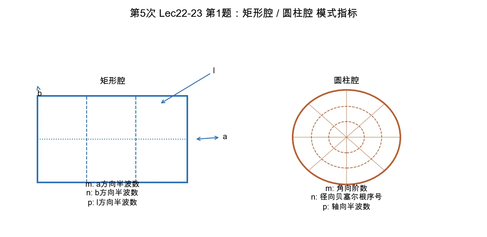

# 第 1 题：谐振腔模式指标 \(m,n,p\) 的物理含义

> 对应知识点：[01-微波谐振器与谐振腔](../../../knowledge/08-谐振器网络与课程综合/01-微波谐振器与谐振腔.md)

**题目**：矩形谐振腔和圆形谐振腔中 \(\mathrm{TE}_{mnp}\)、\(\mathrm{TM}_{mnp}\) 模式中的 \(m\)、\(n\)、\(p\) 有什么物理含义，取值范围分别是什么？

*图：矩形腔的 \(m,n,p\) 对应三个几何方向的驻波次数；圆柱腔的 \(m,n,p\) 分别对应角向阶数、径向根序号和轴向半波数。*

## 一、前置知识

谐振腔的模式编号用于描述场在三个方向上的驻波分布。TE/TM 指的是相对轴向参考方向的纵向场分量：

- TE：纵向电场为零；
- TM：纵向磁场为零。

## 二、标准解答

### 1. 矩形谐振腔

设矩形腔尺寸为 \(a\times b\times l\)，三个指标分别对应三个几何方向：

| 指标 | 物理含义 |
|------|----------|
| \(m\) | 沿宽边 \(a\) 方向的半波变化次数 |
| \(n\) | 沿窄边 \(b\) 方向的半波变化次数 |
| \(p\) | 沿腔长 \(l\) 方向的半波变化次数 |

常用谐振频率写成

\[
f_{mnp}=\frac{c}{2}\sqrt{
\left(\frac{m}{a}\right)^2+
\left(\frac{n}{b}\right)^2+
\left(\frac{p}{l}\right)^2}.
\]

取值口径：

- TE 模：\(m,n,p\) 可出现零指标，但不能全部为零；在本课程的波导短路腔约定中，\(\mathrm{TE}_{101}\) 是矩形腔主模，说明 \(n=0\) 是允许的。
- TM 模：由于纵向电场还要满足金属壁边界，通常要求横向指标为正整数；基础题中可记为 \(m,n,p=1,2,\ldots\)。

### 2. 圆柱谐振腔

设圆柱腔半径 \(R\)、长度 \(l\)，三个指标含义为：

| 指标 | 物理含义 |
|------|----------|
| \(m\) | 角向变化阶数，即绕圆周的场分布阶数 |
| \(n\) | 径向贝塞尔根序号，即从中心到壁面方向的第 \(n\) 个根 |
| \(p\) | 轴向半波变化次数 |

圆柱腔的横向根为：

\[
k_{c,\mathrm{TM}_{mn}}=\frac{\chi_{mn}}{R},\qquad
k_{c,\mathrm{TE}_{mn}}=\frac{\chi'_{mn}}{R}.
\]

取值口径：

- \(m=0,1,2,\ldots\)，表示角向阶数；
- \(n=1,2,\ldots\)，表示第几个径向根；
- \(p=0,1,2,\ldots\)，其中 \(\mathrm{TM}_{010}\) 是典型的 \(p=0\) 模式；TE 模在常见腔模题中多从 \(p=1\) 的 \(\mathrm{TE}_{111}\)、\(\mathrm{TE}_{011}\) 等开始讨论。

## 三、结论与易错点

矩形腔的 \(m,n,p\) 对应三个直角坐标方向的驻波次数；圆柱腔的 \(m,n,p\) 分别对应角向阶数、径向根序号和轴向驻波次数。

易错点：圆柱腔的 \(n\) 不是“沿某条直线的半波数”，而是贝塞尔函数根的编号；TE 用导数根 \(\chi'_{mn}\)，TM 用函数根 \(\chi_{mn}\)。
