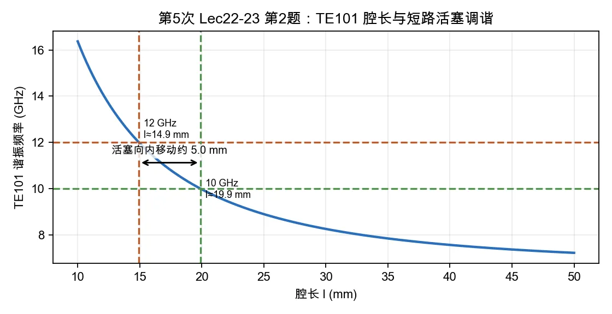

# 第 2 题：BJ-100 \(\mathrm{TE}_{101}\) 矩形腔长度与短路活塞调谐

> 对应知识点：[01-微波谐振器与谐振腔](../../../knowledge/08-谐振器网络与课程综合/01-微波谐振器与谐振腔.md)

**题目**：用 BJ-100（\(a=22.86\,\mathrm{mm}\)，\(b=10.16\,\mathrm{mm}\)）波导制成的 \(\mathrm{TE}_{101}\) 模式矩形腔，要求其谐振频率为 \(10\,\mathrm{GHz}\)，腔体长度 \(l\) 应为多少？在 \(z=l\) 端用理想导体短路活塞调谐，要求将其谐振频率调节为 \(12\,\mathrm{GHz}\)，短路活塞应移动多少距离？

*图：\(\mathrm{TE}_{101}\) 矩形腔腔长越短，谐振频率越高；从 10 GHz 调到 12 GHz 需要把短路活塞向腔内移动约 5.0 mm。*

## 一、前置知识

矩形腔 \(\mathrm{TE}_{101}\) 模的谐振频率为

\[
f=\frac{c}{2}\sqrt{
\left(\frac{1}{a}\right)^2+
\left(\frac{1}{l}\right)^2}.
\]

该模式频率不显含 \(b\)。短路活塞向内移动会缩短有效腔长，使谐振频率升高。

## 二、标准解答

由上式解 \(l\)：

\[
\frac{1}{l}=
\sqrt{\left(\frac{2f}{c}\right)^2-\left(\frac{1}{a}\right)^2}.
\]

当 \(f_1=10\,\mathrm{GHz}\)、\(a=22.86\,\mathrm{mm}=0.02286\,\mathrm{m}\) 时，

\[
\frac{2f_1}{c}=66.67\,\mathrm{m^{-1}},\qquad
\frac{1}{a}=43.74\,\mathrm{m^{-1}}.
\]

\[
l_1=
\frac{1}{\sqrt{66.67^2-43.74^2}}
\approx 1.99\times10^{-2}\,\mathrm{m}.
\]

所以

\[
\boxed{l_1\approx 19.9\,\mathrm{mm}}.
\]

当目标频率调为 \(f_2=12\,\mathrm{GHz}\) 时，

\[
l_2=
\frac{1}{\sqrt{80.00^2-43.74^2}}
\approx 1.49\times10^{-2}\,\mathrm{m}.
\]

即

\[
\boxed{l_2\approx 14.9\,\mathrm{mm}}.
\]

短路活塞需要把腔长从 \(l_1\) 缩短到 \(l_2\)，移动量为

\[
\Delta l=l_1-l_2\approx 19.9-14.9=5.0\,\mathrm{mm}.
\]

## 三、结论与易错点

\[
\boxed{l\approx19.9\,\mathrm{mm},\qquad \Delta l\approx5.0\,\mathrm{mm}\ \text{向腔内移动}.}
\]

易错点：频率从 \(10\,\mathrm{GHz}\) 升到 \(12\,\mathrm{GHz}\)，有效腔长必须变短；不要把活塞移动方向写反。
