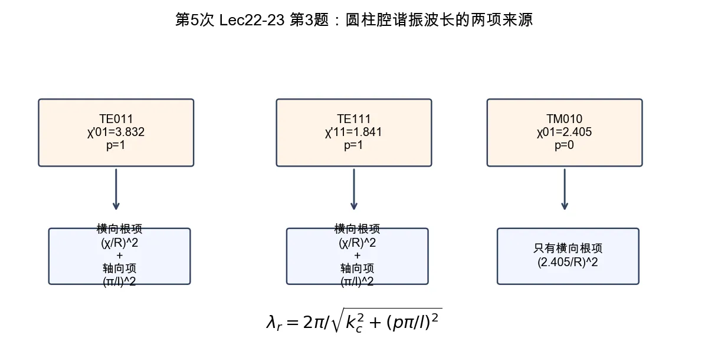

# 第 3 题：圆柱谐振腔三种模式的谐振波长

> 对应知识点：[01-微波谐振器与谐振腔](../../../knowledge/08-谐振器网络与课程综合/01-微波谐振器与谐振腔.md)

**题目**：对于半径为 \(R\)、长度为 \(l\) 的圆形谐振腔，求 \(\mathrm{TE}_{011}\)、\(\mathrm{TE}_{111}\)、\(\mathrm{TM}_{010}\) 模的谐振波长。

*图：圆柱腔谐振波长由横向贝塞尔根项和轴向驻波项共同决定；\(\mathrm{TM}_{010}\) 是 \(p=0\) 的常见特例。*

## 一、前置知识

圆柱腔中

\[
k^2=k_c^2+\left(\frac{p\pi}{l}\right)^2,\qquad
\lambda_r=\frac{2\pi}{k}.
\]

TE 模使用贝塞尔导数根 \(\chi'_{mn}\)，TM 模使用贝塞尔函数根 \(\chi_{mn}\)。

## 二、标准解答

### 1. \(\mathrm{TE}_{011}\)

该模式使用 \(\chi'_{01}=3.832\)，且 \(p=1\)：

\[
k_{\mathrm{TE}_{011}}
=\sqrt{\left(\frac{3.832}{R}\right)^2+\left(\frac{\pi}{l}\right)^2}.
\]

\[
\boxed{
\lambda_{\mathrm{TE}_{011}}
=\frac{2\pi}{
\sqrt{(3.832/R)^2+(\pi/l)^2}
}}
\]

### 2. \(\mathrm{TE}_{111}\)

该模式使用 \(\chi'_{11}=1.841\)，且 \(p=1\)：

\[
\boxed{
\lambda_{\mathrm{TE}_{111}}
=\frac{2\pi}{
\sqrt{(1.841/R)^2+(\pi/l)^2}
}}
\]

### 3. \(\mathrm{TM}_{010}\)

该模式使用 \(\chi_{01}=2.405\)，且 \(p=0\)：

\[
k_{\mathrm{TM}_{010}}=\frac{2.405}{R}.
\]

\[
\boxed{
\lambda_{\mathrm{TM}_{010}}
=\frac{2\pi R}{2.405}
\approx2.61R
}
\]

## 三、结论与易错点

三种模式的谐振波长分别为

\[
\boxed{
\lambda_{\mathrm{TE}_{011}}
=\frac{2\pi}{\sqrt{(3.832/R)^2+(\pi/l)^2}},
\quad
\lambda_{\mathrm{TE}_{111}}
=\frac{2\pi}{\sqrt{(1.841/R)^2+(\pi/l)^2}},
\quad
\lambda_{\mathrm{TM}_{010}}
=\frac{2\pi R}{2.405}.
}
\]

易错点：\(\mathrm{TM}_{010}\) 的 \(p=0\)，因此不含 \(\pi/l\) 项；TE 模不能误用 \(\chi_{mn}\)，应使用 \(\chi'_{mn}\)。
