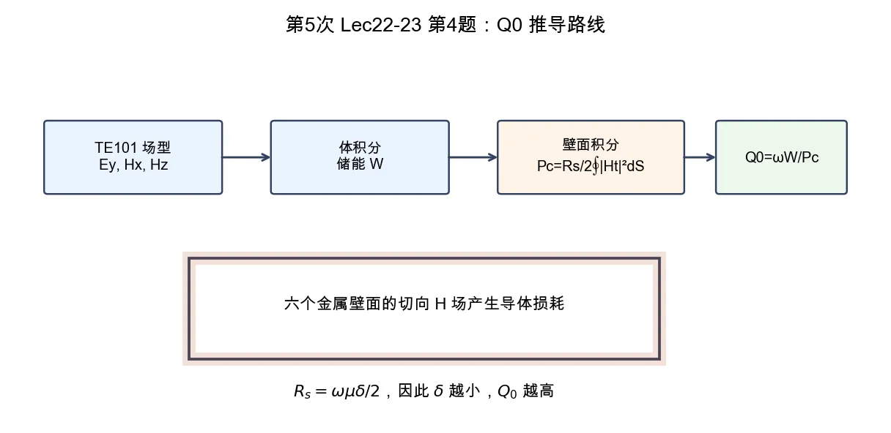

# 第 4 题：矩形腔 \(\mathrm{TE}_{101}\) 模固有品质因数

> 对应知识点：[01-微波谐振器与谐振腔](../../../knowledge/08-谐振器网络与课程综合/01-微波谐振器与谐振腔.md)

**题目**：设一矩形波导尺寸为 \(a,b,l\)，其材质的趋肤深度为 \(\delta\)，求其 \(\mathrm{TE}_{101}\) 模式下的固有品质因数。

*图：固有 \(Q_0\) 的推导要从场型出发，体积分得到储能 \(W\)，壁面积分得到导体损耗 \(P_c\)，最后代入 \(Q_0=\omega W/P_c\)。*

## 一、前置知识

固有品质因数只考虑腔体自身损耗：

\[
Q_0=\omega\frac{W}{P_c}.
\]

导体壁损耗为

\[
P_c=\frac{R_s}{2}\oint |H_t|^2\,dS,\qquad
R_s=\frac{\omega\mu\delta}{2}.
\]

## 二、场分布

取

\[
k_x=\frac{\pi}{a},\qquad k_z=\frac{\pi}{l},\qquad k^2=k_x^2+k_z^2.
\]

对 \(\mathrm{TE}_{101}\) 模，可取

\[
E_y=E_0\sin k_x x\sin k_z z,
\]

\[
H_x=-j\frac{k_z}{\omega\mu}E_0\sin k_x x\cos k_z z,
\qquad
H_z=j\frac{k_x}{\omega\mu}E_0\cos k_x x\sin k_z z.
\]

## 三、储能与损耗

谐振时平均电储能和磁储能相等，总储能可写为

\[
W=\frac{\varepsilon}{2}\int |E_y|^2\,dV
=\frac{\varepsilon |E_0|^2abl}{8}.
\]

六个金属壁面的切向磁场积分为

\[
\oint |H_t|^2\,dS
=\frac{|E_0|^2}{(\omega\mu)^2}
\left[
blk_x^2+\frac{al}{2}(k_x^2+k_z^2)+abk_z^2
\right].
\]

因此

\[
P_c=
\frac{R_s|E_0|^2}{2(\omega\mu)^2}
\left[
blk_x^2+\frac{al}{2}k^2+abk_z^2
\right].
\]

代入 \(Q_0=\omega W/P_c\)，并利用 \(k^2=\omega^2\mu\varepsilon\)、\(R_s=\omega\mu\delta/2\)，得

\[
\boxed{
Q_0=
\frac{k^2abl}
{2\delta\left[
blk_x^2+\frac{al}{2}k^2+abk_z^2
\right]}
}
\]

其中

\[
k_x=\frac{\pi}{a},\qquad
k_z=\frac{\pi}{l},\qquad
k^2=\left(\frac{\pi}{a}\right)^2+\left(\frac{\pi}{l}\right)^2.
\]

## 四、结论与易错点

本题最重要的是推导路径：

1. 写出 \(\mathrm{TE}_{101}\) 场型；
2. 用体积分算储能；
3. 用壁面切向磁场积分算导体损耗；
4. 代入 \(Q_0=\omega W/P_c\)。

易错点：不要只把 \(b\) 从谐振频率公式里删掉；虽然 \(b\) 不显含于 \(\mathrm{TE}_{101}\) 谐振频率，但它进入壁面面积和导体损耗，因此会影响 \(Q_0\)。
