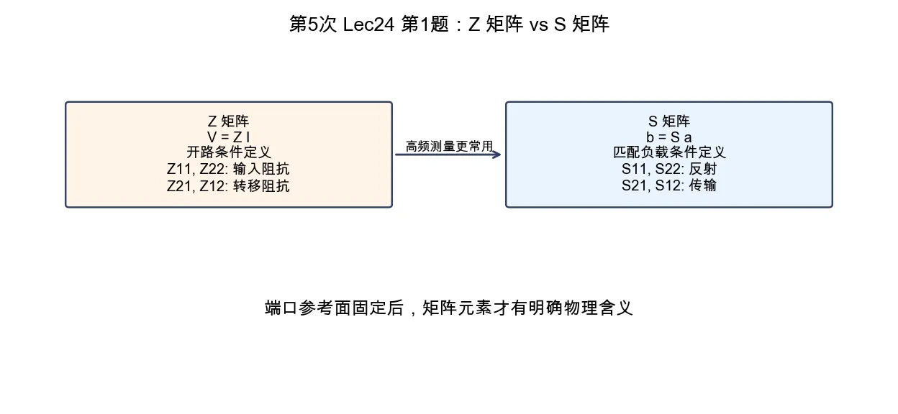

# 第 1 题：阻抗矩阵和散射矩阵元素含义

> 对应知识点：[02-微波网络基础与 S 参数](../../../knowledge/08-谐振器网络与课程综合/02-微波网络基础与S参数.md)

**题目**：双端口网络中阻抗矩阵和散射矩阵中各个元素有什么含义？

*图：阻抗矩阵用端口电压电流描述网络，散射矩阵用入射波与出射波描述网络；微波测量中 \(S\) 参数更直接。*

## 一、阻抗矩阵

二端口阻抗矩阵定义为

\[
\begin{bmatrix}
V_1\\
V_2
\end{bmatrix}
=
\begin{bmatrix}
Z_{11} & Z_{12}\\
Z_{21} & Z_{22}
\end{bmatrix}
\begin{bmatrix}
I_1\\
I_2
\end{bmatrix}.
\]

各元素含义为：

| 元素 | 定义 | 含义 |
|------|------|------|
| \(Z_{11}\) | \(Z_{11}=V_1/I_1\mid_{I_2=0}\) | 端口 2 开路时端口 1 的输入阻抗 |
| \(Z_{22}\) | \(Z_{22}=V_2/I_2\mid_{I_1=0}\) | 端口 1 开路时端口 2 的输入阻抗 |
| \(Z_{21}\) | \(Z_{21}=V_2/I_1\mid_{I_2=0}\) | 端口 2 开路时从 1 到 2 的转移阻抗 |
| \(Z_{12}\) | \(Z_{12}=V_1/I_2\mid_{I_1=0}\) | 端口 1 开路时从 2 到 1 的转移阻抗 |

## 二、散射矩阵

散射矩阵定义为

\[
\begin{bmatrix}
b_1\\
b_2
\end{bmatrix}
=
\begin{bmatrix}
S_{11} & S_{12}\\
S_{21} & S_{22}
\end{bmatrix}
\begin{bmatrix}
a_1\\
a_2
\end{bmatrix}.
\]

在其他端口接匹配负载时：

| 元素 | 定义 | 含义 |
|------|------|------|
| \(S_{11}\) | \(S_{11}=b_1/a_1\mid_{a_2=0}\) | 端口 1 输入反射系数 |
| \(S_{22}\) | \(S_{22}=b_2/a_2\mid_{a_1=0}\) | 端口 2 输入反射系数 |
| \(S_{21}\) | \(S_{21}=b_2/a_1\mid_{a_2=0}\) | 端口 1 到端口 2 的正向传输系数 |
| \(S_{12}\) | \(S_{12}=b_1/a_2\mid_{a_1=0}\) | 端口 2 到端口 1 的反向传输系数 |

## 三、结论与易错点

阻抗矩阵用端口电压电流描述网络，定义常依赖开路条件；散射矩阵用入射波/出射波描述网络，定义常依赖匹配负载条件。

易错点：\(S_{21}\) 是从端口 1 入射、端口 2 出射，不要按“1 到 2 就写 \(S_{12}\)”反着写。
