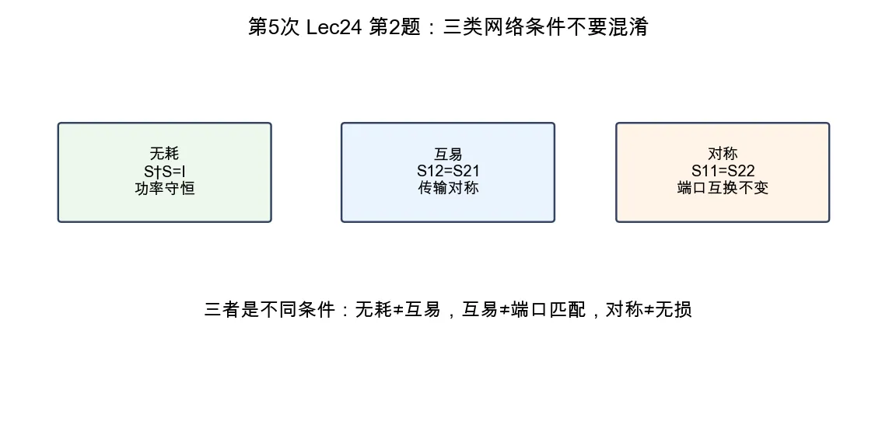

# 第 2 题：无耗、对称、互易网络的散射矩阵特点

> 对应知识点：[02-微波网络基础与 S 参数](../../../knowledge/08-谐振器网络与课程综合/02-微波网络基础与S参数.md)

**题目**：无耗网络、对称网络、互易网络的散射矩阵各有什么特点？

*图：无耗、互易、对称分别约束功率守恒、正反向传输和端口互换，不是同一个条件。*

## 一、无耗网络

无耗表示端口入射功率全部以反射或传输形式输出，没有内部耗散。因此散射矩阵满足酉条件：

\[
\boxed{S^\dagger S=I}
\]

对二端口，常用关系包括

\[
|S_{11}|^2+|S_{21}|^2=1,
\]

\[
|S_{12}|^2+|S_{22}|^2=1,
\]

\[
S_{11}^*S_{12}+S_{21}^*S_{22}=0.
\]

## 二、对称网络

对称表示端口 1 与端口 2 互换后网络不变。在相同参考阻抗下，二端口常见结论为

\[
\boxed{S_{11}=S_{22}}
\]

若结构同时互易，则还满足 \(S_{12}=S_{21}\)。

## 三、互易网络

互易表示信号从 1 到 2 与从 2 到 1 的传输关系相同。散射矩阵满足

\[
\boxed{S=S^T}
\]

二端口即

\[
\boxed{S_{12}=S_{21}}.
\]

## 四、结论与易错点

| 类型 | 关键矩阵条件 |
|------|--------------|
| 无耗 | \(S^\dagger S=I\) |
| 对称 | 二端口常见为 \(S_{11}=S_{22}\) |
| 互易 | \(S_{12}=S_{21}\) |

易错点：无耗、对称、互易是三种不同条件；无耗不保证 \(S_{12}=S_{21}\)，互易也不保证端口匹配。
