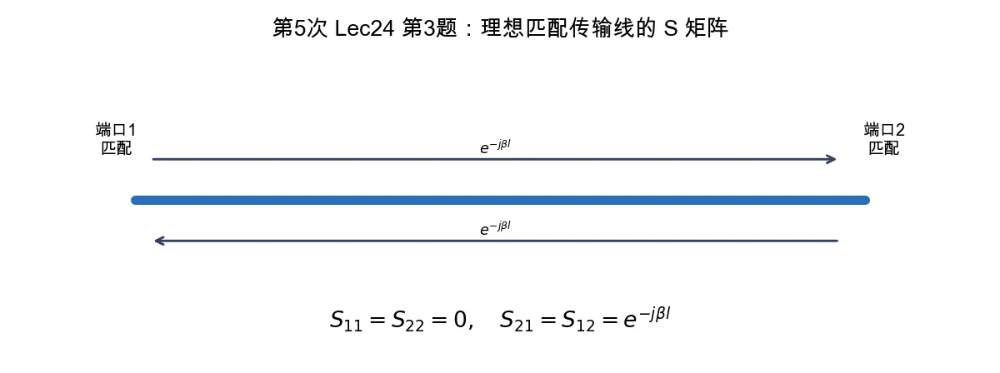

# 第 3 题：理想传输线的散射矩阵

> 对应知识点：[02-微波网络基础与 S 参数](../../../knowledge/08-谐振器网络与课程综合/02-微波网络基础与S参数.md)

**题目**：利用网络参量的定义式，求长度为 \(l\) 的一段理想传输线的散射矩阵 \([S]\) 的表示式；当 \(l=\lambda/3\) 时，给出 \([S]\) 各分量的具体值。

*图：参考阻抗等于特性阻抗时，一段理想传输线没有端口反射，只在两个方向上引入相同传播相移。*

## 一、前置知识

理想无耗传输线两端参考阻抗取为其特性阻抗 \(Z_0\) 时，两端都匹配，因此没有反射：

\[
S_{11}=S_{22}=0.
\]

波沿长度 \(l\) 传播只产生相移 \(e^{-j\beta l}\)。

## 二、标准解答

由定义得

\[
S_{21}=e^{-j\beta l},\qquad S_{12}=e^{-j\beta l}.
\]

所以

\[
\boxed{
[S]=
\begin{bmatrix}
0 & e^{-j\beta l}\\
e^{-j\beta l} & 0
\end{bmatrix}
}
\]

当

\[
l=\frac{\lambda}{3},\qquad \beta=\frac{2\pi}{\lambda},
\]

则

\[
\beta l=\frac{2\pi}{3}.
\]

\[
e^{-j2\pi/3}
=\cos\frac{2\pi}{3}-j\sin\frac{2\pi}{3}
=-\frac{1}{2}-j\frac{\sqrt3}{2}.
\]

因此

\[
\boxed{
[S]=
\begin{bmatrix}
0 & -\frac12-j\frac{\sqrt3}{2}\\
-\frac12-j\frac{\sqrt3}{2} & 0
\end{bmatrix}
}
\]

## 三、结论与易错点

理想匹配传输线不会引入反射，只引入双向相同的相位延迟。

易错点：不要把 \(e^{-j\beta l}\) 写成 \(e^{+j\beta l}\) 后又不说明相量传播约定；本解答采用沿传输方向传播相移为 \(e^{-j\beta l}\) 的约定。
