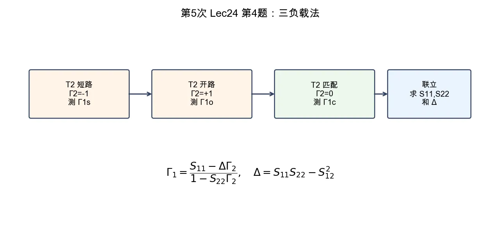

# 第 4 题：互易二端口的加载反射系数与三负载法

> 对应知识点：[02-微波网络基础与 S 参数](../../../knowledge/08-谐振器网络与课程综合/02-微波网络基础与S参数.md)

**题目**：已知一互易二端口网络，从参考面 \(T_1\) 和 \(T_2\) 向负载方向看去的反射系数分别为 \(\Gamma_1\) 和 \(\Gamma_2\)。证明加载反射关系；当参考面 \(T_2\) 分别短路、开路和接匹配负载时，在 \(T_1\) 处测得 \(\Gamma_{1s}\)、\(\Gamma_{1o}\)、\(\Gamma_{1c}\)，求 \(S_{11}\)、\(S_{22}\)、\(S_{12}\) 和 \(S_{11}S_{22}-S_{12}^2\)。

*图：在 \(T_2\) 依次接短路、开路、匹配负载，测得三组输入反射系数后，可联立求出 \(S_{11}\)、\(S_{22}\) 与 \(\Delta=S_{11}S_{22}-S_{12}^2\)。*

## 一、证明加载反射关系

二端口散射方程为

\[
b_1=S_{11}a_1+S_{12}a_2,
\]

\[
b_2=S_{21}a_1+S_{22}a_2.
\]

端口 2 接负载 \(\Gamma_2\)，所以

\[
a_2=\Gamma_2 b_2.
\]

代入第二式：

\[
b_2=S_{21}a_1+S_{22}\Gamma_2 b_2,
\]

\[
b_2=\frac{S_{21}}{1-S_{22}\Gamma_2}a_1.
\]

再代入第一式：

\[
\Gamma_1=\frac{b_1}{a_1}
=S_{11}+\frac{S_{12}S_{21}\Gamma_2}{1-S_{22}\Gamma_2}.
\]

互易网络 \(S_{12}=S_{21}\)，于是

\[
\boxed{
\Gamma_1
=S_{11}+\frac{S_{12}^2\Gamma_2}{1-S_{22}\Gamma_2}
}
\]

也可写成

\[
\boxed{
\Gamma_1
=\frac{S_{11}-(S_{11}S_{22}-S_{12}^2)\Gamma_2}
{1-S_{22}\Gamma_2}
}
\]

## 二、三种负载代入

短路、开路、匹配负载分别对应

\[
\Gamma_s=-1,\qquad \Gamma_o=+1,\qquad \Gamma_c=0.
\]

令

\[
\Delta=S_{11}S_{22}-S_{12}^2.
\]

匹配时 \(\Gamma_2=0\)，得

\[
\boxed{S_{11}=\Gamma_{1c}}.
\]

短路时

\[
\Gamma_{1s}=\frac{S_{11}+\Delta}{1+S_{22}}.
\]

开路时

\[
\Gamma_{1o}=\frac{S_{11}-\Delta}{1-S_{22}}.
\]

由两式联立，得到

\[
\boxed{
S_{22}=
\frac{2\Gamma_{1c}-\Gamma_{1s}-\Gamma_{1o}}
{\Gamma_{1s}-\Gamma_{1o}}
}
\]

以及

\[
\boxed{
\Delta=S_{11}S_{22}-S_{12}^2
=
\frac{
\Gamma_{1c}(\Gamma_{1s}+\Gamma_{1o})-2\Gamma_{1s}\Gamma_{1o}
}
{\Gamma_{1s}-\Gamma_{1o}}
}
\]

因此

\[
\boxed{
S_{12}^2=S_{11}S_{22}-\Delta
}
\]

若题目要求 \(S_{12}\) 本身，则

\[
\boxed{S_{12}=\pm\sqrt{S_{11}S_{22}-\Delta}}
\]

符号或相位分支通常需要额外传输测量确定。

## 三、结论与易错点

三负载法的核心是用短路、开路、匹配三种已知 \(\Gamma_2\) 反推出网络参数组合。注意仅靠反射测量可确定 \(S_{12}^2\)，若要确定 \(S_{12}\) 的相位分支，需要补充传输测量或约定。
