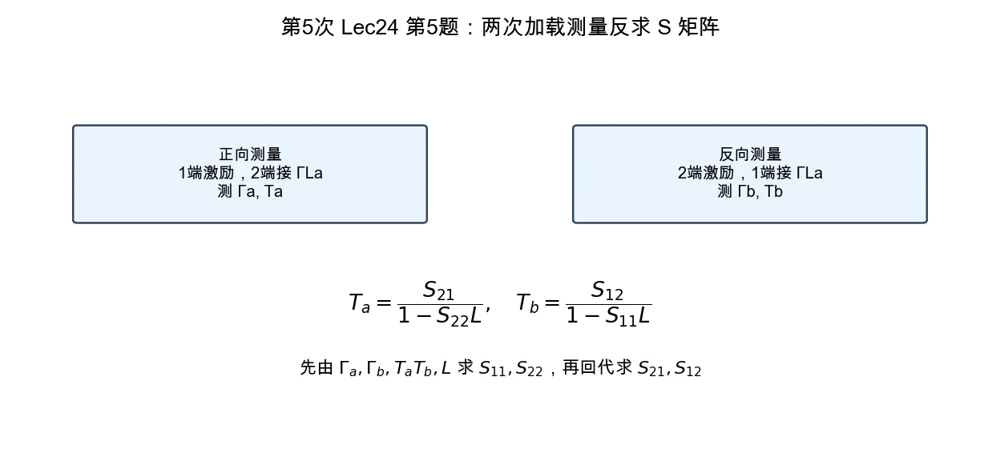

# 第 5 题：由两次加载测量反求二端口 \(S\) 矩阵

> 对应知识点：[02-微波网络基础与 S 参数](../../../knowledge/08-谐振器网络与课程综合/02-微波网络基础与S参数.md)

**题目**：有一个二端口网络，当其端口 1 接信号源、端口 2 接反射系数为 \(\Gamma_{La}\) 的负载时，测得端口 1 的反射系数为 \(\Gamma_a\)、端口 1 到端口 2 的传输系数为 \(T_a\)；当端口 2 接信号源、端口 1 接反射系数为 \(\Gamma_{La}\) 的负载时，测得端口 2 的反射系数为 \(\Gamma_b\)、端口 2 到端口 1 的传输系数为 \(T_b\)。求该二端口网络的散射矩阵 \([S]\)。

*图：正向测量给出 \(\Gamma_a,T_a\)，反向测量给出 \(\Gamma_b,T_b\)；加载传输系数需先去除负载反射影响，不能直接当作 \(S_{21},S_{12}\)。*

## 一、记号简化

令

\[
L=\Gamma_{La},\qquad P=T_aT_b.
\]

## 二、端口 1 激励时

端口 2 接负载 \(L\)，所以

\[
\Gamma_a=S_{11}+\frac{S_{12}S_{21}L}{1-S_{22}L}.
\]

此时端口 1 到端口 2 的加载传输系数为

\[
T_a=\frac{S_{21}}{1-S_{22}L}.
\]

## 三、端口 2 激励时

同理，

\[
\Gamma_b=S_{22}+\frac{S_{12}S_{21}L}{1-S_{11}L},
\]

\[
T_b=\frac{S_{12}}{1-S_{11}L}.
\]

## 四、反求矩阵元素

由

\[
S_{12}=T_b(1-S_{11}L),
\qquad
S_{21}=T_a(1-S_{22}L)
\]

代回反射式，可得

\[
\boxed{
S_{11}=
\frac{\Gamma_a-PL}{1-PL^2}
}
\]

\[
\boxed{
S_{22}=
\frac{\Gamma_b-PL}{1-PL^2}
}
\]

然后

\[
\boxed{
S_{21}=T_a(1-S_{22}L)
}
\]

\[
\boxed{
S_{12}=T_b(1-S_{11}L)
}
\]

于是

\[
\boxed{
[S]=
\begin{bmatrix}
\dfrac{\Gamma_a-PL}{1-PL^2}
&
T_b(1-S_{11}L)
\\[1.2em]
T_a(1-S_{22}L)
&
\dfrac{\Gamma_b-PL}{1-PL^2}
\end{bmatrix}
}
\]

其中右侧的 \(S_{11}\)、\(S_{22}\) 取上面两式。

## 五、结论与易错点

若 \(L=0\)，也就是另一端口接匹配负载，则立刻退化为

\[
S_{11}=\Gamma_a,\qquad S_{22}=\Gamma_b,\qquad S_{21}=T_a,\qquad S_{12}=T_b.
\]

易错点：\(T_a\)、\(T_b\) 是加载条件下测得的传输系数，不一定直接等于 \(S_{21}\)、\(S_{12}\)；只有负载匹配时才可直接等同。
