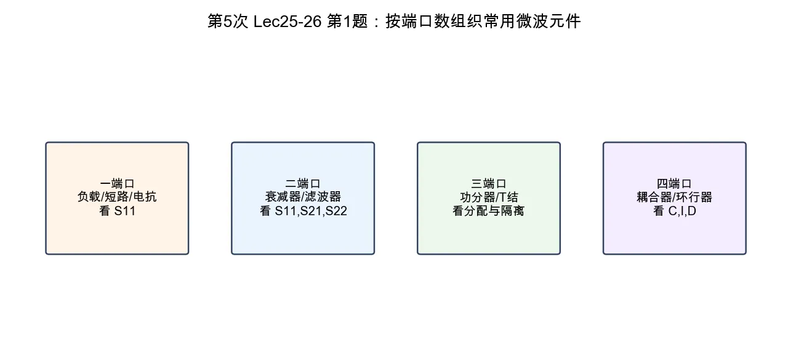

# 第 1 题：常用微波元件按端口数分类

> 对应知识点：[03-常用微波元件网络化描述](../../../knowledge/08-谐振器网络与课程综合/03-常用微波元件网络化描述.md)

**题目**：说明常用微波元件如何按端口数分类，每类至少举出两个例子，并说明适合用哪些 \(S\) 参数或工程指标表征。

*图：端口数决定了最自然的网络描述方式；端口越多，越需要同时关注传输、反射、隔离和端口角色。*

## 标准解答

| 端口数 | 典型元件 | 常用表征 |
|--------|----------|----------|
| 一端口 | 匹配负载、短路器、开路器、电抗调配元件 | \(S_{11}\)、回波损耗、驻波比、反射相位、功率容量 |
| 二端口 | 衰减器、移相器、滤波器、阻抗变换器、隔离器 | \(S_{11}\)、\(S_{22}\)、\(S_{21}\)、\(S_{12}\)、插入损耗、相移、带宽、隔离度 |
| 三端口 | T 型结、Wilkinson 功率分配器、功率合成器 | 分配比、插入损耗、端口匹配、输出端隔离度、幅度/相位平衡 |
| 四端口 | 定向耦合器、魔 T、环行器 | 耦合度、隔离度、方向性、端口驻波比、传输损耗 |

## 说明

一端口主要看反射，因为没有“传到另一端口”的概念。二端口同时要看输入/输出匹配和正反向传输。三端口、四端口除了匹配和传输，还要关注端口之间的隔离关系。

## 结论与易错点

微波元件分类的目的不是背名字，而是选择合适的网络参数。端口数越多，越不能只看一个 \(S_{21}\)，必须明确每个端口的角色和未测端口的匹配条件。
