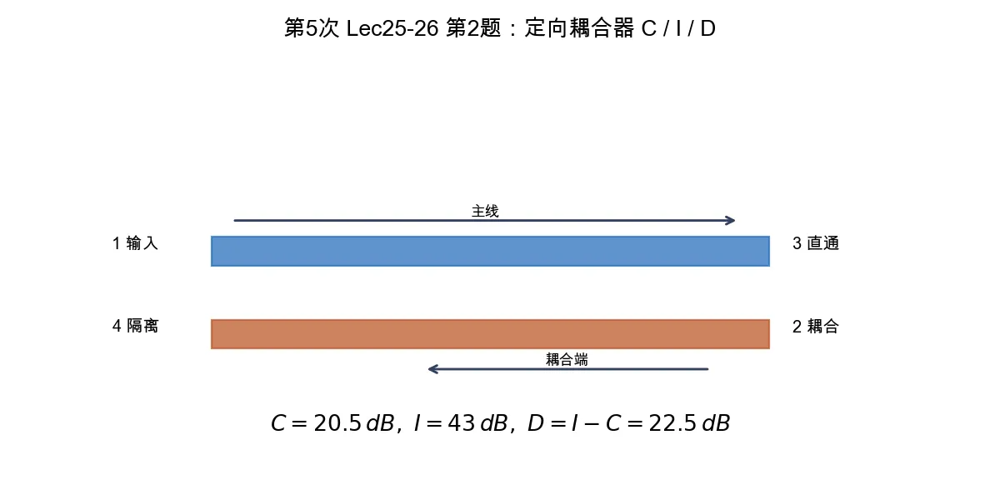

# 第 2 题：20 dB 定向耦合器的 \(C\)、\(I\)、\(D\)

> 对应知识点：[03-常用微波元件网络化描述](../../../knowledge/08-谐振器网络与课程综合/03-常用微波元件网络化描述.md)

**题目**：对一个理想 \(20\,\mathrm{dB}\) 定向耦合器，写出耦合度、隔离度、方向性的定义。若测得耦合端 \(|S_{21}|=-20.5\,\mathrm{dB}\)、隔离端 \(|S_{41}|=-43\,\mathrm{dB}\)，求 \(C\)、\(I\)、\(D\)。

*图：耦合度看输入端到耦合端，隔离度看输入端到隔离端，方向性是隔离度与耦合度之差。*

## 一、定义

按大纲端口约定，耦合端为 2，隔离端为 4：

\[
C=-20\log_{10}|S_{21}|
\]

\[
I=-20\log_{10}|S_{41}|
\]

\[
D=I-C
\]

其中 \(C\) 为耦合度，\(I\) 为隔离度，\(D\) 为方向性。工程上常把这些指标写成正的 dB 数。

## 二、计算

题目已给出 dB 读数：

\[
|S_{21}|_{\mathrm{dB}}=-20.5\,\mathrm{dB},
\qquad
|S_{41}|_{\mathrm{dB}}=-43\,\mathrm{dB}.
\]

因此

\[
C=20.5\,\mathrm{dB},
\]

\[
I=43\,\mathrm{dB},
\]

\[
D=I-C=43-20.5=22.5\,\mathrm{dB}.
\]

## 三、结论与易错点

\[
\boxed{C=20.5\,\mathrm{dB},\qquad I=43\,\mathrm{dB},\qquad D=22.5\,\mathrm{dB}.}
\]

易错点：理想标称为 \(20\,\mathrm{dB}\)，但题目要求按实测值计算；方向性不是 \(C-I\)，而是 \(D=I-C\)。
