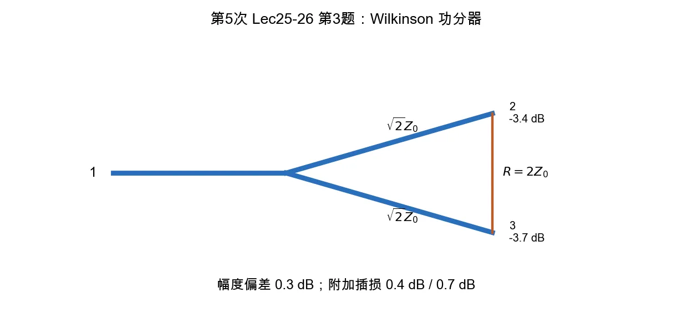

# 第 3 题：理想 3 dB Wilkinson 功分器

> 对应知识点：[03-常用微波元件网络化描述](../../../knowledge/08-谐振器网络与课程综合/03-常用微波元件网络化描述.md)

**题目**：理想 \(3\,\mathrm{dB}\) Wilkinson 功分器中各支路特性阻抗和隔离电阻应取多少？若实测两路 \(S_{21}\) 分别为 \(-3.4\,\mathrm{dB}\) 和 \(-3.7\,\mathrm{dB}\)，求幅度偏差和两路附加插入损耗。

*图：等分 Wilkinson 功分器中心频率处两支路为 \(\sqrt{2}Z_0\)，隔离电阻为 \(2Z_0\)；实测值超过 \(-3\,\mathrm{dB}\) 的部分才是附加插损。*

## 一、理想参数

等分 Wilkinson 功分器在中心频率处

\[
Z_{\mathrm{branch}}=\sqrt2 Z_0,\qquad R=2Z_0.
\]

若系统为常见 \(Z_0=50\,\Omega\)，则

\[
\boxed{Z_{\mathrm{branch}}\approx70.7\,\Omega,\qquad R=100\,\Omega.}
\]

## 二、幅度偏差

两路实测为

\[
S_{21,a}=-3.4\,\mathrm{dB},\qquad S_{21,b}=-3.7\,\mathrm{dB}.
\]

幅度偏差取两路 dB 差的绝对值：

\[
\Delta A=|-3.4-(-3.7)|=0.3\,\mathrm{dB}.
\]

## 三、附加插入损耗

理想二等分功分器每路本来就是 \(-3.0\,\mathrm{dB}\)，这是分功率造成的理论值。附加插入损耗为实测损耗扣除 \(3\,\mathrm{dB}\)：

\[
L_{a,\mathrm{add}}=3.4-3.0=0.4\,\mathrm{dB},
\]

\[
L_{b,\mathrm{add}}=3.7-3.0=0.7\,\mathrm{dB}.
\]

## 四、结论与易错点

\[
\boxed{
\Delta A=0.3\,\mathrm{dB},\quad
L_{a,\mathrm{add}}=0.4\,\mathrm{dB},\quad
L_{b,\mathrm{add}}=0.7\,\mathrm{dB}.
}
\]

易错点：\(-3\,\mathrm{dB}\) 是等分功率的理论结果，不应全部算作器件损耗；超过 \(3\,\mathrm{dB}\) 的部分才是附加插入损耗。
