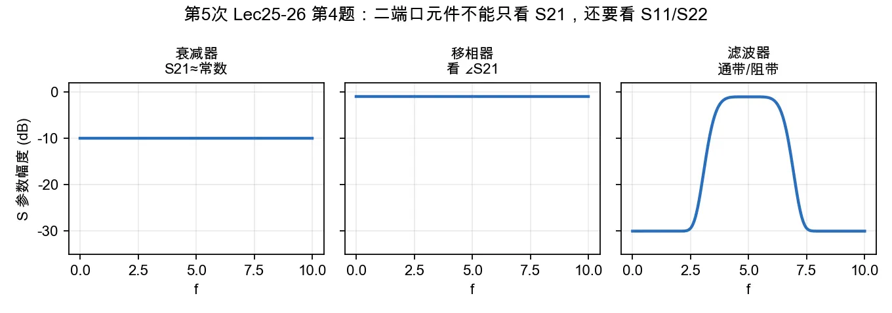

# 第 4 题：衰减器、移相器和滤波器的主要 \(S\) 参数指标

> 对应知识点：[03-常用微波元件网络化描述](../../../knowledge/08-谐振器网络与课程综合/03-常用微波元件网络化描述.md)

**题目**：阐述衰减器、移相器和滤波器的主要 \(S\) 参数指标分别是什么；为什么单看 \(S_{21}\) 不够，还要关注 \(S_{11}\) 和 \(S_{22}\)？

*图：衰减器、移相器和滤波器都以 \(S_{21}\) 为主指标，但端口匹配还必须由 \(S_{11}\)、\(S_{22}\) 约束。*

## 一、衰减器

主要看：

- \(S_{21}\)：衰减量是否达到标称，例如 \(-10\,\mathrm{dB}\)、\(-20\,\mathrm{dB}\)；
- \(S_{11}\)、\(S_{22}\)：输入/输出端口匹配；
- 频率平坦度和功率容量。

## 二、移相器

主要看：

- \(\angle S_{21}\)：目标相移是否达到；
- \(|S_{21}|\)：插入损耗是否可接受；
- \(S_{11}\)、\(S_{22}\)：端口匹配；
- 相位随频率变化是否线性。

## 三、滤波器

主要看：

- \(S_{21}\)：通带插入损耗、阻带抑制度、中心频率、带宽；
- \(S_{11}\)、\(S_{22}\)：通带内端口回波损耗；
- 群延迟、带内波纹、带外抑制。

## 四、为什么不能只看 \(S_{21}\)

\(S_{21}\) 只说明从端口 1 到端口 2 的传输。若 \(S_{11}\) 或 \(S_{22}\) 很大，说明端口失配严重，实际系统中会出现：

1. 输入功率被反射，导致标称衰减或通带增益不稳定；
2. 与前后级级联时形成多次反射，产生驻波纹波；
3. 滤波器通带内即使 \(S_{21}\) 看似可用，系统可交付功率也可能偏低；
4. 测量时若端口失配，会让读数依赖电缆长度和参考面。

## 五、结论与易错点

衰减器、移相器、滤波器都不能只用 \(S_{21}\) 表征。完整评价至少应同时说明 \(S_{11}\)、\(S_{22}\) 和 \(S_{21}\) 的幅度/相位指标。
