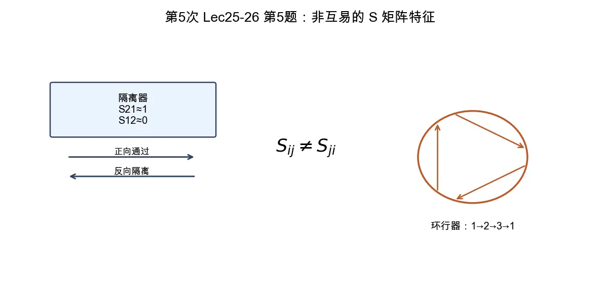

# 第 5 题：隔离器、环行器与普通互易无源网络的区别

> 对应知识点：[03-常用微波元件网络化描述](../../../knowledge/08-谐振器网络与课程综合/03-常用微波元件网络化描述.md)

**题目**：比较隔离器、环行器与普通互易无源网络的区别，并用 \(S\) 矩阵特征说明“非互易”的含义。

*图：非互易器件的关键矩阵特征是 \(S_{ij}\ne S_{ji}\)；隔离器单向通过，环行器按固定方向循环传输。*

## 一、普通互易无源网络

普通互易网络满足

\[
S=S^T.
\]

对二端口就是

\[
S_{12}=S_{21}.
\]

物理含义是：从 1 到 2 的传输与从 2 到 1 的传输相同。

## 二、隔离器

隔离器允许一个方向低损耗通过，反方向强衰减。若正向为 \(1\to2\)，理想情况可写成

\[
S_{21}\approx1,\qquad S_{12}\approx0.
\]

因此

\[
S_{21}\ne S_{12},
\]

它不是互易网络。

## 三、环行器

三端口环行器让信号按固定方向循环，例如 \(1\to2\)、\(2\to3\)、\(3\to1\)。一种理想 \(S\) 矩阵可写为

\[
S=
\begin{bmatrix}
0 & 0 & 1\\
1 & 0 & 0\\
0 & 1 & 0
\end{bmatrix}.
\]

它显然不满足 \(S=S^T\)，因此也是非互易网络。

## 四、结论与易错点

隔离器和环行器通常利用铁氧体偏置磁场实现非互易传播。所谓“非互易”，在 \(S\) 矩阵中就表现为

\[
\boxed{S_{ij}\ne S_{ji}.}
\]

易错点：无源不等于互易。隔离器、环行器可以是无源器件，但仍然是非互易器件。
