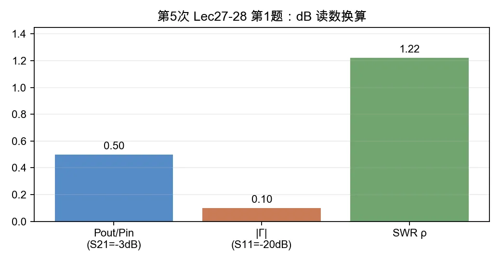

# 第 1 题：\(S_{21}\)、\(S_{11}\) dB 读数换算

> 对应知识点：[04-微波测量与课程综合](../../../knowledge/08-谐振器网络与课程综合/04-微波测量与课程综合.md)

**题目**：屏幕上 \(S_{21}=-3\,\mathrm{dB}\) 表示输出功率约占输入功率多少？若 \(S_{11}=-20\,\mathrm{dB}\)，求 \(|\Gamma|\) 及对应驻波比 \(\rho\)。

*图：\(-3\,\mathrm{dB}\) 的传输约为半功率；\(-20\,\mathrm{dB}\) 的反射对应 \(|\Gamma|=0.1\)，驻波比约为 1.22。*

## 一、\(S_{21}=-3\,\mathrm{dB}\)

\(S_{21}\) 的 dB 值对应波幅比：

\[
S_{21}[\mathrm{dB}]=20\log_{10}|S_{21}|.
\]

功率比为

\[
\frac{P_2}{P_1}=|S_{21}|^2=10^{S_{21}[\mathrm{dB}]/10}.
\]

代入 \(-3\,\mathrm{dB}\)：

\[
\frac{P_2}{P_1}=10^{-3/10}\approx0.501.
\]

即输出功率约为输入功率的一半。

## 二、\(S_{11}=-20\,\mathrm{dB}\)

反射系数幅度

\[
|\Gamma|=|S_{11}|=10^{-20/20}=0.1.
\]

驻波比

\[
\rho=\frac{1+|\Gamma|}{1-|\Gamma|}
=\frac{1.1}{0.9}
\approx1.22.
\]

## 三、结论

\[
\boxed{\frac{P_2}{P_1}\approx0.50,\qquad |\Gamma|=0.1,\qquad \rho\approx1.22.}
\]

易错点：\(S\) 参数幅度的 dB 用 \(20\log\)，但从 dB 直接换功率比可用 \(10^{\mathrm{dB}/10}\)。
